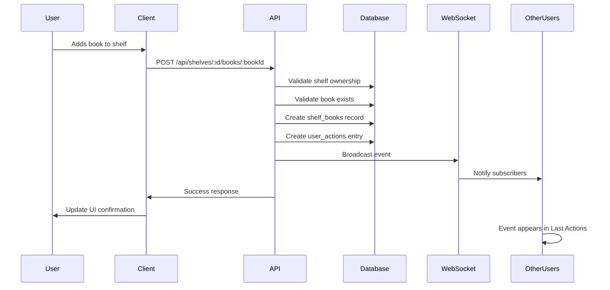

# Feature Design: Book Added to Shelf Event in Last Actions

## Overview

Expand the Last Actions feed on the `/stream` page to include a new event type that tracks when users add books to their shelves. This event will provide visibility into book organization activities across the platform, following the existing pattern established for user registration and shelf creation events.

## Strategic Context

The Last Actions feed currently tracks various user activities including navigation, user registration, and shelf creation. Adding book-to-shelf events completes the picture of user engagement with the platform's core book organization functionality, enabling users to discover what books others are adding to their collections.

## Business Value

- **Community Engagement**: Users can discover books that others are organizing and saving
- **Content Discovery**: Popular books being added to shelves become visible to the community
- **Activity Transparency**: Provides insight into active book curation behavior
- **Consistent Experience**: Follows established patterns for similar events in the system

## Functional Requirements

### Event Creation Trigger

The system shall create a user action event when:
- A user successfully adds a book to any of their shelves
- The operation occurs through the POST endpoint `/api/shelves/:id/books/:bookId`
- The book and shelf both exist and the user owns the shelf

### Event Data Structure

The event shall capture:
- **Action Type**: Identifier indicating this is a book-to-shelf addition
- **User Information**: The user who performed the action (username, avatar)
- **Book Information**: The book being added (title, ID)
- **Shelf Information**: The target shelf (name, ID)
- **Timestamp**: When the action occurred

### Event Display

The event shall be displayed in the Last Actions tab with:
- An appropriate icon representing book organization
- User identification showing who added the book
- Book title with link to book detail page
- Shelf name with link to shelf view
- Formatted text describing the action (e.g., "Username added 'Book Title' to 'Shelf Name'")
- Timestamp showing when the action occurred

### Real-Time Broadcasting

The system shall:
- Broadcast the event via WebSocket to the global stream room
- Broadcast the event to the last-actions specific room
- Ensure immediate visibility without page refresh
- Follow the same broadcasting pattern as shelf creation events

## Technical Approach

### Database Layer

Utilize the existing `user_actions` table with the following mapping:
- `user_id`: User performing the action
- `action_type`: New value to represent book-to-shelf addition
- `target_type`: Identifier for book entity
- `target_id`: Book ID being added
- `metadata`: JSON object containing:
  - Book title
  - Shelf ID
  - Shelf name
  - Any additional contextual information

### Backend Integration Point

Modify the "Add book to shelf" endpoint handler to:
1. Complete the existing book-to-shelf association logic
2. Retrieve necessary context (book title, shelf name, user information)
3. Create user action record asynchronously
4. Broadcast event via WebSocket to designated rooms
5. Handle errors gracefully without failing the primary operation

### API Response

No changes to existing endpoint responses required. Event creation occurs as a side effect after successful book addition.

### Frontend Display

The Last Actions tab component shall:
- Recognize the new action type
- Render appropriate card with icon and formatted text
- Provide navigation links to:
  - User profile
  - Book detail page
  - Shelf view (if accessible)
- Display relative timestamp

### Event Text Formatting

Following the existing convention, the event text shall be constructed on the backend and included in metadata, with internationalization considerations for user-facing display.

## User Experience Flow

## Data Model Relationships

The event connects the following entities:

| Entity | Relationship | Purpose |
|--------|--------------|---------|
| User | Actor | Who performed the action |
| Book | Target | What was added |
| Shelf | Context | Where it was added |
| user_actions | Event Record | Tracks the activity |

## Non-Functional Considerations

### Performance

- Event creation shall execute asynchronously to avoid delaying the primary operation
- Database insertion shall use indexed columns for efficient querying
- WebSocket broadcasting shall be non-blocking

### Error Handling

- Failed event creation shall not cause the book addition to fail
- Errors shall be logged for monitoring
- Silent degradation if WebSocket broadcast fails

### Security

- Event creation shall only occur for authenticated users
- Only publicly visible information shall be included in event data
- Shelf ownership verification must occur before event creation

### Scalability

- Event records shall participate in existing soft-delete patterns
- Pagination and filtering already exist in Last Actions feed
- No additional database tables required

## Integration Points

### Modified Components

- `server/routes.ts`: Enhance POST `/api/shelves/:id/books/:bookId` endpoint
- `client/src/pages/StreamPage.tsx`: Already handles dynamic event types
- `client/src/components/stream/LastActionsActivityCard.tsx`: Add rendering logic for new event type

### Unchanged Components

- Database schema (existing `user_actions` table sufficient)
- API response contracts
- WebSocket room structure
- Query and pagination logic

## Validation Criteria

The implementation shall be considered successful when:

1. Adding a book to a shelf creates a user action record
2. The event appears in the Last Actions feed immediately via WebSocket
3. The event displays correct user, book, and shelf information
4. All links navigate to correct destinations
5. The event text follows established formatting patterns
6. Failed event creation does not disrupt book addition
7. The feature works consistently across different shelf types

## Localization Considerations

Event text shall support multiple languages by:
- Storing raw data (usernames, titles, names) in metadata
- Allowing frontend to construct localized display text
- Following patterns established by existing Last Actions events

## Future Extensibility

This implementation maintains compatibility with potential future enhancements:
- Filtering Last Actions by event type
- User-specific activity feeds
- Book popularity metrics based on shelf additions
- Notification preferences for followed users' activities
- **User Information**: The user who performed the action (username, avatar)
- **Book Information**: The book being added (title, ID)
- **Shelf Information**: The target shelf (name, ID)
- **Timestamp**: When the action occurred

### Event Display

The event shall be displayed in the Last Actions tab with:
- An appropriate icon representing book organization
- User identification showing who added the book
- Book title with link to book detail page
- Shelf name with link to shelf view
- Formatted text describing the action (e.g., "Username added 'Book Title' to 'Shelf Name'")
- Timestamp showing when the action occurred

### Real-Time Broadcasting

The system shall:
- Broadcast the event via WebSocket to the global stream room
- Broadcast the event to the last-actions specific room
- Ensure immediate visibility without page refresh
- Follow the same broadcasting pattern as shelf creation events

## Technical Approach

### Database Layer

Utilize the existing `user_actions` table with the following mapping:
- `user_id`: User performing the action
- `action_type`: New value to represent book-to-shelf addition
- `target_type`: Identifier for book entity
- `target_id`: Book ID being added
- `metadata`: JSON object containing:
  - Book title
  - Shelf ID
  - Shelf name
  - Any additional contextual information

### Backend Integration Point

Modify the "Add book to shelf" endpoint handler to:
1. Complete the existing book-to-shelf association logic
2. Retrieve necessary context (book title, shelf name, user information)
3. Create user action record asynchronously
4. Broadcast event via WebSocket to designated rooms
5. Handle errors gracefully without failing the primary operation

### API Response

No changes to existing endpoint responses required. Event creation occurs as a side effect after successful book addition.

### Frontend Display

The Last Actions tab component shall:
- Recognize the new action type
- Render appropriate card with icon and formatted text
- Provide navigation links to:
  - User profile
  - Book detail page
  - Shelf view (if accessible)
- Display relative timestamp

### Event Text Formatting

Following the existing convention, the event text shall be constructed on the backend and included in metadata, with internationalization considerations for user-facing display.

## User Experience Flow

## Data Model Relationships

The event connects the following entities:

| Entity | Relationship | Purpose |
|--------|--------------|---------|
| User | Actor | Who performed the action |
| Book | Target | What was added |
| Shelf | Context | Where it was added |
| user_actions | Event Record | Tracks the activity |

## Non-Functional Considerations

### Performance

- Event creation shall execute asynchronously to avoid delaying the primary operation
- Database insertion shall use indexed columns for efficient querying
- WebSocket broadcasting shall be non-blocking

### Error Handling

- Failed event creation shall not cause the book addition to fail
- Errors shall be logged for monitoring
- Silent degradation if WebSocket broadcast fails

### Security

- Event creation shall only occur for authenticated users
- Only publicly visible information shall be included in event data
- Shelf ownership verification must occur before event creation

### Scalability

- Event records shall participate in existing soft-delete patterns
- Pagination and filtering already exist in Last Actions feed
- No additional database tables required

## Integration Points

### Modified Components

- `server/routes.ts`: Enhance POST `/api/shelves/:id/books/:bookId` endpoint
- `client/src/pages/StreamPage.tsx`: Already handles dynamic event types
- `client/src/components/stream/LastActionsActivityCard.tsx`: Add rendering logic for new event type

### Unchanged Components

- Database schema (existing `user_actions` table sufficient)
- API response contracts
- WebSocket room structure
- Query and pagination logic

## Validation Criteria

The implementation shall be considered successful when:

1. Adding a book to a shelf creates a user action record
2. The event appears in the Last Actions feed immediately via WebSocket
3. The event displays correct user, book, and shelf information
4. All links navigate to correct destinations
5. The event text follows established formatting patterns
6. Failed event creation does not disrupt book addition
7. The feature works consistently across different shelf types

## Localization Considerations

Event text shall support multiple languages by:
- Storing raw data (usernames, titles, names) in metadata
- Allowing frontend to construct localized display text
- Following patterns established by existing Last Actions events

## Future Extensibility

This implementation maintains compatibility with potential future enhancements:
- Filtering Last Actions by event type
- User-specific activity feeds
- Book popularity metrics based on shelf additions
- Notification preferences for followed users' activities
- **Action Type**: Identifier indicating this is a book-to-shelf addition
- **User Information**: The user who performed the action (username, avatar)
- **Book Information**: The book being added (title, ID)
- **Shelf Information**: The target shelf (name, ID)
- **Timestamp**: When the action occurred

### Event Display

The event shall be displayed in the Last Actions tab with:
- An appropriate icon representing book organization
- User identification showing who added the book
- Book title with link to book detail page
- Shelf name with link to shelf view
- Formatted text describing the action (e.g., "Username added 'Book Title' to 'Shelf Name'")
- Timestamp showing when the action occurred

### Real-Time Broadcasting

The system shall:
- Broadcast the event via WebSocket to the global stream room
- Broadcast the event to the last-actions specific room
- Ensure immediate visibility without page refresh
- Follow the same broadcasting pattern as shelf creation events

## Technical Approach

### Database Layer

Utilize the existing `user_actions` table with the following mapping:
- `user_id`: User performing the action
- `action_type`: New value to represent book-to-shelf addition
- `target_type`: Identifier for book entity
- `target_id`: Book ID being added
- `metadata`: JSON object containing:
  - Book title
  - Shelf ID
  - Shelf name
  - Any additional contextual information

### Backend Integration Point

Modify the "Add book to shelf" endpoint handler to:
1. Complete the existing book-to-shelf association logic
2. Retrieve necessary context (book title, shelf name, user information)
3. Create user action record asynchronously
4. Broadcast event via WebSocket to designated rooms
5. Handle errors gracefully without failing the primary operation

### API Response

No changes to existing endpoint responses required. Event creation occurs as a side effect after successful book addition.

### Frontend Display

The Last Actions tab component shall:
- Recognize the new action type
- Render appropriate card with icon and formatted text
- Provide navigation links to:
  - User profile
  - Book detail page
  - Shelf view (if accessible)
- Display relative timestamp

### Event Text Formatting

Following the existing convention, the event text shall be constructed on the backend and included in metadata, with internationalization considerations for user-facing display.

## User Experience Flow

## Data Model Relationships

The event connects the following entities:

| Entity | Relationship | Purpose |
|--------|--------------|---------|
| User | Actor | Who performed the action |
| Book | Target | What was added |
| Shelf | Context | Where it was added |
| user_actions | Event Record | Tracks the activity |

## Non-Functional Considerations

### Performance

- Event creation shall execute asynchronously to avoid delaying the primary operation
- Database insertion shall use indexed columns for efficient querying
- WebSocket broadcasting shall be non-blocking

### Error Handling

- Failed event creation shall not cause the book addition to fail
- Errors shall be logged for monitoring
- Silent degradation if WebSocket broadcast fails

### Security

- Event creation shall only occur for authenticated users
- Only publicly visible information shall be included in event data
- Shelf ownership verification must occur before event creation

### Scalability

- Event records shall participate in existing soft-delete patterns
- Pagination and filtering already exist in Last Actions feed
- No additional database tables required

## Integration Points

### Modified Components

- `server/routes.ts`: Enhance POST `/api/shelves/:id/books/:bookId` endpoint
- `client/src/pages/StreamPage.tsx`: Already handles dynamic event types
- `client/src/components/stream/LastActionsActivityCard.tsx`: Add rendering logic for new event type

### Unchanged Components

- Database schema (existing `user_actions` table sufficient)
- API response contracts
- WebSocket room structure
- Query and pagination logic

## Validation Criteria

The implementation shall be considered successful when:

1. Adding a book to a shelf creates a user action record
2. The event appears in the Last Actions feed immediately via WebSocket
3. The event displays correct user, book, and shelf information
4. All links navigate to correct destinations
5. The event text follows established formatting patterns
6. Failed event creation does not disrupt book addition
7. The feature works consistently across different shelf types

## Localization Considerations

Event text shall support multiple languages by:
- Storing raw data (usernames, titles, names) in metadata
- Allowing frontend to construct localized display text
- Following patterns established by existing Last Actions events

## Future Extensibility

This implementation maintains compatibility with potential future enhancements:
- Filtering Last Actions by event type
- User-specific activity feeds
- Book popularity metrics based on shelf additions
- Notification preferences for followed users' activities
