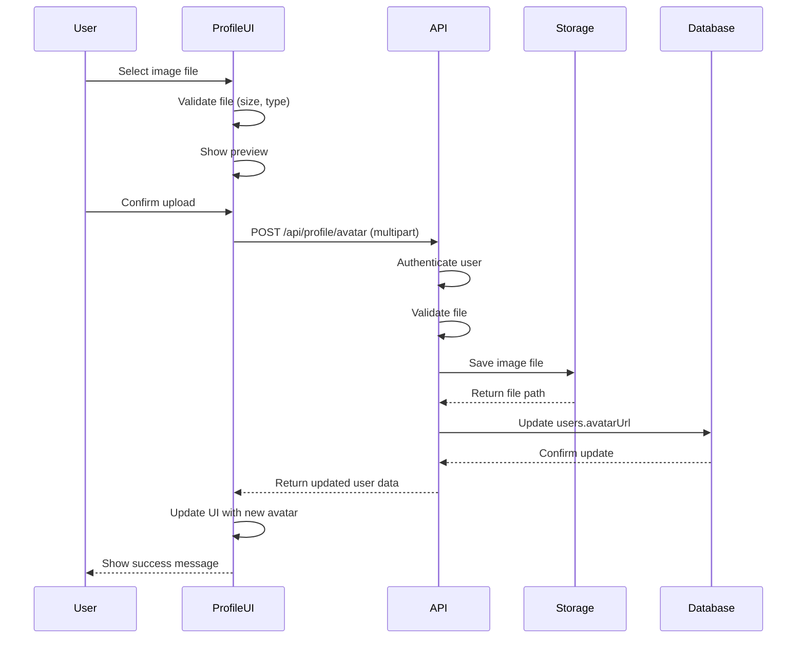
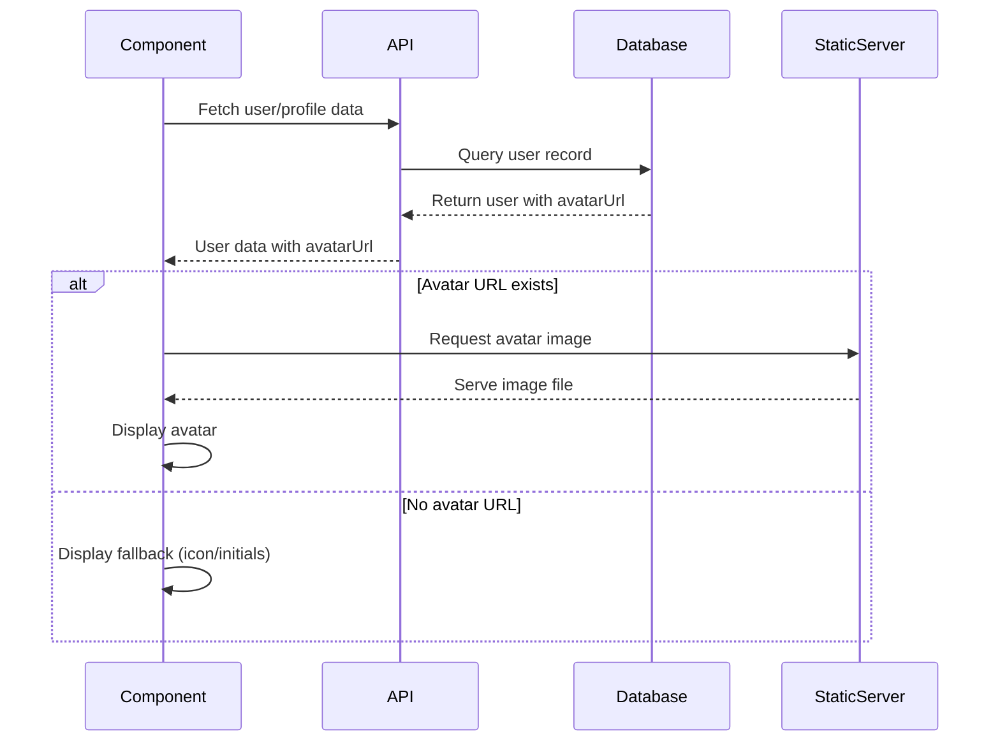

# Feature Design: User Avatar Management

## Overview

This feature enables users to upload and manage their profile avatars throughout the application. Users will be able to change their avatar in their profile settings, and the avatar will be displayed consistently across all areas where user identity is shown (profile pages, comments, reviews, news articles, navigation bar, etc.).

## Current State Analysis

### Existing Infrastructure

The application already has foundational support for avatars:

**Database Schema:**
- The `users` table in the database already includes an `avatarUrl` field of type `text` to store avatar image URLs
- This field is nullable and optional

**Frontend Components:**
- Avatar UI component exists (`client/src/components/ui/avatar.tsx`) using Radix UI primitives
- Avatar components are already rendered in multiple locations but currently show fallback icons or initials
- Profile page (`client/src/pages/Profile.tsx`) displays avatar with fallback to User icon

**Current Avatar Display Locations:**
- Profile page header (large display)
- Comments section (small circular avatars)
- Reviews section (small circular avatars)
- Book detail page comments and reviews
- Potentially news articles (author attribution)

### Gaps to Address

The following functionality needs to be implemented:

1. Avatar upload capability in profile editing interface
2. Backend API endpoint to handle avatar file uploads
3. Image storage and serving strategy
4. Avatar image display from database URLs in all existing avatar components
5. Consistent fallback behavior when no avatar is set
6. Image validation and processing (size limits, format validation, etc.)

## Feature Requirements

### Functional Requirements

**Profile Avatar Management:**
- Users must be able to upload a new avatar image from their profile page
- Users must be able to preview their current avatar
- Users must be able to remove their avatar (revert to default)
- Supported image formats: JPEG, PNG, GIF, WebP
- Maximum file size: 5MB
- Images should be automatically resized to optimize storage and display performance

**Avatar Display:**
- Avatar must be displayed in the profile page header (large: 128x128px)
- Avatar must be displayed in comments sections (small: 40x40px)
- Avatar must be displayed in reviews sections (small: 40x40px)
- Avatar must be displayed in news articles for author attribution (medium: 48x48px)
- Avatar should be displayed in navigation/mobile menu if space permits
- When no avatar is set, display a consistent fallback (user icon or user initials)

**Security and Validation:**
- Only authenticated users can upload avatars
- Users can only modify their own avatar
- File type validation on both client and server
- File size validation to prevent abuse
- Sanitize uploaded filenames

### Non-Functional Requirements

**Performance:**
- Avatar images should be optimized for web delivery
- Consider implementing multiple sizes (thumbnail, medium, large) for different display contexts
- Images should be cached appropriately

**User Experience:**
- Upload process should provide clear feedback (loading states, success/error messages)
- Image preview before upload confirmation
- Drag-and-drop upload support (optional enhancement)

**Storage:**
- Avatar files should be stored in a dedicated directory structure
- File naming convention should prevent conflicts (user ID + timestamp)
- Consider cloud storage integration for production scalability (optional future enhancement)

## Design Approach

### Data Flow

**Avatar Upload Flow:**



**Avatar Display Flow:**



### API Design

**New Endpoint: Upload Avatar**

| Property | Value |
|----------|-------|
| Method | POST |
| Path | `/api/profile/avatar` |
| Authentication | Required (JWT Bearer token) |
| Content-Type | multipart/form-data |
| Request Body | Form data with 'avatar' field containing image file |
| Success Response | 200 OK with updated user object including new avatarUrl |
| Error Responses | 400 (invalid file), 401 (unauthorized), 413 (file too large), 500 (server error) |

**Request Example:**
```
POST /api/profile/avatar
Authorization: Bearer {token}
Content-Type: multipart/form-data

Form Data:
  avatar: [image file]
```

**Response Example (Success):**
```json
{
  "id": "user-uuid",
  "username": "john_doe",
  "fullName": "John Doe",
  "bio": "Book enthusiast",
  "avatarUrl": "/uploads/avatars/user-uuid-1234567890.jpg",
  "email": "john@example.com",
  "accessLevel": "user",
  "createdAt": "2024-01-15T10:30:00Z",
  "updatedAt": "2024-03-20T14:25:00Z"
}
```

**New Endpoint: Delete Avatar**

| Property | Value |
|----------|-------|
| Method | DELETE |
| Path | `/api/profile/avatar` |
| Authentication | Required (JWT Bearer token) |
| Success Response | 200 OK with updated user object (avatarUrl set to null) |
| Error Responses | 401 (unauthorized), 500 (server error) |

**Modified Endpoint: Update Profile**

The existing `/api/profile` PUT endpoint will continue to work for updating bio and fullName, but will not handle avatar uploads. Avatar management is separated into dedicated endpoints for clarity and to support multipart uploads.

### File Storage Strategy

**Directory Structure:**
```
uploads/
  └── avatars/
      ├── {userId}-{timestamp}.{ext}
      └── {userId}-{timestamp}.{ext}
```

**File Naming Convention:**
- Format: `{userId}-{timestamp}.{extension}`
- Example: `a1b2c3d4-1710936000000.jpg`
- Ensures uniqueness and allows tracking multiple uploads per user
- Old avatar files can be cleaned up when new ones are uploaded

**Static File Serving:**
- Avatar images served via Express static middleware
- Path: `/uploads/avatars/*`
- Cache headers should be configured for optimal performance
- Consider CDN integration for production environments

### Frontend Component Updates

**Profile Page Avatar Section:**

The profile page should include an avatar upload interface when viewing own profile:

- Display current avatar (large size: 128x128px)
- Show "Change Avatar" button overlay on hover
- Clicking opens file picker dialog
- After selection, show preview and "Save" / "Cancel" buttons
- Display upload progress indicator
- Show success/error toast messages

**Avatar Display Component Pattern:**

All avatar displays should follow a consistent pattern:

```
<Avatar className="w-{size} h-{size}">
  {user.avatarUrl ? (
    <AvatarImage src={user.avatarUrl} alt={user.fullName || user.username} />
  ) : null}
  <AvatarFallback>
    {user.fullName ? user.fullName[0] : <UserIcon />}
  </AvatarFallback>
</Avatar>
```

**Components Requiring Updates:**

| Component | Location | Avatar Size | Current State | Update Required |
|-----------|----------|-------------|---------------|-----------------|
| Profile Page | `client/src/pages/Profile.tsx` | 128x128px | Shows fallback icon | Add upload UI, display avatarUrl |
| Comments Section | `client/src/components/CommentsSection.tsx` | 40x40px | Shows fallback initial | Display avatarUrl |
| Reviews Section | `client/src/components/ReviewsSection.tsx` | 40x40px | Shows fallback initial | Display avatarUrl |
| Book Detail Page | `client/src/pages/BookDetail.tsx` | 40x40px | Shows fallback icon | Display avatarUrl |
| News Block | `client/src/components/NewsBlock.tsx` | 48x48px | No avatar currently | Add avatar display for authors |
| News Management | `client/src/components/NewsManagement.tsx` | N/A | No avatar display | Consider adding for consistency |
| Navbar | `client/src/components/Navbar.tsx` | 32x32px (optional) | Text only | Optional: Add small avatar |
| Mobile Menu | `client/src/components/MobileMenu.tsx` | 32x32px (optional) | Text only | Optional: Add small avatar |

### Backend Implementation Strategy

**File Upload Handling:**

The existing multer configuration in `server/routes.ts` already supports image uploads but needs extension for avatar-specific handling:

- Create dedicated multer instance for avatars with specific configuration
- Validate image file types (JPEG, PNG, GIF, WebP)
- Enforce 5MB file size limit
- Generate unique filenames using user ID and timestamp
- Store files in `uploads/avatars/` directory

**Image Processing (Optional Enhancement):**

Consider using image processing library (e.g., sharp) to:
- Resize images to standard dimensions (e.g., 512x512px max)
- Optimize file size and quality
- Generate multiple sizes for different display contexts
- Convert to consistent format (e.g., WebP for better compression)

**Database Update Flow:**

1. Authenticate user via JWT middleware
2. Receive uploaded file via multer
3. Validate file type and size
4. Save file to avatars directory
5. Generate public URL path for the file
6. Update user record in database with new avatarUrl
7. Optionally: Delete old avatar file from storage
8. Return updated user object to client

**Cleanup Strategy:**

When a user uploads a new avatar:
- The old avatar file should be deleted from storage to prevent accumulation
- Parse the old avatarUrl to extract filename
- Delete the physical file from uploads/avatars/ directory
- Handle cases where file may not exist (already deleted or never uploaded)

### Data Model

**Users Table (Existing):**

The users table already has the necessary field:

| Column | Type | Nullable | Description |
|--------|------|----------|-------------|
| avatarUrl | text | Yes | Relative path to avatar image file |

**Example Values:**
- With avatar: `/uploads/avatars/user123-1710936000000.jpg`
- Without avatar: `null` or empty string

### Security Considerations

**File Upload Security:**

- Validate file extensions on both client and server
- Validate MIME types to prevent malicious uploads
- Scan uploaded files for malware (production consideration)
- Limit file sizes to prevent storage abuse
- Use unique filenames to prevent path traversal attacks
- Store uploads outside of public web root (serve via controlled route)

**Access Control:**

- Only authenticated users can upload avatars
- Users can only update their own avatar
- Verify user identity through JWT token
- Rate limit avatar uploads to prevent abuse (e.g., max 10 uploads per hour)

**Image Serving:**

- Serve images with appropriate Content-Type headers
- Implement cache headers for performance
- Consider serving via CDN in production
- Prevent directory listing of uploads folder

## Implementation Phases

### Phase 1: Backend Avatar Upload API

**Scope:**
- Create POST `/api/profile/avatar` endpoint with file upload handling
- Create DELETE `/api/profile/avatar` endpoint for avatar removal
- Implement file validation and storage logic
- Update user record with avatarUrl in database
- Add static file serving for avatars directory

**Acceptance Criteria:**
- Users can upload avatar images via API
- Avatar files are stored in designated directory
- Database is updated with correct avatar path
- Old avatar files are cleaned up on new upload
- Invalid files are rejected with appropriate error messages

### Phase 2: Profile Page Avatar Management UI

**Scope:**
- Add avatar upload interface to Profile page edit mode
- Implement file picker and preview functionality
- Add "Change Avatar" and "Remove Avatar" buttons
- Display current avatar from database
- Show upload progress and status messages

**Acceptance Criteria:**
- Users can select and preview avatar images before upload
- Upload process shows loading state
- Success and error states are clearly communicated
- Current avatar is displayed when set
- Fallback icon is shown when no avatar exists

### Phase 3: Avatar Display Integration

**Scope:**
- Update all components to display avatar from user.avatarUrl
- Ensure consistent fallback behavior across components
- Test avatar display in all contexts (comments, reviews, news, etc.)

**Components to Update:**
- CommentsSection
- ReviewsSection  
- BookDetail page (comments and reviews)
- NewsBlock (add author avatar)
- Profile page (already done in Phase 2)

**Acceptance Criteria:**
- Avatars display correctly in all locations
- Fallback icons/initials appear when no avatar is set
- Avatar images load efficiently
- No broken image links

### Phase 4: Optional Enhancements

**Scope (Future Consideration):**
- Image optimization and resizing on upload
- Multiple avatar sizes for different display contexts
- Drag-and-drop upload interface
- Avatar cropping tool
- Navbar/mobile menu avatar display
- Admin ability to moderate avatars
- Avatar upload from URL option
- Integration with cloud storage (S3, etc.)

## Testing Strategy

### Unit Testing

**Backend Tests:**
- File upload validation logic
- File storage and retrieval
- Database update operations
- Old file cleanup logic
- Error handling for invalid uploads

**Frontend Tests:**
- File selection and validation
- Preview generation
- Upload state management
- Error message display

### Integration Testing

**API Tests:**
- Upload avatar with valid image file
- Upload avatar with invalid file type (should fail)
- Upload avatar exceeding size limit (should fail)
- Upload avatar without authentication (should fail)
- Delete avatar successfully
- Delete avatar when none exists (should handle gracefully)

**UI Tests:**
- Complete avatar upload flow from profile page
- Avatar display in comments after upload
- Avatar display in reviews after upload
- Fallback display when no avatar set

### Manual Testing Checklist

- Upload various image formats (JPEG, PNG, GIF, WebP)
- Upload large file exceeding limit (should be rejected)
- Upload very small image (should work)
- Upload corrupted image file (should be rejected or handled gracefully)
- Remove avatar and verify fallback display
- Verify avatar persists across sessions
- Check avatar display in all components
- Test responsive display on mobile devices
- Verify old avatars are deleted from storage

## Success Metrics

**User Engagement:**
- Percentage of users who upload an avatar within 7 days of registration
- Percentage of active users with custom avatars

**Technical Performance:**
- Avatar upload success rate (target: >99%)
- Average upload time (target: <3 seconds)
- Storage usage growth rate
- Image load times across application

**User Experience:**
- User feedback on avatar feature
- Support tickets related to avatar functionality

## Risks and Mitigations

| Risk | Impact | Mitigation |
|------|--------|------------|
| Storage space exhaustion | High | Implement file size limits, regular cleanup of orphaned files, monitor storage usage |
| Inappropriate avatar images | Medium | Implement reporting mechanism, admin moderation tools, consider AI content filtering |
| Large files causing slow uploads | Medium | Enforce strict size limits, implement client-side image compression, show clear progress indicator |
| Broken image links after deployment | High | Use relative paths, test file serving in staging environment, implement proper static file middleware |
| Security vulnerabilities in uploads | High | Strict file type validation, malware scanning, store files outside web root, sanitize filenames |

## Future Considerations

**Scalability:**
- As user base grows, consider migrating to cloud storage (AWS S3, Google Cloud Storage)
- Implement CDN for faster avatar delivery globally
- Add image processing service for automatic optimization

**Features:**
- Avatar history (view and restore previous avatars)
- Default avatar customization (select from predefined icons or patterns)
- Integration with Gravatar or similar services
- Avatar galleries or templates for users to choose from
- Animated avatar support (GIF)

**Accessibility:**
- Ensure alt text is properly set for all avatar images
- Provide text-based fallbacks for screen readers
- Ensure sufficient color contrast for default avatars
- Keyboard navigation for avatar upload interface

## Dependencies

**External Libraries:**
- multer: Already in use for file uploads
- sharp (optional): For image processing and optimization
- express static middleware: Already configured for file serving

**Internal Systems:**
- User authentication system (JWT)
- Database (PostgreSQL with Drizzle ORM)
- File storage system (local filesystem, expandable to cloud)

**Browser APIs:**
- File API for client-side file selection
- FormData API for multipart uploads
- Optional: FileReader API for image preview

## Rollout Plan

### Development Environment
- Implement and test all phases locally
- Ensure file uploads work with local storage
- Test with various image files and edge cases

### Staging Environment  
- Deploy to staging with production-like configuration
- Test with realistic file upload scenarios
- Verify static file serving works correctly
- Load test with multiple concurrent uploads

### Production Deployment
- Deploy backend API changes first
- Verify file storage directory permissions
- Deploy frontend changes
- Monitor error rates and upload success metrics
- Communicate feature availability to users

### Rollback Plan
- If critical issues arise, feature can be disabled via feature flag
- Avatar display will gracefully fall back to default icons
- Uploaded files will remain in storage for later access
- Database avatarUrl field will preserve data for re-enabling

## Documentation Requirements

**User Documentation:**
- Help article explaining how to upload and change avatar
- Supported file formats and size limits
- Troubleshooting common upload issues

**Developer Documentation:**
- API endpoint specifications
- File storage architecture
- Image optimization guidelines
- Component integration patterns

**Operations Documentation:**
- Storage monitoring and cleanup procedures
- Backup and disaster recovery for avatar files
- Performance monitoring and optimization
