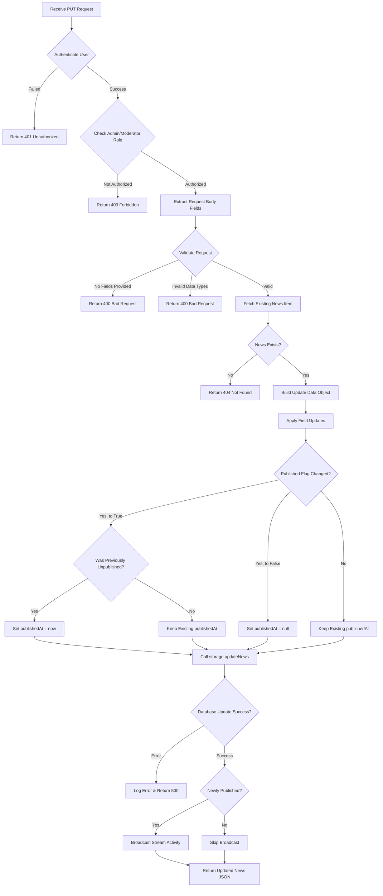
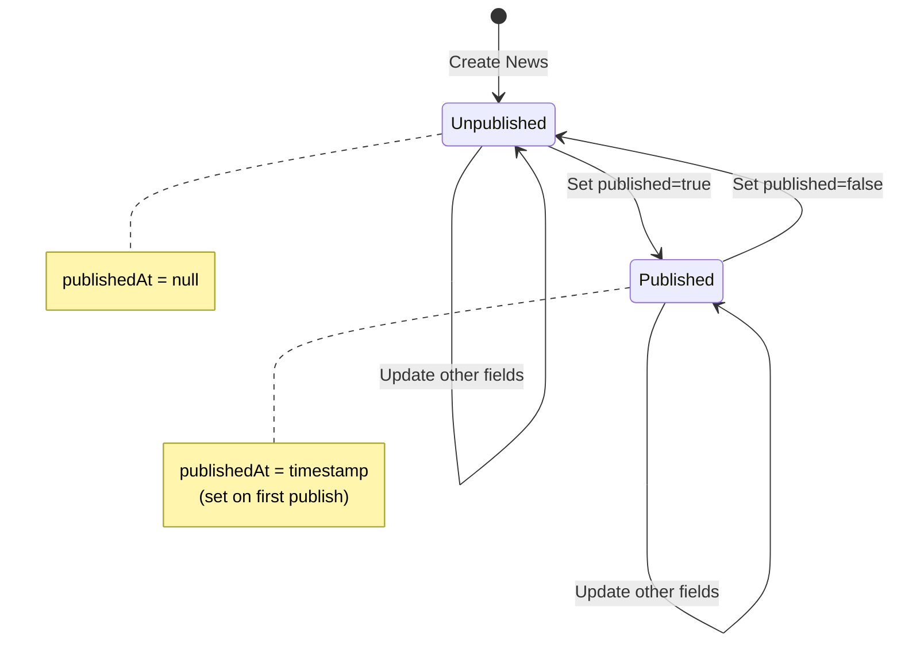

# Admin News Published Flag Update - Bug Fix Design

## Problem Statement

When an administrator attempts to update the `published` flag for a news article in the admin panel, the backend API endpoint returns a 500 Internal Server Error.

**Error Context:**
- Endpoint: `PUT https://reader.market/api/admin/news/{newsId}`
- HTTP Status: 500 Internal Server Error
- User Action: Toggling the published flag for a news article in the admin interface
- PM2 Process Name: `ollama-reader`

**Actual Error Observed:**
```
PUT https://reader.market/api/admin/news/dc7b68b3-69af-43c3-88db-829cc38b2989
Status: 500 Internal Server Error

Request Body:
{
  "published": false,
  "title": "New stream page!"
}

Response Body:
{
  "error": "Failed to update news"
}
```

**Key Observations:**
- The request includes both `published` and `title` fields
- The `content` field is missing from the request
- This suggests a partial update scenario where only some fields are being modified

## Root Cause Analysis

### Current Implementation Issues

1. **Backend Endpoint Logic (routes.ts, lines 1179-1265)**
   - The endpoint attempts to update multiple fields even when only the `published` flag changes
   - The `publishedAt` timestamp logic (line 1194) unconditionally sets a new date whenever `published` is true, which may not be the intended behavior
   - No validation for partial updates when only the `published` flag is being modified

2. **Data Validation Gap**
   - Missing validation for scenarios where the request contains only the `published` field without `title` or `content`
   - The existing implementation expects all fields to be present or uses fallback to existing values, which may cause issues with data type handling

3. **Frontend Integration Uncertainty**
   - The current NewsManagement component only updates news through a full form submission (title, content, published)
   - No direct published flag toggle mechanism is visible in the analyzed code, suggesting there may be another UI component or inline editing feature

4. **Database Layer Error Handling**
   - The `updateNews` function in storage.ts (lines 2921-2933) directly spreads the `newsData` object without sanitization
   - Potential for unexpected fields or data type mismatches to reach the database layer

## Design Solution

### 1. Request Validation Enhancement

**Objective:** Ensure the API endpoint can handle partial updates specifically for the published flag

**Approach:**
- Validate that at least one field is provided in the request
- Allow updates with only the `published` field present
- Maintain backward compatibility for full news updates

**Validation Rules:**
| Field | Required | Validation |
|-------|----------|------------|
| title | No (for partial update) | If provided, must be non-empty string |
| content | No (for partial update) | If provided, must be non-empty string |
| published | No (for partial update) | Must be boolean if provided |

### 2. Published Timestamp Logic Refinement

**Current Behavior:**
- Sets `publishedAt` to current date whenever `published` is true
- **BUG:** Assigns `existingNews.publishedAt` (ISO string) directly, causing type error

**Improved Behavior:**
- Only set `publishedAt` when transitioning from unpublished to published state
- Preserve existing `publishedAt` value if already published
- Clear `publishedAt` if transitioning from published to unpublished
- **CRITICAL:** Convert ISO string timestamps to Date objects before assigning

**State Transition Table:**

| Previous State | New State | publishedAt Action |
|---------------|-----------|-------------------|
| unpublished (false) | published (true) | Set to new Date() |
| published (true) | published (true) | Convert existing string to Date |
| published (true) | unpublished (false) | Set to null |
| unpublished (false) | unpublished (false) | Keep as null |

**Type Conversion Required:**

```typescript
// WRONG (current code):
publishedAt: published ? new Date() : existingNews.publishedAt

// CORRECT (fixed code):
publishedAt: published 
  ? (existingNews.published ? new Date(existingNews.publishedAt) : new Date())
  : null

// Or more explicit:
publishedAt: (() => {
  if (published && !existingNews.published) {
    // Transitioning to published: set new timestamp
    return new Date();
  } else if (published && existingNews.published) {
    // Already published: preserve existing timestamp (convert string to Date)
    return existingNews.publishedAt ? new Date(existingNews.publishedAt) : new Date();
  } else {
    // Unpublishing or staying unpublished: clear timestamp
    return null;
  }
})()
```

### 3. Data Sanitization Layer

**Objective:** Prevent invalid or unexpected fields from reaching the database

**Implementation Strategy:**
- Create an explicit whitelist of updatable fields
- Filter the request body to include only valid fields
- Transform data types as needed before database operation

**Allowed Fields for News Update:**
- title
- content
- published
- publishedAt (computed, not from request)
- updatedAt (automatically set)

### 4. Error Response Enhancement

**Objective:** Provide meaningful error messages to help diagnose issues

**Error Response Structure:**
```
{
  "error": "Description of what went wrong",
  "details": "Specific technical details",
  "field": "Field name if validation failed on specific field"
}
```

**Error Scenarios to Handle:**
| Scenario | HTTP Status | Error Message |
|----------|-------------|---------------|
| News article not found | 404 | "News item not found" |
| No fields provided for update | 400 | "At least one field must be provided for update" |
| Invalid published value | 400 | "published field must be a boolean value" |
| Database constraint violation | 400 | "Invalid data: [specific constraint message]" |
| Unexpected database error | 500 | "Failed to update news" |

### 5. Frontend Integration Verification

**Investigation Required:**
- Identify where the published flag toggle is triggered in the frontend
- Verify what data is being sent in the PUT request body
- Ensure the request includes authentication token and proper headers

**Expected Request Format:**
```
PUT /api/admin/news/{newsId}
Headers:
  Authorization: Bearer {token}
  Content-Type: application/json
  
Body (minimal update):
{
  "published": true
}

Body (full update):
{
  "title": "Updated Title",
  "content": "Updated Content",
  "published": true
}
```

## Implementation Flow

### Backend Update Endpoint Processing



### Published State Transition Logic



## Testing Considerations

### Test Scenarios

1. **Toggle Published Flag from False to True**
   - Verify publishedAt is set to current timestamp
   - Verify WebSocket broadcast occurs for new published news
   - Verify response includes updated news with correct fields

2. **Toggle Published Flag from True to False**
   - Verify publishedAt is cleared (set to null)
   - Verify no WebSocket broadcast occurs
   - Verify news no longer appears in public news feed

3. **Update Already Published News (keep published=true)**
   - Verify publishedAt timestamp is preserved
   - Verify other fields (title, content) are updated correctly
   - Verify no duplicate WebSocket broadcasts

4. **Partial Update with Only Published Flag**
   - Send request with only `{"published": true}`
   - Verify title and content remain unchanged
   - Verify update succeeds

5. **Invalid Request Handling**
   - Send empty request body → expect 400 error
   - Send invalid published value (string instead of boolean) → expect 400 error
   - Send request for non-existent news ID → expect 404 error
   - Send request without authentication → expect 401 error
   - Send request as non-admin user → expect 403 error

6. **Database Constraint Violations**
   - Attempt to set invalid data types
   - Verify proper error handling and rollback

### API Contract Validation

**Endpoint:** PUT /api/admin/news/:id

**Request Body Schema:**
```
{
  title?: string,        // Optional: if provided, must be non-empty
  content?: string,      // Optional: if provided, must be non-empty
  published?: boolean    // Optional: if provided, must be boolean
}
```

**Success Response (200):**
```
{
  id: string,
  title: string,
  content: string,
  authorId: string,
  published: boolean,
  publishedAt: string | null,
  viewCount: number,
  commentCount: number,
  reactionCount: number,
  createdAt: string,
  updatedAt: string
}
```

**Error Response (4xx/5xx):**
```
{
  error: string,
  details?: string
}
```

## Impact Analysis

### Components Affected

1. **Backend API (server/routes.ts)**
   - PUT /api/admin/news/:id endpoint logic
   - Request validation logic
   - Published state transition logic

2. **Data Layer (server/storage.ts)**
   - updateNews function (may need input sanitization)

3. **Frontend Admin Panel**
   - Verification needed for where published toggle is triggered
   - Error handling for failed updates

4. **WebSocket Broadcasting**
   - Ensure broadcast only occurs for newly published content
   - Prevent duplicate broadcasts for existing published content updates

### Database Schema

**No Changes Required**
- The `news` table already has the required structure
- `published` column: boolean with default false
- `publishedAt` column: nullable timestamp

### Performance Considerations

- Minimal performance impact expected
- Additional validation adds negligible overhead
- Database update remains a single operation

## Security Considerations

1. **Authentication & Authorization**
   - Verify JWT token authentication is working correctly
   - Confirm requireAdminOrModerator middleware is applied
   - Ensure no privilege escalation vulnerabilities

2. **Input Validation**
   - Sanitize all input fields to prevent injection attacks
   - Validate data types strictly
   - Reject unexpected fields in request body

3. **Data Integrity**
   - Ensure publishedAt logic maintains data consistency
   - Validate that published/unpublished state transitions are atomic
   - Log all admin actions for audit trail

## Diagnostic Steps

### Viewing Server Logs

Since the application runs under PM2 with process name `ollama-reader`:

```bash
# View all logs
pm2 logs ollama-reader

# View only error logs
pm2 logs ollama-reader --err

# View last 200 lines
pm2 logs ollama-reader --lines 200

# Clear old logs and watch new ones
pm2 flush ollama-reader
pm2 logs ollama-reader
```

### Actual Error from Server Logs

```
0|ollama-reader  | 2026-01-12T23:52:57: Error updating news: TypeError: e.toISOString is not a function
0|ollama-reader  | 2026-01-12T23:52:57:     at na.mapToDriverValue (/var/www/reader.market/dist/index.cjs:68:108123)
0|ollama-reader  | 2026-01-12T23:52:57:     at /var/www/reader.market/dist/index.cjs:68:84888
0|ollama-reader  | 2026-01-12T23:52:57:     at Array.map (<anonymous>)
0|ollama-reader  | 2026-01-12T23:52:57:     at t.buildQueryFromSourceParams (/var/www/reader.market/dist/index.cjs:68:83865)
```

### Root Cause Confirmed

**Error Type:** `TypeError: e.toISOString is not a function`

**What this means:**
- Drizzle ORM is attempting to call `.toISOString()` on a value that is not a Date object
- This occurs in `mapToDriverValue` when preparing timestamp fields for database insertion
- The error happens during the `UPDATE` query construction

**Why this happens:**

Looking at the backend code in `routes.ts` (line 1194):

```typescript
publishedAt: published ? new Date() : existingNews.publishedAt
```

The problem:
- `existingNews.publishedAt` comes from the database query result
- Database query results return ISO string timestamps, NOT Date objects
- When `published` is false (or already true), the code assigns `existingNews.publishedAt` (a string) to the update object
- Drizzle ORM expects Date objects for timestamp columns
- When Drizzle tries to call `.toISOString()` on the string, it fails

**Additional Issue:**

The request body is missing `content`, so:
```typescript
content: content !== undefined ? content : existingNews.content
```

Similarly, `existingNews.content` and other fields from the database may have type mismatches that cause issues when spread into the update operation.

### Common Root Causes

1. **Primary Issue: Date Type Mismatch** ✅ CONFIRMED
   - Database query results return ISO strings for timestamp fields
   - Drizzle ORM expects Date objects for timestamp columns
   - The code assigns string timestamps directly without conversion

2. **Secondary Issue: Unsafe Data Spreading**
   - The `updateNews` function spreads all request data directly into the database update
   - Fields from `existingNews` are database result types (strings for dates)
   - These get passed directly to Drizzle without type conversion

3. **Tertiary Issue: Missing Field Handling**
   - The code uses fallback values from `existingNews` when fields are undefined
   - But these fallback values have the wrong type (string instead of Date)

## Implementation Fix

### Exact Code Change Required

**Location:** `server/routes.ts`, line ~1190-1197

**Current Code (BROKEN):**
```typescript
const newsData = {
  title: title !== undefined ? title : existingNews.title,
  content: content !== undefined ? content : existingNews.content,
  published: published !== undefined ? published : existingNews.published,
  publishedAt: published ? new Date() : existingNews.publishedAt  // ❌ BUG: existingNews.publishedAt is a string
};
```

**Fixed Code:**
```typescript
const newsData = {
  title: title !== undefined ? title : existingNews.title,
  content: content !== undefined ? content : existingNews.content,
  published: published !== undefined ? published : existingNews.published,
  publishedAt: (() => {
    const isPublishing = published !== undefined ? published : existingNews.published;
    
    if (isPublishing) {
      // If transitioning to published, set new timestamp
      // If already published, preserve existing timestamp (convert string to Date)
      if (published === true && !existingNews.published) {
        return new Date(); // First time publishing
      } else if (existingNews.publishedAt) {
        return new Date(existingNews.publishedAt); // Convert string to Date
      } else {
        return new Date(); // Fallback if somehow publishedAt is missing
      }
    } else {
      return null; // Unpublished state
    }
  })()
};
```

**Simplified Alternative (if you don't care about preserving original publish date):**
```typescript
const newsData = {
  title: title !== undefined ? title : existingNews.title,
  content: content !== undefined ? content : existingNews.content,
  published: published !== undefined ? published : existingNews.published,
  publishedAt: (() => {
    const isPublishing = published !== undefined ? published : existingNews.published;
    return isPublishing ? new Date() : null;
  })()
};
```

### Why This Fix Works

1. **Eliminates Type Error:**
   - Never passes string timestamps to Drizzle ORM
   - Always converts to Date objects or null
   - `new Date(isoString)` creates proper Date object

2. **Handles All Cases:**
   - New publication: sets new Date()
   - Already published: converts existing string timestamp to Date
   - Unpublishing: sets null
   - Missing fields: uses existing values correctly

3. **Type Safe:**
   - Drizzle ORM receives Date objects for timestamp fields
   - No more `.toISOString()` errors

## Rollback Strategy

If issues persist after implementation:

1. **Immediate Mitigation**
   - Add detailed error logging to capture full stack traces
   - Check PM2 logs: `pm2 logs ollama-reader --err`
   - Temporarily add additional validation to reject ambiguous requests
   - Monitor server logs for database constraint violations

2. **Diagnostic Tools**
   - Add request/response logging middleware for admin endpoints
   - Create database query logging for news update operations
   - Implement health check endpoint to verify database connectivity

3. **Fallback Approach**
   - Require full news object (title, content, published) for all updates
   - Disable inline published toggle if frontend component exists
   - Force admins to use full edit form for any modifications

## Success Criteria

The fix is considered successful when:

1. Administrators can toggle the published flag without encountering 500 errors
2. The publishedAt timestamp is correctly set only on first publication
3. Previously published news items preserve their publishedAt when updated
4. Partial updates (changing only published flag) work correctly
5. Full updates (changing title, content, and published) work correctly
6. WebSocket broadcasts only occur for newly published content
7. Error messages clearly indicate the cause of any failures
8. All test scenarios pass successfully

## Monitoring & Observability

### Logging Enhancements

Add structured logging for:
- News update requests with sanitized input data
- Published state transitions (before → after)
- publishedAt timestamp changes
- Database update operation results
- WebSocket broadcast events

### Metrics to Track

- News update success rate (admin panel)
- News update error rate by error type
- Average response time for news update endpoint
- Frequency of published flag toggles
- WebSocket broadcast delivery success rate

### Alert Conditions

- News update endpoint error rate exceeds 5% over 5-minute window
- Database connection failures during news updates
- Authentication failures spike for admin endpoints
- WebSocket broadcast failures exceed 10% of attempts
   - Partial update without `content` field causes database constraint violation

2. **Type Mismatch**
   - The `published` value might not be properly parsed as boolean
   - String "false" vs boolean false

3. **Data Spreading Issue**
   - The `updateNews` function spreads all request data directly
   - Missing `content` field causes undefined to be passed to database

## Rollback Strategy

If issues persist after implementation:

1. **Immediate Mitigation**
   - Add detailed error logging to capture full stack traces
   - Check PM2 logs: `pm2 logs ollama-reader --err`
   - Temporarily add additional validation to reject ambiguous requests
   - Monitor server logs for database constraint violations

2. **Diagnostic Tools**
   - Add request/response logging middleware for admin endpoints
   - Create database query logging for news update operations
   - Implement health check endpoint to verify database connectivity

3. **Fallback Approach**
   - Require full news object (title, content, published) for all updates
   - Disable inline published toggle if frontend component exists
   - Force admins to use full edit form for any modifications

## Success Criteria

The fix is considered successful when:

1. Administrators can toggle the published flag without encountering 500 errors
2. The publishedAt timestamp is correctly set only on first publication
3. Previously published news items preserve their publishedAt when updated
4. Partial updates (changing only published flag) work correctly
5. Full updates (changing title, content, and published) work correctly
6. WebSocket broadcasts only occur for newly published content
7. Error messages clearly indicate the cause of any failures
8. All test scenarios pass successfully

## Monitoring & Observability

### Logging Enhancements

Add structured logging for:
- News update requests with sanitized input data
- Published state transitions (before → after)
- publishedAt timestamp changes
- Database update operation results
- WebSocket broadcast events

### Metrics to Track

- News update success rate (admin panel)
- News update error rate by error type
- Average response time for news update endpoint
- Frequency of published flag toggles
- WebSocket broadcast delivery success rate

### Alert Conditions

- News update endpoint error rate exceeds 5% over 5-minute window
- Database connection failures during news updates
- Authentication failures spike for admin endpoints
- WebSocket broadcast failures exceed 10% of attempts
