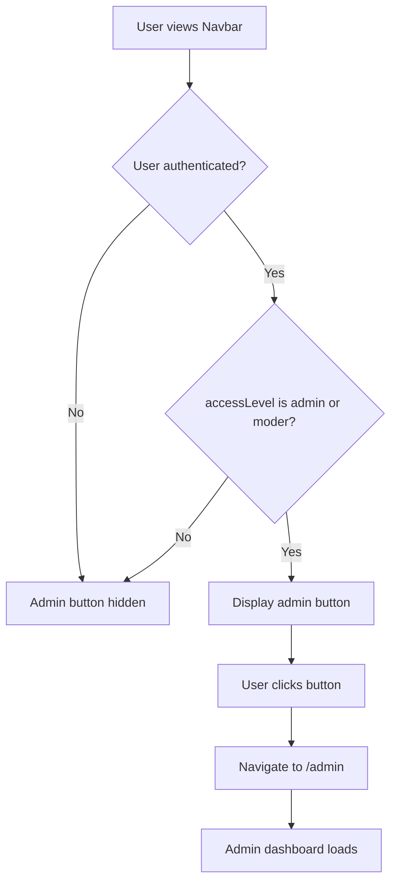
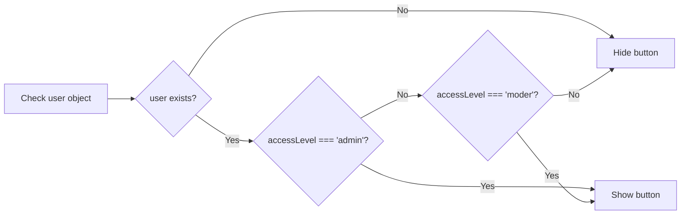

# Admin Panel Shortcut Button in Header

## Overview

Add a small, subtle button in the navigation header immediately after the logo and "Reader.Market" branding that provides administrators quick access to the admin panel located at `/admin`. The button should be visible only to users with administrator or moderator access levels.

## Business Context

**Problem**: Administrators and moderators currently need to manually navigate to `/admin` URL to access the admin panel. There is no visible UI element providing quick access to administrative functions.

**Solution**: Introduce a discreet icon button in the header that appears only for authorized users (admin and moderator roles), enabling one-click access to the admin dashboard.

**Value**: Improves administrator workflow efficiency by reducing navigation steps and making admin tools readily accessible without being intrusive to regular users.

## Functional Requirements

### Authorization and Visibility

| Requirement | Description |
|------------|-------------|
| **Access Control** | Button must only be visible to users with `accessLevel` of `'admin'` or `'moder'` |
| **Authentication Check** | Button should not appear for unauthenticated users or users with standard access level |
| **Dynamic Rendering** | Visibility must update immediately when user authentication state changes |

### Visual Design

| Aspect | Specification |
|--------|--------------|
| **Placement** | Positioned immediately after the logo and "Reader.Market" text in the navigation bar |
| **Size** | Small icon, approximately 16x16 pixels to maintain subtlety |
| **Style** | Minimal, unobtrusive design using muted colors that blend with header theme |
| **Icon** | Administrative symbol (e.g., gear/settings icon, shield icon, or dashboard icon) |
| **Hover State** | Subtle visual feedback on hover (color change or slight opacity adjustment) |
| **Spacing** | Adequate margin from logo to maintain visual hierarchy without crowding |

### Interaction Behavior

| Action | Expected Behavior |
|--------|------------------|
| **Click** | Navigate to `/admin` route |
| **Visual Feedback** | Hover effect to indicate interactivity |
| **Accessibility** | Include appropriate ARIA label for screen readers |
| **Mobile Responsiveness** | Button should adapt appropriately for mobile view or be integrated into mobile menu |

## Technical Design

### Component Integration

**Target Component**: `client/src/components/Navbar.tsx`

**Integration Point**: Between lines 88-90, immediately after the logo Link element

**Conditional Rendering Logic**:
- Access the authenticated user object from the auth context
- Check if `user.accessLevel` equals `'admin'` or `'moder'`
- Render button only when condition is met

### Data Requirements

| Data Element | Source | Purpose |
|-------------|--------|---------|
| **user** | Auth context (`useAuth` hook) | Retrieve current user information |
| **user.accessLevel** | User object property | Determine if user has admin or moderator privileges |

### Navigation Flow

### Authorization Logic

## UI Structure

### Desktop Layout

The navigation header structure will be modified as follows:

**Before**:
- Logo + "Reader.Market" text
- Navigation menu items (right-aligned)

**After**:
- Logo + "Reader.Market" text
- **Admin button (conditional, for admin/moder only)**
- Navigation menu items (right-aligned)

### Mobile Considerations

| Approach | Description |
|----------|-------------|
| **Option A** | Include admin button in mobile menu dropdown alongside other navigation items |
| **Option B** | Show small admin icon next to mobile menu hamburger icon |
| **Recommendation** | Option A - integrate into existing MobileMenu component for consistency |

## Accessibility Requirements

| Requirement | Implementation |
|------------|----------------|
| **Screen Reader Support** | Provide descriptive `aria-label` (e.g., "Admin Panel") |
| **Keyboard Navigation** | Ensure button is focusable and activatable via Enter/Space keys |
| **Focus Indicator** | Clear visual focus ring for keyboard navigation |
| **Semantic HTML** | Use appropriate button or link element with proper role |

## Non-Functional Requirements

### Performance

- Authorization check must not introduce noticeable latency
- Button rendering must not impact overall navbar load time
- Use existing auth context data without additional API calls

### Security

- Enforce server-side authorization on `/admin` route regardless of client-side button visibility
- Button visibility is a convenience feature, not a security control
- Admin panel must validate user permissions on backend

### Maintainability

- Keep authorization logic consistent with existing patterns (e.g., `AdminDashboard.tsx` line 337)
- Use existing icon library (lucide-react) for consistency
- Follow established component styling patterns

## Edge Cases and Considerations

| Scenario | Handling Strategy |
|----------|------------------|
| **User role changes during session** | Button visibility updates automatically when auth context refreshes |
| **Slow authentication load** | Button appears/disappears smoothly without layout shift |
| **Multiple tabs open** | Each tab independently reflects current authentication state |
| **Direct navigation to /admin** | Backend enforces access control regardless of button visibility |

## Design Principles

1. **Subtlety**: Button should be small and unobtrusive, not competing with primary navigation
2. **Discoverability**: Visible enough for administrators to easily find without prominence
3. **Consistency**: Follow existing design patterns and component structure in Navbar
4. **Progressive Enhancement**: Feature adds convenience without breaking existing functionality
5. **Security-First**: Client-side visibility is cosmetic; server enforces actual access control

## Success Criteria

| Criterion | Measurement |
|-----------|-------------|
| **Visibility** | Button appears only for admin/moder users |
| **Functionality** | Clicking button navigates to `/admin` |
| **Design** | Button is subtle and does not disrupt header layout |
| **Responsiveness** | Button adapts appropriately across device sizes |
| **Accessibility** | Button is usable via keyboard and screen readers |
| **Performance** | No measurable impact on navbar render time || **Accessibility** | Button is usable via keyboard and screen readers |
| **Performance** | No measurable impact on navbar render time |