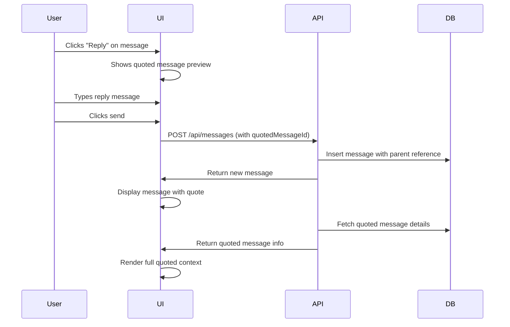
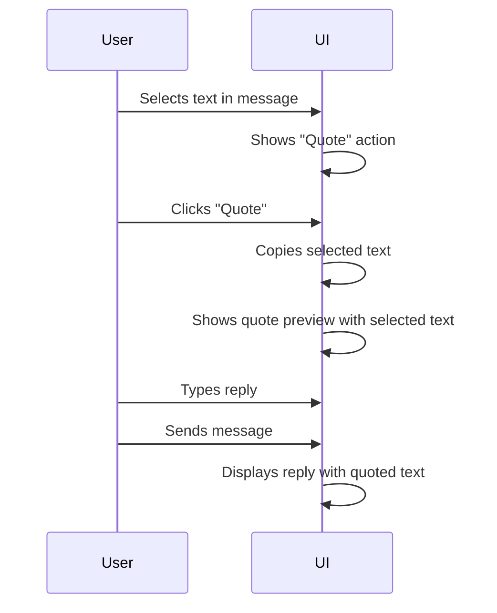
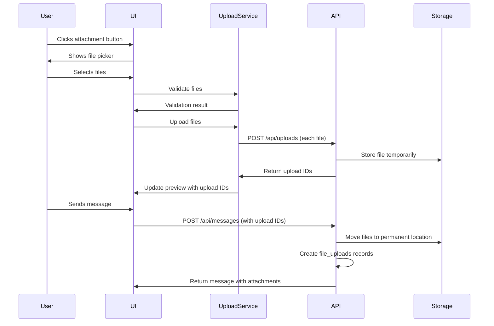

# Message Citation, Reply, Emoji and File Attachment Feature Design

## Feature Overview

This design extends the messaging system and book review features to support:
1. **Message Citation and Reply**: Users can quote and reply to specific messages in private and group chats, showing clear conversation threads
2. **Text Selection Quote**: Users can select specific portions of message text to quote in their replies
3. **Emoji Support**: Native emoji picker for messages, comments, and reviews
4. **File and Image Attachments**: Users can attach files and images to messages, comments, and reviews

## Business Context

### User Value
- Improved conversation clarity by maintaining context through message replies
- Enhanced expressiveness through emoji usage in all communication contexts
- Richer content sharing through file and image attachments
- Better user experience aligned with modern messaging applications

### Current System State
The system already has:
- Private messaging between users
- Group messaging with channels
- Book comments and reviews system
- Message reactions infrastructure (message_reactions table)
- Basic emoji support for reactions

## Data Model Changes

### 1. Messages Table Enhancement

The existing messages table requires modifications to support citations and attachments:

| Field Name | Data Type | Constraints | Purpose |
|------------|-----------|-------------|---------|
| quoted_message_id | varchar | references messages.id, nullable | References the message being quoted/replied to |
| quoted_text | text | nullable | Stores specific text selection from quoted message |
| attachment_urls | jsonb | nullable, default [] | Array of attachment file URLs |
| attachment_metadata | jsonb | nullable | Stores metadata for each attachment (filename, size, type, dimensions for images) |

**Metadata Structure for attachments**:
```
{
  "attachments": [
    {
      "url": "string",
      "filename": "string", 
      "fileSize": number (bytes),
      "mimeType": "string",
      "uploadedAt": "ISO timestamp",
      "thumbnailUrl": "string" (optional, for images),
      "width": number (optional, for images),
      "height": number (optional, for images)
    }
  ]
}
```

### 2. Comments Table Enhancement

The existing comments table needs similar attachment support:

| Field Name | Data Type | Constraints | Purpose |
|------------|-----------|-------------|---------|
| attachment_urls | jsonb | nullable, default [] | Array of attachment file URLs |
| attachment_metadata | jsonb | nullable | Stores metadata for each attachment |

### 3. Reviews Table Enhancement

The existing reviews table needs similar attachment support:

| Field Name | Data Type | Constraints | Purpose |
|------------|-----------|-------------|---------|
| attachment_urls | jsonb | nullable, default [] | Array of attachment file URLs |
| attachment_metadata | jsonb | nullable | Stores metadata for each attachment |

### 4. New Table: File Uploads

Track all uploaded files for storage management and access control:

| Field Name | Data Type | Constraints | Purpose |
|------------|-----------|-------------|---------|
| id | varchar | primary key, default gen_random_uuid() | Unique file identifier |
| uploader_id | varchar | references users.id, not null | User who uploaded the file |
| file_url | text | not null | Full file URL/path |
| filename | text | not null | Original filename |
| file_size | integer | not null | File size in bytes |
| mime_type | text | not null | File MIME type |
| storage_path | text | not null | Internal storage path |
| entity_type | text | not null | 'message', 'comment', or 'review' |
| entity_id | varchar | nullable | ID of related message/comment/review |
| thumbnail_url | text | nullable | Thumbnail URL for images |
| uploaded_at | timestamp | not null, default now() | Upload timestamp |
| deleted_at | timestamp | nullable | Soft delete timestamp |

**Indexes**:
- uploader_id (for user file management)
- entity_type + entity_id (for loading attachments)
- uploaded_at (for cleanup operations)

## Functional Requirements

### Feature 1: Message Citation and Reply

#### User Interactions

**Reply to Message**:
1. User hovers over or long-presses a message
2. System displays action menu with "Reply" option
3. User clicks "Reply"
4. System shows quoted message preview in input area
5. User types their response
6. System sends message with reference to quoted message

**Quote Text Selection**:
1. User selects specific text within a message
2. System shows context menu with "Quote" option
3. User clicks "Quote"
4. System shows selected text as quote preview in input area
5. User types their response
6. System sends message with quoted text and reference

#### Display Requirements

**Quoted Message Display**:
- Show compact quoted message above reply in a visually distinct container
- Display sender name and truncated content (max 3 lines)
- Show full quoted text when user clicks/taps on quote
- Clicking quote scrolls to original message if visible in chat history
- Show indicator if quoted message is no longer available (deleted)

**Thread Visualization**:
- Visual indicator (line, indentation, or icon) connecting reply to quoted message
- Subtle background color or border to distinguish quoted content
- Clear separation between quoted content and reply content

#### Business Rules

- Users can only reply to messages in conversations they are part of
- Quoted messages remain visible even if original is deleted (show "[Message Deleted]" placeholder)
- Maximum quote depth: 1 level (no nested quote chains to avoid complexity)
- Quoted text selection limited to 500 characters maximum
- Reply notification sent to original message sender

### Feature 2: Emoji Support

#### Integration Points

**Message Composition**:
- Emoji picker button in message input toolbar
- Emoji inserted at cursor position in text input
- Recent emoji section for quick access
- Emoji search functionality

**Comments and Reviews**:
- Same emoji picker UI integrated into comment/review input areas
- Consistent behavior across all text input contexts

#### User Interface Elements

**Emoji Picker Components**:
- Button with smile icon to trigger picker
- Popup/popover containing emoji grid
- Category tabs (smileys, people, nature, food, activities, travel, objects, symbols, flags)
- Search bar for emoji lookup
- Recently used emojis section (stored per user in browser local storage)
- Skin tone selector for applicable emojis

#### Technical Specifications

- Use native emoji rendering (Unicode)
- Store emojis as text in database (UTF-8 encoded)
- Fallback to text representation for unsupported emojis
- Client-side emoji data library for picker UI
- No server-side emoji processing required beyond UTF-8 storage

### Feature 3: File and Image Attachments

#### Upload Capabilities

**Supported File Types**:
- Images: JPEG, PNG, GIF, WEBP (max 10 MB each)
- Documents: PDF, DOC, DOCX, TXT (max 20 MB each)
- Maximum 5 attachments per message/comment/review

**Upload Process**:
1. User clicks attachment button
2. System shows file picker dialog
3. User selects files
4. System validates file type and size
5. System shows upload progress indicator
6. System uploads files to storage
7. System displays preview of attached files
8. User sends message/comment/review with attachments

#### Display Requirements

**Image Attachments**:
- Display inline as thumbnails (max 200x200px)
- Click to open full-size lightbox viewer
- Multiple images shown in grid layout (2 columns)
- Show loading placeholder during upload
- Display image dimensions and file size on hover

**Document Attachments**:
- Display as file card with icon, filename, and size
- Click to download file
- Show file type icon based on MIME type
- Display upload progress during sending

**Attachment Organization**:
- Attachments appear below message text content
- Multiple attachments laid out in responsive grid
- Clear visual separation from message text

#### Storage Strategy

**File Storage Location**:
- Store files in dedicated uploads directory on server
- Organize by date: `/uploads/messages/{year}/{month}/{filename}`
- Generate unique filenames to prevent collisions: `{uuid}_{originalFilename}`
- Separate directories for messages, comments, reviews

**Image Processing**:
- Generate thumbnails automatically (200x200px, maintain aspect ratio)
- Store both original and thumbnail
- Compress images for optimal bandwidth (JPEG quality 85%)
- Preserve EXIF orientation metadata

**Security Measures**:
- Validate file extensions and MIME types on server
- Scan filenames for path traversal attempts
- Store files outside web root if possible
- Serve files through authenticated endpoint
- Generate signed URLs with expiration for private file access

#### Access Control

**Attachment Visibility Rules**:
- Message attachments: Only visible to conversation participants
- Group message attachments: Visible to all group members
- Comment/review attachments: Follow book visibility rules (public if book is public)
- Deleted messages: Attachments become inaccessible
- User leaves group: Attachments remain visible to other members

**Download Authorization**:
- Verify user has access to parent entity (message/comment/review)
- Check user is conversation participant or group member
- For public content, allow unauthenticated downloads
- Rate limit downloads to prevent abuse (10 downloads per minute per IP)

## API Endpoints Design

### Message Reply Endpoints

**Send Message with Quote**
- Method: POST
- Path: `/api/messages` (existing endpoint, enhanced)
- Request Body:
```
{
  "conversationId": "string" (optional),
  "channelId": "string" (optional),
  "content": "string" (required),
  "quotedMessageId": "string" (optional),
  "quotedText": "string" (optional),
  "attachments": ["file1.jpg", "file2.pdf"] (optional, temporary upload IDs)
}
```
- Response: Message object with quoted message details populated
- Authorization: User must be conversation participant or group member

**Get Message Thread**
- Method: GET
- Path: `/api/messages/{messageId}/thread`
- Response: Array of messages that quoted the specified message
- Purpose: Show who replied to a specific message
- Authorization: User must have access to the conversation

### File Upload Endpoints

**Upload File**
- Method: POST
- Path: `/api/uploads`
- Request: Multipart form data with file
- Response:
```
{
  "uploadId": "string",
  "url": "string",
  "filename": "string",
  "fileSize": number,
  "mimeType": "string",
  "thumbnailUrl": "string" (if image)
}
```
- Authorization: Authenticated users only
- Note: Returns temporary upload ID, file is moved to permanent storage when message/comment is created

**Download File**
- Method: GET
- Path: `/api/uploads/{uploadId}`
- Response: File stream with appropriate Content-Type header
- Authorization: Verify user access to parent entity

**Delete Attachment**
- Method: DELETE
- Path: `/api/uploads/{uploadId}`
- Response: Success confirmation
- Authorization: Only file uploader or content moderator
- Note: Soft delete, mark deleted_at timestamp

## Frontend Component Architecture

### Message Reply UI Components

**QuotedMessagePreview Component**
- Displays compact view of quoted message
- Shows sender avatar, name, and truncated content
- Click handler to scroll to original message
- Close button to remove quote from draft

**MessageWithQuote Component**
- Wraps existing message display
- Renders quoted message above main message content
- Applies visual styling for quote container
- Handles click to navigate to quoted message

### Emoji Picker Integration

**EmojiPicker Component**
- Reusable picker component for all text inputs
- Category navigation
- Search functionality
- Recent emojis persistence
- Keyboard navigation support

**EmojiButton Component**
- Trigger button for emoji picker
- Positioned in input toolbar
- Shows picker in popover on click
- Mobile-responsive positioning

### File Attachment Components

**AttachmentButton Component**
- Paperclip icon button
- Opens file picker dialog
- Handles file selection and validation
- Shows error messages for invalid files

**AttachmentPreview Component**
- Displays selected files before sending
- Shows image thumbnails or file icons
- Remove button for each attachment
- Upload progress indicators
- File size and type information

**AttachmentDisplay Component**
- Renders attachments in sent messages
- Image gallery for multiple images
- File cards for documents
- Click handlers for download/view
- Lightbox viewer for images

**FileUploadManager Service**
- Handles file upload to server
- Tracks upload progress
- Manages temporary upload IDs
- Handles upload errors and retries
- Validates files before upload

## User Experience Flow

### Message Reply Flow



### Text Quote Selection Flow



### File Attachment Flow



## UI/UX Specifications

### Message Reply Visual Design

**Quote Container Styling**:
- Light gray background (#F5F5F5)
- Left border accent (3px solid, theme color)
- Padding: 8px 12px
- Border radius: 4px
- Margin bottom: 8px from reply text

**Quote Content**:
- Sender name in bold, smaller font (12px)
- Message text in regular font (13px), gray color (#666)
- Truncate to 3 lines with ellipsis
- Show "Show more" link if truncated

**Reply Indicator**:
- Small reply icon next to sender name
- Dotted line connecting quote to reply (optional, for clarity)

### Emoji Picker Placement

**Desktop**:
- Popover anchored to emoji button
- Positioned above input on bottom sheets
- Width: 320px, Height: 400px
- Appears on click, closes on outside click or emoji selection

**Mobile**:
- Bottom sheet modal
- Full width
- Height: 50% of viewport
- Swipe down to close gesture

### Attachment Display Layout

**Single Image**:
- Display at natural size up to 400px width
- Maintain aspect ratio
- Rounded corners (8px)

**Multiple Images (2-4)**:
- 2 column grid
- Equal height thumbnails (200px)
- 4px gap between images

**More than 4 Images**:
- Show first 3 in grid
- Fourth thumbnail shows "+N more" overlay
- Click to open gallery viewer

**Document Attachments**:
- File card: 60px icon + filename + size
- One per row
- Download icon on right
- Hover shows full filename in tooltip

## Performance Considerations

### File Upload Optimization

**Client-Side**:
- Compress images before upload (quality 85%, max dimension 2048px)
- Show immediate preview from File API
- Upload files in parallel (max 3 concurrent)
- Cancel uploads if user navigates away

**Server-Side**:
- Stream file uploads to disk, don't buffer in memory
- Generate thumbnails asynchronously after initial save
- Use CDN or object storage for serving files at scale
- Implement resumable uploads for large files (future enhancement)

### Database Query Optimization

**Message Loading with Quotes**:
- Left join to load quoted message data in single query
- Limit quote data to essential fields (id, sender, content preview)
- Index on quoted_message_id for fast lookups
- Paginate message history (50 messages per page)

**Attachment Loading**:
- Lazy load attachment metadata only when message is visible
- Batch requests for multiple messages' attachments
- Cache attachment URLs in browser
- Use signed URLs with 1-hour expiration

## Security Considerations

### File Upload Security

**Validation**:
- Whitelist allowed file extensions on server
- Verify MIME type matches extension
- Check file size limits before accepting upload
- Sanitize filenames (remove special characters, path separators)

**Storage**:
- Store files with generated UUIDs, not original filenames
- Never execute uploaded files
- Set proper Content-Type and Content-Disposition headers on download
- Implement virus scanning for uploaded files (future enhancement)

**Access Control**:
- Verify user authentication before accepting uploads
- Check user has permission to post in target conversation/channel
- Validate upload IDs belong to requesting user when attaching to message
- Expire temporary uploads after 1 hour if not attached to message

### Quote Injection Prevention

**Content Sanitization**:
- Escape HTML in quoted text to prevent XSS
- Validate quoted_message_id exists and user has access
- Limit quoted text length to prevent oversized messages
- Strip formatting from quoted text for consistency

## Migration Strategy

### Database Migration Steps

1. Add new columns to messages table (quoted_message_id, quoted_text, attachment_urls, attachment_metadata)
2. Add new columns to comments table (attachment_urls, attachment_metadata)
3. Add new columns to reviews table (attachment_urls, attachment_metadata)
4. Create file_uploads table with indexes
5. Create foreign key from messages.quoted_message_id to messages.id
6. Set all new columns to nullable for backward compatibility

### Deployment Approach

**Phase 1: File Upload Infrastructure**
- Deploy file upload API endpoints
- Configure storage directories
- Test upload and download flows

**Phase 2: Message Reply Feature**
- Deploy database migrations
- Update message API to support quotes
- Deploy frontend UI for replies
- Test in production with limited users

**Phase 3: Emoji Support**
- Integrate emoji picker library
- Update all text input components
- Deploy to production

**Phase 4: Full Rollout**
- Enable for all users
- Monitor performance and error rates
- Gather user feedback

## Testing Scenarios

### Message Reply Testing

**Functional Tests**:
- Reply to private message shows quoted message correctly
- Reply to group message maintains quote context
- Clicking quote scrolls to original message
- Quote shows placeholder when original message is deleted
- Maximum quote depth is enforced
- Text selection quote captures correct text range

**Edge Cases**:
- Reply to very long message shows truncated quote
- Reply to message with emoji renders correctly
- Reply to message with attachment shows attachment info in quote
- User leaves conversation: existing quotes still display
- Quote message that user no longer has access to

### File Attachment Testing

**Upload Tests**:
- Upload single image displays thumbnail correctly
- Upload multiple images shows grid layout
- Upload document shows file card with icon
- Upload fails gracefully for oversized files
- Upload fails gracefully for unsupported file types
- Upload progress shows correctly
- Cancel upload removes file preview

**Download Tests**:
- Clicking image opens lightbox viewer
- Clicking document downloads file
- Unauthorized user cannot download private attachments
- Deleted attachment shows error message
- Slow connection shows loading state

**Storage Tests**:
- Files stored in correct directory structure
- Filenames are properly sanitized
- Thumbnails generated for images
- Temporary uploads cleaned up after 1 hour
- Soft-deleted files are not accessible

### Emoji Testing

**Picker Tests**:
- Emoji picker opens on button click
- Emoji inserts at cursor position
- Recent emojis persist across sessions
- Emoji search finds correct results
- Emoji categories navigate correctly
- Skin tone selector works for applicable emojis

**Rendering Tests**:
- Emojis display correctly on all platforms
- Mixed text and emoji render properly
- Emoji-only messages display at appropriate size
- Copy-paste emoji preserves correct characters

## Success Metrics

### User Engagement Metrics
- Percentage of messages using reply feature (target: >20% after 1 month)
- Percentage of messages with emoji (target: >40%)
- Percentage of messages with attachments (target: >15%)
- Average attachments per message with attachments (expected: 1-2)

### Technical Metrics
- File upload success rate (target: >99%)
- Average upload time for 1MB file (target: <3 seconds)
- Attachment download latency (target: <500ms)
- Quote rendering performance (target: <50ms per message)

### Quality Metrics
- User reported issues with replies (target: <5 per 1000 users)
- Failed file uploads due to validation (monitor for false positives)
- Storage usage growth rate (monitor for abuse)

## Future Enhancements

### Advanced Reply Features
- Thread view showing all replies to a message
- Reply notifications for mentioned users
- Nested reply support (up to 3 levels deep)
- Quote formatting preservation (bold, italic)

### Enhanced File Support
- Voice message recording and playback
- Video attachment support (up to 50MB)
- File preview for documents (PDF viewer)
- Drag-and-drop file upload
- Paste images from clipboard

### Collaboration Features
- Collaborative document editing on attachments
- File version history
- Shared file galleries per group
- File search across conversations

## Appendix: Third-Party Libraries

### Emoji Picker
- **emoji-picker-react** or **emoji-mart**: Pre-built React emoji picker components
- Features: Category navigation, search, skin tone selection, recent emojis
- Bundle size consideration: ~100KB (acceptable for feature value)

### Image Processing
- **sharp** (Node.js): Fast image resizing and thumbnail generation on server
- **browser-image-compression** (client): Compress images before upload

### File Validation
- **file-type**: Detect actual file type from magic numbers, not just extension
- **sanitize-filename**: Clean filenames for safe storage

### UI Components
- **react-image-lightbox**: Image viewer with zoom and navigation
- **react-dropzone**: Drag-and-drop file upload area
