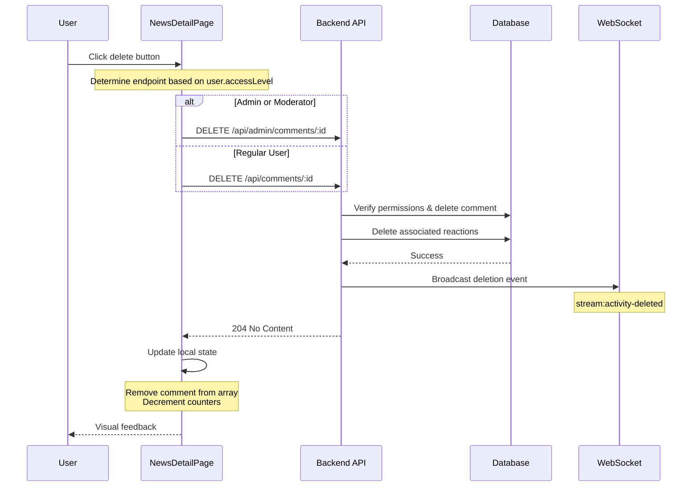

# Comment Management on News Detail Page

## Overview

This design addresses missing comment deletion functionality and comment counter synchronization issues on the news detail page (`/news/:id`). Currently, users cannot delete their own comments, administrators cannot delete any comments, and the comment counter in the news header does not update when comments are deleted.

## Problem Statement

### Current Issues

1. **Missing Delete Functionality**: On the NewsDetailPage component, there are no delete buttons for comments, preventing both regular users from deleting their own comments and administrators from moderating content.

2. **Comment Counter Inconsistency**: Two comment counters exist on the page:
   - **Header Counter**: Located in the news item header under the author name, displaying `newsItem.commentCount`
   - **Section Counter**: Located above the comments list, showing actual `comments.length`
   
   When a comment is deleted (through other interfaces like admin panel), only the section counter updates automatically, while the header counter remains stale.

## Requirements

### Functional Requirements

1. **User Comment Deletion**
   - Regular users must be able to delete their own comments
   - Delete button should only appear on comments owned by the current user
   - Deletion should be immediate with visual feedback

2. **Administrator Comment Deletion**
   - Administrators and moderators must be able to delete any comment
   - Delete button should appear on all comments for admin/moderator users
   - Must use admin-specific API endpoints to bypass ownership checks

3. **Comment Counter Synchronization**
   - Both header counter and section counter must update simultaneously when comments are added or deleted
   - Counter updates must persist across page refreshes
   - Counter must reflect actual database state

4. **User Interface Standards**
   - Delete button should follow existing design patterns from CommentsSection and BookDetail components
   - Modern X icon (lucide-react `X` component) positioned in top-right corner of comment card
   - Confirmation dialog before deletion (optional but recommended)
   - Internationalization support for all UI text

### Non-Functional Requirements

1. **Permission Security**: Backend authorization checks must prevent unauthorized deletions
2. **State Consistency**: Local state updates must occur optimistically before API confirmation
3. **Error Handling**: Failed deletions must restore previous state and show error messages
4. **WebSocket Integration**: Deletions should broadcast to other connected clients via Socket.IO

## System Architecture

### Frontend Component Structure

```
NewsDetailPage (client/src/pages/NewsDetailPage.tsx)
├── News Header Section
│   ├── Title
│   ├── Author Info with Avatar
│   ├── Statistics Badges
│   │   ├── View Count
│   │   ├── Comment Count (newsItem.commentCount) ← MUST UPDATE
│   │   └── Reaction Count
│   └── Content
│
├── Comment Input Section (authenticated users only)
│   └── Textarea with Post Button
│
└── Comments List Section
    ├── Section Header with Counter (comments.length) ← MUST UPDATE
    └── Comment Cards
        ├── Avatar
        ├── Author Name & Date
        ├── Content
        ├── Reaction Bar
        └── Delete Button (conditional) ← NEW FEATURE
```

### API Endpoints

The backend already provides the necessary endpoints:

| Endpoint | Method | Purpose | Authorization |
|----------|--------|---------|---------------|
| `/api/news/:id/comments` | GET | Fetch all comments for news item | Authenticated users |
| `/api/news/:id/comments` | POST | Create new comment | Authenticated users |
| `/api/comments/:id` | DELETE | Delete own comment | Comment owner only |
| `/api/admin/comments/:id` | DELETE | Delete any comment | Admin/Moderator only |

### Permission Logic

The system must determine which endpoint to use based on user access level:

| User Type | Access Level | Can Delete | Endpoint Used |
|-----------|-------------|------------|---------------|
| Anonymous | None | No comments | N/A |
| Regular User | `user` | Own comments only | `/api/comments/:id` |
| Moderator | `moder` | All comments | `/api/admin/comments/:id` |
| Administrator | `admin` | All comments | `/api/admin/comments/:id` |

**Permission Check Logic**:
```
IF user is authenticated:
  IF user.accessLevel === 'admin' OR user.accessLevel === 'moder':
    SHOW delete button on ALL comments
    USE admin endpoint: /api/admin/comments/:id
  ELSE IF comment.userId === user.id:
    SHOW delete button on OWN comments only
    USE user endpoint: /api/comments/:id
  ELSE:
    HIDE delete button
```

## Data Flow

### Comment Deletion Workflow



### State Update Logic

When a comment is successfully deleted:

1. **Remove from Comments Array**
   ```
   setComments(prevComments => 
     prevComments.filter(comment => comment.id !== deletedCommentId)
   )
   ```

2. **Update News Item Counter**
   ```
   setNewsItem(prevNewsItem => ({
     ...prevNewsItem,
     commentCount: Math.max(0, prevNewsItem.commentCount - 1)
   }))
   ```

3. **Section Counter Updates Automatically** via `comments.length`

### Comment Creation Counter Update

The existing `handlePostComment` function already updates both counters correctly:

```
// After successful comment creation:
1. Add new comment to comments array
2. Increment newsItem.commentCount
3. Both counters reflect new state
```

This pattern must be mirrored for deletion operations.

## Implementation Strategy

### 1. UI Component Modifications

**Component**: `client/src/pages/NewsDetailPage.tsx`

**Changes Required**:

#### Add Delete Handler Function

Location: After `handleCommentReact` function (around line 304)

Functionality:
- Accept `commentId` parameter
- Determine appropriate endpoint based on `user.accessLevel`
- Call DELETE API with authentication token
- Update both `comments` state and `newsItem.commentCount` on success
- Handle errors gracefully with console logging

#### Add Delete Button to Comment Card

Location: Inside comment map function (around line 442-476)

Requirements:
- Import `X` icon from `lucide-react`
- Position button in top-right corner of comment card using absolute positioning
- Show button conditionally based on ownership or admin status
- Style button with hover effects and proper contrast
- Bind onClick handler to call delete function with `comment.id`

#### Visual Design Specifications

**Button Styling**:
- Position: Absolute top-right corner
- Size: Small (24x24px clickable area)
- Icon: X from lucide-react (16x16px)
- Colors:
  - Default: Muted gray (`text-muted-foreground`)
  - Hover: Destructive red (`hover:text-destructive`)
- Background: Transparent with hover effect (`hover:bg-destructive/10`)
- Border radius: Rounded (`rounded`)

**Button HTML Structure** (conceptual):
```
Container (relative positioning)
  ├── Avatar & Content (existing layout)
  └── Delete Button (absolute top-right)
      └── X Icon
```

### 2. State Management

**Local State Variables** (already existing):
- `newsItem`: Contains `commentCount` property
- `comments`: Array of comment objects
- `user`: Current authenticated user with `accessLevel` property

**State Update Pattern**:
All state updates must be performed optimistically (before API confirmation) for better UX, with error recovery handling to restore state if API call fails.

### 3. Internationalization

**Translation Keys Required**:

Add to translation files (`client/src/locales/*/common.json`):

| Key | English | Russian |
|-----|---------|---------|
| `deleteComment` | Delete Comment | Удалить комментарий |
| `confirmDeleteComment` | Are you sure you want to delete this comment? | Вы уверены, что хотите удалить этот комментарий? |
| `commentDeleted` | Comment deleted | Комментарий удалён |
| `failedToDeleteComment` | Failed to delete comment | Не удалось удалить комментарий |

**Usage in Component**:
```
const { t } = useTranslation(['common', 'news']);

// Button aria-label
aria-label={t('common:deleteComment')}

// Confirmation dialog (if implemented)
window.confirm(t('common:confirmDeleteComment'))
```

### 4. Error Handling

**Error Scenarios**:

| Scenario | HTTP Status | User Feedback | Recovery Action |
|----------|-------------|---------------|-----------------|
| Network failure | N/A | Log to console | Restore comment to list, show error |
| Unauthorized | 401/403 | Log to console | Refresh authentication |
| Comment not found | 404 | Log to console | Remove from UI (already deleted) |
| Server error | 500 | Log to console | Restore comment to list |

**Error Handler Pattern**:
```
try {
  // Optimistic update
  updateStateOptimistically();
  
  // API call
  const response = await fetch(endpoint, options);
  
  if (!response.ok) {
    throw new Error(`HTTP ${response.status}`);
  }
} catch (error) {
  console.error('Error deleting comment:', error);
  
  // Restore previous state
  rollbackOptimisticUpdate();
}
```

### 5. Backend Considerations

**Existing Backend Logic** (no changes required):

The backend already implements:
- Proper authentication via `authenticateToken` middleware
- Authorization via `requireAdminOrModerator` middleware for admin endpoints
- Ownership validation in `storage.deleteComment()` method
- Cascade deletion of comment reactions
- WebSocket broadcasting for real-time updates
- Comment counter updates via database triggers or computed values

**Backend Delete Flow**:
1. Authenticate user from JWT token
2. Verify permissions (ownership OR admin/moderator access)
3. Delete associated reactions from `reactions` table where `commentId` matches
4. Delete comment from `comments` table
5. Broadcast deletion event via Socket.IO to `stream:global` room
6. Return 204 No Content status

The backend automatically handles comment counter updates through database-level computed fields, so no manual counter updates are needed in the backend logic.

## Testing Strategy

### Manual Testing Checklist

**As Regular User**:
- [ ] Cannot see delete button on other users' comments
- [ ] Can see delete button on own comments only
- [ ] Clicking delete removes comment from UI immediately
- [ ] Header comment counter decrements correctly
- [ ] Section comment counter decrements correctly
- [ ] Page refresh shows updated counter values
- [ ] Cannot delete comments via direct API calls to admin endpoint (should return 403)

**As Administrator/Moderator**:
- [ ] Can see delete button on all comments
- [ ] Clicking delete removes any comment from UI
- [ ] Both counters update correctly
- [ ] Admin endpoint is called (verify in network tab: `/api/admin/comments/:id`)
- [ ] Can delete own comments and other users' comments

**Error Scenarios**:
- [ ] Network disconnection shows error and comment remains
- [ ] Deleting already-deleted comment (404) gracefully removes from UI
- [ ] Server error (500) shows error and comment remains

**UI/UX Verification**:
- [ ] Delete button positioned in top-right corner
- [ ] X icon clearly visible with proper contrast
- [ ] Hover effect provides visual feedback
- [ ] Button does not overlap with content
- [ ] Responsive design works on mobile viewports

### Integration Testing

**WebSocket Broadcast Testing**:
- Open news detail page in two browser tabs with different users
- Delete comment in tab 1
- Verify deletion broadcasts to tab 2 via Socket.IO
- Verify counters update in both tabs

**Database State Verification**:
- Delete comment via UI
- Check database `comments` table to ensure comment is removed
- Check `reactions` table to ensure comment reactions are cascade deleted
- Verify news item's computed `commentCount` reflects correct value

## Success Criteria

The implementation will be considered complete when:

1. ✅ Users can delete their own comments on news detail pages
2. ✅ Administrators and moderators can delete any comment
3. ✅ Both comment counters (header and section) update simultaneously on deletion
4. ✅ Comment counters remain synchronized after page refresh
5. ✅ Delete functionality follows existing UI patterns from CommentsSection component
6. ✅ All permission checks prevent unauthorized deletions
7. ✅ Error handling gracefully manages failure scenarios
8. ✅ WebSocket integration broadcasts deletions to connected clients
9. ✅ Internationalization supports English and Russian languages

## Security Considerations

### Frontend Security
- Never trust client-side access level checks alone
- Always send authorization token with DELETE requests
- Handle 401/403 responses by redirecting to login or showing error

### Backend Security (already implemented)
- JWT token validation on all endpoints
- Role-based access control (RBAC) via middleware
- Ownership verification for regular user deletions
- SQL injection prevention via parameterized queries
- Cascade deletion to maintain referential integrity

### Data Privacy
- Deleted comments are permanently removed from database
- Associated reactions are also deleted
- Activity feed entries may reference deleted comments (handled by backend WebSocket logic)

## Performance Considerations

### Optimistic Updates
The UI updates immediately before API confirmation to provide instant feedback, reducing perceived latency.

### Database Impact
- Comment deletion is a single database transaction
- Cascade deletion of reactions handled by database constraints or application logic
- Comment counter updates via database computed fields or triggers (minimal overhead)

### WebSocket Efficiency
Broadcast only deletion event ID, not full comment data, to minimize bandwidth usage.

## Dependencies

### Existing Components Referenced
- `client/src/components/CommentsSection.tsx` - Pattern for delete functionality
- `client/src/components/ReviewsSection.tsx` - Pattern for admin/user permission checks
- `client/src/pages/BookDetail.tsx` - Pattern for comment deletion with counter updates

### External Libraries
- `lucide-react` - X icon component (already installed)
- `wouter` - Routing and navigation (already installed)
- `react-i18next` - Internationalization (already installed)

### Backend Dependencies
- `server/routes.ts` - API endpoints (lines 745-2190)
- `server/storage.ts` - Database operations for deleteComment method
- Socket.IO - Real-time deletion broadcasting

## Migration and Rollout

### Deployment Steps
1. Update frontend component with delete functionality
2. Deploy frontend changes to production
3. No backend changes required (endpoints already exist)
4. Test in production with admin account
5. Monitor error logs for permission issues

### Rollback Plan
If issues arise, the changes can be rolled back by:
1. Reverting frontend component to previous version
2. No data migration needed (backend unchanged)
3. Comments remain deletable via admin panel as fallback

### Feature Flag (Optional)
Consider adding a feature flag to enable/disable delete buttons:
```
const canDeleteComments = useFeatureFlag('news-comment-deletion');
```

This allows for gradual rollout and quick disabling if issues are discovered.

## Future Enhancements

### Potential Improvements
1. **Edit Functionality**: Allow users to edit their own comments (admin endpoint already exists: `PUT /api/admin/comments/:id`)
2. **Soft Delete**: Implement soft deletion with trash/recovery mechanism instead of permanent deletion
3. **Bulk Moderation**: Admin interface to delete multiple comments at once
4. **Delete Confirmation Modal**: Replace browser confirm dialog with custom modal component
5. **Audit Logging**: Track who deleted which comments for moderation transparency
6. **Undo Deletion**: Brief window to undo deletion before permanent removal

### Related Features
- Apply same pattern to news reactions management
- Implement comment reporting functionality
- Add comment threading/replies support- Implement comment reporting functionality
- Add comment threading/replies support