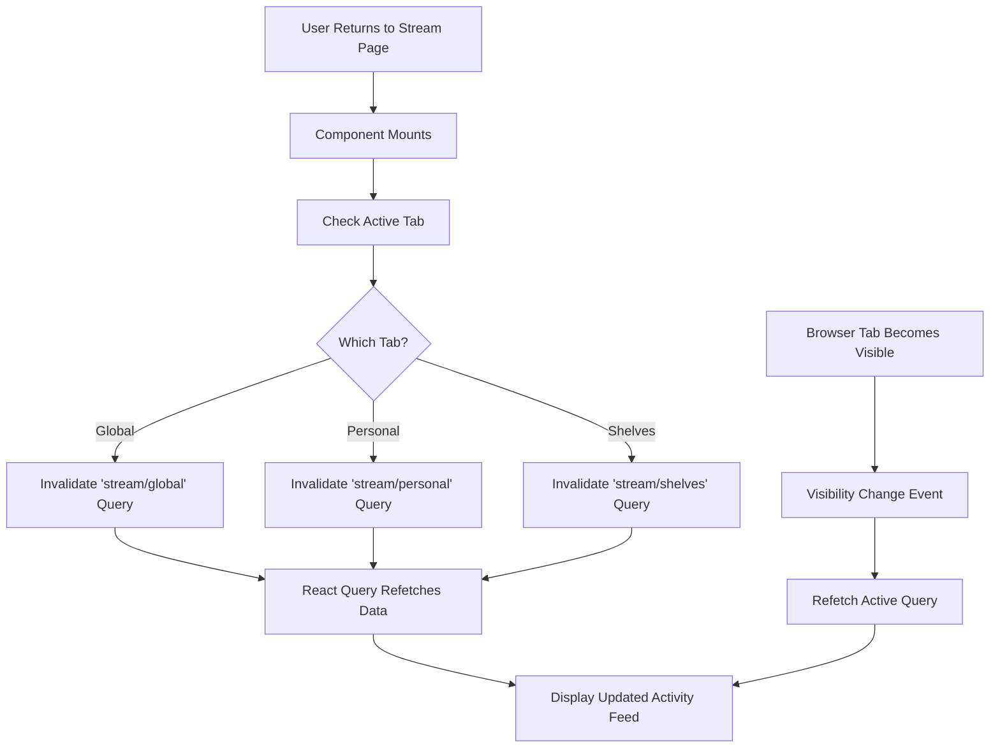

# Design Document: Real-Time Comment Visibility in Stream

## Problem Statement

When a user posts a comment on a News or Book detail page and then navigates back to the Stream page, the newly created comment activity does not appear immediately in the activity feed. The activity only becomes visible after manually refreshing the page.

**Expected Behavior:** The new comment activity should appear automatically in the Stream feed without requiring a page refresh.

**Current Behavior:** User must manually refresh the Stream page to see their newly posted comment.

## Root Cause Analysis

### Current Implementation Flow

When a comment is created on News or Book detail pages:

1. Frontend posts the comment via API (`POST /api/news/{id}/comments` or `POST /api/books/{bookId}/comments`)
2. Backend creates the comment in the database
3. Backend broadcasts a WebSocket event `stream:new-activity` to the `stream:global` room
4. **The Stream page receives the WebSocket event if it's currently open**
5. Frontend on the detail page updates its local state optimistically

### Identified Issue

The problem occurs when the user is on a **different page** (News or Book detail page) when the comment is posted. The Stream page's WebSocket listeners are **inactive** or the query cache becomes **stale** when navigating between pages.

Specifically:
- The Stream page maintains WebSocket listeners that update React Query cache
- When the user navigates to a detail page, they leave the Stream page component
- The comment is created and broadcast occurs
- When returning to Stream page, React Query serves **cached data** that doesn't include the new activity
- The WebSocket event was already broadcast while the user was on another page, so it was missed

## Solution Design

### Strategy: Ensure Stream Query Refresh on Navigation Return

The solution focuses on ensuring that when a user returns to the Stream page, the activity data is refreshed to include any activities created while they were away.

### Approach

Implement a **combination of cache invalidation and selective refetch** triggered by page visibility and navigation events.

#### Option A: Query Invalidation on Page Mount (Recommended)

Invalidate the relevant stream query cache when the Stream page component mounts, forcing a fresh fetch from the server.

**Rationale:**
- Simple and reliable
- Guarantees fresh data on every page visit
- Minimal performance impact (single API call)
- No risk of missing activities created while away

**Implementation Points:**
- Add a `useEffect` hook in `StreamPage.tsx` that runs on component mount
- Invalidate the active tab's query key
- Allow React Query's automatic refetch to pull fresh data

#### Option B: Page Visibility API Integration (Supplementary)

Enhance the existing implementation by adding Page Visibility API listeners that refetch data when the tab becomes visible again.

**Rationale:**
- Handles cases where user switches browser tabs
- Complements the mount-based refresh
- Provides real-time updates when returning to the browser tab

**Implementation Points:**
- Add event listeners for `visibilitychange` event
- Refetch the active stream query when document becomes visible
- Ensure proper cleanup on unmount

### Implementation Plan

#### 1. Frontend: Stream Page Cache Management

**File:** `client/src/pages/StreamPage.tsx`

**Changes Required:**

Add a refresh mechanism that triggers when the user returns to the Stream page:

- Add a `useEffect` hook that runs on initial mount
- Invalidate the current active tab's query cache
- Optionally add Page Visibility API listener for tab switching

**Logic Flow:**

#### 2. Behavioral Specifications

| Scenario | Current Behavior | Expected Behavior |
|----------|-----------------|-------------------|
| User posts comment on News page, returns to Stream | Comment not visible until manual refresh | Comment appears immediately in feed |
| User posts comment on Book page, returns to Stream | Comment not visible until manual refresh | Comment appears immediately in feed |
| User switches to another browser tab and back | Stream data remains stale | Stream data refreshes automatically |
| User stays on Stream page while another user posts | Real-time update via WebSocket | No change (already working) |

#### 3. Data Consistency Considerations

**Cache Invalidation Strategy:**

| Query Key | When to Invalidate |
|-----------|-------------------|
| `['api', 'stream', 'global']` | Always on Stream page mount (all users see global stream) |
| `['api', 'stream', 'personal']` | On mount when activeTab is 'personal' and user is authenticated |
| `['api', 'stream', 'shelves', filters]` | On mount when activeTab is 'shelves' and user is authenticated |

**Conflict Resolution:**

If a WebSocket update arrives during the refetch:
- React Query will merge the updates based on timestamp
- Duplicate activities are prevented by the existing ID-based deduplication logic
- Most recent data takes precedence

#### 4. Performance Impact Assessment

**Metrics:**

| Aspect | Impact Level | Mitigation |
|--------|-------------|------------|
| Additional API Calls | Low | Single refetch per page visit, not per navigation |
| Network Bandwidth | Minimal | Stream API returns limited activities (default 50) |
| User Experience | Positive | Eliminates manual refresh, data always current |
| Server Load | Negligible | Existing API endpoint, no new infrastructure |

**Optimization Opportunities:**
- Implement conditional refetch based on time elapsed since last fetch
- Use `staleTime` configuration in React Query to prevent unnecessary refetches
- Consider implementing incremental updates (fetch only new activities since last known timestamp)

#### 5. Alternative Approaches Considered

| Approach | Pros | Cons | Decision |
|----------|------|------|----------|
| Global WebSocket listener | Receives all events regardless of page | Complex state management, potential memory leaks | Rejected |
| Local Storage synchronization | Works across tabs | Requires manual synchronization, race conditions | Rejected |
| Polling mechanism | Simple implementation | Inefficient, constant server load | Rejected |
| Cache invalidation on mount | Simple, reliable, leverages existing infrastructure | Slight delay on page load | **Selected** |
| Page Visibility API | Handles tab switching | Doesn't handle navigation within app | **Selected as supplement** |

## Success Criteria

### Functional Requirements

1. When a user posts a comment on a News detail page and navigates to the Stream page, the comment activity must appear without manual refresh
2. When a user posts a comment on a Book detail page and navigates to the Stream page, the comment activity must appear without manual refresh
3. When a user switches browser tabs away from Stream and returns, the feed must reflect any new activities created during absence
4. Existing real-time updates via WebSocket must continue to function when user remains on Stream page

### Non-Functional Requirements

1. Page load performance degradation must be less than 200ms
2. No visual flickering or loading indicators on navigation
3. Solution must work consistently across all three Stream tabs (Global, Personal, Shelves)
4. Implementation must not break existing WebSocket real-time functionality

### Testing Validation

| Test Case | Steps | Expected Result |
|-----------|-------|-----------------|
| News Comment Visibility | 1. Navigate to Stream page 2. Open a News item 3. Post a comment 4. Return to Stream | Comment appears in Global stream without refresh |
| Book Comment Visibility | 1. Navigate to Stream page 2. Open a Book detail 3. Post a comment 4. Return to Stream | Comment appears in relevant stream without refresh |
| Tab Switching | 1. Open Stream page 2. Switch to another browser tab 3. Post comment from mobile/another session 4. Return to Stream tab | New activity appears automatically |
| Real-Time Updates Preserved | 1. Open Stream page 2. Keep page open 3. Another user posts activity | Activity appears immediately via WebSocket |

## Implementation Scope

### Files to Modify

1. `client/src/pages/StreamPage.tsx` - Add cache invalidation logic on mount and visibility change

### Estimated Complexity

**Effort:** Low  
**Risk:** Low  
**Time:** 1-2 hours

### Dependencies

- Existing React Query infrastructure
- Existing WebSocket implementation
- No new libraries required

## Future Enhancements

1. **Incremental Sync:** Implement delta-based fetching to only retrieve activities created after the last known timestamp
2. **Optimistic Activity Preview:** Show a temporary "pending" activity immediately when posting, before server confirmation
3. **Smart Refresh Logic:** Only refresh if elapsed time since last fetch exceeds a threshold (e.g., 30 seconds)
4. **Background Sync:** Use Service Workers to maintain stream synchronization even when tab is inactive
