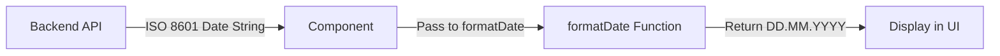
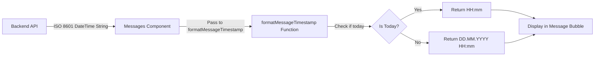

# Date Formatting for Books

## Overview

Update date and time display formats across the application:
1. Book dates: Use consistent numeric format `DD.MM.YYYY` (e.g., 01.01.2026) instead of verbose format with full month names
2. Message timestamps: Display time only for today's messages, and date + time for older messages in format `DD.MM.YYYY HH:mm`

## Objectives

- Standardize date formatting for book publication dates, upload dates, and last activity dates
- Replace verbose date format with compact numeric format across book cards and book detail pages
- Implement context-aware timestamp display for messages (time only for today, date + time for older messages)
- Maintain consistency across all date displays in book-related and messaging components

## Scope

### In Scope

- BookCard component date formatting
- BookDetail page date formatting
- All book-related date displays (publishedAt, uploadedAt, lastActivityDate)
- Messages page timestamp formatting for individual messages
- Context-aware timestamp logic based on message date

### Out of Scope

- Comment and review timestamps (these use relative time display for recent items)
- Conversation list last message timestamps (keep current format)
- Backend date storage or API response format
- Group channel message timestamps (follow same pattern as private messages)

## Current State Analysis

### Current Date Formatting Implementation

**Location**: BookCard component and BookDetail page

**Current Format Function**:
```
formatDate function uses:
date.toLocaleDateString('ru-RU', {
  year: 'numeric',
  month: 'long',
  day: 'numeric'
})
```

**Current Output Example**: "1 января 2026"

### Affected Components

| Component | File Path | Date Fields Displayed |
|-----------|-----------|----------------------|
| BookCard | `client/src/components/BookCard.tsx` | publishedAt, uploadedAt, lastActivityDate |
| BookDetail | `client/src/pages/BookDetail.tsx` | publishedAt, uploadedAt, lastActivityDate |
| Messages | `client/src/pages/Messages.tsx` | message.createdAt (individual message timestamps) |

### Affected Date Fields

| Field Name | Current Display Label | Usage Context |
|------------|---------------------|---------------|
| publishedAt | "Опубликовано: [date]" | Publication date of the book |
| uploadedAt | "Добавлено: [date]" | Date when book was uploaded to system |
| lastActivityDate | "Последняя активность: [date]" | Latest comment/review date |
| message.createdAt | (no label, inline timestamp) | Message sent timestamp in conversations |

## Design Solution

### Date Formatting Strategy

#### 1. Book Dates
Replace the current verbose date formatting function with a numeric format that outputs `DD.MM.YYYY`.

#### 2. Message Timestamps
Implement context-aware formatting that:
- Shows only time (`HH:mm`) for messages sent today
- Shows date and time (`DD.MM.YYYY HH:mm`) for messages sent yesterday or earlier

### New Format Function Specifications

#### Book Date Format Function

**Input**: Date string (ISO 8601 format from backend)
**Output**: String in format `DD.MM.YYYY`

**Behavior**:
- Day: Two digits with leading zero if needed (01-31)
- Month: Two digits with leading zero if needed (01-12)
- Year: Four digits (YYYY)
- Separator: Period (.)
- Handle undefined/null dates: Return empty string

**Example Transformations**:
| Input Date | Current Output | New Output |
|------------|----------------|------------|
| 2026-01-01T00:00:00Z | "1 января 2026" | "01.01.2026" |
| 2025-12-25T10:30:00Z | "25 декабря 2025" | "25.12.2025" |
| undefined | "" | "" |

#### Message Timestamp Format Function

**Input**: Date string (ISO 8601 format from backend)
**Output**: String in format `HH:mm` (if today) or `DD.MM.YYYY HH:mm` (if not today)

**Behavior**:
1. Parse input date string to Date object
2. Get current date (today)
3. Compare dates (ignoring time):
   - If same day: Return only time in 24-hour format (`HH:mm`)
   - If different day: Return date and time (`DD.MM.YYYY HH:mm`)
4. Time format: Two digits for hours and minutes with leading zeros
5. 24-hour time format (no AM/PM)

**Example Transformations** (assuming today is 2026-01-08):
| Input DateTime | Message Sent | Current Output | New Output |
|----------------|--------------|----------------|------------|
| 2026-01-08T14:30:00Z | Today | "14:30:00" (locale time) | "14:30" |
| 2026-01-08T09:15:00Z | Today | "09:15:00" (locale time) | "09:15" |
| 2026-01-07T22:45:00Z | Yesterday | "22:45:00" (locale time) | "07.01.2026 22:45" |
| 2026-01-01T10:00:00Z | Week ago | "10:00:00" (locale time) | "01.01.2026 10:00" |
| 2025-12-25T15:20:00Z | Last month | "15:20:00" (locale time) | "25.12.2025 15:20" |

### Implementation Approach

The date formatting logic should be updated in three components:

#### 1. BookCard Component

**File**: `client/src/components/BookCard.tsx`

**Current formatDate function** (lines 40-48) transforms dates to verbose Russian format.

**Required change**: Modify the formatDate function to output `DD.MM.YYYY` format using JavaScript Date methods or date formatting utilities.

**Affected code sections**:
- Line 40-48: formatDate function definition
- Line 146: Published date display
- Line 153: Uploaded date display  
- Line 195: Last activity date display

#### 2. BookDetail Page

**File**: `client/src/pages/BookDetail.tsx`

**Current formatDate function** (lines 93-101) uses the same verbose Russian format.

**Required change**: Modify the formatDate function to output `DD.MM.YYYY` format.

**Affected code sections**:
- Line 93-101: formatDate function definition
- Line 816: Published date display in book statistics section
- Line 823: Uploaded date display in book statistics section
- Line 849: Last activity date display in book statistics section

**Note**: The formatDateDisplay function (lines 104-116) is used for comments/reviews and should remain unchanged as it uses relative time for recent items.

#### 3. Messages Page

**File**: `client/src/pages/Messages.tsx`

**Current timestamp display** (line 1432) uses `toLocaleTimeString()` which shows time in local format.

**Required change**: Replace with context-aware formatting function that shows:
- Only time for today's messages
- Date and time for older messages

**Affected code sections**:
- Line 1432: Message timestamp display within message bubble
- New helper function needed: `formatMessageTimestamp(dateString: string): string`

**Implementation details**:
- Add a new date formatting helper function near the top of the component
- Function should check if message date is today
- Return appropriate format based on date comparison
- Apply to all message timestamps in the message list

### Format Function Specifications Detail

#### Book Date Format Function

The updated formatDate function should:

1. Accept a date string parameter (string | undefined)
2. Return empty string if input is undefined or null
3. Parse the date string to a Date object
4. Extract day, month, and year components
5. Pad day and month with leading zeros if needed
6. Return formatted string as `DD.MM.YYYY`

**Edge cases to handle**:
- Invalid date strings: Return empty string or fallback gracefully
- Timezone considerations: Use local date components (not UTC)
- Null/undefined values: Return empty string

#### Message Timestamp Format Function

The new formatMessageTimestamp function should:

1. Accept a date string parameter (string)
2. Parse the date string to a Date object
3. Get current date and normalize to start of day
4. Normalize message date to start of day
5. Compare if dates are the same day:
   - Same day: Format as `HH:mm`
   - Different day: Format as `DD.MM.YYYY HH:mm`
6. Use 24-hour time format with leading zeros

**Edge cases to handle**:
- Timezone considerations: Use local date/time components
- Midnight edge case: Message sent at 23:59 vs. 00:01
- Date comparison should ignore time component
- Invalid date strings: Fall back to showing full date-time

### Visual Impact

#### Book Dates
**Before**: "Опубликовано: 15 января 2026"
**After**: "Опубликовано: 15.01.2026"

The change affects:
- All book cards in Library page
- All book cards in Shelves page
- All book cards in Profile page
- Book detail page statistics section

#### Message Timestamps
**Before** (all messages): "14:30:00" or locale-specific time format
**After** (today's messages): "14:30"
**After** (older messages): "07.01.2026 22:45"

The change affects:
- All message bubbles in private conversations
- All message bubbles in group channel conversations
- Messages page at `/messages` route

### Data Flow

#### Book Dates


#### Message Timestamps


### Localization Considerations

The current implementation uses Russian locale (`ru-RU`) for date formatting. The new numeric format is language-neutral and does not require localization adjustments.

The date format `DD.MM.YYYY` is commonly used in:
- Russia and CIS countries
- Most European countries
- The format is intuitive for the target audience

**Label localization** remains unchanged:
- "Опубликовано:" (Published)
- "Добавлено:" (Added)
- "Последняя активность:" (Last activity)

## Acceptance Criteria

| Criterion | Description |
|-----------|-------------|
| Format consistency (books) | All book dates display in DD.MM.YYYY format |
| Leading zeros (books) | Single-digit days and months show with leading zeros (01, 02, etc.) |
| Date fields coverage | publishedAt, uploadedAt, and lastActivityDate all use new format |
| Component coverage (books) | Both BookCard and BookDetail components updated |
| Message time display | Today's messages show only time (HH:mm) |
| Message date-time display | Yesterday's and older messages show date and time (DD.MM.YYYY HH:mm) |
| Time format | 24-hour format with leading zeros for hours and minutes |
| Date boundary logic | Message at 23:59 today shows time only; message at 00:01 yesterday shows date+time |
| Component coverage (messages) | Messages page updated with new timestamp format |
| No regressions | Comment/review relative timestamps remain unchanged |
| Null handling | Undefined/null dates return empty string without errors |
| Visual verification | All formats display correctly on respective pages |

## Testing Considerations

### Book Date Scenarios

| Test Case | Input | Expected Output |
|-----------|-------|-----------------|
| Regular date | "2026-01-15T12:00:00Z" | "15.01.2026" |
| Single digit day | "2026-01-01T00:00:00Z" | "01.01.2026" |
| Single digit month | "2026-09-25T00:00:00Z" | "25.09.2026" |
| End of year | "2025-12-31T23:59:59Z" | "31.12.2025" |
| Undefined date | undefined | "" (empty string) |
| Null date | null | "" (empty string) |

### Message Timestamp Scenarios

**Assuming current date/time: 2026-01-08 15:30**

| Test Case | Message DateTime | Expected Output |
|-----------|------------------|----------------|
| Message sent 1 hour ago | "2026-01-08T14:30:00Z" | "14:30" |
| Message sent this morning | "2026-01-08T09:15:00Z" | "09:15" |
| Message sent at midnight today | "2026-01-08T00:01:00Z" | "00:01" |
| Message sent yesterday evening | "2026-01-07T22:45:00Z" | "07.01.2026 22:45" |
| Message sent yesterday morning | "2026-01-07T08:00:00Z" | "07.01.2026 08:00" |
| Message sent last week | "2026-01-01T10:00:00Z" | "01.01.2026 10:00" |
| Message sent last month | "2025-12-25T15:20:00Z" | "25.12.2025 15:20" |
| Message sent last year | "2025-01-08T12:00:00Z" | "08.01.2025 12:00" |

### Visual Verification Points

- Library page: Check popular books, new releases, recently reviewed sections
- Shelves page: Check book cards in different shelf views
- Profile page: Check user's book cards
- BookDetail page: Check all three date fields in statistics section
- Messages page: Check message timestamps in private conversations
- Messages page: Verify today's messages show time only
- Messages page: Verify yesterday's messages show date + time
- Messages page: Check message timestamps in group channels

### Browser Compatibility

The date formatting should work consistently across:
- Modern browsers (Chrome, Firefox, Safari, Edge)
- Different timezones
- Mobile and desktop viewports

## Risk Assessment

| Risk | Impact | Mitigation |
|------|--------|-----------|
| Format confusion for users (books) | Low | DD.MM.YYYY is standard format for target region |
| Timezone display issues | Low | Using local date components maintains current behavior |
| Date boundary edge cases (messages) | Medium | Careful testing around midnight to ensure correct date detection |
| Today/not-today logic errors | Medium | Clear date comparison logic with proper normalization |
| Breaking existing tests | Low | Format changes are straightforward, tests easy to update |

## Implementation Notes

### Recommended Approach for Book Dates

Use JavaScript's built-in Date methods for formatting:
- `getDate()` for day
- `getMonth() + 1` for month (zero-indexed)
- `getFullYear()` for year
- String padding for leading zeros (`.padStart(2, '0')`)

Alternative: Use `toLocaleDateString()` with specific options to achieve numeric format.

### Recommended Approach for Message Timestamps

1. **Date Comparison Logic**:
   - Create Date objects from message timestamp
   - Get current date
   - Normalize both dates to start of day (set hours, minutes, seconds, ms to 0)
   - Compare using `.getTime()` or date equality

2. **Time Formatting**:
   - Extract hours: `getHours()`
   - Extract minutes: `getMinutes()`
   - Pad with leading zeros: `.padStart(2, '0')`
   - Format as `HH:mm`

3. **Date Formatting**:
   - Combine date format (DD.MM.YYYY) with time format (HH:mm)
   - Separator: space between date and time

**Example Implementation Pattern**:
```
function formatMessageTimestamp(dateString: string): string {
  const messageDate = new Date(dateString);
  const today = new Date();
  
  // Normalize to compare dates only (ignore time)
  const isToday = 
    messageDate.getDate() === today.getDate() &&
    messageDate.getMonth() === today.getMonth() &&
    messageDate.getFullYear() === today.getFullYear();
  
  // Format time
  const hours = messageDate.getHours().toString().padStart(2, '0');
  const minutes = messageDate.getMinutes().toString().padStart(2, '0');
  const timeStr = `${hours}:${minutes}`;
  
  if (isToday) {
    return timeStr;
  }
  
  // Format date
  const day = messageDate.getDate().toString().padStart(2, '0');
  const month = (messageDate.getMonth() + 1).toString().padStart(2, '0');
  const year = messageDate.getFullYear();
  
  return `${day}.${month}.${year} ${timeStr}`;
}
```

### Code Reusability

**Book Date Functions**:
Both BookCard and BookDetail components currently have duplicate formatDate functions. Consider:
- Keeping separate implementations (minimal code, no dependencies)
- Or extracting to shared utility if more date formatting needs arise in future

For this simple change, maintaining separate implementations is acceptable.

**Message Timestamp Function**:
Add as a local helper function in Messages.tsx component. If group channel messages need same formatting in future, consider extracting to shared utility.

## Open Questions

None. Requirements are clear and implementation is straightforward.
