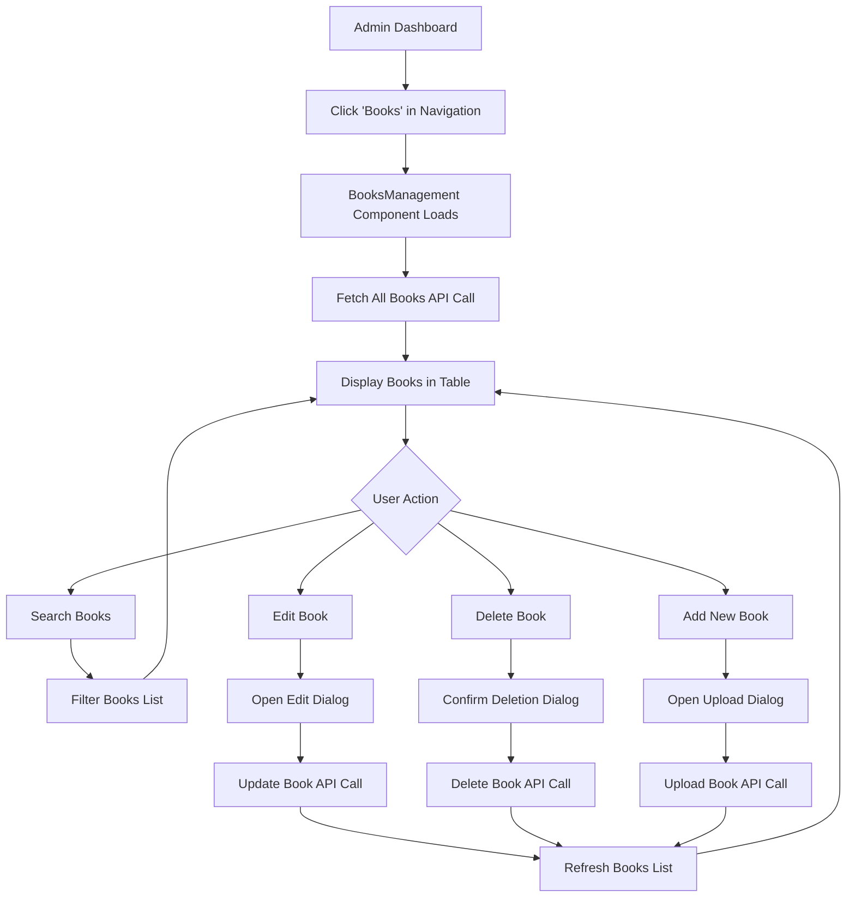
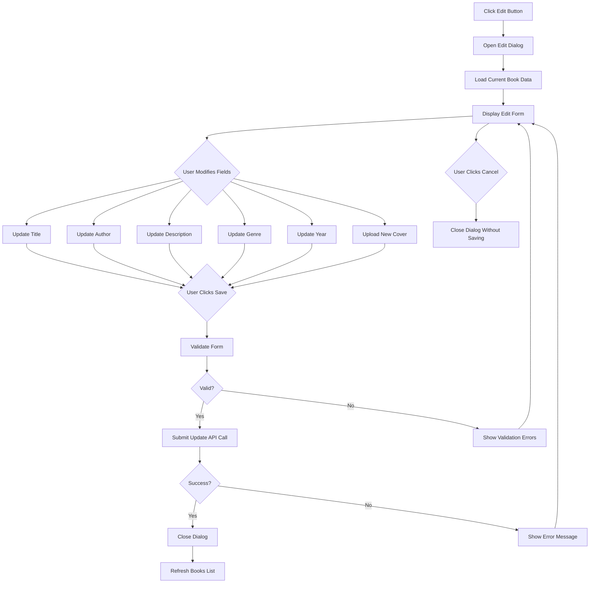
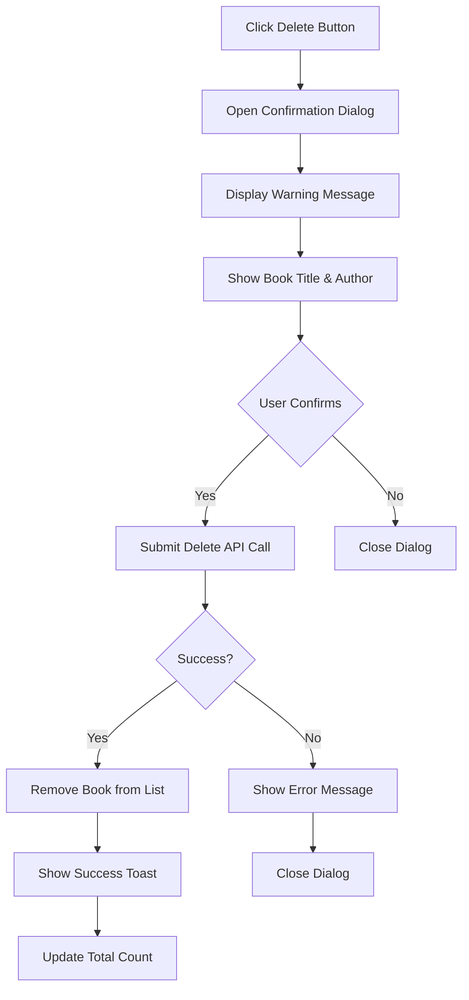

# Admin Book Management Feature Design

## Overview

This design describes the addition of comprehensive book management capabilities to the admin panel at `http://localhost:3001/admin`. The feature enables administrators and moderators to view, search, edit, and delete books, as well as upload new books directly from the admin interface.

## Strategic Intent

The primary goal is to provide administrators with centralized control over the book catalog, streamlining content moderation and catalog management. This addresses the operational need to:

- Review and moderate uploaded books
- Correct metadata errors without requiring user intervention
- Remove inappropriate or duplicate content
- Add books to the library on behalf of users or as platform content

This feature follows the established pattern of other moderation interfaces (Comments, Reviews, News, User Management) already present in the admin dashboard.

## User Access Control

Access to book management functionality follows the existing authorization model:

- **Admin users** (`accessLevel: 'admin'`): Full access to all operations (view, edit, delete, create)
- **Moderator users** (`accessLevel: 'moder'`): Full access to all operations (view, edit, delete, create)
- **Regular users**: No access to this functionality

The feature leverages the existing `requireAdminOrModerator` middleware to enforce these permissions.

## Feature Components

### Navigation Enhancement

A new menu item "Books" will be added to the admin sidebar navigation alongside existing items:

- Dashboard
- News Management
- Comments
- Reviews
- User Management (admin only)
- **Books** (new)

This menu item is visible to both admins and moderators and uses an appropriate icon (e.g., BookOpen, Library, or Book icon from lucide-react).

### Book Management Interface

#### Main View Structure

The books management page displays a comprehensive list of all books in the system with:

**Data Display Table/List** showing:
- Cover image (thumbnail)
- Title
- Author
- Genre
- Publication year
- Rating (average user rating)
- Upload date
- Uploader (username/full name)
- File type
- File size
- Action buttons (Edit, Delete)

**Search and Filter Capabilities**:
- Real-time search across book title, author, and genre
- Search input field positioned prominently at the top of the page
- Search executes as user types (debounced) or on explicit search action
- Clear indication when search results are filtered vs. showing all books

**Pagination**:
- Display books in manageable pages (e.g., 20-50 books per page)
- Page navigation controls at bottom of list
- Total book count indicator

**Action Toolbar**:
- "Add New Book" button positioned prominently (top-right or top-left)
- Bulk action capabilities (optional future enhancement)

#### Book Editing Workflow

When an administrator clicks "Edit" on a book:

**Edit Modal or Dedicated Page** opens displaying:

**Editable Fields**:
- Title (text input, required)
- Author (text input, required)
- Description (textarea, optional)
- Genre (text input, optional)
- Publication year (number input, optional, range validation: 1000 - current year)
- Published date (date picker, optional)
- Cover image (file upload, optional - allows replacing existing cover)

**Non-Editable Display Fields**:
- Current file type
- Current file size
- Upload date
- Uploader information
- Current rating

**File Management**:
- Book file cannot be replaced (prevents content substitution issues)
- Cover image can be replaced via file upload
- Existing cover preview shown

**Action Buttons**:
- Save Changes (validates inputs, submits update)
- Cancel (closes editor without saving)

**Validation**:
- Title and Author are required fields
- Year must be reasonable (1000 to current year)
- File size limits enforced on cover image upload
- Allowed cover image formats: JPEG, PNG, GIF, WebP

#### Book Deletion Workflow

When clicking "Delete" on a book:

**Confirmation Dialog** appears with:
- Clear warning about permanent deletion
- Book title and author for confirmation
- Explanation of cascade effects (reading progress, bookmarks, reviews, comments will be affected)
- Confirmation requirement (typed confirmation or explicit checkbox)

**Deletion Process**:
- Validates admin/moderator permissions
- Removes book and all associated data (cascade deletion):
  - Shelf associations
  - Reading progress records
  - Bookmarks
  - Comments
  - Reviews
  - Reactions
  - View statistics
  - Reading statistics
- Deletes physical files (book file, cover image) from storage
- Returns success confirmation

**Error Handling**:
- Handle cases where book is not found
- Handle file deletion failures gracefully
- Provide clear error messages to user

#### New Book Upload Workflow

When clicking "Add New Book":

**Reuse Existing Component**:
- The system reuses the existing `AddBook` component (from `/client/src/pages/AddBook.tsx`)
- Open as modal overlay or navigate to dedicated form page within admin context
- Form includes all standard fields:
  - Title (required)
  - Author (required)
  - Description (optional)
  - Genre (optional)
  - Publication year (optional)
  - Published date (optional)
  - Cover image file upload (optional)
  - Book file upload (required)

**Upload Behavior**:
- Book is uploaded and associated with the admin user account
- Book is automatically added to admin's "Uploaded" shelf (or designated admin shelf)
- Success message displayed with option to view book or return to book list

**File Validations** (consistent with existing upload logic):
- Book file formats: PDF, DOC, DOCX, EPUB, TXT, FB2
- Maximum file size: 100MB
- Cover image formats: JPEG, PNG, GIF, WebP
- MIME type validation with extension fallback for FB2 files

## Backend API Design

### New API Endpoints

#### Get All Books (Admin)

**Endpoint**: `GET /api/admin/books`

**Authentication**: Required (JWT token)

**Authorization**: Admin or Moderator access level

**Query Parameters**:
- `page` (number, optional, default: 1) - Page number for pagination
- `limit` (number, optional, default: 20) - Books per page
- `search` (string, optional) - Search query for filtering books
- `sortBy` (string, optional) - Field to sort by (title, uploadedAt, rating)
- `sortOrder` (string, optional) - Sort direction (asc, desc)

**Response**:
```
{
  books: [
    {
      id: string,
      title: string,
      author: string,
      description: string,
      coverImageUrl: string,
      filePath: string,
      fileSize: number,
      fileType: string,
      genre: string,
      publishedYear: number,
      rating: number,
      userId: string,
      uploaderUsername: string,
      uploaderFullName: string,
      uploadedAt: ISO8601 timestamp,
      publishedAt: ISO8601 timestamp,
      createdAt: ISO8601 timestamp,
      updatedAt: ISO8601 timestamp
    },
    ...
  ],
  pagination: {
    page: number,
    limit: number,
    total: number,
    pages: number
  }
}
```

**Behavior**:
- Fetches books from database with user information joined
- Applies search filter if search query provided (searches title, author, genre)
- Applies sorting based on sortBy and sortOrder parameters
- Returns paginated results with pagination metadata

#### Update Book (Admin)

**Endpoint**: `PUT /api/admin/books/:id`

**Authentication**: Required (JWT token)

**Authorization**: Admin or Moderator access level

**Request Body**:
```
{
  title: string (optional),
  author: string (optional),
  description: string (optional),
  genre: string (optional),
  publishedYear: number (optional),
  publishedAt: ISO8601 timestamp (optional)
}
```

**File Upload** (multipart/form-data):
- `coverImage` (optional) - New cover image file

**Response**:
```
{
  id: string,
  title: string,
  author: string,
  description: string,
  coverImageUrl: string,
  genre: string,
  publishedYear: number,
  publishedAt: ISO8601 timestamp,
  updatedAt: ISO8601 timestamp
}
```

**Behavior**:
- Validates admin/moderator access
- Validates book exists
- Updates only provided fields in database
- If new cover image provided:
  - Validates file type and size
  - Deletes old cover image file (if exists)
  - Saves new cover image
  - Updates coverImageUrl in database
- Returns updated book object

**Error Handling**:
- 404 if book not found
- 400 for validation errors
- 403 if user lacks required permissions

#### Delete Book (Admin)

**Endpoint**: `DELETE /api/admin/books/:id`

**Authentication**: Required (JWT token)

**Authorization**: Admin or Moderator access level

**Response**: 204 No Content (success) or error response

**Behavior**:
- Validates admin/moderator access
- Validates book exists
- Performs cascade deletion:
  - Removes from all shelves (shelf_books table)
  - Deletes reading progress records
  - Deletes reading statistics
  - Deletes bookmarks
  - Deletes comments (which cascades to reactions)
  - Deletes reviews (which cascades to reactions)
  - Deletes view statistics
- Deletes physical files:
  - Book file from storage
  - Cover image from storage (if exists)
- Deletes book record from database
- Returns success status

**Permission Model**:
- Unlike regular book deletion (user can only delete own books), admin deletion bypasses ownership check
- Admins and moderators can delete any book regardless of uploader

**Error Handling**:
- 404 if book not found
- 403 if user lacks required permissions
- 500 for database or file system errors

## Data Model Considerations

### Existing Schema Usage

The feature utilizes the existing `books` table schema from `shared/schema.ts`:

**Books Table Fields**:
- `id` - Primary key (UUID)
- `title` - Book title (required)
- `author` - Author name (required)
- `description` - Book description (optional)
- `coverImageUrl` - Path to cover image (optional)
- `filePath` - Path to book file (required)
- `fileSize` - File size in bytes (required)
- `fileType` - MIME type or extension (required)
- `genre` - Genre classification (optional)
- `publishedYear` - Year of publication (optional)
- `rating` - Average rating (calculated from reviews)
- `userId` - Reference to uploader (required)
- `uploadedAt` - System upload timestamp (required)
- `publishedAt` - Book publication date (optional)
- `createdAt` - Record creation timestamp (required)
- `updatedAt` - Record modification timestamp (required)

### Related Data Cascade

When deleting a book, related data in the following tables must be handled:

- `shelf_books` - Remove book from all shelves
- `reading_progress` - Delete user progress records
- `reading_statistics` - Delete reading statistics
- `user_statistics` - May need recalculation (handled by existing triggers/logic)
- `bookmarks` - Delete all bookmarks for this book
- `comments` - Delete all comments
- `reviews` - Delete all reviews
- `reactions` - Cascade deleted when comments/reviews are removed
- `book_view_statistics` - Delete view statistics

## Frontend Component Structure

### New Components

**BooksManagement Component**:
- Main container for book management interface
- Located at: `/client/src/components/BooksManagement.tsx`
- Manages state for book list, search, pagination
- Handles API calls to fetch, update, and delete books
- Renders book list table/grid
- Integrates search functionality
- Manages modal states for edit and create workflows

**BookEditDialog/Modal Component**:
- Modal or dialog for editing book details
- Receives book data as props
- Manages form state for editable fields
- Handles validation and submission
- Shows loading state during save operation
- Displays success/error messages

**BookUploadDialog/Modal Component** (or reuse existing AddBook):
- Modal wrapper around existing AddBook component
- Adapts component for admin context
- Handles post-upload navigation back to book list
- Shows upload progress and completion status

### Integration with AdminDashboard

**Modified Component**: `/client/src/components/AdminDashboard.tsx`

**Changes Required**:
- Add new menu item to `menuItems` array:
  ```
  { id: 'books', label: 'Books', icon: BookOpen }
  ```
- Import BooksManagement component
- Add conditional rendering for books tab:
  ```
  {activeTab === 'books' && (
    <BooksManagement />
  )}
  ```

### API Client Extensions

**Modified File**: `/client/src/lib/api.ts`

**New API Functions**:
```
export const adminBooksApi = {
  getAllBooks: (params: {
    page?: number,
    limit?: number,
    search?: string,
    sortBy?: string,
    sortOrder?: string
  }) => apiCall('/api/admin/books?' + new URLSearchParams(params).toString()),
  
  updateBook: (bookId: string, bookData: FormData) => apiCall(`/api/admin/books/${bookId}`, {
    method: 'PUT',
    body: bookData
  }),
  
  deleteBook: (bookId: string) => apiCall(`/api/admin/books/${bookId}`, {
    method: 'DELETE'
  })
}
```

## User Interface Flow Diagrams

### Book Management Main Flow



### Book Edit Flow



### Book Deletion Flow



## Search Functionality Design

### Search Behavior

**Search Input Field**:
- Positioned at top of books list
- Placeholder text: "Search by title, author, or genre..."
- Clear/reset button when search text present
- Search executes on:
  - User stops typing for 500ms (debounced)
  - Enter key press
  - Click search button (optional)

**Search Logic**:
- Backend performs case-insensitive partial match search
- Searches across: title, author, genre fields
- Uses SQL LIKE or full-text search capabilities
- Returns filtered results with same pagination structure

**Search State Management**:
- Frontend tracks current search query
- Resets pagination to page 1 when search query changes
- Shows "Search results for: [query]" indicator when active
- Shows "No results found" when search returns empty set
- Provides clear action to reset/clear search

**Performance Considerations**:
- Debounce input to prevent excessive API calls
- Show loading indicator during search
- Cache recent search results (optional optimization)

## Error Handling Strategy

### Client-Side Validation

**Form Validation**:
- Title required (non-empty after trim)
- Author required (non-empty after trim)
- Year range validation (1000 - current year)
- File type validation for cover image
- File size validation for cover image
- Display inline validation errors near relevant fields

### Server-Side Error Responses

**Error Response Format**:
```
{
  error: string (human-readable error message)
}
```

**HTTP Status Codes**:
- 400 - Bad Request (validation errors, malformed data)
- 403 - Forbidden (insufficient permissions)
- 404 - Not Found (book not found)
- 500 - Internal Server Error (database, file system errors)

### User Feedback

**Success Messages**:
- Book updated successfully
- Book deleted successfully
- Book uploaded successfully

**Error Messages**:
- Display error dialogs or toast notifications
- Provide actionable guidance (e.g., "Check file format")
- Avoid exposing technical stack traces to users

**Loading States**:
- Show spinner during API calls
- Disable action buttons during processing
- Show progress for file uploads (optional)

## Security Considerations

### Authorization Enforcement

**Permission Checks**:
- All admin book endpoints protected by `requireAdminOrModerator` middleware
- Verify user access level on every request
- No client-side only permission checks (always validate on server)

**Bypass User Ownership**:
- Admin deletion bypasses the normal ownership check
- Regular users can only delete books they uploaded
- Admins/moderators can delete any book
- This difference must be explicitly handled in delete logic

### Input Sanitization

**Text Fields**:
- Sanitize HTML/script tags from text inputs (title, author, description, genre)
- Prevent SQL injection through parameterized queries
- Validate data types match schema expectations

**File Upload Security**:
- Validate MIME types on server side (don't trust client)
- Check file extensions as secondary validation
- Store files outside web root to prevent direct execution
- Generate unique file names to prevent path traversal
- Enforce file size limits

### Data Integrity

**Cascade Deletion Protection**:
- Use database transactions for multi-table deletions
- Ensure referential integrity maintained
- Log deletion operations for audit trail

**File System Operations**:
- Handle file deletion errors gracefully
- Don't fail entire operation if old file deletion fails
- Prevent orphaned files through cleanup processes

## Performance Optimization

### Database Queries

**Indexing Strategy**:
- Ensure indexes on books.title, books.author, books.genre for search performance
- Index on books.uploadedAt for sorting recent uploads
- Index on books.userId for join performance

**Query Optimization**:
- Use JOIN to fetch user information efficiently
- Limit result sets with pagination
- Use COUNT query for total count (separate or combined with main query)

### Frontend Performance

**Data Loading**:
- Implement pagination to limit initial data load
- Use debouncing for search input
- Show skeleton loaders during data fetch
- Cache API responses where appropriate (with invalidation strategy)

**Component Optimization**:
- Use React memo for book list items
- Virtualize long lists if book count very high (optional)
- Lazy load modals/dialogs

## Monitoring and Logging

### Server-Side Logging

**Log Events**:
- Admin book edit operations (who edited what, when)
- Admin book deletion operations (who deleted what, when)
- Failed permission checks
- File operation failures
- Validation errors

**Log Format**:
```
[timestamp] [level] [operation] userId=XXX bookId=XXX action=edit|delete status=success|failure
```

### Audit Trail

**Track Changes** (optional future enhancement):
- Maintain history of book metadata changes
- Store who made changes and when
- Enable rollback capability

## Testing Considerations

### Backend Testing Scenarios

**API Endpoint Tests**:
- Get all books with pagination
- Get all books with search filter
- Update book with valid data
- Update book with invalid data (validation errors)
- Update book cover image
- Delete book (verify cascade)
- Unauthorized access attempts (non-admin users)
- Non-existent book ID handling

**Integration Tests**:
- End-to-end book creation, editing, deletion flow
- Verify file uploads and deletions
- Verify cascade deletions affect related tables

### Frontend Testing Scenarios

**Component Tests**:
- BooksManagement renders book list correctly
- Search input filters books
- Edit dialog opens with correct data
- Edit dialog validates form inputs
- Delete confirmation dialog prevents accidental deletion
- Upload dialog integrates with AddBook component

**User Interaction Tests**:
- User can search and find books
- User can edit book and see changes
- User can delete book and see removal
- User can upload new book and see it in list

## Implementation Phases

### Phase 1: Backend API Foundation
- Implement GET /api/admin/books endpoint with pagination and search
- Implement PUT /api/admin/books/:id endpoint for updates
- Implement DELETE /api/admin/books/:id with cascade logic
- Add admin permission checks to all endpoints
- Test all API endpoints

### Phase 2: Frontend Book List Interface
- Create BooksManagement component
- Implement book list table/grid display
- Add search functionality with debouncing
- Implement pagination controls
- Integrate with backend API for data fetching

### Phase 3: Edit Functionality
- Create BookEditDialog component
- Implement form with validation
- Add cover image upload capability
- Wire up PUT endpoint
- Add success/error feedback

### Phase 4: Delete Functionality
- Add delete confirmation dialog
- Wire up DELETE endpoint
- Implement cascade deletion UI feedback
- Add success/error feedback

### Phase 5: Add Book Integration
- Create modal wrapper for AddBook component
- Integrate upload workflow into admin context
- Handle post-upload navigation
- Test complete create flow

### Phase 6: Polish and Testing
- Add loading states throughout
- Implement comprehensive error handling
- Add user feedback (toasts, notifications)
- Perform integration testing
- Address performance optimization
- Documentation updates

## Future Enhancements

**Batch Operations**:
- Select multiple books for batch delete
- Bulk metadata updates

**Advanced Filtering**:
- Filter by genre, rating range, upload date range
- Filter by uploader
- Combine multiple filters

**Book Statistics**:
- View count, download count
- Reader engagement metrics
- Most reviewed/commented books

**Metadata Enrichment**:
- Auto-fetch metadata from external sources (e.g., ISBN lookup)
- Cover image search and selection

**Audit Log Viewer**:
- View history of changes to book metadata
- Rollback capability

**Export Functionality**:
- Export book list to CSV
- Generate reports on book catalog
- Create BooksManagement component
- Implement book list table/grid display
- Add search functionality with debouncing
- Implement pagination controls
- Integrate with backend API for data fetching

### Phase 3: Edit Functionality
- Create BookEditDialog component
- Implement form with validation
- Add cover image upload capability
- Wire up PUT endpoint
- Add success/error feedback

### Phase 4: Delete Functionality
- Add delete confirmation dialog
- Wire up DELETE endpoint
- Implement cascade deletion UI feedback
- Add success/error feedback

### Phase 5: Add Book Integration
- Create modal wrapper for AddBook component
- Integrate upload workflow into admin context
- Handle post-upload navigation
- Test complete create flow

### Phase 6: Polish and Testing
- Add loading states throughout
- Implement comprehensive error handling
- Add user feedback (toasts, notifications)
- Perform integration testing
- Address performance optimization
- Documentation updates

## Future Enhancements

**Batch Operations**:
- Select multiple books for batch delete
- Bulk metadata updates

**Advanced Filtering**:
- Filter by genre, rating range, upload date range
- Filter by uploader
- Combine multiple filters

**Book Statistics**:
- View count, download count
- Reader engagement metrics
- Most reviewed/commented books

**Metadata Enrichment**:
- Auto-fetch metadata from external sources (e.g., ISBN lookup)
- Cover image search and selection

**Audit Log Viewer**:
- View history of changes to book metadata
- Rollback capability

**Export Functionality**:
- Export book list to CSV
- Generate reports on book catalog
### Phase 2: Frontend Book List Interface
- Create BooksManagement component
- Implement book list table/grid display
- Add search functionality with debouncing
- Implement pagination controls
- Integrate with backend API for data fetching

### Phase 3: Edit Functionality
- Create BookEditDialog component
- Implement form with validation
- Add cover image upload capability
- Wire up PUT endpoint
- Add success/error feedback

### Phase 4: Delete Functionality
- Add delete confirmation dialog
- Wire up DELETE endpoint
- Implement cascade deletion UI feedback
- Add success/error feedback

### Phase 5: Add Book Integration
- Create modal wrapper for AddBook component
- Integrate upload workflow into admin context
- Handle post-upload navigation
- Test complete create flow

### Phase 6: Polish and Testing
- Add loading states throughout
- Implement comprehensive error handling
- Add user feedback (toasts, notifications)
- Perform integration testing
- Address performance optimization
- Documentation updates

## Future Enhancements

**Batch Operations**:
- Select multiple books for batch delete
- Bulk metadata updates

**Advanced Filtering**:
- Filter by genre, rating range, upload date range
- Filter by uploader
- Combine multiple filters

**Book Statistics**:
- View count, download count
- Reader engagement metrics
- Most reviewed/commented books

**Metadata Enrichment**:
- Auto-fetch metadata from external sources (e.g., ISBN lookup)
- Cover image search and selection

**Audit Log Viewer**:
- View history of changes to book metadata
- Rollback capability

**Export Functionality**:
- Export book list to CSV
- Generate reports on book catalog
