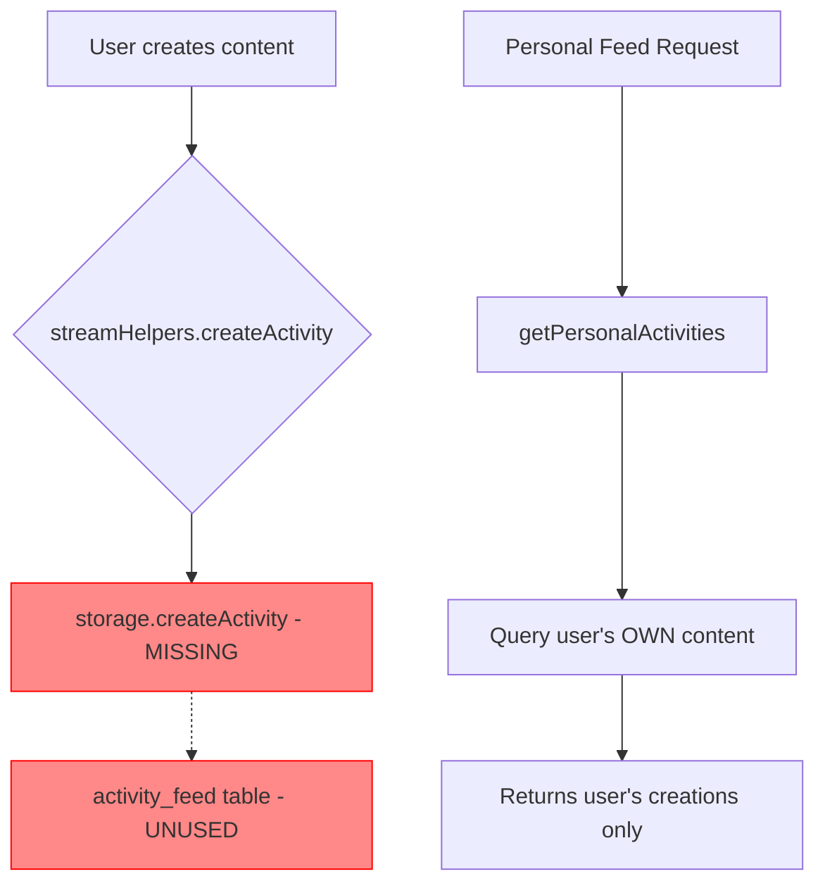

# Analysis: Empty "My Feed" Tab on /stream Page

## Problem Statement

The "My Feed" (Моя лента) tab on the `/stream` page is always empty for users. This analysis examines the current implementation to understand why this occurs.

## Current Implementation Analysis

### 1. Frontend Implementation

**Location**: `client/src/pages/StreamPage.tsx`

The page implements three tabs:
- **Global**: Shows all public activities
- **My Feed (Personal)**: Should show personalized activities
- **My Shelves**: Shows activities for books on user's shelves

The Personal tab fetches data from `/api/stream/personal` endpoint when:
- The tab is active (`activeTab === 'personal'`)
- User is authenticated (`isAuthenticated === true`)

### 2. Backend API Endpoint

**Location**: `server/routes.ts` (lines 4578-4592)

```
GET /api/stream/personal
- Requires authentication (authenticateToken middleware)
- Calls storage.getPersonalActivities(userId, limit, offset, before)
- Returns activity array
```

### 3. Core Logic: getPersonalActivities Method

**Location**: `server/storage.ts` (lines 4474-4683)

#### Current Behavior

The method retrieves **the user's own content**:

1. **User's News Articles** (lines 4484-4535)
   - Queries: `news` table where `authorId = userId` and `published = true`
   - Includes: reactions, view/comment/reaction counts
   - Limit: ceil(limit / 4)

2. **User's Uploaded Books** (lines 4537-4562)
   - Queries: `books` table where `userId = userId`
   - Includes: title, author, cover, genre
   - Limit: ceil(limit / 4)

3. **User's Comments** (lines 4564-4618)
   - Queries: `comments` table where `userId = userId`
   - Includes: content preview, book title, reactions
   - Limit: ceil(limit / 4)

4. **User's Reviews** (lines 4620-4672)
   - Queries: `reviews` table where `userId = userId`
   - Includes: content preview, rating, book title, reactions
   - Limit: ceil(limit / 4)

All results are sorted by creation date and paginated.

### 4. Why "My Feed" Appears Empty

The tab appears empty when:
- User has not published any news articles
- User has not uploaded any books
- User has not written any comments
- User has not posted any reviews

**This is the expected behavior** based on current implementation.

### 5. Activity Feed Table Not Used

**Critical Finding**: The `activity_feed` table exists in the database schema but is **not being used**.

**Schema Location**: `shared/schema.ts` (lines 290-301)

```
activity_feed table contains:
- id: Primary key
- activityType: 'news', 'book', 'comment', 'review'
- entityId: Reference to the actual entity
- userId: Who created the activity
- targetUserId: Who should see it (personal feed)
- bookId: Related book reference
- metadata: Additional data (JSONB)
- createdAt, updatedAt, deletedAt
```

**Key Field**: `targetUserId` - This field determines which user should see the activity in their personal feed.

### 6. Missing Implementation

**Location**: `server/streamHelpers.ts` (line 67)

The `createActivity` helper function attempts to call:
```
storage.createActivity({ ... })
```

However, this method **does not exist** in the storage interface or implementation.

**Evidence**: 
- Line 4258 in storage.ts has comment: "Activity feed methods (temporary implementation without activity_feed table)"
- No `createActivity` method exists in IStorage interface
- No `createActivity` method exists in DBStorage class

## Root Cause Summary

The "My Feed" tab shows the user's **own created content** rather than **activities relevant to the user**. This occurs because:

1. **No Activity Recording**: Activities are never saved to the `activity_feed` table because `storage.createActivity()` is not implemented

2. **Mismatched Logic**: The `getPersonalActivities` method queries for content created BY the user, not content targeted TO the user

3. **Unused Target User Field**: The `targetUserId` field in the activity_feed schema is designed to track which users should see activities, but it's never populated

4. **WebSocket-Only Activities**: Activities are broadcast via WebSocket but not persisted, so they disappear when the page refreshes

## Expected vs Actual Behavior

### Expected Personal Feed Content
- Comments on my books
- Reviews on my books  
- Replies to my comments
- Reactions to my content
- Mentions in discussions
- Books added to my shelves by others

### Actual Personal Feed Content
- My own published news
- My own uploaded books
- My own comments
- My own reviews

## Technical Architecture



## Related Files

- Frontend: `client/src/pages/StreamPage.tsx`
- API Routes: `server/routes.ts` (lines 4578-4592)
- Storage Logic: `server/storage.ts` (lines 4474-4683)
- Stream Helpers: `server/streamHelpers.ts`
- Database Schema: `shared/schema.ts` (lines 290-301)
- Activity Card: `client/src/components/stream/ActivityCard.tsx`

## Conclusion

The "My Feed" tab is empty for most users because it displays only the content they have created themselves. The proper activity feed functionality - which would show relevant activities targeted to the user - was never fully implemented despite having the database schema designed for it.
