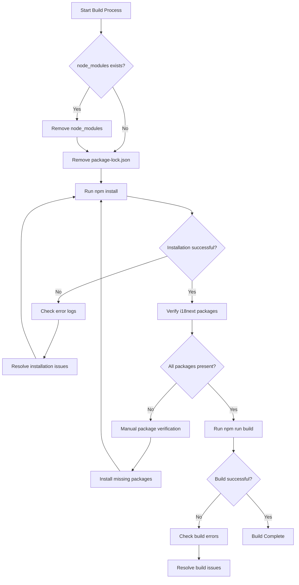

# Fix Missing i18next Dependency in Production Build

## Problem Statement

The production build process fails on the server when running `npm run build` with the following error:

```
[vite]: Rollup failed to resolve import "i18next" from "/var/www/reader.market/client/src/i18n.ts".
This is most likely unintended because it can break your application at runtime.
```

The error occurs despite `i18next` being declared as a dependency in `package.json`. This indicates that the dependency is not properly installed in the server's `node_modules` directory.

## Root Cause Analysis

### Primary Cause
The `node_modules` directory on the server does not contain the required i18next packages, even though they are listed in `package.json` dependencies:
- `i18next` (version ^25.7.3)
- `i18next-browser-languagedetector` (version ^8.2.0)
- `react-i18next` (version ^16.5.1)

### Contributing Factors
1. **Incomplete Dependency Installation**: Dependencies may not have been installed after the last code deployment
2. **Node Modules Synchronization**: The server's `node_modules` directory may be out of sync with `package.json`
3. **Build Cache Issues**: Stale build cache or lockfile inconsistencies may prevent proper dependency resolution

## Design Solution

### Objective
Ensure all required dependencies are properly installed on the server before running the production build process.

### Resolution Strategy

#### Step 1: Clean Existing Dependencies
Remove potentially corrupted or incomplete dependency installations:
- Delete `node_modules` directory completely
- Remove `package-lock.json` to eliminate lockfile inconsistencies

**Rationale**: Starting with a clean slate eliminates any partial or corrupted installations that might prevent proper dependency resolution.

#### Step 2: Fresh Dependency Installation
Perform a complete dependency installation from scratch:
- Execute `npm install` to install all dependencies from `package.json`
- Verify that the installation completes successfully without errors

**Expected Outcome**: All packages listed in `package.json` (including i18next and related packages) will be downloaded and installed in `node_modules`.

#### Step 3: Verify Installation
Confirm that the required i18next packages are present:
- Check for presence of `i18next` in `node_modules`
- Check for presence of `i18next-browser-languagedetector` in `node_modules`
- Check for presence of `react-i18next` in `node_modules`

#### Step 4: Execute Production Build
Run the build process after successful installation:
- Execute `npm run build`
- Monitor the build output for any remaining dependency errors

### Dependency Requirements

The following packages must be present in `node_modules` for successful build:

| Package | Version | Purpose |
|---------|---------|---------|
| i18next | ^25.7.3 | Core internationalization framework |
| i18next-browser-languagedetector | ^8.2.0 | Browser language detection plugin |
| react-i18next | ^16.5.1 | React bindings for i18next |

### Build Process Flow



## Execution Commands

The following commands should be executed sequentially on the server:

### Phase 1: Clean Environment
```
rm -rf node_modules
rm -f package-lock.json
```

### Phase 2: Install Dependencies
```
npm install
```

### Phase 3: Build Application
```
npm run build
```

## Validation Criteria

### Success Indicators
1. `npm install` completes without errors
2. `node_modules/i18next` directory exists
3. `node_modules/i18next-browser-languagedetector` directory exists
4. `node_modules/react-i18next` directory exists
5. `npm run build` completes successfully
6. Client bundle is created in `dist/public` directory
7. Server bundle is created as `dist/index.cjs`

### Failure Indicators
- `npm install` fails with network or permission errors
- Missing packages after installation
- Build process fails with import resolution errors
- Incomplete build output

## Risk Assessment

### Low Risk Factors
- Standard npm dependency installation procedure
- No code changes required
- Reversible operation (can reinstall dependencies)

### Potential Issues
1. **Network Connectivity**: Installation may fail if npm registry is unreachable
   - Mitigation: Verify network connectivity before starting
   
2. **Disk Space**: Installation requires adequate disk space for `node_modules`
   - Mitigation: Check available disk space before proceeding

3. **Permission Issues**: Installation may fail due to file system permissions
   - Mitigation: Ensure proper permissions on project directory

## Alternative Approaches

### Option 1: Selective Package Installation (Not Recommended)
Install only the missing i18next packages without full reinstallation:
```
npm install i18next i18next-browser-languagedetector react-i18next
```

**Drawback**: Does not address potential issues with other dependencies

### Option 2: Use npm ci (Recommended for CI/CD)
Use `npm ci` instead of `npm install` for cleaner installation:
```
npm ci
```

**Advantage**: Installs exact versions from lockfile, faster and more reliable
**Requirement**: Requires existing `package-lock.json` to be committed

## Post-Resolution Actions

### Immediate Actions
1. Document the resolution in deployment procedures
2. Update deployment scripts to include dependency installation step

### Preventive Measures
1. **Deployment Checklist**: Always run `npm install` or `npm ci` after code deployment
2. **Automated CI/CD**: Include dependency installation in automated deployment pipelines
3. **Version Control**: Ensure `package-lock.json` is committed to version control
4. **Health Checks**: Add build verification step before starting application

### Monitoring
- Track build success/failure rates
- Monitor dependency installation duration
- Alert on build failures related to missing dependencies

## Technical Context

### Current Build Configuration

The project uses a custom build process defined in `script/build.ts`:
1. **Client Build**: Vite builds the React application from `client/` directory
2. **Server Build**: esbuild bundles the Express server from `server/` directory
3. **Output Location**: Built files are placed in `dist/` directory

### Dependency Usage

The `i18next` library is used in `client/src/i18n.ts` for:
- Multilingual support (English and Russian)
- Browser language detection
- Translation resource management
- React component integration

The application loads translation files from:
- `client/src/locales/en/*.json` (English translations)
- `client/src/locales/ru/*.json` (Russian translations)

## Confidence Assessment

**Confidence Level**: High

**Basis**:
- Clear root cause identified (missing dependencies in node_modules)
- Standard npm resolution procedure
- Dependencies are correctly declared in package.json
- No code changes required
- Well-established fix for common deployment issue
