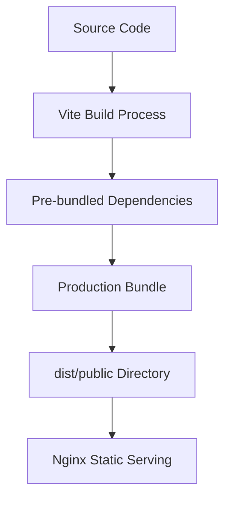
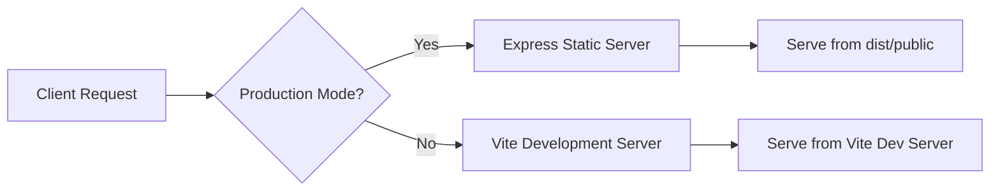

# Fix Missing Vite Dependencies in Production

## Overview
The application is experiencing 404 errors for Vite-generated dependency files in production, specifically for React and React DOM dependencies. The URLs showing 404 errors are:
- `https://reader.market/@fs/var/www/reader.market/node_modules/.vite/deps/react_jsx-dev-runtime.js?v=80485d5a`
- `https://reader.market/@fs/var/www/reader.market/node_modules/.vite/deps/react.js?v=80485d5a`
- `https://reader.market/@fs/var/www/reader.market/node_modules/.vite/deps/react-dom_client.js?v=80485d5a`

## Problem Statement
The Vite development server is attempting to serve pre-bundled dependencies from the `.vite/deps` directory, but these files are not accessible in the production environment. This occurs because Vite's development server handles dependency pre-bundling differently than the production build process.

## Root Cause Analysis
1. **Development vs Production Build Mismatch**: Vite development server pre-bundles dependencies and serves them from a virtual file system (`@fs`), but the production build does not include these pre-bundled dependencies in the correct location.

2. **Incorrect Asset Serving**: The production build process creates a `dist` directory with compiled assets, but the Vite dependencies are not properly resolved in the production environment.

3. **Nginx Configuration**: The nginx configuration may be attempting to serve Vite's development dependencies rather than the production-built assets.

## Solution Strategy
The issue stems from confusion between Vite's development server behavior and production build output. In production, Vite dependencies should be properly bundled into the production build rather than served as separate files.

### Primary Solution: Proper Production Build Configuration
1. **Update Vite Build Configuration**: Ensure the Vite build process properly bundles all dependencies into the final production build
2. **Correct Asset Serving**: Modify the production server to serve built assets correctly without relying on Vite's development server features
3. **Nginx Configuration Update**: Update nginx to properly serve the production-built assets

### Implementation Approach
1. **Modify Vite Configuration**: Update `vite.config.ts` to ensure proper dependency handling in production builds
2. **Asset Pre-bundling**: Pre-bundle dependencies during the build process rather than at runtime
3. **Server-Side Handling**: Update the Express server to properly serve production assets

## Architecture Impact
- **Frontend Build Process**: Vite will bundle all dependencies during the build phase rather than serving them separately
- **Asset Delivery**: Production assets will be served from the built `dist/public` directory
- **Server Logic**: Express server will serve pre-built assets without Vite's development middleware

## Technical Design

### Vite Build Configuration
The Vite configuration needs to ensure all dependencies are properly bundled during the production build:

### Production Asset Serving
In production, the Express server will serve pre-built assets from the `dist/public` directory:

### Dependencies Handling
All dependencies should be bundled during the build process rather than served as separate files:

- React and React DOM will be bundled into the main JavaScript bundle
- Other dependencies will be pre-bundled during the build process
- No runtime dependency on Vite's `.vite/deps` directory

## Implementation Steps

1. **Update Vite Configuration**:
   - Configure proper dependency pre-bundling
   - Ensure all necessary dependencies are included in production build

2. **Modify Build Process**:
   - Update the build script to properly bundle all dependencies
   - Verify that all required assets are generated in the `dist` directory

3. **Update Server Configuration**:
   - Ensure Express server properly serves production assets
   - Remove any development-specific Vite middleware in production mode

4. **Nginx Configuration**:
   - Ensure nginx properly serves static assets from the correct location
   - Update location blocks to serve pre-built assets

## Validation Criteria
- All React and React DOM dependencies should be properly bundled in the production build
- No requests should be made to the `@fs` Vite development endpoints in production
- All static assets should be served from the production `dist/public` directory
- Application should function correctly without Vite development server features

## Risk Mitigation
- Test the production build locally before deployment
- Maintain separate development and production configurations
- Ensure fallback mechanisms exist for asset loading
- Monitor application behavior after implementing changes- Ensure fallback mechanisms exist for asset loading
- Monitor application behavior after implementing changes