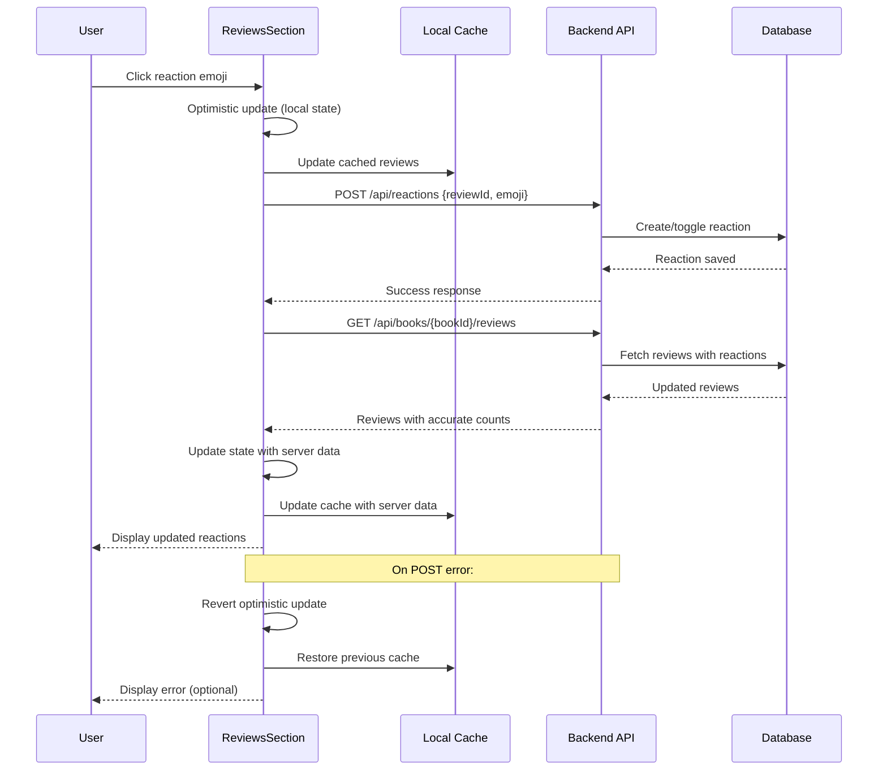

# Fix Review Reaction Endpoint - Design Document

## Problem Statement

Users cannot add reactions to reviews on the book detail page. When clicking a reaction emoji for a review, the system makes a GET request to fetch reviews instead of a POST request to save the reaction. The GET request returns a 304 Not Modified status, and no reaction is actually saved to the database.

### Current Behavior
- User clicks on a reaction emoji for a review
- System only performs optimistic UI update
- System makes GET request: `GET /api/books/{bookId}/reviews`
- GET request returns 304 Not Modified
- No POST request is sent to save the reaction
- Reaction is not persisted to database

### Expected Behavior
- User clicks on a reaction emoji for a review
- System performs optimistic UI update
- System makes POST request: `POST /api/reactions` with `{ reviewId, emoji }`
- Reaction is saved to database
- System refetches reviews to get updated reaction counts
- UI displays the correct reaction state

## Root Cause Analysis

The `handleReact` function in `ReviewsSection.tsx` is missing the critical POST request to the `/api/reactions` endpoint. It only:
1. Updates local state optimistically
2. Refetches reviews with GET request

This contrasts with other components in the system:
- `BookDetail.tsx` has `handleReactToReview` that correctly calls POST `/api/reactions`
- `ActivityCard.tsx` has `handleReact` that correctly calls POST `/api/reactions`

## Solution Design

### Functional Requirements

1. **API Call Implementation**
   - Add POST request to `/api/reactions` endpoint before refetching reviews
   - Include `reviewId` and `emoji` in request body
   - Include authentication token in request headers
   - Handle API errors appropriately

2. **Error Handling**
   - Revert optimistic UI updates if POST request fails
   - Display user-friendly error message
   - Preserve previous reaction state on failure

3. **User Experience**
   - Maintain optimistic UI updates for immediate feedback
   - Ensure reaction persistence across page refreshes
   - Handle both adding and toggling reactions

### Technical Approach

The fix involves modifying the `handleReact` function in `ReviewsSection.tsx` to include the missing POST request step.

#### Current Flow
```
User clicks reaction → Optimistic UI update → Refetch reviews (GET)
```

#### Fixed Flow
```
User clicks reaction → Optimistic UI update → Save reaction (POST) → Refetch reviews (GET)
```

### Implementation Details

#### Modified Function: `handleReact`

**Location**: `client/src/components/ReviewsSection.tsx`

**Changes Required**:

1. After optimistic UI update (line 322)
2. Before refetching reviews (line 326)
3. Add POST request to `/api/reactions` endpoint

**API Contract**:
- **Endpoint**: `POST /api/reactions`
- **Headers**: 
  - `Content-Type: application/json`
  - `Authorization: Bearer {token}`
- **Request Body**:
  ```
  {
    "reviewId": string,
    "emoji": string
  }
  ```
- **Success Response**: JSON object with reaction details
- **Error Response**: JSON object with error message

**Error Handling Strategy**:
- If POST request fails, revert the optimistic updates
- Restore previous review state
- Restore previous cache state
- Log error for debugging
- Do not proceed to refetch reviews

**Consistency with Existing Patterns**:
- Follow the pattern used in `handleReactToReview` in `BookDetail.tsx` (lines 573-590)
- Follow the pattern used in `handleReact` in `ActivityCard.tsx` (lines 142-183)
- Use same error handling approach as `handleReactToComment` (lines 537-571)

### Data Flow



### Rollback Strategy

If the POST request fails:
1. Restore the `reviews` state to its pre-optimistic value
2. Restore the `userReview` state if modified
3. Restore the cached reviews using `setCachedReviews`
4. Do not proceed with the GET refetch
5. Log the error for debugging purposes

## Testing Considerations

### Functional Test Cases

1. **Add New Reaction**
   - User clicks reaction emoji on review without existing reactions
   - Verify POST request is sent with correct reviewId and emoji
   - Verify reaction appears in UI
   - Verify reaction persists after page refresh

2. **Toggle Existing Reaction**
   - User clicks same reaction emoji they previously added
   - Verify POST request is sent
   - Verify reaction count decrements
   - Verify userReacted flag toggles correctly

3. **Add Different Reaction**
   - User clicks different reaction emoji on review
   - Verify POST request is sent with new emoji
   - Verify new reaction appears alongside existing ones

4. **Error Handling**
   - Simulate POST request failure
   - Verify optimistic update is reverted
   - Verify UI returns to previous state
   - Verify cache is not corrupted

5. **Authentication**
   - Verify unauthenticated users cannot add reactions
   - Verify auth token is included in request

### Integration Points

- Backend endpoint: `POST /api/reactions` (already implemented in `server/routes.ts`)
- WebSocket broadcast: Reaction updates are broadcast via `stream:reaction-update` event
- Cache system: Local review cache must be updated correctly
- User authentication: Auth token from localStorage

## Success Criteria

1. ✅ Clicking reaction emoji on review sends POST request to `/api/reactions`
2. ✅ Reaction is saved to database and persists
3. ✅ UI updates correctly with accurate reaction counts
4. ✅ Optimistic updates are reverted on error
5. ✅ Pattern is consistent with comment reactions and activity card reactions
6. ✅ No duplicate GET requests without POST
7. ✅ User experience remains smooth with immediate visual feedback

## References

### Related Files
- `client/src/components/ReviewsSection.tsx` - File requiring modification
- `client/src/pages/BookDetail.tsx` - Reference implementation for review reactions
- `client/src/components/stream/ActivityCard.tsx` - Reference implementation for activity reactions
- `server/routes.ts` - Backend API endpoint (already correct)

### Existing Working Patterns
- Comment reactions: Correctly implemented in `BookDetail.tsx` (handleReactToComment)
- Review reactions (alternate): Correctly implemented in `BookDetail.tsx` (handleReactToReview)
- Activity reactions: Correctly implemented in `ActivityCard.tsx` (handleReact)
- Reaction is saved to database
- System refetches reviews to get updated reaction counts
- UI displays the correct reaction state

## Root Cause Analysis

The `handleReact` function in `ReviewsSection.tsx` is missing the critical POST request to the `/api/reactions` endpoint. It only:
1. Updates local state optimistically
2. Refetches reviews with GET request

This contrasts with other components in the system:
- `BookDetail.tsx` has `handleReactToReview` that correctly calls POST `/api/reactions`
- `ActivityCard.tsx` has `handleReact` that correctly calls POST `/api/reactions`

## Solution Design

### Functional Requirements

1. **API Call Implementation**
   - Add POST request to `/api/reactions` endpoint before refetching reviews
   - Include `reviewId` and `emoji` in request body
   - Include authentication token in request headers
   - Handle API errors appropriately

2. **Error Handling**
   - Revert optimistic UI updates if POST request fails
   - Display user-friendly error message
   - Preserve previous reaction state on failure

3. **User Experience**
   - Maintain optimistic UI updates for immediate feedback
   - Ensure reaction persistence across page refreshes
   - Handle both adding and toggling reactions

### Technical Approach

The fix involves modifying the `handleReact` function in `ReviewsSection.tsx` to include the missing POST request step.

#### Current Flow
```
User clicks reaction → Optimistic UI update → Refetch reviews (GET)
```

#### Fixed Flow
```
User clicks reaction → Optimistic UI update → Save reaction (POST) → Refetch reviews (GET)
```

### Implementation Details

#### Modified Function: `handleReact`

**Location**: `client/src/components/ReviewsSection.tsx`

**Changes Required**:

1. After optimistic UI update (line 322)
2. Before refetching reviews (line 326)
3. Add POST request to `/api/reactions` endpoint

**API Contract**:
- **Endpoint**: `POST /api/reactions`
- **Headers**: 
  - `Content-Type: application/json`
  - `Authorization: Bearer {token}`
- **Request Body**:
  ```
  {
    "reviewId": string,
    "emoji": string
  }
  ```
- **Success Response**: JSON object with reaction details
- **Error Response**: JSON object with error message

**Error Handling Strategy**:
- If POST request fails, revert the optimistic updates
- Restore previous review state
- Restore previous cache state
- Log error for debugging
- Do not proceed to refetch reviews

**Consistency with Existing Patterns**:
- Follow the pattern used in `handleReactToReview` in `BookDetail.tsx` (lines 573-590)
- Follow the pattern used in `handleReact` in `ActivityCard.tsx` (lines 142-183)
- Use same error handling approach as `handleReactToComment` (lines 537-571)

### Data Flow


### Rollback Strategy

If the POST request fails:
1. Restore the `reviews` state to its pre-optimistic value
2. Restore the `userReview` state if modified
3. Restore the cached reviews using `setCachedReviews`
4. Do not proceed with the GET refetch
5. Log the error for debugging purposes

## Testing Considerations

### Functional Test Cases

1. **Add New Reaction**
   - User clicks reaction emoji on review without existing reactions
   - Verify POST request is sent with correct reviewId and emoji
   - Verify reaction appears in UI
   - Verify reaction persists after page refresh

2. **Toggle Existing Reaction**
   - User clicks same reaction emoji they previously added
   - Verify POST request is sent
   - Verify reaction count decrements
   - Verify userReacted flag toggles correctly

3. **Add Different Reaction**
   - User clicks different reaction emoji on review
   - Verify POST request is sent with new emoji
   - Verify new reaction appears alongside existing ones

4. **Error Handling**
   - Simulate POST request failure
   - Verify optimistic update is reverted
   - Verify UI returns to previous state
   - Verify cache is not corrupted

5. **Authentication**
   - Verify unauthenticated users cannot add reactions
   - Verify auth token is included in request

### Integration Points

- Backend endpoint: `POST /api/reactions` (already implemented in `server/routes.ts`)
- WebSocket broadcast: Reaction updates are broadcast via `stream:reaction-update` event
- Cache system: Local review cache must be updated correctly
- User authentication: Auth token from localStorage

## Success Criteria

1. ✅ Clicking reaction emoji on review sends POST request to `/api/reactions`
2. ✅ Reaction is saved to database and persists
3. ✅ UI updates correctly with accurate reaction counts
4. ✅ Optimistic updates are reverted on error
5. ✅ Pattern is consistent with comment reactions and activity card reactions
6. ✅ No duplicate GET requests without POST
7. ✅ User experience remains smooth with immediate visual feedback

## References

### Related Files
- `client/src/components/ReviewsSection.tsx` - File requiring modification
- `client/src/pages/BookDetail.tsx` - Reference implementation for review reactions
- `client/src/components/stream/ActivityCard.tsx` - Reference implementation for activity reactions
- `server/routes.ts` - Backend API endpoint (already correct)

### Existing Working Patterns
- Comment reactions: Correctly implemented in `BookDetail.tsx` (handleReactToComment)
- Review reactions (alternate): Correctly implemented in `BookDetail.tsx` (handleReactToReview)
- Activity reactions: Correctly implemented in `ActivityCard.tsx` (handleReact)
- System makes POST request: `POST /api/reactions` with `{ reviewId, emoji }`
- Reaction is saved to database
- System refetches reviews to get updated reaction counts
- UI displays the correct reaction state

## Root Cause Analysis

The `handleReact` function in `ReviewsSection.tsx` is missing the critical POST request to the `/api/reactions` endpoint. It only:
1. Updates local state optimistically
2. Refetches reviews with GET request

This contrasts with other components in the system:
- `BookDetail.tsx` has `handleReactToReview` that correctly calls POST `/api/reactions`
- `ActivityCard.tsx` has `handleReact` that correctly calls POST `/api/reactions`

## Solution Design

### Functional Requirements

1. **API Call Implementation**
   - Add POST request to `/api/reactions` endpoint before refetching reviews
   - Include `reviewId` and `emoji` in request body
   - Include authentication token in request headers
   - Handle API errors appropriately

2. **Error Handling**
   - Revert optimistic UI updates if POST request fails
   - Display user-friendly error message
   - Preserve previous reaction state on failure

3. **User Experience**
   - Maintain optimistic UI updates for immediate feedback
   - Ensure reaction persistence across page refreshes
   - Handle both adding and toggling reactions

### Technical Approach

The fix involves modifying the `handleReact` function in `ReviewsSection.tsx` to include the missing POST request step.

#### Current Flow
```
User clicks reaction → Optimistic UI update → Refetch reviews (GET)
```

#### Fixed Flow
```
User clicks reaction → Optimistic UI update → Save reaction (POST) → Refetch reviews (GET)
```

### Implementation Details

#### Modified Function: `handleReact`

**Location**: `client/src/components/ReviewsSection.tsx`

**Changes Required**:

1. After optimistic UI update (line 322)
2. Before refetching reviews (line 326)
3. Add POST request to `/api/reactions` endpoint

**API Contract**:
- **Endpoint**: `POST /api/reactions`
- **Headers**: 
  - `Content-Type: application/json`
  - `Authorization: Bearer {token}`
- **Request Body**:
  ```
  {
    "reviewId": string,
    "emoji": string
  }
  ```
- **Success Response**: JSON object with reaction details
- **Error Response**: JSON object with error message

**Error Handling Strategy**:
- If POST request fails, revert the optimistic updates
- Restore previous review state
- Restore previous cache state
- Log error for debugging
- Do not proceed to refetch reviews

**Consistency with Existing Patterns**:
- Follow the pattern used in `handleReactToReview` in `BookDetail.tsx` (lines 573-590)
- Follow the pattern used in `handleReact` in `ActivityCard.tsx` (lines 142-183)
- Use same error handling approach as `handleReactToComment` (lines 537-571)

### Data Flow


### Rollback Strategy

If the POST request fails:
1. Restore the `reviews` state to its pre-optimistic value
2. Restore the `userReview` state if modified
3. Restore the cached reviews using `setCachedReviews`
4. Do not proceed with the GET refetch
5. Log the error for debugging purposes

## Testing Considerations

### Functional Test Cases

1. **Add New Reaction**
   - User clicks reaction emoji on review without existing reactions
   - Verify POST request is sent with correct reviewId and emoji
   - Verify reaction appears in UI
   - Verify reaction persists after page refresh

2. **Toggle Existing Reaction**
   - User clicks same reaction emoji they previously added
   - Verify POST request is sent
   - Verify reaction count decrements
   - Verify userReacted flag toggles correctly

3. **Add Different Reaction**
   - User clicks different reaction emoji on review
   - Verify POST request is sent with new emoji
   - Verify new reaction appears alongside existing ones

4. **Error Handling**
   - Simulate POST request failure
   - Verify optimistic update is reverted
   - Verify UI returns to previous state
   - Verify cache is not corrupted

5. **Authentication**
   - Verify unauthenticated users cannot add reactions
   - Verify auth token is included in request

### Integration Points

- Backend endpoint: `POST /api/reactions` (already implemented in `server/routes.ts`)
- WebSocket broadcast: Reaction updates are broadcast via `stream:reaction-update` event
- Cache system: Local review cache must be updated correctly
- User authentication: Auth token from localStorage

## Success Criteria

1. ✅ Clicking reaction emoji on review sends POST request to `/api/reactions`
2. ✅ Reaction is saved to database and persists
3. ✅ UI updates correctly with accurate reaction counts
4. ✅ Optimistic updates are reverted on error
5. ✅ Pattern is consistent with comment reactions and activity card reactions
6. ✅ No duplicate GET requests without POST
7. ✅ User experience remains smooth with immediate visual feedback

## References

### Related Files
- `client/src/components/ReviewsSection.tsx` - File requiring modification
- `client/src/pages/BookDetail.tsx` - Reference implementation for review reactions
- `client/src/components/stream/ActivityCard.tsx` - Reference implementation for activity reactions
- `server/routes.ts` - Backend API endpoint (already correct)

### Existing Working Patterns
- Comment reactions: Correctly implemented in `BookDetail.tsx` (handleReactToComment)
- Review reactions (alternate): Correctly implemented in `BookDetail.tsx` (handleReactToReview)
- Activity reactions: Correctly implemented in `ActivityCard.tsx` (handleReact)
