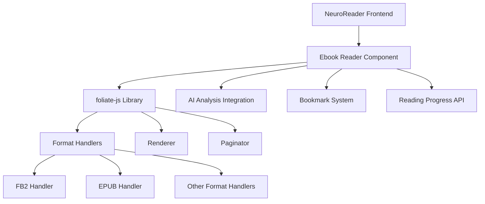
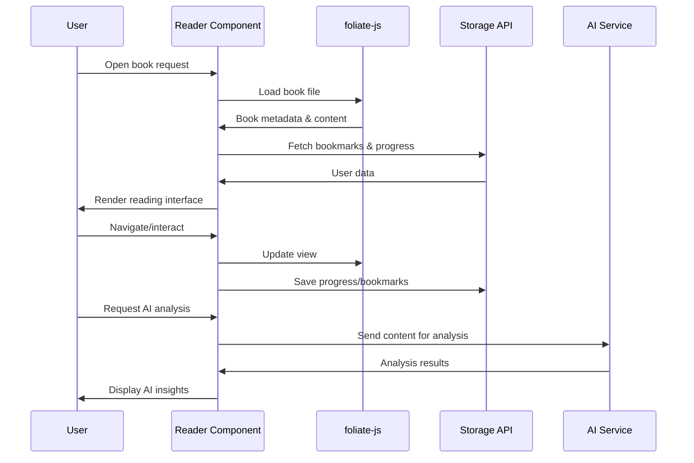

# Design Document: Integration of Advanced Ebook Reader Engine

## 1. Overview

### 1.1 Purpose
This document outlines the design for integrating a modern, feature-rich ebook reader engine to replace the current basic reading implementation in the NeuroReader application. The new reader will provide enhanced functionality including better pagination, navigation, bookmarking, and annotation capabilities while maintaining compatibility with the existing AI analysis features.

### 11.2 Context
The current implementation uses a basic HTML-based reader with character-by-character pagination that lacks sophisticated features expected from modern ebook readers. Users have expressed interest in upgrading to a more capable reading experience that supports industry-standard ebook formats and provides advanced reading features.

### 1.3 Scope
This design covers:
- Integration of a modern ebook reader library (foliate-js)
- Migration of existing functionality (bookmarks, AI analysis)
- Enhancement of reading experience with professional-grade features
- Maintenance of existing API contracts and data structures

## 2. Current System Analysis

### 2.1 Existing Reader Implementation
The current reader implementation has the following characteristics:
- Basic HTML rendering with manual pagination
- Character-based pagination using exact measurement techniques
- Limited navigation controls
- Simple bookmark management
- Integration with AI sidebar for content analysis
- Support for FB2 and plain text formats

### 2.2 Technical Limitations
- No standardized ebook format support (EPUB, MOBI, etc.)
- Manual pagination implementation prone to inconsistencies
- Limited text rendering capabilities
- No built-in search functionality
- No table of contents navigation
- No annotation/highlighting features

### 2.3 Functional Requirements
The new reader must maintain compatibility with:
- Existing bookmark system
- Reading progress tracking
- AI analysis sidebar
- User preferences (font size, theme)
- Existing book metadata and storage system

## 3. Proposed Solution

### 3.1 Selected Technology: foliate-js
After evaluating available options, **foliate-js** has been selected as the most suitable library for integration due to:

#### 3.1.1 Advantages
- Native web browser support with no build requirements
- Modular architecture allowing selective feature integration
- Support for multiple ebook formats including FB2 (currently used)
- Small footprint with no hard dependencies
- Active maintenance and permissive licensing
- Built-in support for pagination, search, and navigation

#### 3.1.2 Supported Formats
- EPUB (primary focus)
- FB2 (existing format in use)
- MOBI/KF8 (AZW3)
- CBZ (comic books)
- PDF (experimental)

### 3.2 Architecture Overview



### 3.3 Component Structure

#### 3.3.1 Reader Component
The new `EnhancedBookReader` component will replace the current `BookReader` and provide:

##### Core Features
- Format detection and handling
- Pagination and navigation
- Table of contents display
- Search functionality
- Text selection and highlighting
- Metadata extraction

##### Integration Points
- Bookmark management system
- Reading progress tracking
- AI analysis sidebar
- User preferences (font, theme)

#### 3.3.2 Data Flow



## 4. Implementation Plan

### 4.1 Phase 1: Library Integration
#### Tasks
1. Add foliate-js as a dependency
2. Create wrapper component for foliate-js integration
3. Implement basic book loading and rendering
4. Test with existing FB2 files

#### Success Criteria
- Books load and display correctly
- Basic navigation works
- No breaking changes to existing UI

### 4.2 Phase 2: Feature Parity
#### Tasks
1. Integrate existing bookmark system
2. Maintain reading progress tracking
3. Preserve font size controls
4. Keep AI analysis functionality

#### Success Criteria
- All existing features work with new reader
- User data migration successful
- Performance comparable to current implementation

### 4.3 Phase 3: Enhanced Features
#### Tasks
1. Implement search functionality
2. Add table of contents navigation
3. Enable text selection and highlighting
4. Add metadata display

#### Success Criteria
- Enhanced reading experience
- Professional-grade features
- Improved usability

### 4.4 Phase 4: Format Expansion
#### Tasks
1. Add EPUB format support
2. Test with various ebook files
3. Implement format-specific optimizations
4. Update upload interface

#### Success Criteria
- Multi-format support
- Consistent user experience across formats
- Backward compatibility

## 5. API Design

### 5.1 Component Interface
```typescript
interface EnhancedBookReaderProps {
  book: Book;
  onNext?: () => void;
  onPrev?: () => void;
  hasPrev: boolean;
  hasNext: boolean;
  fontSize?: number;
  totalPages?: number;
  currentPageIndex?: number;
  bookmarks: Bookmark[];
  onAddBookmark: (title: string) => void;
  onRemoveBookmark: (id: string) => void;
  onNavigateToBookmark: (chapterId: number) => void;
}
```

### 5.2 Data Structures
The existing data structures for `Book` and `Bookmark` will remain unchanged to ensure backward compatibility.

### 5.3 Integration Points
- `/api/books/:id` - Fetch book metadata
- Bookmark storage system - Maintain existing API
- Reading progress tracking - Continue using existing endpoints

## 6. Migration Strategy

### 6.1 Backward Compatibility
- Maintain existing URL structure (`/read/:bookId/:position`)
- Preserve all user data (bookmarks, reading progress)
- Keep existing UI components where appropriate

### 6.2 Data Migration
No data migration is required as the new reader will use the same:
- Bookmark storage format
- Reading progress tracking
- User preferences

### 6.3 Rollout Plan
1. Deploy to staging environment for testing
2. Conduct user acceptance testing
3. Gradual rollout to production with feature flag
4. Monitor performance and user feedback
5. Full deployment after validation

## 7. Risk Assessment

### 7.1 Technical Risks
| Risk | Impact | Mitigation |
|------|--------|------------|
| Performance degradation | Medium | Comprehensive testing, lazy loading |
| Format compatibility issues | High | Extensive format testing, fallback mechanism |
| Breaking existing functionality | High | Thorough regression testing |
| Library maintenance concerns | Medium | Evaluate alternatives, consider fork |

### 7.2 Business Risks
| Risk | Impact | Mitigation |
|------|--------|------------|
| User adoption resistance | Low | Gradual rollout, user education |
| Increased bundle size | Low | Code splitting, lazy loading |
| Learning curve for development | Medium | Documentation, training |

## 8. Success Metrics

### 8.1 Quantitative Metrics
- Page load time < 2 seconds
- Reader initialization time < 1 second
- Memory usage < 100MB for average book
- User retention in reader > 80%

### 8.2 Qualitative Metrics
- User satisfaction scores
- Feature adoption rates
- Support ticket volume reduction
- Accessibility compliance

## 9. Future Enhancements

### 9.1 Short-term (3-6 months)
- Annotation/highlighting system
- Custom themes and reading modes
- Offline reading support
- Sync across devices

### 9.2 Long-term (6-12 months)
- Social reading features
- Advanced AI integration
- Collaborative annotations
- Reading statistics dashboard

## 10. Conclusion

Integrating foliate-js as the ebook reader engine will significantly enhance the NeuroReader application's reading experience while maintaining compatibility with existing features. The modular architecture of foliate-js allows for selective feature integration, ensuring we can maintain our unique AI analysis capabilities while gaining professional-grade reading features.

The phased implementation approach minimizes risk and allows for continuous validation throughout the development process. With proper testing and gradual rollout, this enhancement will position NeuroReader as a competitive modern reading platform.- Integration of a modern ebook reader library (foliate-js)
- Migration of existing functionality (bookmarks, AI analysis)
- Enhancement of reading experience with professional-grade features
- Maintenance of existing API contracts and data structures

## 2. Current System Analysis

### 2.1 Existing Reader Implementation
The current reader implementation has the following characteristics:
- Basic HTML rendering with manual pagination
- Character-based pagination using exact measurement techniques
- Limited navigation controls
- Simple bookmark management
- Integration with AI sidebar for content analysis
- Support for FB2 and plain text formats

### 2.2 Technical Limitations
- No standardized ebook format support (EPUB, MOBI, etc.)
- Manual pagination implementation prone to inconsistencies
- Limited text rendering capabilities
- No built-in search functionality
- No table of contents navigation
- No annotation/highlighting features

### 2.3 Functional Requirements
The new reader must maintain compatibility with:
- Existing bookmark system
- Reading progress tracking
- AI analysis sidebar
- User preferences (font size, theme)
- Existing book metadata and storage system

## 3. Proposed Solution

### 3.1 Selected Technology: foliate-js
After evaluating available options, **foliate-js** has been selected as the most suitable library for integration due to:

#### 3.1.1 Advantages
- Native web browser support with no build requirements
- Modular architecture allowing selective feature integration
- Support for multiple ebook formats including FB2 (currently used)
- Small footprint with no hard dependencies
- Active maintenance and permissive licensing
- Built-in support for pagination, search, and navigation

#### 3.1.2 Supported Formats
- EPUB (primary focus)
- FB2 (existing format in use)
- MOBI/KF8 (AZW3)
- CBZ (comic books)
- PDF (experimental)

### 3.2 Architecture Overview


### 3.3 Component Structure

#### 3.3.1 Reader Component
The new `EnhancedBookReader` component will replace the current `BookReader` and provide:

##### Core Features
- Format detection and handling
- Pagination and navigation
- Table of contents display
- Search functionality
- Text selection and highlighting
- Metadata extraction

##### Integration Points
- Bookmark management system
- Reading progress tracking
- AI analysis sidebar
- User preferences (font, theme)

#### 3.3.2 Data Flow


## 4. Implementation Plan

### 4.1 Phase 1: Library Integration
#### Tasks
1. Add foliate-js as a dependency
2. Create wrapper component for foliate-js integration
3. Implement basic book loading and rendering
4. Test with existing FB2 files

#### Success Criteria
- Books load and display correctly
- Basic navigation works
- No breaking changes to existing UI

### 4.2 Phase 2: Feature Parity
#### Tasks
1. Integrate existing bookmark system
2. Maintain reading progress tracking
3. Preserve font size controls
4. Keep AI analysis functionality

#### Success Criteria
- All existing features work with new reader
- User data migration successful
- Performance comparable to current implementation

### 4.3 Phase 3: Enhanced Features
#### Tasks
1. Implement search functionality
2. Add table of contents navigation
3. Enable text selection and highlighting
4. Add metadata display

#### Success Criteria
- Enhanced reading experience
- Professional-grade features
- Improved usability

### 4.4 Phase 4: Format Expansion
#### Tasks
1. Add EPUB format support
2. Test with various ebook files
3. Implement format-specific optimizations
4. Update upload interface

#### Success Criteria
- Multi-format support
- Consistent user experience across formats
- Backward compatibility

## 5. API Design

### 5.1 Component Interface
```typescript
interface EnhancedBookReaderProps {
  book: Book;
  onNext?: () => void;
  onPrev?: () => void;
  hasPrev: boolean;
  hasNext: boolean;
  fontSize?: number;
  totalPages?: number;
  currentPageIndex?: number;
  bookmarks: Bookmark[];
  onAddBookmark: (title: string) => void;
  onRemoveBookmark: (id: string) => void;
  onNavigateToBookmark: (chapterId: number) => void;
}
```

### 5.2 Data Structures
The existing data structures for `Book` and `Bookmark` will remain unchanged to ensure backward compatibility.

### 5.3 Integration Points
- `/api/books/:id` - Fetch book metadata
- Bookmark storage system - Maintain existing API
- Reading progress tracking - Continue using existing endpoints

## 6. Migration Strategy

### 6.1 Backward Compatibility
- Maintain existing URL structure (`/read/:bookId/:position`)
- Preserve all user data (bookmarks, reading progress)
- Keep existing UI components where appropriate

### 6.2 Data Migration
No data migration is required as the new reader will use the same:
- Bookmark storage format
- Reading progress tracking
- User preferences

### 6.3 Rollout Plan
1. Deploy to staging environment for testing
2. Conduct user acceptance testing
3. Gradual rollout to production with feature flag
4. Monitor performance and user feedback
5. Full deployment after validation

## 7. Risk Assessment

### 7.1 Technical Risks
| Risk | Impact | Mitigation |
|------|--------|------------|
| Performance degradation | Medium | Comprehensive testing, lazy loading |
| Format compatibility issues | High | Extensive format testing, fallback mechanism |
| Breaking existing functionality | High | Thorough regression testing |
| Library maintenance concerns | Medium | Evaluate alternatives, consider fork |

### 7.2 Business Risks
| Risk | Impact | Mitigation |
|------|--------|------------|
| User adoption resistance | Low | Gradual rollout, user education |
| Increased bundle size | Low | Code splitting, lazy loading |
| Learning curve for development | Medium | Documentation, training |

## 8. Success Metrics

### 8.1 Quantitative Metrics
- Page load time < 2 seconds
- Reader initialization time < 1 second
- Memory usage < 100MB for average book
- User retention in reader > 80%

### 8.2 Qualitative Metrics
- User satisfaction scores
- Feature adoption rates
- Support ticket volume reduction
- Accessibility compliance

## 9. Future Enhancements

### 9.1 Short-term (3-6 months)
- Annotation/highlighting system
- Custom themes and reading modes
- Offline reading support
- Sync across devices

### 9.2 Long-term (6-12 months)
- Social reading features
- Advanced AI integration
- Collaborative annotations
- Reading statistics dashboard

## 10. Conclusion

Integrating foliate-js as the ebook reader engine will significantly enhance the NeuroReader application's reading experience while maintaining compatibility with existing features. The modular architecture of foliate-js allows for selective feature integration, ensuring we can maintain our unique AI analysis capabilities while gaining professional-grade reading features.

The phased implementation approach minimizes risk and allows for continuous validation throughout the development process. With proper testing and gradual rollout, this enhancement will position NeuroReader as a competitive modern reading platform.- Integration of a modern ebook reader library (foliate-js)
- Migration of existing functionality (bookmarks, AI analysis)
- Enhancement of reading experience with professional-grade features
- Maintenance of existing API contracts and data structures

## 2. Current System Analysis

### 2.1 Existing Reader Implementation
The current reader implementation has the following characteristics:
- Basic HTML rendering with manual pagination
- Character-based pagination using exact measurement techniques
- Limited navigation controls
- Simple bookmark management
- Integration with AI sidebar for content analysis
- Support for FB2 and plain text formats

### 2.2 Technical Limitations
- No standardized ebook format support (EPUB, MOBI, etc.)
- Manual pagination implementation prone to inconsistencies
- Limited text rendering capabilities
- No built-in search functionality
- No table of contents navigation
- No annotation/highlighting features

### 2.3 Functional Requirements
The new reader must maintain compatibility with:
- Existing bookmark system
- Reading progress tracking
- AI analysis sidebar
- User preferences (font size, theme)
- Existing book metadata and storage system

## 3. Proposed Solution

### 3.1 Selected Technology: foliate-js
After evaluating available options, **foliate-js** has been selected as the most suitable library for integration due to:

#### 3.1.1 Advantages
- Native web browser support with no build requirements
- Modular architecture allowing selective feature integration
- Support for multiple ebook formats including FB2 (currently used)
- Small footprint with no hard dependencies
- Active maintenance and permissive licensing
- Built-in support for pagination, search, and navigation

#### 3.1.2 Supported Formats
- EPUB (primary focus)
- FB2 (existing format in use)
- MOBI/KF8 (AZW3)
- CBZ (comic books)
- PDF (experimental)

### 3.2 Architecture Overview


### 3.3 Component Structure

#### 3.3.1 Reader Component
The new `EnhancedBookReader` component will replace the current `BookReader` and provide:

##### Core Features
- Format detection and handling
- Pagination and navigation
- Table of contents display
- Search functionality
- Text selection and highlighting
- Metadata extraction

##### Integration Points
- Bookmark management system
- Reading progress tracking
- AI analysis sidebar
- User preferences (font, theme)

#### 3.3.2 Data Flow


## 4. Implementation Plan

### 4.1 Phase 1: Library Integration
#### Tasks
1. Add foliate-js as a dependency
2. Create wrapper component for foliate-js integration
3. Implement basic book loading and rendering
4. Test with existing FB2 files

#### Success Criteria
- Books load and display correctly
- Basic navigation works
- No breaking changes to existing UI

### 4.2 Phase 2: Feature Parity
#### Tasks
1. Integrate existing bookmark system
2. Maintain reading progress tracking
3. Preserve font size controls
4. Keep AI analysis functionality

#### Success Criteria
- All existing features work with new reader
- User data migration successful
- Performance comparable to current implementation

### 4.3 Phase 3: Enhanced Features
#### Tasks
1. Implement search functionality
2. Add table of contents navigation
3. Enable text selection and highlighting
4. Add metadata display

#### Success Criteria
- Enhanced reading experience
- Professional-grade features
- Improved usability

### 4.4 Phase 4: Format Expansion
#### Tasks
1. Add EPUB format support
2. Test with various ebook files
3. Implement format-specific optimizations
4. Update upload interface

#### Success Criteria
- Multi-format support
- Consistent user experience across formats
- Backward compatibility

## 5. API Design

### 5.1 Component Interface
```typescript
interface EnhancedBookReaderProps {
  book: Book;
  onNext?: () => void;
  onPrev?: () => void;
  hasPrev: boolean;
  hasNext: boolean;
  fontSize?: number;
  totalPages?: number;
  currentPageIndex?: number;
  bookmarks: Bookmark[];
  onAddBookmark: (title: string) => void;
  onRemoveBookmark: (id: string) => void;
  onNavigateToBookmark: (chapterId: number) => void;
}
```

### 5.2 Data Structures
The existing data structures for `Book` and `Bookmark` will remain unchanged to ensure backward compatibility.

### 5.3 Integration Points
- `/api/books/:id` - Fetch book metadata
- Bookmark storage system - Maintain existing API
- Reading progress tracking - Continue using existing endpoints

## 6. Migration Strategy

### 6.1 Backward Compatibility
- Maintain existing URL structure (`/read/:bookId/:position`)
- Preserve all user data (bookmarks, reading progress)
- Keep existing UI components where appropriate

### 6.2 Data Migration
No data migration is required as the new reader will use the same:
- Bookmark storage format
- Reading progress tracking
- User preferences

### 6.3 Rollout Plan
1. Deploy to staging environment for testing
2. Conduct user acceptance testing
3. Gradual rollout to production with feature flag
4. Monitor performance and user feedback
5. Full deployment after validation

## 7. Risk Assessment

### 7.1 Technical Risks
| Risk | Impact | Mitigation |
|------|--------|------------|
| Performance degradation | Medium | Comprehensive testing, lazy loading |
| Format compatibility issues | High | Extensive format testing, fallback mechanism |
| Breaking existing functionality | High | Thorough regression testing |
| Library maintenance concerns | Medium | Evaluate alternatives, consider fork |

### 7.2 Business Risks
| Risk | Impact | Mitigation |
|------|--------|------------|
| User adoption resistance | Low | Gradual rollout, user education |
| Increased bundle size | Low | Code splitting, lazy loading |
| Learning curve for development | Medium | Documentation, training |

## 8. Success Metrics

### 8.1 Quantitative Metrics
- Page load time < 2 seconds
- Reader initialization time < 1 second
- Memory usage < 100MB for average book
- User retention in reader > 80%

### 8.2 Qualitative Metrics
- User satisfaction scores
- Feature adoption rates
- Support ticket volume reduction
- Accessibility compliance

## 9. Future Enhancements

### 9.1 Short-term (3-6 months)
- Annotation/highlighting system
- Custom themes and reading modes
- Offline reading support
- Sync across devices

### 9.2 Long-term (6-12 months)
- Social reading features
- Advanced AI integration
- Collaborative annotations
- Reading statistics dashboard

## 10. Conclusion

Integrating foliate-js as the ebook reader engine will significantly enhance the NeuroReader application's reading experience while maintaining compatibility with existing features. The modular architecture of foliate-js allows for selective feature integration, ensuring we can maintain our unique AI analysis capabilities while gaining professional-grade reading features.

