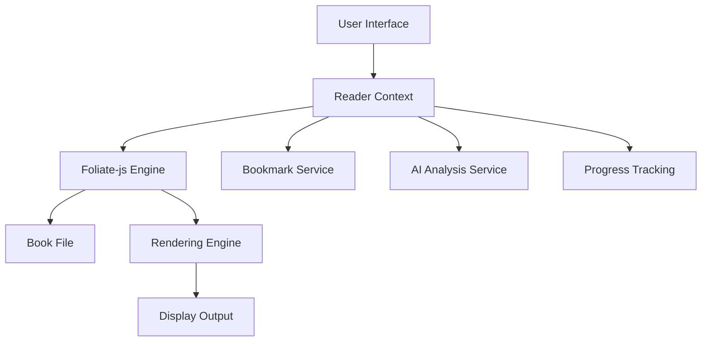

# Integrate Foliate-js Ebook Reading Engine

## Overview

The current book reading implementation in the Ollama-Reader application has limitations in terms of functionality and user experience. As you've specifically requested, the goal is to integrate Foliate-js, a modern JavaScript library for rendering ebooks in browsers, to provide:

1. **Convenient reading mechanism** with better navigation, formatting, and features
2. **Enhanced bookmark system** with improved management capabilities
3. **Seamless integration** with our existing AI-powered analysis and book summarization functionality

These three requirements are the primary focus of this integration effort.

## Current System Analysis

### Existing Implementation

The current reading functionality is implemented in:
- `client/src/pages/Reader.tsx` - Main reading page
- `client/src/components/BookReader.tsx` - Book reader component
- Pagination utilities in `client/src/lib/*PaginationUtils.ts`

### Limitations of Current Implementation

1. **Basic Text Display**: The current implementation simply displays HTML content without proper ebook formatting
2. **Limited Navigation**: Only basic next/previous page navigation without table of contents or search
3. **No Format Support**: Lacks support for standard ebook formats like EPUB, MOBI, etc.
4. **Poor Pagination**: Uses a custom character-based pagination system that may not handle complex layouts well
5. **Missing Features**: No built-in search, annotations, bookmarks management, or reading statistics

### Existing Features to Preserve

1. **Bookmark System**: Integration with the existing bookmark functionality
2. **AI Analysis Sidebar**: The AI-powered analysis feature that provides summaries and key takeaways
3. **Reading Progress Tracking**: Saving and restoring reading positions
4. **Font Size Adjustment**: Customizable text appearance
5. **User Authentication**: Integration with the existing user system

## Requirements

### Functional Requirements

#### 1. Convenient Reading Mechanism

- **Format Support**:
   - EPUB format support (primary)
   - FB2 format support (existing format in the system)
   - PDF support (optional)
   - TXT format support (existing format in the system)

- **Navigation Features**:
   - Table of Contents navigation
   - Search within book functionality
   - Page/Chapter navigation controls
   - Smooth page transitions

- **Reading Experience**:
   - Responsive layout that adapts to different screen sizes
   - Customizable typography (font, size, spacing)
   - Day/Night mode support

#### 2. Enhanced Bookmark System

- **Bookmark Management**:
   - Create, edit, and delete bookmarks
   - Organize bookmarks with tags or categories
   - Add notes to bookmarks
   - Search and filter bookmarks

- **Annotation Features**:
   - Highlight text selections
   - Add comments to highlights
   - Export bookmarks and annotations

#### 3. AI Analysis Integration

- **Content Extraction**:
   - Extract current chapter/page content for AI processing
   - Provide context-aware content to AI services

- **Seamless Integration**:
   - Maintain existing AI analysis sidebar
   - Enable real-time AI summarization
   - Support AI-powered vocabulary building

### Non-Functional Requirements

1. **Performance**:
   - Fast loading times for large books
   - Efficient memory usage
   - Smooth scrolling and navigation

2. **Compatibility**:
   - Cross-browser support (Chrome, Firefox, Safari, Edge)
   - Mobile-responsive design
   - Touch-friendly interface

3. **Security**:
   - Secure handling of uploaded book files
   - Proper authentication for accessing books
   - Protection against malicious content

## Foliate-js Implementation Details

As the chosen solution, Foliate-js will be the core of the new reading engine. Here are the specific implementation details for integrating this library.

### Library Characteristics

Foliate-js is a lightweight JavaScript library specifically designed for rendering ebooks in web browsers. Its browser-focused approach makes it ideal for integration with the existing React application.

### Supported Formats

- EPUB (primary format)
- FB2 (already used in the system)
- MOBI
- CBZ (comic books)
- Experimental PDF support

### Core Capabilities

1. **Rendering Engine**: Efficiently renders ebook content with proper formatting
2. **Navigation**: Built-in table of contents and pagination
3. **Search**: Text search within documents
4. **Annotations**: Support for highlights and bookmarks
5. **Responsive Design**: Adapts to different screen sizes
6. **Customizable Styling**: Theming and typography controls
7. **Content Extraction**: Ability to extract text content for AI processing
8. **Location Tracking**: CFI (Canonical Fragment Identifier) support for precise positioning

## Selected Approach

Following the decision to proceed with **Foliate-js**, this approach offers the optimal balance of features and simplicity for a web-based ebook reader:

1. **Alignment with Requirements**: Foliate-js provides the right balance of features and simplicity for a web-based ebook reader
2. **Licensing**: The MIT license allows for flexible integration without licensing concerns
3. **Format Support**: Supports multiple formats including EPUB and FB2 which are already used in the system
4. **Lightweight**: Being browser-focused, it will integrate well with the existing React application
5. **Customization**: The modular design allows for integration with existing features like bookmarks and AI analysis

## Architecture Design

### Component Structure

```
src/
├── components/
│   ├── BookReader/           # Main reader component folder
│   │   ├── ReaderView.tsx    # Primary reader interface
│   │   ├── NavigationPanel.tsx # Table of contents and navigation
│   │   ├── SearchPanel.tsx   # Search functionality
│   │   ├── SettingsPanel.tsx # Typography and display settings
│   │   └── ReaderContext.tsx # Shared state management
│   ├── Bookmarks/            # Updated bookmark components
│   └── AIAnalysis/           # AI sidebar components
├── hooks/
│   ├── useReader.ts          # Reader state management hook
│   └── useBookmarks.ts       # Enhanced bookmark functionality
└── lib/
    ├── ebookEngine/          # Ebook engine integration layer
    │   ├── foliateAdapter.ts # Adapter for Foliate-js
    │   ├── formatHandlers/   # Format-specific handlers
    │   └── types.ts          # Type definitions
    └── readerUtils/          # Utilities for reading features
```

### Data Flow



## Critical Integration Points

### 1. Enhanced Bookmark System

The integration with Foliate-js will significantly enhance our existing bookmark system:

- **Mapping Locations**: Convert Foliate-js CFI locations to our database bookmark format
- **Extended Functionality**: Leverage Foliate-js annotation features for richer bookmark capabilities
- **Database Integration**: Ensure seamless synchronization between Foliate-js bookmarks and our existing database
- **User Experience**: Provide a more intuitive bookmark management interface

### 2. AI Analysis Integration

The integration with our AI-powered analysis features is crucial:

- **Content Extraction**: Use Foliate-js APIs to extract clean text content from the current reading position
- **Context Preservation**: Maintain reading context for more accurate AI analysis
- **Real-time Processing**: Enable dynamic content extraction as the user navigates through the book
- **Seamless Workflow**: Ensure the AI sidebar continues to function without interruption

## Implementation Plan

### Phase 1: Core Integration (Week 1-2)

1. **Setup Foliate-js Integration**:
   - Install and configure Foliate-js library
   - Create basic reader component
   - Implement file loading for supported formats

2. **UI Components**:
   - Develop primary reader view
   - Implement basic navigation controls
   - Create settings panel for typography

### Phase 2: Feature Enhancement (Week 3-4)

1. **Navigation Features**:
   - Implement table of contents
   - Add search functionality
   - Create bookmark management interface

2. **Reading Experience**:
   - Implement day/night mode
   - Add responsive layout adjustments
   - Optimize performance for large files

### Phase 3: Integration & Testing (Week 5-6)

1. **System Integration**:
   - Connect to existing bookmark system
   - Integrate with AI analysis sidebar
   - Implement reading progress tracking

2. **Testing & Optimization**:
   - Performance testing with large books
   - Cross-browser compatibility testing
   - User experience refinement

## Database Schema Considerations

The existing database schema already supports the required functionality:
- `books` table stores book metadata and file paths
- `bookmarks` table stores user bookmarks
- `reading_progress` table tracks reading progress
- `reading_statistics` table stores reading analytics

No schema changes are required, but the integration layer will need to map between Foliate-js data structures and the existing database format.

## API Integration

The existing API endpoints will largely remain unchanged:
- `/api/books/:id` for retrieving book metadata
- `/api/bookmarks` for bookmark management
- `/api/reading-progress` for progress tracking

New endpoints may be needed for:
- Search within book functionality (if implemented server-side)
- Advanced reading statistics (if enhanced)

## Security Considerations

1. **File Handling**:
   - Validate uploaded book files
   - Sanitize content to prevent XSS attacks
   - Limit file sizes and types

2. **Authentication**:
   - Maintain existing JWT-based authentication
   - Ensure proper authorization for book access

3. **Data Protection**:
   - Encrypt sensitive user data
   - Implement proper error handling to avoid information leakage

## Performance Optimization

1. **Lazy Loading**:
   - Load book content on-demand
   - Implement virtual scrolling for long documents

2. **Caching**:
   - Cache frequently accessed book metadata
   - Store user preferences locally

3. **Memory Management**:
   - Unload content when not in view
   - Implement garbage collection for large files

## Testing Strategy

### Unit Tests
- Ebook engine integration functions
- Bookmark mapping functions
- Progress tracking utilities

### Integration Tests
- File loading and rendering
- Bookmark creation and retrieval
- Progress saving and restoration

### User Acceptance Tests
- Navigation functionality
- Search capabilities
- Bookmark management
- AI analysis integration

## Rollout Plan

1. **Development Environment**:
   - Implement in development branch
   - Conduct thorough testing

2. **Staging Environment**:
   - Deploy to staging for internal testing
   - Gather feedback from team members

3. **Production Release**:
   - Gradual rollout to users
   - Monitor performance and user feedback
   - Address any issues promptly

## Success Metrics

1. **User Engagement**:
   - Increased time spent reading
   - Higher bookmark creation rates
   - More frequent use of search functionality

2. **Technical Performance**:
   - Reduced loading times
   - Improved memory usage
   - Fewer reported bugs

3. **User Satisfaction**:
   - Positive feedback on reading experience
   - Increased user retention
   - Higher ratings in app store (if applicable)

## Risks and Mitigation

### Technical Risks
1. **Browser Compatibility Issues**:
   - Mitigation: Extensive cross-browser testing

2. **Performance Problems with Large Files**:
   - Mitigation: Implement lazy loading and caching

3. **Integration Challenges**:
   - Mitigation: Create adapter layer for smooth integration

### Business Risks
1. **User Adoption**:
   - Mitigation: Provide clear documentation and tutorials

2. **Feature Gap**:
   - Mitigation: Prioritize essential features first

## Future Enhancements

1. **Advanced Features**:
   - Annotation support
   - Social sharing of highlights
   - Reading challenges and goals

2. **Format Expansion**:
   - Support for additional ebook formats
   - Audiobook integration

3. **AI Enhancements**:
   - Personalized reading recommendations
   - Automated vocabulary building
   - Smart reading speed adjustment
### Business Risks
1. **User Adoption**:
   - Mitigation: Provide clear documentation and tutorials

2. **Feature Gap**:
   - Mitigation: Prioritize essential features first

## Future Enhancements

1. **Advanced Features**:
   - Annotation support
   - Social sharing of highlights
   - Reading challenges and goals

2. **Format Expansion**:
   - Support for additional ebook formats
   - Audiobook integration

3. **AI Enhancements**:
   - Personalized reading recommendations
   - Automated vocabulary building
   - Smart reading speed adjustment

2. **Format Expansion**:
   - Support for additional ebook formats
   - Audiobook integration

3. **AI Enhancements**:
   - Personalized reading recommendations
   - Automated vocabulary building
   - Smart reading speed adjustment
   - Support for additional ebook formats
   - Audiobook integration

3. **AI Enhancements**:
   - Personalized reading recommendations
   - Automated vocabulary building
   - Smart reading speed adjustment

3. **AI Enhancements**:
   - Personalized reading recommendations
   - Automated vocabulary building
   - Smart reading speed adjustment
2. **Format Expansion**:
   - Support for additional ebook formats
   - Audiobook integration

3. **AI Enhancements**:
   - Personalized reading recommendations
   - Automated vocabulary building
   - Smart reading speed adjustment
3. **Integration Challenges**:
   - Mitigation: Create adapter layer for smooth integration

### Business Risks
1. **User Adoption**:
   - Mitigation: Provide clear documentation and tutorials

2. **Feature Gap**:
   - Mitigation: Prioritize essential features first

## Future Enhancements

1. **Advanced Features**:
   - Annotation support
   - Social sharing of highlights
   - Reading challenges and goals

2. **Format Expansion**:
   - Support for additional ebook formats
   - Audiobook integration

3. **AI Enhancements**:
   - Personalized reading recommendations
   - Automated vocabulary building
   - Smart reading speed adjustment
2. **Format Expansion**:
   - Support for additional ebook formats
   - Audiobook integration

3. **AI Enhancements**:
   - Personalized reading recommendations
   - Automated vocabulary building
   - Smart reading speed adjustment
3. **Integration Challenges**:
   - Mitigation: Create adapter layer for smooth integration

### Business Risks
1. **User Adoption**:
   - Mitigation: Provide clear documentation and tutorials

2. **Feature Gap**:
   - Mitigation: Prioritize essential features first

## Future Enhancements

1. **Advanced Features**:
   - Annotation support
   - Social sharing of highlights
   - Reading challenges and goals

2. **Format Expansion**:
   - Support for additional ebook formats
   - Audiobook integration

3. **AI Enhancements**:
   - Personalized reading recommendations
   - Automated vocabulary building
   - Smart reading speed adjustment

2. **Format Expansion**:
   - Support for additional ebook formats
   - Audiobook integration

3. **AI Enhancements**:
   - Personalized reading recommendations
   - Automated vocabulary building
   - Smart reading speed adjustmentormats
   - Audiobook integration

3. **AI Enhancements**:
   - Personalized reading recommendations
   - Automated vocabulary building
   - Smart reading speed adjustment
3. **Integration Challenges**:
   - Mitigation: Create adapter layer for smooth integration

### Business Risks
1. **User Adoption**:
   - Mitigation: Provide clear documentation and tutorials

2. **Feature Gap**:
   - Mitigation: Prioritize essential features first

## Future Enhancements

1. **Advanced Features**:
   - Annotation support
   - Social sharing of highlights
   - Reading challenges and goals

2. **Format Expansion**:
   - Support for additional ebook formats
   - Audiobook integration

3. **AI Enhancements**:
   - Personalized reading recommendations
   - Automated vocabulary building
   - Smart reading speed adjustment

2. **Format Expansion**:
   - Support for additional ebook formats
   - Audiobook integration

3. **AI Enhancements**:
   - Personalized reading recommendations
   - Automated vocabulary building
   - Smart reading speed adjustmentormats
   - Audiobook integration

3. **AI Enhancements**:
   - Personalized reading recommendations
   - Automated vocabulary building
   - Smart reading speed adjustment
3. **Integration Challenges**:
   - Mitigation: Create adapter layer for smooth integration

### Business Risks
1. **User Adoption**:
   - Mitigation: Provide clear documentation and tutorials

2. **Feature Gap**:
   - Mitigation: Prioritize essential features first

## Future Enhancements

1. **Advanced Features**:
   - Annotation support
   - Social sharing of highlights
   - Reading challenges and goals

2. **Format Expansion**:
   - Support for additional ebook formats
   - Audiobook integration

3. **AI Enhancements**:
   - Personalized reading recommendations
   - Automated vocabulary building
   - Smart reading speed adjustment
## Future Enhancements

1. **Advanced Features**:
   - Annotation support
   - Social sharing of highlights
   - Reading challenges and goals

2. **Format Expansion**:
   - Support for additional ebook formats
   - Audiobook integration

3. **AI Enhancements**:
   - Personalized reading recommendations
   - Automated vocabulary building
   - Smart reading speed adjustment
3. **Integration Challenges**:
   - Mitigation: Create adapter layer for smooth integration

### Business Risks
1. **User Adoption**:
   - Mitigation: Provide clear documentation and tutorials

2. **Feature Gap**:
   - Mitigation: Prioritize essential features first

## Future Enhancements

1. **Advanced Features**:
   - Annotation support
   - Social sharing of highlights
   - Reading challenges and goals

2. **Format Expansion**:
   - Support for additional ebook formats
   - Audiobook integration

3. **AI Enhancements**:
   - Personalized reading recommendations
   - Automated vocabulary building
   - Smart reading speed adjustmentormats
   - Audiobook integration

3. **AI Enhancements**:
   - Personalized reading recommendations
   - Automated vocabulary building
   - Smart reading speed adjustment
3. **Integration Challenges**:
   - Mitigation: Create adapter layer for smooth integration

### Business Risks
1. **User Adoption**:
   - Mitigation: Provide clear documentation and tutorials

2. **Feature Gap**:
   - Mitigation: Prioritize essential features first

## Future Enhancements

1. **Advanced Features**:
   - Annotation support
   - Social sharing of highlights
   - Reading challenges and goals

2. **Format Expansion**:
   - Support for additional ebook formats
   - Audiobook integration

3. **AI Enhancements**:
   - Personalized reading recommendations
   - Automated vocabulary building
   - Smart reading speed adjustmentormats
   - Audiobook integration

3. **AI Enhancements**:
   - Personalized reading recommendations
   - Automated vocabulary building
   - Smart reading speed adjustment
3. **Integration Challenges**:
   - Mitigation: Create adapter layer for smooth integration

### Business Risks
1. **User Adoption**:
   - Mitigation: Provide clear documentation and tutorials

2. **Feature Gap**:
   - Mitigation: Prioritize essential features first

## Future Enhancements

1. **Advanced Features**:
   - Annotation support
   - Social sharing of highlights
   - Reading challenges and goals

2. **Format Expansion**:
   - Support for additional ebook formats
   - Audiobook integration

3. **AI Enhancements**:
   - Personalized reading recommendations
   - Automated vocabulary building
   - Smart reading speed adjustment
3. **AI Enhancements**:
   - Personalized reading recommendations
   - Automated vocabulary building
   - Smart reading speed adjustmentations
   - Automated vocabulary building
   - Smart reading speed adjustment

3. **AI Enhancements**:
   - Personalized reading recommendations
   - Automated vocabulary building
   - Smart reading speed adjustment
3. **Integration Challenges**:
   - Mitigation: Create adapter layer for smooth integration

### Business Risks
1. **User Adoption**:
   - Mitigation: Provide clear documentation and tutorials

2. **Feature Gap**:
   - Mitigation: Prioritize essential features first

## Future Enhancements

1. **Advanced Features**:
   - Annotation support
   - Social sharing of highlights
   - Reading challenges and goals

2. **Format Expansion**:
   - Support for additional ebook formats
   - Audiobook integration

3. **AI Enhancements**:
   - Personalized reading recommendations
   - Automated vocabulary building
   - Smart reading speed adjustment
3. **Integration Challenges**:
   - Mitigation: Create adapter layer for smooth integration

### Business Risks
1. **User Adoption**:
   - Mitigation: Provide clear documentation and tutorials

2. **Feature Gap**:
   - Mitigation: Prioritize essential features first

## Future Enhancements

1. **Advanced Features**:
   - Annotation support
   - Social sharing of highlights
   - Reading challenges and goals

2. **Format Expansion**:
   - Support for additional ebook formats
   - Audiobook integration

3. **AI Enhancements**:
   - Personalized reading recommendations
   - Automated vocabulary building
   - Smart reading speed adjustmentations
   - Automated vocabulary building
   - Smart reading speed adjustment
3. **Integration Challenges**:
   - Mitigation: Create adapter layer for smooth integration

### Business Risks
1. **User Adoption**:
   - Mitigation: Provide clear documentation and tutorials

2. **Feature Gap**:
   - Mitigation: Prioritize essential features first

## Future Enhancements

1. **Advanced Features**:
   - Annotation support
   - Social sharing of highlights
   - Reading challenges and goals

2. **Format Expansion**:
   - Support for additional ebook formats
   - Audiobook integration

3. **AI Enhancements**:
   - Personalized reading recommendations
   - Automated vocabulary building
   - Smart reading speed adjustment
3. **Integration Challenges**:
   - Mitigation: Create adapter layer for smooth integration

### Business Risks
1. **User Adoption**:
   - Mitigation: Provide clear documentation and tutorials

2. **Feature Gap**:
   - Mitigation: Prioritize essential features first

## Future Enhancements

1. **Advanced Features**:
   - Annotation support
   - Social sharing of highlights
   - Reading challenges and goals

2. **Format Expansion**:
   - Support for additional ebook formats
   - Audiobook integration

3. **AI Enhancements**:
   - Personalized reading recommendations
   - Automated vocabulary building
   - Smart reading speed adjustmentations
   - Automated vocabulary building
   - Smart reading speed adjustmenter for smooth integration

### Business Risks
1. **User Adoption**:
   - Mitigation: Provide clear documentation and tutorials

2. **Feature Gap**:
   - Mitigation: Prioritize essential features first

## Future Enhancements

1. **Advanced Features**:
   - Annotation support
   - Social sharing of highlights
   - Reading challenges and goals

2. **Format Expansion**:
   - Support for additional ebook formats
   - Audiobook integration

3. **AI Enhancements**:
   - Personalized reading recommendations
   - Automated vocabulary building
   - Smart reading speed adjustment
3. **Integration Challenges**:
   - Mitigation: Create adapter layer for smooth integration

### Business Risks
1. **User Adoption**:
   - Mitigation: Provide clear documentation and tutorials

2. **Feature Gap**:
   - Mitigation: Prioritize essential features first

## Future Enhancements

1. **Advanced Features**:
   - Annotation support
   - Social sharing of highlights
   - Reading challenges and goals

2. **Format Expansion**:
   - Support for additional ebook formats
   - Audiobook integration

3. **AI Enhancements**:
   - Personalized reading recommendations
   - Automated vocabulary building
   - Smart reading speed adjustment
## Future Enhancements

1. **Advanced Features**:
   - Annotation support
   - Social sharing of highlights
   - Reading challenges and goals

2. **Format Expansion**:
   - Support for additional ebook formats
   - Audiobook integration

3. **AI Enhancements**:
   - Personalized reading recommendations
   - Automated vocabulary building
   - Smart reading speed adjustment
3. **Integration Challenges**:
   - Mitigation: Create adapter layer for smooth integration

### Business Risks
1. **User Adoption**:
   - Mitigation: Provide clear documentation and tutorials

2. **Feature Gap**:
   - Mitigation: Prioritize essential features first

## Future Enhancements

1. **Advanced Features**:
   - Annotation support
   - Social sharing of highlights
   - Reading challenges and goals

2. **Format Expansion**:
   - Support for additional ebook formats
   - Audiobook integration

3. **AI Enhancements**:
   - Personalized reading recommendations
   - Automated vocabulary building
   - Smart reading speed adjustment
   - Annotation support
   - Social sharing of highlights
   - Reading challenges and goals

2. **Format Expansion**:
   - Support for additional ebook formats
   - Audiobook integration

3. **AI Enhancements**:
   - Personalized reading recommendations
   - Automated vocabulary building
   - Smart reading speed adjustment
3. **Integration Challenges**:
   - Mitigation: Create adapter layer for smooth integration

### Business Risks
1. **User Adoption**:
   - Mitigation: Provide clear documentation and tutorials

2. **Feature Gap**:
   - Mitigation: Prioritize essential features first

## Future Enhancements

1. **Advanced Features**:
   - Annotation support
   - Social sharing of highlights
   - Reading challenges and goals

2. **Format Expansion**:
   - Support for additional ebook formats
   - Audiobook integration

3. **AI Enhancements**:
   - Personalized reading recommendations
   - Automated vocabulary building
   - Smart reading speed adjustment

2. **Format Expansion**:
   - Support for additional ebook formats
   - Audiobook integration

3. **AI Enhancements**:
   - Personalized reading recommendations
   - Automated vocabulary building
   - Smart reading speed adjustment
   - Support for additional ebook formats
   - Audiobook integration

3. **AI Enhancements**:
   - Personalized reading recommendations
   - Automated vocabulary building
   - Smart reading speed adjustment

3. **AI Enhancements**:
   - Personalized reading recommendations
   - Automated vocabulary building
   - Smart reading speed adjustment
2. **Format Expansion**:
   - Support for additional ebook formats
   - Audiobook integration

3. **AI Enhancements**:
   - Personalized reading recommendations
   - Automated vocabulary building
   - Smart reading speed adjustment
3. **Integration Challenges**:
   - Mitigation: Create adapter layer for smooth integration

### Business Risks
1. **User Adoption**:
   - Mitigation: Provide clear documentation and tutorials

2. **Feature Gap**:
   - Mitigation: Prioritize essential features first

## Future Enhancements

1. **Advanced Features**:
   - Annotation support
   - Social sharing of highlights
   - Reading challenges and goals

2. **Format Expansion**:
   - Support for additional ebook formats
   - Audiobook integration

3. **AI Enhancements**:
   - Personalized reading recommendations
   - Automated vocabulary building
   - Smart reading speed adjustment
2. **Format Expansion**:
   - Support for additional ebook formats
   - Audiobook integration

3. **AI Enhancements**:
   - Personalized reading recommendations
   - Automated vocabulary building
   - Smart reading speed adjustment
3. **Integration Challenges**:
   - Mitigation: Create adapter layer for smooth integration

### Business Risks
1. **User Adoption**:
   - Mitigation: Provide clear documentation and tutorials

2. **Feature Gap**:
   - Mitigation: Prioritize essential features first

## Future Enhancements

1. **Advanced Features**:
   - Annotation support
   - Social sharing of highlights
   - Reading challenges and goals

2. **Format Expansion**:
   - Support for additional ebook formats
   - Audiobook integration

3. **AI Enhancements**:
   - Personalized reading recommendations
   - Automated vocabulary building
   - Smart reading speed adjustment

2. **Format Expansion**:
   - Support for additional ebook formats
   - Audiobook integration

3. **AI Enhancements**:
   - Personalized reading recommendations
   - Automated vocabulary building
   - Smart reading speed adjustmentormats
   - Audiobook integration

3. **AI Enhancements**:
   - Personalized reading recommendations
   - Automated vocabulary building
   - Smart reading speed adjustment
3. **Integration Challenges**:
   - Mitigation: Create adapter layer for smooth integration

### Business Risks
1. **User Adoption**:
   - Mitigation: Provide clear documentation and tutorials

2. **Feature Gap**:
   - Mitigation: Prioritize essential features first

## Future Enhancements

1. **Advanced Features**:
   - Annotation support
   - Social sharing of highlights
   - Reading challenges and goals

2. **Format Expansion**:
   - Support for additional ebook formats
   - Audiobook integration

3. **AI Enhancements**:
   - Personalized reading recommendations
   - Automated vocabulary building
   - Smart reading speed adjustment

2. **Format Expansion**:
   - Support for additional ebook formats
   - Audiobook integration

3. **AI Enhancements**:
   - Personalized reading recommendations
   - Automated vocabulary building
   - Smart reading speed adjustmentormats
   - Audiobook integration

3. **AI Enhancements**:
   - Personalized reading recommendations
   - Automated vocabulary building
   - Smart reading speed adjustment
3. **Integration Challenges**:
   - Mitigation: Create adapter layer for smooth integration

### Business Risks
1. **User Adoption**:
   - Mitigation: Provide clear documentation and tutorials

2. **Feature Gap**:
   - Mitigation: Prioritize essential features first

## Future Enhancements

1. **Advanced Features**:
   - Annotation support
   - Social sharing of highlights
   - Reading challenges and goals

2. **Format Expansion**:
   - Support for additional ebook formats
   - Audiobook integration

3. **AI Enhancements**:
   - Personalized reading recommendations
   - Automated vocabulary building
   - Smart reading speed adjustment
## Future Enhancements

1. **Advanced Features**:
   - Annotation support
   - Social sharing of highlights
   - Reading challenges and goals

2. **Format Expansion**:
   - Support for additional ebook formats
   - Audiobook integration

3. **AI Enhancements**:
   - Personalized reading recommendations
   - Automated vocabulary building
   - Smart reading speed adjustment
3. **Integration Challenges**:
   - Mitigation: Create adapter layer for smooth integration

### Business Risks
1. **User Adoption**:
   - Mitigation: Provide clear documentation and tutorials

2. **Feature Gap**:
   - Mitigation: Prioritize essential features first

## Future Enhancements

1. **Advanced Features**:
   - Annotation support
   - Social sharing of highlights
   - Reading challenges and goals

2. **Format Expansion**:
   - Support for additional ebook formats
   - Audiobook integration

3. **AI Enhancements**:
   - Personalized reading recommendations
   - Automated vocabulary building
   - Smart reading speed adjustmentormats
   - Audiobook integration

3. **AI Enhancements**:
   - Personalized reading recommendations
   - Automated vocabulary building
   - Smart reading speed adjustment
3. **Integration Challenges**:
   - Mitigation: Create adapter layer for smooth integration

### Business Risks
1. **User Adoption**:
   - Mitigation: Provide clear documentation and tutorials

2. **Feature Gap**:
   - Mitigation: Prioritize essential features first

## Future Enhancements

1. **Advanced Features**:
   - Annotation support
   - Social sharing of highlights
   - Reading challenges and goals

2. **Format Expansion**:
   - Support for additional ebook formats
   - Audiobook integration

3. **AI Enhancements**:
   - Personalized reading recommendations
   - Automated vocabulary building
   - Smart reading speed adjustmentormats
   - Audiobook integration

3. **AI Enhancements**:
   - Personalized reading recommendations
   - Automated vocabulary building
   - Smart reading speed adjustment
3. **Integration Challenges**:
   - Mitigation: Create adapter layer for smooth integration

### Business Risks
1. **User Adoption**:
   - Mitigation: Provide clear documentation and tutorials

2. **Feature Gap**:
   - Mitigation: Prioritize essential features first

## Future Enhancements

1. **Advanced Features**:
   - Annotation support
   - Social sharing of highlights
   - Reading challenges and goals

2. **Format Expansion**:
   - Support for additional ebook formats
   - Audiobook integration

3. **AI Enhancements**:
   - Personalized reading recommendations
   - Automated vocabulary building
   - Smart reading speed adjustment
   - Personalized reading recommendations
   - Automated vocabulary building
   - Smart reading speed adjustmentormats
   - Audiobook integration

3. **AI Enhancements**:
   - Personalized reading recommendations
   - Automated vocabulary building
   - Smart reading speed adjustment
3. **Integration Challenges**:
   - Mitigation: Create adapter layer for smooth integration

### Business Risks
1. **User Adoption**:
   - Mitigation: Provide clear documentation and tutorials

2. **Feature Gap**:
   - Mitigation: Prioritize essential features first

## Future Enhancements

1. **Advanced Features**:
   - Annotation support
   - Social sharing of highlights
   - Reading challenges and goals

2. **Format Expansion**:
   - Support for additional ebook formats
   - Audiobook integration

3. **AI Enhancements**:
   - Personalized reading recommendations
   - Automated vocabulary building
   - Smart reading speed adjustment

2. **Format Expansion**:
   - Support for additional ebook formats
   - Audiobook integration

3. **AI Enhancements**:
   - Personalized reading recommendations
   - Automated vocabulary building
   - Smart reading speed adjustmentormats
   - Audiobook integration

3. **AI Enhancements**:
   - Personalized reading recommendations
   - Automated vocabulary building
   - Smart reading speed adjustment
3. **Integration Challenges**:
   - Mitigation: Create adapter layer for smooth integration

### Business Risks
1. **User Adoption**:
   - Mitigation: Provide clear documentation and tutorials

2. **Feature Gap**:
   - Mitigation: Prioritize essential features first

## Future Enhancements

1. **Advanced Features**:
   - Annotation support
   - Social sharing of highlights
   - Reading challenges and goals

2. **Format Expansion**:
   - Support for additional ebook formats
   - Audiobook integration

3. **AI Enhancements**:
   - Personalized reading recommendations
   - Automated vocabulary building
   - Smart reading speed adjustment
## Future Enhancements

1. **Advanced Features**:
   - Annotation support
   - Social sharing of highlights
   - Reading challenges and goals

2. **Format Expansion**:
   - Support for additional ebook formats
   - Audiobook integration

3. **AI Enhancements**:
   - Personalized reading recommendations
   - Automated vocabulary building
   - Smart reading speed adjustment
3. **Integration Challenges**:
   - Mitigation: Create adapter layer for smooth integration

### Business Risks
1. **User Adoption**:
   - Mitigation: Provide clear documentation and tutorials

2. **Feature Gap**:
   - Mitigation: Prioritize essential features first

## Future Enhancements

1. **Advanced Features**:
   - Annotation support
   - Social sharing of highlights
   - Reading challenges and goals

2. **Format Expansion**:
   - Support for additional ebook formats
   - Audiobook integration

3. **AI Enhancements**:
   - Personalized reading recommendations
   - Automated vocabulary building
   - Smart reading speed adjustmentormats
   - Audiobook integration

3. **AI Enhancements**:
   - Personalized reading recommendations
   - Automated vocabulary building
   - Smart reading speed adjustment
3. **Integration Challenges**:
   - Mitigation: Create adapter layer for smooth integration

### Business Risks
1. **User Adoption**:
   - Mitigation: Provide clear documentation and tutorials

2. **Feature Gap**:
   - Mitigation: Prioritize essential features first

## Future Enhancements

1. **Advanced Features**:
   - Annotation support
   - Social sharing of highlights
   - Reading challenges and goals

2. **Format Expansion**:
   - Support for additional ebook formats
   - Audiobook integration

3. **AI Enhancements**:
   - Personalized reading recommendations
   - Automated vocabulary building
   - Smart reading speed adjustmentormats
   - Audiobook integration

3. **AI Enhancements**:
   - Personalized reading recommendations
   - Automated vocabulary building
   - Smart reading speed adjustment
3. **Integration Challenges**:
   - Mitigation: Create adapter layer for smooth integration

### Business Risks
1. **User Adoption**:
   - Mitigation: Provide clear documentation and tutorials

2. **Feature Gap**:
   - Mitigation: Prioritize essential features first

## Future Enhancements

1. **Advanced Features**:
   - Annotation support
   - Social sharing of highlights
   - Reading challenges and goals

2. **Format Expansion**:
   - Support for additional ebook formats
   - Audiobook integration

3. **AI Enhancements**:
   - Personalized reading recommendations
   - Automated vocabulary building
   - Smart reading speed adjustmentowser testing with target browsers

2. **Performance with Large EPUB Files**:
   - Risk: Large ebooks may cause memory issues or slow rendering
   - Mitigation: Leverage Foliate-js built-in lazy loading and implement additional caching

### Business Risks
1. **User Adoption**:
   - Risk: Users may need time to adapt to the new interface
   - Mitigation: Provide clear documentation, tooltips, and gradual feature introduction

2. **Feature Parity**:
   - Risk: Initial implementation may lack some features of the current reader
   - Mitigation: Prioritize essential features first and iterate based on user feedback

## Future Enhancements

1. **Advanced Features**:
   - Annotation support
   - Social sharing of highlights
   - Reading challenges and goals

2. **Format Expansion**:
   - Support for additional ebook formats
   - Audiobook integration

3. **AI Enhancements**:
   - Personalized reading recommendations
   - Automated vocabulary building
   - Smart reading speed adjustmentations
   - Automated vocabulary building
   - Smart reading speed adjustment

3. **AI Enhancements**:
   - Personalized reading recommendations
   - Automated vocabulary building
   - Smart reading speed adjustment
3. **Integration Challenges**:
   - Mitigation: Create adapter layer for smooth integration

### Business Risks
1. **User Adoption**:
   - Mitigation: Provide clear documentation and tutorials

2. **Feature Gap**:
   - Mitigation: Prioritize essential features first

## Future Enhancements

1. **Advanced Features**:
   - Annotation support
   - Social sharing of highlights
   - Reading challenges and goals

2. **Format Expansion**:
   - Support for additional ebook formats
   - Audiobook integration

3. **AI Enhancements**:
   - Personalized reading recommendations
   - Automated vocabulary building
   - Smart reading speed adjustment
3. **Integration Challenges**:
   - Mitigation: Create adapter layer for smooth integration

### Business Risks
1. **User Adoption**:
   - Mitigation: Provide clear documentation and tutorials

2. **Feature Gap**:
   - Mitigation: Prioritize essential features first

## Future Enhancements

1. **Advanced Features**:
   - Annotation support
   - Social sharing of highlights
   - Reading challenges and goals

2. **Format Expansion**:
   - Support for additional ebook formats
   - Audiobook integration

3. **AI Enhancements**:
   - Personalized reading recommendations
   - Automated vocabulary building
   - Smart reading speed adjustmentations
   - Automated vocabulary building
   - Smart reading speed adjustment
3. **Integration Challenges**:
   - Mitigation: Create adapter layer for smooth integration

### Business Risks
1. **User Adoption**:
   - Mitigation: Provide clear documentation and tutorials

2. **Feature Gap**:
   - Mitigation: Prioritize essential features first

## Future Enhancements

1. **Advanced Features**:
   - Annotation support
   - Social sharing of highlights
   - Reading challenges and goals

2. **Format Expansion**:
   - Support for additional ebook formats
   - Audiobook integration

3. **AI Enhancements**:
   - Personalized reading recommendations
   - Automated vocabulary building
   - Smart reading speed adjustment
3. **Integration Challenges**:
   - Mitigation: Create adapter layer for smooth integration

### Business Risks
1. **User Adoption**:
   - Mitigation: Provide clear documentation and tutorials

2. **Feature Gap**:
   - Mitigation: Prioritize essential features first

## Future Enhancements

1. **Advanced Features**:
   - Annotation support
   - Social sharing of highlights
   - Reading challenges and goals

2. **Format Expansion**:
   - Support for additional ebook formats
   - Audiobook integration

3. **AI Enhancements**:
   - Personalized reading recommendations
   - Automated vocabulary building
   - Smart reading speed adjustmentations
   - Automated vocabulary building
   - Smart reading speed adjustmenter for smooth integration

### Business Risks
1. **User Adoption**:
   - Mitigation: Provide clear documentation and tutorials

2. **Feature Gap**:
   - Mitigation: Prioritize essential features first

## Future Enhancements

1. **Advanced Features**:
   - Annotation support
   - Social sharing of highlights
   - Reading challenges and goals

2. **Format Expansion**:
   - Support for additional ebook formats
   - Audiobook integration

3. **AI Enhancements**:
   - Personalized reading recommendations
   - Automated vocabulary building
   - Smart reading speed adjustment
3. **Integration Challenges**:
   - Mitigation: Create adapter layer for smooth integration

### Business Risks
1. **User Adoption**:
   - Mitigation: Provide clear documentation and tutorials

2. **Feature Gap**:
   - Mitigation: Prioritize essential features first

## Future Enhancements

1. **Advanced Features**:
   - Annotation support
   - Social sharing of highlights
   - Reading challenges and goals

2. **Format Expansion**:
   - Support for additional ebook formats
   - Audiobook integration

3. **AI Enhancements**:
   - Personalized reading recommendations
   - Automated vocabulary building
   - Smart reading speed adjustment
## Future Enhancements

1. **Advanced Features**:
   - Annotation support
   - Social sharing of highlights
   - Reading challenges and goals

2. **Format Expansion**:
   - Support for additional ebook formats
   - Audiobook integration

3. **AI Enhancements**:
   - Personalized reading recommendations
   - Automated vocabulary building
   - Smart reading speed adjustment
3. **Integration Challenges**:
   - Mitigation: Create adapter layer for smooth integration

### Business Risks
1. **User Adoption**:
   - Mitigation: Provide clear documentation and tutorials

2. **Feature Gap**:
   - Mitigation: Prioritize essential features first

## Future Enhancements

1. **Advanced Features**:
   - Annotation support
   - Social sharing of highlights
   - Reading challenges and goals

2. **Format Expansion**:
   - Support for additional ebook formats
   - Audiobook integration

3. **AI Enhancements**:
   - Personalized reading recommendations
   - Automated vocabulary building
   - Smart reading speed adjustment
   - Annotation support
   - Social sharing of highlights
   - Reading challenges and goals

2. **Format Expansion**:
   - Support for additional ebook formats
   - Audiobook integration

3. **AI Enhancements**:
   - Personalized reading recommendations
   - Automated vocabulary building
   - Smart reading speed adjustment
3. **Integration Challenges**:
   - Mitigation: Create adapter layer for smooth integration

### Business Risks
1. **User Adoption**:
   - Mitigation: Provide clear documentation and tutorials

2. **Feature Gap**:
   - Mitigation: Prioritize essential features first

## Future Enhancements

1. **Advanced Features**:
   - Annotation support
   - Social sharing of highlights
   - Reading challenges and goals

2. **Format Expansion**:
   - Support for additional ebook formats
   - Audiobook integration

3. **AI Enhancements**:
   - Personalized reading recommendations
   - Automated vocabulary building
   - Smart reading speed adjustment

2. **Format Expansion**:
   - Support for additional ebook formats
   - Audiobook integration

3. **AI Enhancements**:
   - Personalized reading recommendations
   - Automated vocabulary building
   - Smart reading speed adjustment
   - Support for additional ebook formats
   - Audiobook integration

3. **AI Enhancements**:
   - Personalized reading recommendations
   - Automated vocabulary building
   - Smart reading speed adjustment

3. **AI Enhancements**:
   - Personalized reading recommendations
   - Automated vocabulary building
   - Smart reading speed adjustment
2. **Format Expansion**:
   - Support for additional ebook formats
   - Audiobook integration

3. **AI Enhancements**:
   - Personalized reading recommendations
   - Automated vocabulary building
   - Smart reading speed adjustment
3. **Integration Challenges**:
   - Mitigation: Create adapter layer for smooth integration

### Business Risks
1. **User Adoption**:
   - Mitigation: Provide clear documentation and tutorials

2. **Feature Gap**:
   - Mitigation: Prioritize essential features first

## Future Enhancements

1. **Advanced Features**:
   - Annotation support
   - Social sharing of highlights
   - Reading challenges and goals

2. **Format Expansion**:
   - Support for additional ebook formats
   - Audiobook integration

3. **AI Enhancements**:
   - Personalized reading recommendations
   - Automated vocabulary building
   - Smart reading speed adjustment
2. **Format Expansion**:
   - Support for additional ebook formats
   - Audiobook integration

3. **AI Enhancements**:
   - Personalized reading recommendations
   - Automated vocabulary building
   - Smart reading speed adjustment
3. **Integration Challenges**:
   - Mitigation: Create adapter layer for smooth integration

### Business Risks
1. **User Adoption**:
   - Mitigation: Provide clear documentation and tutorials

2. **Feature Gap**:
   - Mitigation: Prioritize essential features first

## Future Enhancements

1. **Advanced Features**:
   - Annotation support
   - Social sharing of highlights
   - Reading challenges and goals

2. **Format Expansion**:
   - Support for additional ebook formats
   - Audiobook integration

3. **AI Enhancements**:
   - Personalized reading recommendations
   - Automated vocabulary building
   - Smart reading speed adjustment

2. **Format Expansion**:
   - Support for additional ebook formats
   - Audiobook integration

3. **AI Enhancements**:
   - Personalized reading recommendations
   - Automated vocabulary building
   - Smart reading speed adjustmentormats
   - Audiobook integration

3. **AI Enhancements**:
   - Personalized reading recommendations
   - Automated vocabulary building
   - Smart reading speed adjustment
3. **Integration Challenges**:
   - Mitigation: Create adapter layer for smooth integration

### Business Risks
1. **User Adoption**:
   - Mitigation: Provide clear documentation and tutorials

2. **Feature Gap**:
   - Mitigation: Prioritize essential features first

## Future Enhancements

1. **Advanced Features**:
   - Annotation support
   - Social sharing of highlights
   - Reading challenges and goals

2. **Format Expansion**:
   - Support for additional ebook formats
   - Audiobook integration

3. **AI Enhancements**:
   - Personalized reading recommendations
   - Automated vocabulary building
   - Smart reading speed adjustment

2. **Format Expansion**:
   - Support for additional ebook formats
   - Audiobook integration

3. **AI Enhancements**:
   - Personalized reading recommendations
   - Automated vocabulary building
   - Smart reading speed adjustmentormats
   - Audiobook integration

3. **AI Enhancements**:
   - Personalized reading recommendations
   - Automated vocabulary building
   - Smart reading speed adjustment
3. **Integration Challenges**:
   - Mitigation: Create adapter layer for smooth integration

### Business Risks
1. **User Adoption**:
   - Mitigation: Provide clear documentation and tutorials

2. **Feature Gap**:
   - Mitigation: Prioritize essential features first

## Future Enhancements

1. **Advanced Features**:
   - Annotation support
   - Social sharing of highlights
   - Reading challenges and goals

2. **Format Expansion**:
   - Support for additional ebook formats
   - Audiobook integration

3. **AI Enhancements**:
   - Personalized reading recommendations
   - Automated vocabulary building
   - Smart reading speed adjustment
## Future Enhancements

1. **Advanced Features**:
   - Annotation support
   - Social sharing of highlights
   - Reading challenges and goals

2. **Format Expansion**:
   - Support for additional ebook formats
   - Audiobook integration

3. **AI Enhancements**:
   - Personalized reading recommendations
   - Automated vocabulary building
   - Smart reading speed adjustment
3. **Integration Challenges**:
   - Mitigation: Create adapter layer for smooth integration

### Business Risks
1. **User Adoption**:
   - Mitigation: Provide clear documentation and tutorials

2. **Feature Gap**:
   - Mitigation: Prioritize essential features first

## Future Enhancements

1. **Advanced Features**:
   - Annotation support
   - Social sharing of highlights
   - Reading challenges and goals

2. **Format Expansion**:
   - Support for additional ebook formats
   - Audiobook integration

3. **AI Enhancements**:
   - Personalized reading recommendations
   - Automated vocabulary building
   - Smart reading speed adjustmentormats
   - Audiobook integration

3. **AI Enhancements**:
   - Personalized reading recommendations
   - Automated vocabulary building
   - Smart reading speed adjustment
3. **Integration Challenges**:
   - Mitigation: Create adapter layer for smooth integration

### Business Risks
1. **User Adoption**:
   - Mitigation: Provide clear documentation and tutorials

2. **Feature Gap**:
   - Mitigation: Prioritize essential features first

## Future Enhancements

1. **Advanced Features**:
   - Annotation support
   - Social sharing of highlights
   - Reading challenges and goals

2. **Format Expansion**:
   - Support for additional ebook formats
   - Audiobook integration

3. **AI Enhancements**:
   - Personalized reading recommendations
   - Automated vocabulary building
   - Smart reading speed adjustmentormats
   - Audiobook integration

3. **AI Enhancements**:
   - Personalized reading recommendations
   - Automated vocabulary building
   - Smart reading speed adjustment
3. **Integration Challenges**:
   - Mitigation: Create adapter layer for smooth integration

### Business Risks
1. **User Adoption**:
   - Mitigation: Provide clear documentation and tutorials

2. **Feature Gap**:
   - Mitigation: Prioritize essential features first

## Future Enhancements

1. **Advanced Features**:
   - Annotation support
   - Social sharing of highlights
   - Reading challenges and goals

2. **Format Expansion**:
   - Support for additional ebook formats
   - Audiobook integration

3. **AI Enhancements**:
   - Personalized reading recommendations
   - Automated vocabulary building
   - Smart reading speed adjustmentowser testing with target browsers

2. **Performance with Large EPUB Files**:
   - Risk: Large ebooks may cause memory issues or slow rendering
   - Mitigation: Leverage Foliate-js built-in lazy loading and implement additional caching

### Business Risks
1. **User Adoption**:
   - Risk: Users may need time to adapt to the new interface
   - Mitigation: Provide clear documentation, tooltips, and gradual feature introduction

2. **Feature Parity**:
   - Risk: Initial implementation may lack some features of the current reader
   - Mitigation: Prioritize essential features first and iterate based on user feedback

## Future Enhancements

1. **Advanced Features**:
   - Annotation support
   - Social sharing of highlights
   - Reading challenges and goals

2. **Format Expansion**:
   - Support for additional ebook formats
   - Audiobook integration

3. **AI Enhancements**:
   - Personalized reading recommendations
   - Automated vocabulary building
   - Smart reading speed adjustmentations
   - Automated vocabulary building
   - Smart reading speed adjustment

3. **AI Enhancements**:
   - Personalized reading recommendations
   - Automated vocabulary building
   - Smart reading speed adjustment
3. **Integration Challenges**:
   - Mitigation: Create adapter layer for smooth integration

### Business Risks
1. **User Adoption**:
   - Mitigation: Provide clear documentation and tutorials

2. **Feature Gap**:
   - Mitigation: Prioritize essential features first

## Future Enhancements

1. **Advanced Features**:
   - Annotation support
   - Social sharing of highlights
   - Reading challenges and goals

2. **Format Expansion**:
   - Support for additional ebook formats
   - Audiobook integration

3. **AI Enhancements**:
   - Personalized reading recommendations
   - Automated vocabulary building
   - Smart reading speed adjustment
3. **Integration Challenges**:
   - Mitigation: Create adapter layer for smooth integration

### Business Risks
1. **User Adoption**:
   - Mitigation: Provide clear documentation and tutorials

2. **Feature Gap**:
   - Mitigation: Prioritize essential features first

## Future Enhancements

1. **Advanced Features**:
   - Annotation support
   - Social sharing of highlights
   - Reading challenges and goals

2. **Format Expansion**:
   - Support for additional ebook formats
   - Audiobook integration

3. **AI Enhancements**:
   - Personalized reading recommendations
   - Automated vocabulary building
   - Smart reading speed adjustmentations
   - Automated vocabulary building
   - Smart reading speed adjustment
3. **Integration Challenges**:
   - Mitigation: Create adapter layer for smooth integration

### Business Risks
1. **User Adoption**:
   - Mitigation: Provide clear documentation and tutorials

2. **Feature Gap**:
   - Mitigation: Prioritize essential features first

## Future Enhancements

1. **Advanced Features**:
   - Annotation support
   - Social sharing of highlights
   - Reading challenges and goals

2. **Format Expansion**:
   - Support for additional ebook formats
   - Audiobook integration

3. **AI Enhancements**:
   - Personalized reading recommendations
   - Automated vocabulary building
   - Smart reading speed adjustment
3. **Integration Challenges**:
   - Mitigation: Create adapter layer for smooth integration

### Business Risks
1. **User Adoption**:
   - Mitigation: Provide clear documentation and tutorials

2. **Feature Gap**:
   - Mitigation: Prioritize essential features first

## Future Enhancements

1. **Advanced Features**:
   - Annotation support
   - Social sharing of highlights
   - Reading challenges and goals

2. **Format Expansion**:
   - Support for additional ebook formats
   - Audiobook integration

3. **AI Enhancements**:
   - Personalized reading recommendations
   - Automated vocabulary building
   - Smart reading speed adjustmentations
   - Automated vocabulary building
   - Smart reading speed adjustmenter for smooth integration

### Business Risks
1. **User Adoption**:
   - Mitigation: Provide clear documentation and tutorials

2. **Feature Gap**:
   - Mitigation: Prioritize essential features first

## Future Enhancements

1. **Advanced Features**:
   - Annotation support
   - Social sharing of highlights
   - Reading challenges and goals

2. **Format Expansion**:
   - Support for additional ebook formats
   - Audiobook integration

3. **AI Enhancements**:
   - Personalized reading recommendations
   - Automated vocabulary building
   - Smart reading speed adjustment
3. **Integration Challenges**:
   - Mitigation: Create adapter layer for smooth integration

### Business Risks
1. **User Adoption**:
   - Mitigation: Provide clear documentation and tutorials

2. **Feature Gap**:
   - Mitigation: Prioritize essential features first

## Future Enhancements

1. **Advanced Features**:
   - Annotation support
   - Social sharing of highlights
   - Reading challenges and goals

2. **Format Expansion**:
   - Support for additional ebook formats
   - Audiobook integration

3. **AI Enhancements**:
   - Personalized reading recommendations
   - Automated vocabulary building
   - Smart reading speed adjustment
## Future Enhancements

1. **Advanced Features**:
   - Annotation support
   - Social sharing of highlights
   - Reading challenges and goals

2. **Format Expansion**:
   - Support for additional ebook formats
   - Audiobook integration

3. **AI Enhancements**:
   - Personalized reading recommendations
   - Automated vocabulary building
   - Smart reading speed adjustment
3. **Integration Challenges**:
   - Mitigation: Create adapter layer for smooth integration

### Business Risks
1. **User Adoption**:
   - Mitigation: Provide clear documentation and tutorials

2. **Feature Gap**:
   - Mitigation: Prioritize essential features first

## Future Enhancements

1. **Advanced Features**:
   - Annotation support
   - Social sharing of highlights
   - Reading challenges and goals

2. **Format Expansion**:
   - Support for additional ebook formats
   - Audiobook integration

3. **AI Enhancements**:
   - Personalized reading recommendations
   - Automated vocabulary building
   - Smart reading speed adjustment
   - Annotation support
   - Social sharing of highlights
   - Reading challenges and goals

2. **Format Expansion**:
   - Support for additional ebook formats
   - Audiobook integration

3. **AI Enhancements**:
   - Personalized reading recommendations
   - Automated vocabulary building
   - Smart reading speed adjustment
3. **Integration Challenges**:
   - Mitigation: Create adapter layer for smooth integration

### Business Risks
1. **User Adoption**:
   - Mitigation: Provide clear documentation and tutorials

2. **Feature Gap**:
   - Mitigation: Prioritize essential features first

## Future Enhancements

1. **Advanced Features**:
   - Annotation support
   - Social sharing of highlights
   - Reading challenges and goals

2. **Format Expansion**:
   - Support for additional ebook formats
   - Audiobook integration

3. **AI Enhancements**:
   - Personalized reading recommendations
   - Automated vocabulary building
   - Smart reading speed adjustment

2. **Format Expansion**:
   - Support for additional ebook formats
   - Audiobook integration

3. **AI Enhancements**:
   - Personalized reading recommendations
   - Automated vocabulary building
   - Smart reading speed adjustment
   - Support for additional ebook formats
   - Audiobook integration

3. **AI Enhancements**:
   - Personalized reading recommendations
   - Automated vocabulary building
   - Smart reading speed adjustment

3. **AI Enhancements**:
   - Personalized reading recommendations
   - Automated vocabulary building
   - Smart reading speed adjustment
2. **Format Expansion**:
   - Support for additional ebook formats
   - Audiobook integration

3. **AI Enhancements**:
   - Personalized reading recommendations
   - Automated vocabulary building
   - Smart reading speed adjustment
3. **Integration Challenges**:
   - Mitigation: Create adapter layer for smooth integration

### Business Risks
1. **User Adoption**:
   - Mitigation: Provide clear documentation and tutorials

2. **Feature Gap**:
   - Mitigation: Prioritize essential features first

## Future Enhancements

1. **Advanced Features**:
   - Annotation support
   - Social sharing of highlights
   - Reading challenges and goals

2. **Format Expansion**:
   - Support for additional ebook formats
   - Audiobook integration

3. **AI Enhancements**:
   - Personalized reading recommendations
   - Automated vocabulary building
   - Smart reading speed adjustment
2. **Format Expansion**:
   - Support for additional ebook formats
   - Audiobook integration

3. **AI Enhancements**:
   - Personalized reading recommendations
   - Automated vocabulary building
   - Smart reading speed adjustment
3. **Integration Challenges**:
   - Mitigation: Create adapter layer for smooth integration

### Business Risks
1. **User Adoption**:
   - Mitigation: Provide clear documentation and tutorials

2. **Feature Gap**:
   - Mitigation: Prioritize essential features first

## Future Enhancements

1. **Advanced Features**:
   - Annotation support
   - Social sharing of highlights
   - Reading challenges and goals

2. **Format Expansion**:
   - Support for additional ebook formats
   - Audiobook integration

3. **AI Enhancements**:
   - Personalized reading recommendations
   - Automated vocabulary building
   - Smart reading speed adjustment

2. **Format Expansion**:
   - Support for additional ebook formats
   - Audiobook integration

3. **AI Enhancements**:
   - Personalized reading recommendations
   - Automated vocabulary building
   - Smart reading speed adjustmentormats
   - Audiobook integration

3. **AI Enhancements**:
   - Personalized reading recommendations
   - Automated vocabulary building
   - Smart reading speed adjustment
3. **Integration Challenges**:
   - Mitigation: Create adapter layer for smooth integration

### Business Risks
1. **User Adoption**:
   - Mitigation: Provide clear documentation and tutorials

2. **Feature Gap**:
   - Mitigation: Prioritize essential features first

## Future Enhancements

1. **Advanced Features**:
   - Annotation support
   - Social sharing of highlights
   - Reading challenges and goals

2. **Format Expansion**:
   - Support for additional ebook formats
   - Audiobook integration

3. **AI Enhancements**:
   - Personalized reading recommendations
   - Automated vocabulary building
   - Smart reading speed adjustment

2. **Format Expansion**:
   - Support for additional ebook formats
   - Audiobook integration

3. **AI Enhancements**:
   - Personalized reading recommendations
   - Automated vocabulary building
   - Smart reading speed adjustmentormats
   - Audiobook integration

3. **AI Enhancements**:
   - Personalized reading recommendations
   - Automated vocabulary building
   - Smart reading speed adjustment
3. **Integration Challenges**:
   - Mitigation: Create adapter layer for smooth integration

### Business Risks
1. **User Adoption**:
   - Mitigation: Provide clear documentation and tutorials

2. **Feature Gap**:
   - Mitigation: Prioritize essential features first

## Future Enhancements

1. **Advanced Features**:
   - Annotation support
   - Social sharing of highlights
   - Reading challenges and goals

2. **Format Expansion**:
   - Support for additional ebook formats
   - Audiobook integration

3. **AI Enhancements**:
   - Personalized reading recommendations
   - Automated vocabulary building
   - Smart reading speed adjustment
## Future Enhancements

1. **Advanced Features**:
   - Annotation support
   - Social sharing of highlights
   - Reading challenges and goals

2. **Format Expansion**:
   - Support for additional ebook formats
   - Audiobook integration

3. **AI Enhancements**:
   - Personalized reading recommendations
   - Automated vocabulary building
   - Smart reading speed adjustment
3. **Integration Challenges**:
   - Mitigation: Create adapter layer for smooth integration

### Business Risks
1. **User Adoption**:
   - Mitigation: Provide clear documentation and tutorials

2. **Feature Gap**:
   - Mitigation: Prioritize essential features first

## Future Enhancements

1. **Advanced Features**:
   - Annotation support
   - Social sharing of highlights
   - Reading challenges and goals

2. **Format Expansion**:
   - Support for additional ebook formats
   - Audiobook integration

3. **AI Enhancements**:
   - Personalized reading recommendations
   - Automated vocabulary building
   - Smart reading speed adjustmentormats
   - Audiobook integration

3. **AI Enhancements**:
   - Personalized reading recommendations
   - Automated vocabulary building
   - Smart reading speed adjustment
3. **Integration Challenges**:
   - Mitigation: Create adapter layer for smooth integration

### Business Risks
1. **User Adoption**:
   - Mitigation: Provide clear documentation and tutorials

2. **Feature Gap**:
   - Mitigation: Prioritize essential features first

## Future Enhancements

1. **Advanced Features**:
   - Annotation support
   - Social sharing of highlights
   - Reading challenges and goals

2. **Format Expansion**:
   - Support for additional ebook formats
   - Audiobook integration

3. **AI Enhancements**:
   - Personalized reading recommendations
   - Automated vocabulary building
   - Smart reading speed adjustmentormats
   - Audiobook integration

3. **AI Enhancements**:
   - Personalized reading recommendations
   - Automated vocabulary building
   - Smart reading speed adjustment
3. **Integration Challenges**:
   - Mitigation: Create adapter layer for smooth integration

### Business Risks
1. **User Adoption**:
   - Mitigation: Provide clear documentation and tutorials

2. **Feature Gap**:
   - Mitigation: Prioritize essential features first

## Future Enhancements

1. **Advanced Features**:
   - Annotation support
   - Social sharing of highlights
   - Reading challenges and goals

2. **Format Expansion**:
   - Support for additional ebook formats
   - Audiobook integration

3. **AI Enhancements**:
   - Personalized reading recommendations
   - Automated vocabulary building
   - Smart reading speed adjustmentowser testing with target browsers

2. **Performance with Large EPUB Files**:
   - Risk: Large ebooks may cause memory issues or slow rendering
   - Mitigation: Leverage Foliate-js built-in lazy loading and implement additional caching

### Business Risks
1. **User Adoption**:
   - Risk: Users may need time to adapt to the new interface
   - Mitigation: Provide clear documentation, tooltips, and gradual feature introduction

2. **Feature Parity**:
   - Risk: Initial implementation may lack some features of the current reader
   - Mitigation: Prioritize essential features first and iterate based on user feedback

## Future Enhancements

1. **Advanced Features**:
   - Annotation support
   - Social sharing of highlights
   - Reading challenges and goals

2. **Format Expansion**:
   - Support for additional ebook formats
   - Audiobook integration

3. **AI Enhancements**:
   - Personalized reading recommendations
   - Automated vocabulary building
   - Smart reading speed adjustment
3. **Integration Challenges**:
   - Mitigation: Create adapter layer for smooth integration

### Business Risks
1. **User Adoption**:
   - Mitigation: Provide clear documentation and tutorials

2. **Feature Gap**:
   - Mitigation: Prioritize essential features first

## Future Enhancements

1. **Advanced Features**:
   - Annotation support
   - Social sharing of highlights
   - Reading challenges and goals

2. **Format Expansion**:
   - Support for additional ebook formats
   - Audiobook integration

3. **AI Enhancements**:
   - Personalized reading recommendations
   - Automated vocabulary building
   - Smart reading speed adjustment
3. **Integration Challenges**:
   - Mitigation: Create adapter layer for smooth integration

### Business Risks
1. **User Adoption**:
   - Mitigation: Provide clear documentation and tutorials

2. **Feature Gap**:
   - Mitigation: Prioritize essential features first

## Future Enhancements

1. **Advanced Features**:
   - Annotation support
   - Social sharing of highlights
   - Reading challenges and goals

2. **Format Expansion**:
   - Support for additional ebook formats
   - Audiobook integration

3. **AI Enhancements**:
   - Personalized reading recommendations
   - Automated vocabulary building
   - Smart reading speed adjustment
1. **User Adoption**:
   - Mitigation: Provide clear documentation and tutorials

2. **Feature Gap**:
   - Mitigation: Prioritize essential features first

## Future Enhancements

1. **Advanced Features**:
   - Annotation support
   - Social sharing of highlights
   - Reading challenges and goals

2. **Format Expansion**:
   - Support for additional ebook formats
   - Audiobook integration

3. **AI Enhancements**:
   - Personalized reading recommendations
   - Automated vocabulary building
   - Smart reading speed adjustment
3. **Integration Challenges**:
   - Mitigation: Create adapter layer for smooth integration

### Business Risks
1. **User Adoption**:
   - Mitigation: Provide clear documentation and tutorials

2. **Feature Gap**:
   - Mitigation: Prioritize essential features first

## Future Enhancements

1. **Advanced Features**:
   - Annotation support
   - Social sharing of highlights
   - Reading challenges and goals

2. **Format Expansion**:
   - Support for additional ebook formats
   - Audiobook integration

3. **AI Enhancements**:
   - Personalized reading recommendations
   - Automated vocabulary building
   - Smart reading speed adjustment
   - Annotation support
   - Social sharing of highlights
   - Reading challenges and goals

2. **Format Expansion**:
   - Support for additional ebook formats
   - Audiobook integration

3. **AI Enhancements**:
   - Personalized reading recommendations
   - Automated vocabulary building
   - Smart reading speed adjustment
   - Annotation support
   - Social sharing of highlights
   - Reading challenges and goals

2. **Format Expansion**:
   - Support for additional ebook formats
   - Audiobook integration

3. **AI Enhancements**:
   - Personalized reading recommendations
   - Automated vocabulary building
   - Smart reading speed adjustmentormats
   - Audiobook integration

3. **AI Enhancements**:
   - Personalized reading recommendations
   - Automated vocabulary building
   - Smart reading speed adjustment
3. **Integration Challenges**:
   - Mitigation: Create adapter layer for smooth integration

### Business Risks
1. **User Adoption**:
   - Mitigation: Provide clear documentation and tutorials

2. **Feature Gap**:
   - Mitigation: Prioritize essential features first

## Future Enhancements

1. **Advanced Features**:
   - Annotation support
   - Social sharing of highlights
   - Reading challenges and goals

2. **Format Expansion**:
   - Support for additional ebook formats
   - Audiobook integration

3. **AI Enhancements**:
   - Personalized reading recommendations
   - Automated vocabulary building
   - Smart reading speed adjustment
3. **Integration Challenges**:
   - Mitigation: Create adapter layer for smooth integration

### Business Risks
1. **User Adoption**:
   - Mitigation: Provide clear documentation and tutorials

2. **Feature Gap**:
   - Mitigation: Prioritize essential features first

## Future Enhancements

1. **Advanced Features**:
   - Annotation support
   - Social sharing of highlights
   - Reading challenges and goals

2. **Format Expansion**:
   - Support for additional ebook formats
   - Audiobook integration

3. **AI Enhancements**:
   - Personalized reading recommendations
   - Automated vocabulary building
   - Smart reading speed adjustmentations
   - Automated vocabulary building
   - Smart reading speed adjustment

3. **AI Enhancements**:
   - Personalized reading recommendations
   - Automated vocabulary building
   - Smart reading speed adjustment
3. **Integration Challenges**:
   - Mitigation: Create adapter layer for smooth integration

### Business Risks
1. **User Adoption**:
   - Mitigation: Provide clear documentation and tutorials

2. **Feature Gap**:
   - Mitigation: Prioritize essential features first

## Future Enhancements

1. **Advanced Features**:
   - Annotation support
   - Social sharing of highlights
   - Reading challenges and goals

2. **Format Expansion**:
   - Support for additional ebook formats
   - Audiobook integration

3. **AI Enhancements**:
   - Personalized reading recommendations
   - Automated vocabulary building
   - Smart reading speed adjustment
3. **Integration Challenges**:
   - Mitigation: Create adapter layer for smooth integration

### Business Risks
1. **User Adoption**:
   - Mitigation: Provide clear documentation and tutorials

2. **Feature Gap**:
   - Mitigation: Prioritize essential features first

## Future Enhancements

1. **Advanced Features**:
   - Annotation support
   - Social sharing of highlights
   - Reading challenges and goals

2. **Format Expansion**:
   - Support for additional ebook formats
   - Audiobook integration

3. **AI Enhancements**:
   - Personalized reading recommendations
   - Automated vocabulary building
   - Smart reading speed adjustmentations
   - Automated vocabulary building
   - Smart reading speed adjustment
3. **Integration Challenges**:
   - Mitigation: Create adapter layer for smooth integration

### Business Risks
1. **User Adoption**:
   - Mitigation: Provide clear documentation and tutorials

2. **Feature Gap**:
   - Mitigation: Prioritize essential features first

## Future Enhancements

1. **Advanced Features**:
   - Annotation support
   - Social sharing of highlights
   - Reading challenges and goals

2. **Format Expansion**:
   - Support for additional ebook formats
   - Audiobook integration

3. **AI Enhancements**:
   - Personalized reading recommendations
   - Automated vocabulary building
   - Smart reading speed adjustment
3. **Integration Challenges**:
   - Mitigation: Create adapter layer for smooth integration

### Business Risks
1. **User Adoption**:
   - Mitigation: Provide clear documentation and tutorials

2. **Feature Gap**:
   - Mitigation: Prioritize essential features first

## Future Enhancements

1. **Advanced Features**:
   - Annotation support
   - Social sharing of highlights
   - Reading challenges and goals

2. **Format Expansion**:
   - Support for additional ebook formats
   - Audiobook integration

3. **AI Enhancements**:
   - Personalized reading recommendations
   - Automated vocabulary building
   - Smart reading speed adjustmentations
   - Automated vocabulary building
   - Smart reading speed adjustmenter for smooth integration

### Business Risks
1. **User Adoption**:
   - Mitigation: Provide clear documentation and tutorials

2. **Feature Gap**:
   - Mitigation: Prioritize essential features first

## Future Enhancements

1. **Advanced Features**:
   - Annotation support
   - Social sharing of highlights
   - Reading challenges and goals

2. **Format Expansion**:
   - Support for additional ebook formats
   - Audiobook integration

3. **AI Enhancements**:
   - Personalized reading recommendations
   - Automated vocabulary building
   - Smart reading speed adjustment
3. **Integration Challenges**:
   - Mitigation: Create adapter layer for smooth integration

### Business Risks
1. **User Adoption**:
   - Mitigation: Provide clear documentation and tutorials

2. **Feature Gap**:
   - Mitigation: Prioritize essential features first

## Future Enhancements

1. **Advanced Features**:
   - Annotation support
   - Social sharing of highlights
   - Reading challenges and goals

2. **Format Expansion**:
   - Support for additional ebook formats
   - Audiobook integration

3. **AI Enhancements**:
   - Personalized reading recommendations
   - Automated vocabulary building
   - Smart reading speed adjustment
## Future Enhancements

1. **Advanced Features**:
   - Annotation support
   - Social sharing of highlights
   - Reading challenges and goals

2. **Format Expansion**:
   - Support for additional ebook formats
   - Audiobook integration

3. **AI Enhancements**:
   - Personalized reading recommendations
   - Automated vocabulary building
   - Smart reading speed adjustment
3. **Integration Challenges**:
   - Mitigation: Create adapter layer for smooth integration

### Business Risks
1. **User Adoption**:
   - Mitigation: Provide clear documentation and tutorials

2. **Feature Gap**:
   - Mitigation: Prioritize essential features first

## Future Enhancements

1. **Advanced Features**:
   - Annotation support
   - Social sharing of highlights
   - Reading challenges and goals

2. **Format Expansion**:
   - Support for additional ebook formats
   - Audiobook integration

3. **AI Enhancements**:
   - Personalized reading recommendations
   - Automated vocabulary building
   - Smart reading speed adjustment
   - Annotation support
   - Social sharing of highlights
   - Reading challenges and goals

2. **Format Expansion**:
   - Support for additional ebook formats
   - Audiobook integration

3. **AI Enhancements**:
   - Personalized reading recommendations
   - Automated vocabulary building
   - Smart reading speed adjustment
3. **Integration Challenges**:
   - Mitigation: Create adapter layer for smooth integration

### Business Risks
1. **User Adoption**:
   - Mitigation: Provide clear documentation and tutorials

2. **Feature Gap**:
   - Mitigation: Prioritize essential features first

## Future Enhancements

1. **Advanced Features**:
   - Annotation support
   - Social sharing of highlights
   - Reading challenges and goals

2. **Format Expansion**:
   - Support for additional ebook formats
   - Audiobook integration

3. **AI Enhancements**:
   - Personalized reading recommendations
   - Automated vocabulary building
   - Smart reading speed adjustment

2. **Format Expansion**:
   - Support for additional ebook formats
   - Audiobook integration

3. **AI Enhancements**:
   - Personalized reading recommendations
   - Automated vocabulary building
   - Smart reading speed adjustment
   - Support for additional ebook formats
   - Audiobook integration

3. **AI Enhancements**:
   - Personalized reading recommendations
   - Automated vocabulary building
   - Smart reading speed adjustment

3. **AI Enhancements**:
   - Personalized reading recommendations
   - Automated vocabulary building
   - Smart reading speed adjustment
2. **Format Expansion**:
   - Support for additional ebook formats
   - Audiobook integration

3. **AI Enhancements**:
   - Personalized reading recommendations
   - Automated vocabulary building
   - Smart reading speed adjustment
3. **Integration Challenges**:
   - Mitigation: Create adapter layer for smooth integration

### Business Risks
1. **User Adoption**:
   - Mitigation: Provide clear documentation and tutorials

2. **Feature Gap**:
   - Mitigation: Prioritize essential features first

## Future Enhancements

1. **Advanced Features**:
   - Annotation support
   - Social sharing of highlights
   - Reading challenges and goals

2. **Format Expansion**:
   - Support for additional ebook formats
   - Audiobook integration

3. **AI Enhancements**:
   - Personalized reading recommendations
   - Automated vocabulary building
   - Smart reading speed adjustment
2. **Format Expansion**:
   - Support for additional ebook formats
   - Audiobook integration

3. **AI Enhancements**:
   - Personalized reading recommendations
   - Automated vocabulary building
   - Smart reading speed adjustment
3. **Integration Challenges**:
   - Mitigation: Create adapter layer for smooth integration

### Business Risks
1. **User Adoption**:
   - Mitigation: Provide clear documentation and tutorials

2. **Feature Gap**:
   - Mitigation: Prioritize essential features first

## Future Enhancements

1. **Advanced Features**:
   - Annotation support
   - Social sharing of highlights
   - Reading challenges and goals

2. **Format Expansion**:
   - Support for additional ebook formats
   - Audiobook integration

3. **AI Enhancements**:
   - Personalized reading recommendations
   - Automated vocabulary building
   - Smart reading speed adjustment

2. **Format Expansion**:
   - Support for additional ebook formats
   - Audiobook integration

3. **AI Enhancements**:
   - Personalized reading recommendations
   - Automated vocabulary building
   - Smart reading speed adjustmentormats
   - Audiobook integration

3. **AI Enhancements**:
   - Personalized reading recommendations
   - Automated vocabulary building
   - Smart reading speed adjustment
3. **Integration Challenges**:
   - Mitigation: Create adapter layer for smooth integration

### Business Risks
1. **User Adoption**:
   - Mitigation: Provide clear documentation and tutorials

2. **Feature Gap**:
   - Mitigation: Prioritize essential features first

## Future Enhancements

1. **Advanced Features**:
   - Annotation support
   - Social sharing of highlights
   - Reading challenges and goals

2. **Format Expansion**:
   - Support for additional ebook formats
   - Audiobook integration

3. **AI Enhancements**:
   - Personalized reading recommendations
   - Automated vocabulary building
   - Smart reading speed adjustment

2. **Format Expansion**:
   - Support for additional ebook formats
   - Audiobook integration

3. **AI Enhancements**:
   - Personalized reading recommendations
   - Automated vocabulary building
   - Smart reading speed adjustmentormats
   - Audiobook integration

3. **AI Enhancements**:
   - Personalized reading recommendations
   - Automated vocabulary building
   - Smart reading speed adjustment
3. **Integration Challenges**:
   - Mitigation: Create adapter layer for smooth integration

### Business Risks
1. **User Adoption**:
   - Mitigation: Provide clear documentation and tutorials

2. **Feature Gap**:
   - Mitigation: Prioritize essential features first

## Future Enhancements

1. **Advanced Features**:
   - Annotation support
   - Social sharing of highlights
   - Reading challenges and goals

2. **Format Expansion**:
   - Support for additional ebook formats
   - Audiobook integration

3. **AI Enhancements**:
   - Personalized reading recommendations
   - Automated vocabulary building
   - Smart reading speed adjustment
## Future Enhancements

1. **Advanced Features**:
   - Annotation support
   - Social sharing of highlights
   - Reading challenges and goals

2. **Format Expansion**:
   - Support for additional ebook formats
   - Audiobook integration

3. **AI Enhancements**:
   - Personalized reading recommendations
   - Automated vocabulary building
   - Smart reading speed adjustment
3. **Integration Challenges**:
   - Mitigation: Create adapter layer for smooth integration

### Business Risks
1. **User Adoption**:
   - Mitigation: Provide clear documentation and tutorials

2. **Feature Gap**:
   - Mitigation: Prioritize essential features first

## Future Enhancements

1. **Advanced Features**:
   - Annotation support
   - Social sharing of highlights
   - Reading challenges and goals

2. **Format Expansion**:
   - Support for additional ebook formats
   - Audiobook integration

3. **AI Enhancements**:
   - Personalized reading recommendations
   - Automated vocabulary building
   - Smart reading speed adjustmentormats
   - Audiobook integration

3. **AI Enhancements**:
   - Personalized reading recommendations
   - Automated vocabulary building
   - Smart reading speed adjustment
3. **Integration Challenges**:
   - Mitigation: Create adapter layer for smooth integration

### Business Risks
1. **User Adoption**:
   - Mitigation: Provide clear documentation and tutorials

2. **Feature Gap**:
   - Mitigation: Prioritize essential features first

## Future Enhancements

1. **Advanced Features**:
   - Annotation support
   - Social sharing of highlights
   - Reading challenges and goals

2. **Format Expansion**:
   - Support for additional ebook formats
   - Audiobook integration

3. **AI Enhancements**:
   - Personalized reading recommendations
   - Automated vocabulary building
   - Smart reading speed adjustmentormats
   - Audiobook integration

3. **AI Enhancements**:
   - Personalized reading recommendations
   - Automated vocabulary building
   - Smart reading speed adjustment
3. **Integration Challenges**:
   - Mitigation: Create adapter layer for smooth integration

### Business Risks
1. **User Adoption**:
   - Mitigation: Provide clear documentation and tutorials

2. **Feature Gap**:
   - Mitigation: Prioritize essential features first

## Future Enhancements

1. **Advanced Features**:
   - Annotation support
   - Social sharing of highlights
   - Reading challenges and goals

2. **Format Expansion**:
   - Support for additional ebook formats
   - Audiobook integration

3. **AI Enhancements**:
   - Personalized reading recommendations
   - Automated vocabulary building
   - Smart reading speed adjustment
1. **User Adoption**:
   - Risk: Users may need time to adapt to the new interface
   - Mitigation: Provide clear documentation, tooltips, and gradual feature introduction

2. **Feature Parity**:
   - Risk: Initial implementation may lack some features of the current reader
   - Mitigation: Prioritize essential features first and iterate based on user feedback

## Future Enhancements

1. **Advanced Features**:
   - Annotation support
   - Social sharing of highlights
   - Reading challenges and goals

2. **Format Expansion**:
   - Support for additional ebook formats
   - Audiobook integration

3. **AI Enhancements**:
   - Personalized reading recommendations
   - Automated vocabulary building
   - Smart reading speed adjustment
1. **User Adoption**:
   - Risk: Users may need time to adapt to the new interface
   - Mitigation: Provide clear documentation, tooltips, and gradual feature introduction

2. **Feature Parity**:
   - Risk: Initial implementation may lack some features of the current reader
   - Mitigation: Prioritize essential features first and iterate based on user feedback

## Future Enhancements

1. **Advanced Features**:
   - Annotation support
   - Social sharing of highlights
   - Reading challenges and goals

2. **Format Expansion**:
   - Support for additional ebook formats
   - Audiobook integration

3. **AI Enhancements**:
   - Personalized reading recommendations
   - Automated vocabulary building
   - Smart reading speed adjustment
3. **Integration Challenges**:
   - Mitigation: Create adapter layer for smooth integration

### Business Risks
1. **User Adoption**:
   - Mitigation: Provide clear documentation and tutorials

2. **Feature Gap**:
   - Mitigation: Prioritize essential features first

## Future Enhancements

1. **Advanced Features**:
   - Annotation support
   - Social sharing of highlights
   - Reading challenges and goals

2. **Format Expansion**:
   - Support for additional ebook formats
   - Audiobook integration

3. **AI Enhancements**:
   - Personalized reading recommendations
   - Automated vocabulary building
   - Smart reading speed adjustment
3. **Integration Challenges**:
   - Mitigation: Create adapter layer for smooth integration

### Business Risks
1. **User Adoption**:
   - Mitigation: Provide clear documentation and tutorials

2. **Feature Gap**:
   - Mitigation: Prioritize essential features first

## Future Enhancements

1. **Advanced Features**:
   - Annotation support
   - Social sharing of highlights
   - Reading challenges and goals

2. **Format Expansion**:
   - Support for additional ebook formats
   - Audiobook integration

3. **AI Enhancements**:
   - Personalized reading recommendations
   - Automated vocabulary building
   - Smart reading speed adjustment
2. **Feature Parity**:
   - Risk: Initial implementation may lack some features of the current reader
   - Mitigation: Prioritize essential features first and iterate based on user feedback

## Future Enhancements

1. **Advanced Features**:
   - Annotation support
   - Social sharing of highlights
   - Reading challenges and goals

2. **Format Expansion**:
   - Support for additional ebook formats
   - Audiobook integration

3. **AI Enhancements**:
   - Personalized reading recommendations
   - Automated vocabulary building
   - Smart reading speed adjustment
3. **Integration Challenges**:
   - Mitigation: Create adapter layer for smooth integration

### Business Risks
1. **User Adoption**:
   - Mitigation: Provide clear documentation and tutorials

2. **Feature Gap**:
   - Mitigation: Prioritize essential features first

## Future Enhancements

1. **Advanced Features**:
   - Annotation support
   - Social sharing of highlights
   - Reading challenges and goals

2. **Format Expansion**:
   - Support for additional ebook formats
   - Audiobook integration

3. **AI Enhancements**:
   - Personalized reading recommendations
   - Automated vocabulary building
   - Smart reading speed adjustment
3. **Integration Challenges**:
   - Mitigation: Create adapter layer for smooth integration

### Business Risks
1. **User Adoption**:
   - Mitigation: Provide clear documentation and tutorials

2. **Feature Gap**:
   - Mitigation: Prioritize essential features first

## Future Enhancements

1. **Advanced Features**:
   - Annotation support
   - Social sharing of highlights
   - Reading challenges and goals

2. **Format Expansion**:
   - Support for additional ebook formats
   - Audiobook integration

3. **AI Enhancements**:
   - Personalized reading recommendations
   - Automated vocabulary building
   - Smart reading speed adjustmentx layouts affecting readability
   - Mitigation: Extensive testing with diverse EPUB samples and implement fallback rendering modes

### Technical Risks
1. **Foliate-js Compatibility Issues**:
   - Risk: Foliate-js may have compatibility issues with certain browsers or older devices
   - Mitigation: Extensive cross-browser testing with target browsers

2. **Performance with Large EPUB Files**:
   - Risk: Large ebooks may cause memory issues or slow rendering
   - Mitigation: Leverage Foliate-js built-in lazy loading and implement additional caching

### Business Risks
1. **User Adoption**:
   - Risk: Users may need time to adapt to the new interface
   - Mitigation: Provide clear documentation, tooltips, and gradual feature introduction

2. **Feature Parity**:
   - Risk: Initial implementation may lack some features of the current reader
   - Mitigation: Prioritize essential features first and iterate based on user feedback

## Future Enhancements

1. **Advanced Features**:
   - Annotation support
   - Social sharing of highlights
   - Reading challenges and goals

2. **Format Expansion**:
   - Support for additional ebook formats
   - Audiobook integration

3. **AI Enhancements**:
   - Personalized reading recommendations
   - Automated vocabulary building
   - Smart reading speed adjustmentx layouts affecting readability
   - Mitigation: Extensive testing with diverse EPUB samples and implement fallback rendering modes

### Technical Risks
1. **Foliate-js Compatibility Issues**:
   - Risk: Foliate-js may have compatibility issues with certain browsers or older devices
   - Mitigation: Extensive cross-browser testing with target browsers

2. **Performance with Large EPUB Files**:
   - Risk: Large ebooks may cause memory issues or slow rendering
   - Mitigation: Leverage Foliate-js built-in lazy loading and implement additional caching

### Business Risks
1. **User Adoption**:
   - Risk: Users may need time to adapt to the new interface
   - Mitigation: Provide clear documentation, tooltips, and gradual feature introduction

2. **Feature Parity**:
   - Risk: Initial implementation may lack some features of the current reader
   - Mitigation: Prioritize essential features first and iterate based on user feedback

## Future Enhancements

1. **Advanced Features**:
   - Annotation support
   - Social sharing of highlights
   - Reading challenges and goals

2. **Format Expansion**:
   - Support for additional ebook formats
   - Audiobook integration

3. **AI Enhancements**:
   - Personalized reading recommendations
   - Automated vocabulary building
   - Smart reading speed adjustmentEPUB samples and implement fallback mechanisms

4. **Integration Complexity**:
   - Risk: Mapping Foliate-js data structures to existing database schemas
   - Mitigation: Create comprehensive adapter layer with thorough testing

### Business Risks
1. **User Adoption**:
   - Risk: Users may need time to adapt to the new interface
   - Mitigation: Provide clear documentation, tooltips, and gradual feature introduction

2. **Feature Parity**:
   - Risk: Initial implementation may lack some features of the current reader
   - Mitigation: Prioritize essential features first and iterate based on user feedback

## Future Enhancements

1. **Advanced Features**:
   - Annotation support
   - Social sharing of highlights
   - Reading challenges and goals

2. **Format Expansion**:
   - Support for additional ebook formats
   - Audiobook integration

3. **AI Enhancements**:
   - Personalized reading recommendations
   - Automated vocabulary building
   - Smart reading speed adjustment
3. **Integration Challenges**:
   - Mitigation: Create adapter layer for smooth integration

### Business Risks
1. **User Adoption**:
   - Mitigation: Provide clear documentation and tutorials

2. **Feature Gap**:
   - Mitigation: Prioritize essential features first

## Future Enhancements

1. **Advanced Features**:
   - Annotation support
   - Social sharing of highlights
   - Reading challenges and goals

2. **Format Expansion**:
   - Support for additional ebook formats
   - Audiobook integration

3. **AI Enhancements**:
   - Personalized reading recommendations
   - Automated vocabulary building
   - Smart reading speed adjustment
3. **Integration Challenges**:
   - Mitigation: Create adapter layer for smooth integration

### Business Risks
1. **User Adoption**:
   - Mitigation: Provide clear documentation and tutorials

2. **Feature Gap**:
   - Mitigation: Prioritize essential features first

## Future Enhancements

1. **Advanced Features**:
   - Annotation support
   - Social sharing of highlights
   - Reading challenges and goals

2. **Format Expansion**:
   - Support for additional ebook formats
   - Audiobook integration

3. **AI Enhancements**:
   - Personalized reading recommendations
   - Automated vocabulary building
   - Smart reading speed adjustmentations
   - Automated vocabulary building
   - Smart reading speed adjustment
4. **Integration Complexity**:
   - Risk: Mapping Foliate-js data structures to existing database schemas
   - Mitigation: Create comprehensive adapter layer with thorough testing

### Business Risks
1. **User Adoption**:
   - Risk: Users may need time to adapt to the new interface
   - Mitigation: Provide clear documentation, tooltips, and gradual feature introduction

2. **Feature Parity**:
   - Risk: Initial implementation may lack some features of the current reader
   - Mitigation: Prioritize essential features first and iterate based on user feedback

## Future Enhancements

1. **Advanced Features**:
   - Annotation support
   - Social sharing of highlights
   - Reading challenges and goals

2. **Format Expansion**:
   - Support for additional ebook formats
   - Audiobook integration

3. **AI Enhancements**:
   - Personalized reading recommendations
   - Automated vocabulary building
   - Smart reading speed adjustment
3. **Integration Challenges**:
   - Mitigation: Create adapter layer for smooth integration

### Business Risks
1. **User Adoption**:
   - Mitigation: Provide clear documentation and tutorials

2. **Feature Gap**:
   - Mitigation: Prioritize essential features first

## Future Enhancements

1. **Advanced Features**:
   - Annotation support
   - Social sharing of highlights
   - Reading challenges and goals

2. **Format Expansion**:
   - Support for additional ebook formats
   - Audiobook integration

3. **AI Enhancements**:
   - Personalized reading recommendations
   - Automated vocabulary building
   - Smart reading speed adjustment
3. **Integration Challenges**:
   - Mitigation: Create adapter layer for smooth integration

### Business Risks
1. **User Adoption**:
   - Mitigation: Provide clear documentation and tutorials

2. **Feature Gap**:
   - Mitigation: Prioritize essential features first

## Future Enhancements

1. **Advanced Features**:
   - Annotation support
   - Social sharing of highlights
   - Reading challenges and goals

2. **Format Expansion**:
   - Support for additional ebook formats
   - Audiobook integration

3. **AI Enhancements**:
   - Personalized reading recommendations
   - Automated vocabulary building
   - Smart reading speed adjustmentations
   - Automated vocabulary building
   - Smart reading speed adjustment
1. **User Adoption**:
   - Risk: Users may need time to adapt to the new interface
   - Mitigation: Provide clear documentation, tooltips, and gradual feature introduction

2. **Feature Parity**:
   - Risk: Initial implementation may lack some features of the current reader
   - Mitigation: Prioritize essential features first and iterate based on user feedback

## Future Enhancements

1. **Advanced Features**:
   - Annotation support
   - Social sharing of highlights
   - Reading challenges and goals

2. **Format Expansion**:
   - Support for additional ebook formats
   - Audiobook integration

3. **AI Enhancements**:
   - Personalized reading recommendations
   - Automated vocabulary building
   - Smart reading speed adjustment
3. **Integration Challenges**:
   - Mitigation: Create adapter layer for smooth integration

### Business Risks
1. **User Adoption**:
   - Mitigation: Provide clear documentation and tutorials

2. **Feature Gap**:
   - Mitigation: Prioritize essential features first

## Future Enhancements

1. **Advanced Features**:
   - Annotation support
   - Social sharing of highlights
   - Reading challenges and goals

2. **Format Expansion**:
   - Support for additional ebook formats
   - Audiobook integration

3. **AI Enhancements**:
   - Personalized reading recommendations
   - Automated vocabulary building
   - Smart reading speed adjustment
3. **Integration Challenges**:
   - Mitigation: Create adapter layer for smooth integration

### Business Risks
1. **User Adoption**:
   - Mitigation: Provide clear documentation and tutorials

2. **Feature Gap**:
   - Mitigation: Prioritize essential features first

## Future Enhancements

1. **Advanced Features**:
   - Annotation support
   - Social sharing of highlights
   - Reading challenges and goals

2. **Format Expansion**:
   - Support for additional ebook formats
   - Audiobook integration

3. **AI Enhancements**:
   - Personalized reading recommendations
   - Automated vocabulary building
   - Smart reading speed adjustmentations
   - Automated vocabulary building
   - Smart reading speed adjustmentdapt to the new interface
   - Mitigation: Provide clear documentation, tooltips, and gradual feature introduction

2. **Feature Parity**:
   - Risk: Initial implementation may lack some features of the current reader
   - Mitigation: Prioritize essential features first and iterate based on user feedback

## Future Enhancements

1. **Advanced Features**:
   - Annotation support
   - Social sharing of highlights
   - Reading challenges and goals

2. **Format Expansion**:
   - Support for additional ebook formats
   - Audiobook integration

3. **AI Enhancements**:
   - Personalized reading recommendations
   - Automated vocabulary building
   - Smart reading speed adjustment
3. **Integration Challenges**:
   - Mitigation: Create adapter layer for smooth integration

### Business Risks
1. **User Adoption**:
   - Mitigation: Provide clear documentation and tutorials

2. **Feature Gap**:
   - Mitigation: Prioritize essential features first

## Future Enhancements

1. **Advanced Features**:
   - Annotation support
   - Social sharing of highlights
   - Reading challenges and goals

2. **Format Expansion**:
   - Support for additional ebook formats
   - Audiobook integration

3. **AI Enhancements**:
   - Personalized reading recommendations
   - Automated vocabulary building
   - Smart reading speed adjustment
3. **Integration Challenges**:
   - Mitigation: Create adapter layer for smooth integration

### Business Risks
1. **User Adoption**:
   - Mitigation: Provide clear documentation and tutorials

2. **Feature Gap**:
   - Mitigation: Prioritize essential features first

## Future Enhancements

1. **Advanced Features**:
   - Annotation support
   - Social sharing of highlights
   - Reading challenges and goals

2. **Format Expansion**:
   - Support for additional ebook formats
   - Audiobook integration

3. **AI Enhancements**:
   - Personalized reading recommendations
   - Automated vocabulary building
   - Smart reading speed adjustment
1. **Advanced Features**:
   - Annotation support
   - Social sharing of highlights
   - Reading challenges and goals

2. **Format Expansion**:
   - Support for additional ebook formats
   - Audiobook integration

3. **AI Enhancements**:
   - Personalized reading recommendations
   - Automated vocabulary building
   - Smart reading speed adjustment
3. **Integration Challenges**:
   - Mitigation: Create adapter layer for smooth integration

### Business Risks
1. **User Adoption**:
   - Mitigation: Provide clear documentation and tutorials

2. **Feature Gap**:
   - Mitigation: Prioritize essential features first

## Future Enhancements

1. **Advanced Features**:
   - Annotation support
   - Social sharing of highlights
   - Reading challenges and goals

2. **Format Expansion**:
   - Support for additional ebook formats
   - Audiobook integration

3. **AI Enhancements**:
   - Personalized reading recommendations
   - Automated vocabulary building
   - Smart reading speed adjustment
3. **Integration Challenges**:
   - Mitigation: Create adapter layer for smooth integration

### Business Risks
1. **User Adoption**:
   - Mitigation: Provide clear documentation and tutorials

2. **Feature Gap**:
   - Mitigation: Prioritize essential features first

## Future Enhancements

1. **Advanced Features**:
   - Annotation support
   - Social sharing of highlights
   - Reading challenges and goals

2. **Format Expansion**:
   - Support for additional ebook formats
   - Audiobook integration

3. **AI Enhancements**:
   - Personalized reading recommendations
   - Automated vocabulary building
   - Smart reading speed adjustment
   - Reading challenges and goals

2. **Format Expansion**:
   - Support for additional ebook formats
   - Audiobook integration

3. **AI Enhancements**:
   - Personalized reading recommendations
   - Automated vocabulary building
   - Smart reading speed adjustment
3. **Integration Challenges**:
   - Mitigation: Create adapter layer for smooth integration

### Business Risks
1. **User Adoption**:
   - Mitigation: Provide clear documentation and tutorials

2. **Feature Gap**:
   - Mitigation: Prioritize essential features first

## Future Enhancements

1. **Advanced Features**:
   - Annotation support
   - Social sharing of highlights
   - Reading challenges and goals

2. **Format Expansion**:
   - Support for additional ebook formats
   - Audiobook integration

3. **AI Enhancements**:
   - Personalized reading recommendations
   - Automated vocabulary building
   - Smart reading speed adjustment
3. **Integration Challenges**:
   - Mitigation: Create adapter layer for smooth integration

### Business Risks
1. **User Adoption**:
   - Mitigation: Provide clear documentation and tutorials

2. **Feature Gap**:
   - Mitigation: Prioritize essential features first

## Future Enhancements

1. **Advanced Features**:
   - Annotation support
   - Social sharing of highlights
   - Reading challenges and goals

2. **Format Expansion**:
   - Support for additional ebook formats
   - Audiobook integration

3. **AI Enhancements**:
   - Personalized reading recommendations
   - Automated vocabulary building
   - Smart reading speed adjustment

2. **Format Expansion**:
   - Support for additional ebook formats
   - Audiobook integration

3. **AI Enhancements**:
   - Personalized reading recommendations
   - Automated vocabulary building
   - Smart reading speed adjustment
   - Support for additional ebook formats
   - Audiobook integration

3. **AI Enhancements**:
   - Personalized reading recommendations
   - Automated vocabulary building
   - Smart reading speed adjustment

3. **AI Enhancements**:
   - Personalized reading recommendations
   - Automated vocabulary building
   - Smart reading speed adjustmentormats
   - Audiobook integration

3. **AI Enhancements**:
   - Personalized reading recommendations
   - Automated vocabulary building
   - Smart reading speed adjustment
3. **Integration Challenges**:
   - Mitigation: Create adapter layer for smooth integration

### Business Risks
1. **User Adoption**:
   - Mitigation: Provide clear documentation and tutorials

2. **Feature Gap**:
   - Mitigation: Prioritize essential features first

## Future Enhancements

1. **Advanced Features**:
   - Annotation support
   - Social sharing of highlights
   - Reading challenges and goals

2. **Format Expansion**:
   - Support for additional ebook formats
   - Audiobook integration

3. **AI Enhancements**:
   - Personalized reading recommendations
   - Automated vocabulary building
   - Smart reading speed adjustment
3. **Integration Challenges**:
   - Mitigation: Create adapter layer for smooth integration

### Business Risks
1. **User Adoption**:
   - Mitigation: Provide clear documentation and tutorials

2. **Feature Gap**:
   - Mitigation: Prioritize essential features first

## Future Enhancements

1. **Advanced Features**:
   - Annotation support
   - Social sharing of highlights
   - Reading challenges and goals

2. **Format Expansion**:
   - Support for additional ebook formats
   - Audiobook integration

3. **AI Enhancements**:
   - Personalized reading recommendations
   - Automated vocabulary building
   - Smart reading speed adjustmentormats
   - Audiobook integration

3. **AI Enhancements**:
   - Personalized reading recommendations
   - Automated vocabulary building
   - Smart reading speed adjustment
3. **Integration Challenges**:
   - Mitigation: Create adapter layer for smooth integration

### Business Risks
1. **User Adoption**:
   - Mitigation: Provide clear documentation and tutorials

2. **Feature Gap**:
   - Mitigation: Prioritize essential features first

## Future Enhancements

1. **Advanced Features**:
   - Annotation support
   - Social sharing of highlights
   - Reading challenges and goals

2. **Format Expansion**:
   - Support for additional ebook formats
   - Audiobook integration

3. **AI Enhancements**:
   - Personalized reading recommendations
   - Automated vocabulary building
   - Smart reading speed adjustment
3. **Integration Challenges**:
   - Mitigation: Create adapter layer for smooth integration

### Business Risks
1. **User Adoption**:
   - Mitigation: Provide clear documentation and tutorials

2. **Feature Gap**:
   - Mitigation: Prioritize essential features first

## Future Enhancements

1. **Advanced Features**:
   - Annotation support
   - Social sharing of highlights
   - Reading challenges and goals

2. **Format Expansion**:
   - Support for additional ebook formats
   - Audiobook integration

3. **AI Enhancements**:
   - Personalized reading recommendations
   - Automated vocabulary building
   - Smart reading speed adjustment

2. **Format Expansion**:
   - Support for additional ebook formats
   - Audiobook integration

3. **AI Enhancements**:
   - Personalized reading recommendations
   - Automated vocabulary building
   - Smart reading speed adjustment
3. **Integration Challenges**:
   - Mitigation: Create adapter layer for smooth integration

### Business Risks
1. **User Adoption**:
   - Mitigation: Provide clear documentation and tutorials

2. **Feature Gap**:
   - Mitigation: Prioritize essential features first

## Future Enhancements

1. **Advanced Features**:
   - Annotation support
   - Social sharing of highlights
   - Reading challenges and goals

2. **Format Expansion**:
   - Support for additional ebook formats
   - Audiobook integration

3. **AI Enhancements**:
   - Personalized reading recommendations
   - Automated vocabulary building
   - Smart reading speed adjustment
3. **Integration Challenges**:
   - Mitigation: Create adapter layer for smooth integration

### Business Risks
1. **User Adoption**:
   - Mitigation: Provide clear documentation and tutorials

2. **Feature Gap**:
   - Mitigation: Prioritize essential features first

## Future Enhancements

1. **Advanced Features**:
   - Annotation support
   - Social sharing of highlights
   - Reading challenges and goals

2. **Format Expansion**:
   - Support for additional ebook formats
   - Audiobook integration

3. **AI Enhancements**:
   - Personalized reading recommendations
   - Automated vocabulary building
   - Smart reading speed adjustment

2. **Format Expansion**:
   - Support for additional ebook formats
   - Audiobook integration

3. **AI Enhancements**:
   - Personalized reading recommendations
   - Automated vocabulary building
   - Smart reading speed adjustment
3. **Integration Challenges**:
   - Mitigation: Create adapter layer for smooth integration

### Business Risks
1. **User Adoption**:
   - Mitigation: Provide clear documentation and tutorials

2. **Feature Gap**:
   - Mitigation: Prioritize essential features first

## Future Enhancements

1. **Advanced Features**:
   - Annotation support
   - Social sharing of highlights
   - Reading challenges and goals

2. **Format Expansion**:
   - Support for additional ebook formats
   - Audiobook integration

3. **AI Enhancements**:
   - Personalized reading recommendations
   - Automated vocabulary building
   - Smart reading speed adjustment
3. **Integration Challenges**:
   - Mitigation: Create adapter layer for smooth integration

### Business Risks
1. **User Adoption**:
   - Mitigation: Provide clear documentation and tutorials

2. **Feature Gap**:
   - Mitigation: Prioritize essential features first

## Future Enhancements

1. **Advanced Features**:
   - Annotation support
   - Social sharing of highlights
   - Reading challenges and goals

2. **Format Expansion**:
   - Support for additional ebook formats
   - Audiobook integration

3. **AI Enhancements**:
   - Personalized reading recommendations
   - Automated vocabulary building
   - Smart reading speed adjustment
1. **Advanced Features**:
   - Annotation support
   - Social sharing of highlights
   - Reading challenges and goals

2. **Format Expansion**:
   - Support for additional ebook formats
   - Audiobook integration

3. **AI Enhancements**:
   - Personalized reading recommendations
   - Automated vocabulary building
   - Smart reading speed adjustment
3. **Integration Challenges**:
   - Mitigation: Create adapter layer for smooth integration

### Business Risks
1. **User Adoption**:
   - Mitigation: Provide clear documentation and tutorials

2. **Feature Gap**:
   - Mitigation: Prioritize essential features first

## Future Enhancements

1. **Advanced Features**:
   - Annotation support
   - Social sharing of highlights
   - Reading challenges and goals

2. **Format Expansion**:
   - Support for additional ebook formats
   - Audiobook integration

3. **AI Enhancements**:
   - Personalized reading recommendations
   - Automated vocabulary building
   - Smart reading speed adjustment
3. **Integration Challenges**:
   - Mitigation: Create adapter layer for smooth integration

### Business Risks
1. **User Adoption**:
   - Mitigation: Provide clear documentation and tutorials

2. **Feature Gap**:
   - Mitigation: Prioritize essential features first

## Future Enhancements

1. **Advanced Features**:
   - Annotation support
   - Social sharing of highlights
   - Reading challenges and goals

2. **Format Expansion**:
   - Support for additional ebook formats
   - Audiobook integration

3. **AI Enhancements**:
   - Personalized reading recommendations
   - Automated vocabulary building
   - Smart reading speed adjustment
3. **Integration Challenges**:
   - Mitigation: Create adapter layer for smooth integration

### Business Risks
1. **User Adoption**:
   - Mitigation: Provide clear documentation and tutorials

2. **Feature Gap**:
   - Mitigation: Prioritize essential features first

## Future Enhancements

1. **Advanced Features**:
   - Annotation support
   - Social sharing of highlights
   - Reading challenges and goals

2. **Format Expansion**:
   - Support for additional ebook formats
   - Audiobook integration

3. **AI Enhancements**:
   - Personalized reading recommendations
   - Automated vocabulary building
   - Smart reading speed adjustment
3. **Integration Challenges**:
   - Mitigation: Create adapter layer for smooth integration

### Business Risks
1. **User Adoption**:
   - Mitigation: Provide clear documentation and tutorials

2. **Feature Gap**:
   - Mitigation: Prioritize essential features first

## Future Enhancements

1. **Advanced Features**:
   - Annotation support
   - Social sharing of highlights
   - Reading challenges and goals

2. **Format Expansion**:
   - Support for additional ebook formats
   - Audiobook integration

3. **AI Enhancements**:
   - Personalized reading recommendations
   - Automated vocabulary building
   - Smart reading speed adjustment
3. **Integration Challenges**:
   - Mitigation: Create adapter layer for smooth integration

### Business Risks
1. **User Adoption**:
   - Mitigation: Provide clear documentation and tutorials

2. **Feature Gap**:
   - Mitigation: Prioritize essential features first

## Future Enhancements

1. **Advanced Features**:
   - Annotation support
   - Social sharing of highlights
   - Reading challenges and goals

2. **Format Expansion**:
   - Support for additional ebook formats
   - Audiobook integration

3. **AI Enhancements**:
   - Personalized reading recommendations
   - Automated vocabulary building
   - Smart reading speed adjustment
3. **Integration Challenges**:
   - Mitigation: Create adapter layer for smooth integration

### Business Risks
1. **User Adoption**:
   - Mitigation: Provide clear documentation and tutorials

2. **Feature Gap**:
   - Mitigation: Prioritize essential features first

## Future Enhancements

1. **Advanced Features**:
   - Annotation support
   - Social sharing of highlights
   - Reading challenges and goals

2. **Format Expansion**:
   - Support for additional ebook formats
   - Audiobook integration

3. **AI Enhancements**:
   - Personalized reading recommendations
   - Automated vocabulary building
   - Smart reading speed adjustment
3. **Integration Challenges**:
   - Mitigation: Create adapter layer for smooth integration

### Business Risks
1. **User Adoption**:
   - Mitigation: Provide clear documentation and tutorials

2. **Feature Gap**:
   - Mitigation: Prioritize essential features first

## Future Enhancements

1. **Advanced Features**:
   - Annotation support
   - Social sharing of highlights
   - Reading challenges and goals

2. **Format Expansion**:
   - Support for additional ebook formats
   - Audiobook integration

3. **AI Enhancements**:
   - Personalized reading recommendations
   - Automated vocabulary building
   - Smart reading speed adjustment
3. **Integration Challenges**:
   - Mitigation: Create adapter layer for smooth integration

### Business Risks
1. **User Adoption**:
   - Mitigation: Provide clear documentation and tutorials

2. **Feature Gap**:
   - Mitigation: Prioritize essential features first

## Future Enhancements

1. **Advanced Features**:
   - Annotation support
   - Social sharing of highlights
   - Reading challenges and goals

2. **Format Expansion**:
   - Support for additional ebook formats
   - Audiobook integration

3. **AI Enhancements**:
   - Personalized reading recommendations
   - Automated vocabulary building
   - Smart reading speed adjustment
3. **AI Enhancements**:
   - Personalized reading recommendations
   - Automated vocabulary building
   - Smart reading speed adjustmentormats
   - Audiobook integration

3. **AI Enhancements**:
   - Personalized reading recommendations
   - Automated vocabulary building
   - Smart reading speed adjustment
   - Support for additional ebook formats
   - Audiobook integration

3. **AI Enhancements**:
   - Personalized reading recommendations
   - Automated vocabulary building
   - Smart reading speed adjustment

3. **AI Enhancements**:
   - Personalized reading recommendations
   - Automated vocabulary building
   - Smart reading speed adjustment
2. **Format Expansion**:
   - Support for additional ebook formats
   - Audiobook integration

3. **AI Enhancements**:
   - Personalized reading recommendations
   - Automated vocabulary building
   - Smart reading speed adjustment
3. **Integration Challenges**:
   - Mitigation: Create adapter layer for smooth integration

### Business Risks
1. **User Adoption**:
   - Mitigation: Provide clear documentation and tutorials

2. **Feature Gap**:
   - Mitigation: Prioritize essential features first

## Future Enhancements

1. **Advanced Features**:
   - Annotation support
   - Social sharing of highlights
   - Reading challenges and goals

2. **Format Expansion**:
   - Support for additional ebook formats
   - Audiobook integration

3. **AI Enhancements**:
   - Personalized reading recommendations
   - Automated vocabulary building
   - Smart reading speed adjustment
2. **Format Expansion**:
   - Support for additional ebook formats
   - Audiobook integration

3. **AI Enhancements**:
   - Personalized reading recommendations
   - Automated vocabulary building
   - Smart reading speed adjustment
3. **Integration Challenges**:
   - Mitigation: Create adapter layer for smooth integration

### Business Risks
1. **User Adoption**:
   - Mitigation: Provide clear documentation and tutorials

2. **Feature Gap**:
   - Mitigation: Prioritize essential features first

## Future Enhancements

1. **Advanced Features**:
   - Annotation support
   - Social sharing of highlights
   - Reading challenges and goals

2. **Format Expansion**:
   - Support for additional ebook formats
   - Audiobook integration

3. **AI Enhancements**:
   - Personalized reading recommendations
   - Automated vocabulary building
   - Smart reading speed adjustment

2. **Format Expansion**:
   - Support for additional ebook formats
   - Audiobook integration

3. **AI Enhancements**:
   - Personalized reading recommendations
   - Automated vocabulary building
   - Smart reading speed adjustmentormats
   - Audiobook integration

3. **AI Enhancements**:
   - Personalized reading recommendations
   - Automated vocabulary building
   - Smart reading speed adjustment
3. **Integration Challenges**:
   - Mitigation: Create adapter layer for smooth integration

### Business Risks
1. **User Adoption**:
   - Mitigation: Provide clear documentation and tutorials

2. **Feature Gap**:
   - Mitigation: Prioritize essential features first

## Future Enhancements

1. **Advanced Features**:
   - Annotation support
   - Social sharing of highlights
   - Reading challenges and goals

2. **Format Expansion**:
   - Support for additional ebook formats
   - Audiobook integration

3. **AI Enhancements**:
   - Personalized reading recommendations
   - Automated vocabulary building
   - Smart reading speed adjustment

2. **Format Expansion**:
   - Support for additional ebook formats
   - Audiobook integration

3. **AI Enhancements**:
   - Personalized reading recommendations
   - Automated vocabulary building
   - Smart reading speed adjustmentormats
   - Audiobook integration

3. **AI Enhancements**:
   - Personalized reading recommendations
   - Automated vocabulary building
   - Smart reading speed adjustment
3. **Integration Challenges**:
   - Mitigation: Create adapter layer for smooth integration

### Business Risks
1. **User Adoption**:
   - Mitigation: Provide clear documentation and tutorials

2. **Feature Gap**:
   - Mitigation: Prioritize essential features first

## Future Enhancements

1. **Advanced Features**:
   - Annotation support
   - Social sharing of highlights
   - Reading challenges and goals

2. **Format Expansion**:
   - Support for additional ebook formats
   - Audiobook integration

3. **AI Enhancements**:
   - Personalized reading recommendations
   - Automated vocabulary building
   - Smart reading speed adjustment
## Future Enhancements

1. **Advanced Features**:
   - Annotation support
   - Social sharing of highlights
   - Reading challenges and goals

2. **Format Expansion**:
   - Support for additional ebook formats
   - Audiobook integration

3. **AI Enhancements**:
   - Personalized reading recommendations
   - Automated vocabulary building
   - Smart reading speed adjustment
3. **Integration Challenges**:
   - Mitigation: Create adapter layer for smooth integration

### Business Risks
1. **User Adoption**:
   - Mitigation: Provide clear documentation and tutorials

2. **Feature Gap**:
   - Mitigation: Prioritize essential features first

## Future Enhancements

1. **Advanced Features**:
   - Annotation support
   - Social sharing of highlights
   - Reading challenges and goals

2. **Format Expansion**:
   - Support for additional ebook formats
   - Audiobook integration

3. **AI Enhancements**:
   - Personalized reading recommendations
   - Automated vocabulary building
   - Smart reading speed adjustmentormats
   - Audiobook integration

3. **AI Enhancements**:
   - Personalized reading recommendations
   - Automated vocabulary building
   - Smart reading speed adjustment
3. **Integration Challenges**:
   - Mitigation: Create adapter layer for smooth integration

### Business Risks
1. **User Adoption**:
   - Mitigation: Provide clear documentation and tutorials

2. **Feature Gap**:
   - Mitigation: Prioritize essential features first

## Future Enhancements

1. **Advanced Features**:
   - Annotation support
   - Social sharing of highlights
   - Reading challenges and goals

2. **Format Expansion**:
   - Support for additional ebook formats
   - Audiobook integration

3. **AI Enhancements**:
   - Personalized reading recommendations
   - Automated vocabulary building
   - Smart reading speed adjustmentormats
   - Audiobook integration

3. **AI Enhancements**:
   - Personalized reading recommendations
   - Automated vocabulary building
   - Smart reading speed adjustment
3. **Integration Challenges**:
   - Mitigation: Create adapter layer for smooth integration

### Business Risks
1. **User Adoption**:
   - Mitigation: Provide clear documentation and tutorials

2. **Feature Gap**:
   - Mitigation: Prioritize essential features first

## Future Enhancements

1. **Advanced Features**:
   - Annotation support
   - Social sharing of highlights
   - Reading challenges and goals

2. **Format Expansion**:
   - Support for additional ebook formats
   - Audiobook integration

3. **AI Enhancements**:
   - Personalized reading recommendations
   - Automated vocabulary building
   - Smart reading speed adjustment
3. **AI Enhancements**:
   - Personalized reading recommendations
   - Automated vocabulary building
   - Smart reading speed adjustmentations
   - Automated vocabulary building
   - Smart reading speed adjustment

3. **AI Enhancements**:
   - Personalized reading recommendations
   - Automated vocabulary building
   - Smart reading speed adjustment
3. **Integration Challenges**:
   - Mitigation: Create adapter layer for smooth integration

### Business Risks
1. **User Adoption**:
   - Mitigation: Provide clear documentation and tutorials

2. **Feature Gap**:
   - Mitigation: Prioritize essential features first

## Future Enhancements

1. **Advanced Features**:
   - Annotation support
   - Social sharing of highlights
   - Reading challenges and goals

2. **Format Expansion**:
   - Support for additional ebook formats
   - Audiobook integration

3. **AI Enhancements**:
   - Personalized reading recommendations
   - Automated vocabulary building
   - Smart reading speed adjustment
3. **Integration Challenges**:
   - Mitigation: Create adapter layer for smooth integration

### Business Risks
1. **User Adoption**:
   - Mitigation: Provide clear documentation and tutorials

2. **Feature Gap**:
   - Mitigation: Prioritize essential features first

## Future Enhancements

1. **Advanced Features**:
   - Annotation support
   - Social sharing of highlights
   - Reading challenges and goals

2. **Format Expansion**:
   - Support for additional ebook formats
   - Audiobook integration

3. **AI Enhancements**:
   - Personalized reading recommendations
   - Automated vocabulary building
   - Smart reading speed adjustmentations
   - Automated vocabulary building
   - Smart reading speed adjustment
3. **Integration Challenges**:
   - Mitigation: Create adapter layer for smooth integration

### Business Risks
1. **User Adoption**:
   - Mitigation: Provide clear documentation and tutorials

2. **Feature Gap**:
   - Mitigation: Prioritize essential features first

## Future Enhancements

1. **Advanced Features**:
   - Annotation support
   - Social sharing of highlights
   - Reading challenges and goals

2. **Format Expansion**:
   - Support for additional ebook formats
   - Audiobook integration

3. **AI Enhancements**:
   - Personalized reading recommendations
   - Automated vocabulary building
   - Smart reading speed adjustment
3. **Integration Challenges**:
   - Mitigation: Create adapter layer for smooth integration

### Business Risks
1. **User Adoption**:
   - Mitigation: Provide clear documentation and tutorials

2. **Feature Gap**:
   - Mitigation: Prioritize essential features first

## Future Enhancements

1. **Advanced Features**:
   - Annotation support
   - Social sharing of highlights
   - Reading challenges and goals

2. **Format Expansion**:
   - Support for additional ebook formats
   - Audiobook integration

3. **AI Enhancements**:
   - Personalized reading recommendations
   - Automated vocabulary building
   - Smart reading speed adjustmentations
   - Automated vocabulary building
   - Smart reading speed adjustmenter for smooth integration

### Business Risks
1. **User Adoption**:
   - Mitigation: Provide clear documentation and tutorials

2. **Feature Gap**:
   - Mitigation: Prioritize essential features first

## Future Enhancements

1. **Advanced Features**:
   - Annotation support
   - Social sharing of highlights
   - Reading challenges and goals

2. **Format Expansion**:
   - Support for additional ebook formats
   - Audiobook integration

3. **AI Enhancements**:
   - Personalized reading recommendations
   - Automated vocabulary building
   - Smart reading speed adjustment
3. **Integration Challenges**:
   - Mitigation: Create adapter layer for smooth integration

### Business Risks
1. **User Adoption**:
   - Mitigation: Provide clear documentation and tutorials

2. **Feature Gap**:
   - Mitigation: Prioritize essential features first

## Future Enhancements

1. **Advanced Features**:
   - Annotation support
   - Social sharing of highlights
   - Reading challenges and goals

2. **Format Expansion**:
   - Support for additional ebook formats
   - Audiobook integration

3. **AI Enhancements**:
   - Personalized reading recommendations
   - Automated vocabulary building
   - Smart reading speed adjustment
## Future Enhancements

1. **Advanced Features**:
   - Annotation support
   - Social sharing of highlights
   - Reading challenges and goals

2. **Format Expansion**:
   - Support for additional ebook formats
   - Audiobook integration

3. **AI Enhancements**:
   - Personalized reading recommendations
   - Automated vocabulary building
   - Smart reading speed adjustment
3. **Integration Challenges**:
   - Mitigation: Create adapter layer for smooth integration

### Business Risks
1. **User Adoption**:
   - Mitigation: Provide clear documentation and tutorials

2. **Feature Gap**:
   - Mitigation: Prioritize essential features first

## Future Enhancements

1. **Advanced Features**:
   - Annotation support
   - Social sharing of highlights
   - Reading challenges and goals

2. **Format Expansion**:
   - Support for additional ebook formats
   - Audiobook integration

3. **AI Enhancements**:
   - Personalized reading recommendations
   - Automated vocabulary building
   - Smart reading speed adjustment
   - Annotation support
   - Social sharing of highlights
   - Reading challenges and goals

2. **Format Expansion**:
   - Support for additional ebook formats
   - Audiobook integration

3. **AI Enhancements**:
   - Personalized reading recommendations
   - Automated vocabulary building
   - Smart reading speed adjustment
3. **Integration Challenges**:
   - Mitigation: Create adapter layer for smooth integration

### Business Risks
1. **User Adoption**:
   - Mitigation: Provide clear documentation and tutorials

2. **Feature Gap**:
   - Mitigation: Prioritize essential features first

## Future Enhancements

1. **Advanced Features**:
   - Annotation support
   - Social sharing of highlights
   - Reading challenges and goals

2. **Format Expansion**:
   - Support for additional ebook formats
   - Audiobook integration

3. **AI Enhancements**:
   - Personalized reading recommendations
   - Automated vocabulary building
   - Smart reading speed adjustment

2. **Format Expansion**:
   - Support for additional ebook formats
   - Audiobook integration

3. **AI Enhancements**:
   - Personalized reading recommendations
   - Automated vocabulary building
   - Smart reading speed adjustment
   - Support for additional ebook formats
   - Audiobook integration

3. **AI Enhancements**:
   - Personalized reading recommendations
   - Automated vocabulary building
   - Smart reading speed adjustment

3. **AI Enhancements**:
   - Personalized reading recommendations
   - Automated vocabulary building
   - Smart reading speed adjustment
2. **Format Expansion**:
   - Support for additional ebook formats
   - Audiobook integration

3. **AI Enhancements**:
   - Personalized reading recommendations
   - Automated vocabulary building
   - Smart reading speed adjustment
3. **Integration Challenges**:
   - Mitigation: Create adapter layer for smooth integration

### Business Risks
1. **User Adoption**:
   - Mitigation: Provide clear documentation and tutorials

2. **Feature Gap**:
   - Mitigation: Prioritize essential features first

## Future Enhancements

1. **Advanced Features**:
   - Annotation support
   - Social sharing of highlights
   - Reading challenges and goals

2. **Format Expansion**:
   - Support for additional ebook formats
   - Audiobook integration

3. **AI Enhancements**:
   - Personalized reading recommendations
   - Automated vocabulary building
   - Smart reading speed adjustment
2. **Format Expansion**:
   - Support for additional ebook formats
   - Audiobook integration

3. **AI Enhancements**:
   - Personalized reading recommendations
   - Automated vocabulary building
   - Smart reading speed adjustment
3. **Integration Challenges**:
   - Mitigation: Create adapter layer for smooth integration

### Business Risks
1. **User Adoption**:
   - Mitigation: Provide clear documentation and tutorials

2. **Feature Gap**:
   - Mitigation: Prioritize essential features first

## Future Enhancements

1. **Advanced Features**:
   - Annotation support
   - Social sharing of highlights
   - Reading challenges and goals

2. **Format Expansion**:
   - Support for additional ebook formats
   - Audiobook integration

3. **AI Enhancements**:
   - Personalized reading recommendations
   - Automated vocabulary building
   - Smart reading speed adjustment

2. **Format Expansion**:
   - Support for additional ebook formats
   - Audiobook integration

3. **AI Enhancements**:
   - Personalized reading recommendations
   - Automated vocabulary building
   - Smart reading speed adjustmentormats
   - Audiobook integration

3. **AI Enhancements**:
   - Personalized reading recommendations
   - Automated vocabulary building
   - Smart reading speed adjustment
3. **Integration Challenges**:
   - Mitigation: Create adapter layer for smooth integration

### Business Risks
1. **User Adoption**:
   - Mitigation: Provide clear documentation and tutorials

2. **Feature Gap**:
   - Mitigation: Prioritize essential features first

## Future Enhancements

1. **Advanced Features**:
   - Annotation support
   - Social sharing of highlights
   - Reading challenges and goals

2. **Format Expansion**:
   - Support for additional ebook formats
   - Audiobook integration

3. **AI Enhancements**:
   - Personalized reading recommendations
   - Automated vocabulary building
   - Smart reading speed adjustment

2. **Format Expansion**:
   - Support for additional ebook formats
   - Audiobook integration

3. **AI Enhancements**:
   - Personalized reading recommendations
   - Automated vocabulary building
   - Smart reading speed adjustmentormats
   - Audiobook integration

3. **AI Enhancements**:
   - Personalized reading recommendations
   - Automated vocabulary building
   - Smart reading speed adjustment
3. **Integration Challenges**:
   - Mitigation: Create adapter layer for smooth integration

### Business Risks
1. **User Adoption**:
   - Mitigation: Provide clear documentation and tutorials

2. **Feature Gap**:
   - Mitigation: Prioritize essential features first

## Future Enhancements

1. **Advanced Features**:
   - Annotation support
   - Social sharing of highlights
   - Reading challenges and goals

2. **Format Expansion**:
   - Support for additional ebook formats
   - Audiobook integration

3. **AI Enhancements**:
   - Personalized reading recommendations
   - Automated vocabulary building
   - Smart reading speed adjustment
## Future Enhancements

1. **Advanced Features**:
   - Annotation support
   - Social sharing of highlights
   - Reading challenges and goals

2. **Format Expansion**:
   - Support for additional ebook formats
   - Audiobook integration

3. **AI Enhancements**:
   - Personalized reading recommendations
   - Automated vocabulary building
   - Smart reading speed adjustment
3. **Integration Challenges**:
   - Mitigation: Create adapter layer for smooth integration

### Business Risks
1. **User Adoption**:
   - Mitigation: Provide clear documentation and tutorials

2. **Feature Gap**:
   - Mitigation: Prioritize essential features first

## Future Enhancements

1. **Advanced Features**:
   - Annotation support
   - Social sharing of highlights
   - Reading challenges and goals

2. **Format Expansion**:
   - Support for additional ebook formats
   - Audiobook integration

3. **AI Enhancements**:
   - Personalized reading recommendations
   - Automated vocabulary building
   - Smart reading speed adjustmentormats
   - Audiobook integration

3. **AI Enhancements**:
   - Personalized reading recommendations
   - Automated vocabulary building
   - Smart reading speed adjustment
3. **Integration Challenges**:
   - Mitigation: Create adapter layer for smooth integration

### Business Risks
1. **User Adoption**:
   - Mitigation: Provide clear documentation and tutorials

2. **Feature Gap**:
   - Mitigation: Prioritize essential features first

## Future Enhancements

1. **Advanced Features**:
   - Annotation support
   - Social sharing of highlights
   - Reading challenges and goals

2. **Format Expansion**:
   - Support for additional ebook formats
   - Audiobook integration

3. **AI Enhancements**:
   - Personalized reading recommendations
   - Automated vocabulary building
   - Smart reading speed adjustmentormats
   - Audiobook integration

3. **AI Enhancements**:
   - Personalized reading recommendations
   - Automated vocabulary building
   - Smart reading speed adjustment
3. **Integration Challenges**:
   - Mitigation: Create adapter layer for smooth integration

### Business Risks
1. **User Adoption**:
   - Mitigation: Provide clear documentation and tutorials

2. **Feature Gap**:
   - Mitigation: Prioritize essential features first

## Future Enhancements

1. **Advanced Features**:
   - Annotation support
   - Social sharing of highlights
   - Reading challenges and goals

2. **Format Expansion**:
   - Support for additional ebook formats
   - Audiobook integration

3. **AI Enhancements**:
   - Personalized reading recommendations
   - Automated vocabulary building
   - Smart reading speed adjustment
   - Personalized reading recommendations
   - Automated vocabulary building
   - Smart reading speed adjustmentormats
   - Audiobook integration

3. **AI Enhancements**:
   - Personalized reading recommendations
   - Automated vocabulary building
   - Smart reading speed adjustment
3. **Integration Challenges**:
   - Mitigation: Create adapter layer for smooth integration

### Business Risks
1. **User Adoption**:
   - Mitigation: Provide clear documentation and tutorials

2. **Feature Gap**:
   - Mitigation: Prioritize essential features first

## Future Enhancements

1. **Advanced Features**:
   - Annotation support
   - Social sharing of highlights
   - Reading challenges and goals

2. **Format Expansion**:
   - Support for additional ebook formats
   - Audiobook integration

3. **AI Enhancements**:
   - Personalized reading recommendations
   - Automated vocabulary building
   - Smart reading speed adjustment

2. **Format Expansion**:
   - Support for additional ebook formats
   - Audiobook integration

3. **AI Enhancements**:
   - Personalized reading recommendations
   - Automated vocabulary building
   - Smart reading speed adjustmentormats
   - Audiobook integration

3. **AI Enhancements**:
   - Personalized reading recommendations
   - Automated vocabulary building
   - Smart reading speed adjustment
3. **Integration Challenges**:
   - Mitigation: Create adapter layer for smooth integration

### Business Risks
1. **User Adoption**:
   - Mitigation: Provide clear documentation and tutorials

2. **Feature Gap**:
   - Mitigation: Prioritize essential features first

## Future Enhancements

1. **Advanced Features**:
   - Annotation support
   - Social sharing of highlights
   - Reading challenges and goals

2. **Format Expansion**:
   - Support for additional ebook formats
   - Audiobook integration

3. **AI Enhancements**:
   - Personalized reading recommendations
   - Automated vocabulary building
   - Smart reading speed adjustment
## Future Enhancements

1. **Advanced Features**:
   - Annotation support
   - Social sharing of highlights
   - Reading challenges and goals

2. **Format Expansion**:
   - Support for additional ebook formats
   - Audiobook integration

3. **AI Enhancements**:
   - Personalized reading recommendations
   - Automated vocabulary building
   - Smart reading speed adjustment
3. **Integration Challenges**:
   - Mitigation: Create adapter layer for smooth integration

### Business Risks
1. **User Adoption**:
   - Mitigation: Provide clear documentation and tutorials

2. **Feature Gap**:
   - Mitigation: Prioritize essential features first

## Future Enhancements

1. **Advanced Features**:
   - Annotation support
   - Social sharing of highlights
   - Reading challenges and goals

2. **Format Expansion**:
   - Support for additional ebook formats
   - Audiobook integration

3. **AI Enhancements**:
   - Personalized reading recommendations
   - Automated vocabulary building
   - Smart reading speed adjustmentormats
   - Audiobook integration

3. **AI Enhancements**:
   - Personalized reading recommendations
   - Automated vocabulary building
   - Smart reading speed adjustment
3. **Integration Challenges**:
   - Mitigation: Create adapter layer for smooth integration

### Business Risks
1. **User Adoption**:
   - Mitigation: Provide clear documentation and tutorials

2. **Feature Gap**:
   - Mitigation: Prioritize essential features first

## Future Enhancements

1. **Advanced Features**:
   - Annotation support
   - Social sharing of highlights
   - Reading challenges and goals

2. **Format Expansion**:
   - Support for additional ebook formats
   - Audiobook integration

3. **AI Enhancements**:
   - Personalized reading recommendations
   - Automated vocabulary building
   - Smart reading speed adjustmentormats
   - Audiobook integration

3. **AI Enhancements**:
   - Personalized reading recommendations
   - Automated vocabulary building
   - Smart reading speed adjustment
3. **Integration Challenges**:
   - Mitigation: Create adapter layer for smooth integration

### Business Risks
1. **User Adoption**:
   - Mitigation: Provide clear documentation and tutorials

2. **Feature Gap**:
   - Mitigation: Prioritize essential features first

## Future Enhancements

1. **Advanced Features**:
   - Annotation support
   - Social sharing of highlights
   - Reading challenges and goals

2. **Format Expansion**:
   - Support for additional ebook formats
   - Audiobook integration

3. **AI Enhancements**:
   - Personalized reading recommendations
   - Automated vocabulary building
   - Smart reading speed adjustmentowser testing with target browsers

2. **Performance with Large EPUB Files**:
   - Risk: Large ebooks may cause memory issues or slow rendering
   - Mitigation: Leverage Foliate-js built-in lazy loading and implement additional caching

### Business Risks
1. **User Adoption**:
   - Risk: Users may need time to adapt to the new interface
   - Mitigation: Provide clear documentation, tooltips, and gradual feature introduction

2. **Feature Parity**:
   - Risk: Initial implementation may lack some features of the current reader
   - Mitigation: Prioritize essential features first and iterate based on user feedback

## Future Enhancements

1. **Advanced Features**:
   - Annotation support
   - Social sharing of highlights
   - Reading challenges and goals

2. **Format Expansion**:
   - Support for additional ebook formats
   - Audiobook integration

3. **AI Enhancements**:
   - Personalized reading recommendations
   - Automated vocabulary building
   - Smart reading speed adjustmentations
   - Automated vocabulary building
   - Smart reading speed adjustment

3. **AI Enhancements**:
   - Personalized reading recommendations
   - Automated vocabulary building
   - Smart reading speed adjustment
3. **Integration Challenges**:
   - Mitigation: Create adapter layer for smooth integration

### Business Risks
1. **User Adoption**:
   - Mitigation: Provide clear documentation and tutorials

2. **Feature Gap**:
   - Mitigation: Prioritize essential features first

## Future Enhancements

1. **Advanced Features**:
   - Annotation support
   - Social sharing of highlights
   - Reading challenges and goals

2. **Format Expansion**:
   - Support for additional ebook formats
   - Audiobook integration

3. **AI Enhancements**:
   - Personalized reading recommendations
   - Automated vocabulary building
   - Smart reading speed adjustment
3. **Integration Challenges**:
   - Mitigation: Create adapter layer for smooth integration

### Business Risks
1. **User Adoption**:
   - Mitigation: Provide clear documentation and tutorials

2. **Feature Gap**:
   - Mitigation: Prioritize essential features first

## Future Enhancements

1. **Advanced Features**:
   - Annotation support
   - Social sharing of highlights
   - Reading challenges and goals

2. **Format Expansion**:
   - Support for additional ebook formats
   - Audiobook integration

3. **AI Enhancements**:
   - Personalized reading recommendations
   - Automated vocabulary building
   - Smart reading speed adjustmentations
   - Automated vocabulary building
   - Smart reading speed adjustment
3. **Integration Challenges**:
   - Mitigation: Create adapter layer for smooth integration

### Business Risks
1. **User Adoption**:
   - Mitigation: Provide clear documentation and tutorials

2. **Feature Gap**:
   - Mitigation: Prioritize essential features first

## Future Enhancements

1. **Advanced Features**:
   - Annotation support
   - Social sharing of highlights
   - Reading challenges and goals

2. **Format Expansion**:
   - Support for additional ebook formats
   - Audiobook integration

3. **AI Enhancements**:
   - Personalized reading recommendations
   - Automated vocabulary building
   - Smart reading speed adjustment
3. **Integration Challenges**:
   - Mitigation: Create adapter layer for smooth integration

### Business Risks
1. **User Adoption**:
   - Mitigation: Provide clear documentation and tutorials

2. **Feature Gap**:
   - Mitigation: Prioritize essential features first

## Future Enhancements

1. **Advanced Features**:
   - Annotation support
   - Social sharing of highlights
   - Reading challenges and goals

2. **Format Expansion**:
   - Support for additional ebook formats
   - Audiobook integration

3. **AI Enhancements**:
   - Personalized reading recommendations
   - Automated vocabulary building
   - Smart reading speed adjustmentations
   - Automated vocabulary building
   - Smart reading speed adjustmenter for smooth integration

### Business Risks
1. **User Adoption**:
   - Mitigation: Provide clear documentation and tutorials

2. **Feature Gap**:
   - Mitigation: Prioritize essential features first

## Future Enhancements

1. **Advanced Features**:
   - Annotation support
   - Social sharing of highlights
   - Reading challenges and goals

2. **Format Expansion**:
   - Support for additional ebook formats
   - Audiobook integration

3. **AI Enhancements**:
   - Personalized reading recommendations
   - Automated vocabulary building
   - Smart reading speed adjustment
3. **Integration Challenges**:
   - Mitigation: Create adapter layer for smooth integration

### Business Risks
1. **User Adoption**:
   - Mitigation: Provide clear documentation and tutorials

2. **Feature Gap**:
   - Mitigation: Prioritize essential features first

## Future Enhancements

1. **Advanced Features**:
   - Annotation support
   - Social sharing of highlights
   - Reading challenges and goals

2. **Format Expansion**:
   - Support for additional ebook formats
   - Audiobook integration

3. **AI Enhancements**:
   - Personalized reading recommendations
   - Automated vocabulary building
   - Smart reading speed adjustment
## Future Enhancements

1. **Advanced Features**:
   - Annotation support
   - Social sharing of highlights
   - Reading challenges and goals

2. **Format Expansion**:
   - Support for additional ebook formats
   - Audiobook integration

3. **AI Enhancements**:
   - Personalized reading recommendations
   - Automated vocabulary building
   - Smart reading speed adjustment
3. **Integration Challenges**:
   - Mitigation: Create adapter layer for smooth integration

### Business Risks
1. **User Adoption**:
   - Mitigation: Provide clear documentation and tutorials

2. **Feature Gap**:
   - Mitigation: Prioritize essential features first

## Future Enhancements

1. **Advanced Features**:
   - Annotation support
   - Social sharing of highlights
   - Reading challenges and goals

2. **Format Expansion**:
   - Support for additional ebook formats
   - Audiobook integration

3. **AI Enhancements**:
   - Personalized reading recommendations
   - Automated vocabulary building
   - Smart reading speed adjustment
   - Annotation support
   - Social sharing of highlights
   - Reading challenges and goals

2. **Format Expansion**:
   - Support for additional ebook formats
   - Audiobook integration

3. **AI Enhancements**:
   - Personalized reading recommendations
   - Automated vocabulary building
   - Smart reading speed adjustment
3. **Integration Challenges**:
   - Mitigation: Create adapter layer for smooth integration

### Business Risks
1. **User Adoption**:
   - Mitigation: Provide clear documentation and tutorials

2. **Feature Gap**:
   - Mitigation: Prioritize essential features first

## Future Enhancements

1. **Advanced Features**:
   - Annotation support
   - Social sharing of highlights
   - Reading challenges and goals

2. **Format Expansion**:
   - Support for additional ebook formats
   - Audiobook integration

3. **AI Enhancements**:
   - Personalized reading recommendations
   - Automated vocabulary building
   - Smart reading speed adjustment

2. **Format Expansion**:
   - Support for additional ebook formats
   - Audiobook integration

3. **AI Enhancements**:
   - Personalized reading recommendations
   - Automated vocabulary building
   - Smart reading speed adjustment
   - Support for additional ebook formats
   - Audiobook integration

3. **AI Enhancements**:
   - Personalized reading recommendations
   - Automated vocabulary building
   - Smart reading speed adjustment

3. **AI Enhancements**:
   - Personalized reading recommendations
   - Automated vocabulary building
   - Smart reading speed adjustment
2. **Format Expansion**:
   - Support for additional ebook formats
   - Audiobook integration

3. **AI Enhancements**:
   - Personalized reading recommendations
   - Automated vocabulary building
   - Smart reading speed adjustment
3. **Integration Challenges**:
   - Mitigation: Create adapter layer for smooth integration

### Business Risks
1. **User Adoption**:
   - Mitigation: Provide clear documentation and tutorials

2. **Feature Gap**:
   - Mitigation: Prioritize essential features first

## Future Enhancements

1. **Advanced Features**:
   - Annotation support
   - Social sharing of highlights
   - Reading challenges and goals

2. **Format Expansion**:
   - Support for additional ebook formats
   - Audiobook integration

3. **AI Enhancements**:
   - Personalized reading recommendations
   - Automated vocabulary building
   - Smart reading speed adjustment
2. **Format Expansion**:
   - Support for additional ebook formats
   - Audiobook integration

3. **AI Enhancements**:
   - Personalized reading recommendations
   - Automated vocabulary building
   - Smart reading speed adjustment
3. **Integration Challenges**:
   - Mitigation: Create adapter layer for smooth integration

### Business Risks
1. **User Adoption**:
   - Mitigation: Provide clear documentation and tutorials

2. **Feature Gap**:
   - Mitigation: Prioritize essential features first

## Future Enhancements

1. **Advanced Features**:
   - Annotation support
   - Social sharing of highlights
   - Reading challenges and goals

2. **Format Expansion**:
   - Support for additional ebook formats
   - Audiobook integration

3. **AI Enhancements**:
   - Personalized reading recommendations
   - Automated vocabulary building
   - Smart reading speed adjustment

2. **Format Expansion**:
   - Support for additional ebook formats
   - Audiobook integration

3. **AI Enhancements**:
   - Personalized reading recommendations
   - Automated vocabulary building
   - Smart reading speed adjustmentormats
   - Audiobook integration

3. **AI Enhancements**:
   - Personalized reading recommendations
   - Automated vocabulary building
   - Smart reading speed adjustment
3. **Integration Challenges**:
   - Mitigation: Create adapter layer for smooth integration

### Business Risks
1. **User Adoption**:
   - Mitigation: Provide clear documentation and tutorials

2. **Feature Gap**:
   - Mitigation: Prioritize essential features first

## Future Enhancements

1. **Advanced Features**:
   - Annotation support
   - Social sharing of highlights
   - Reading challenges and goals

2. **Format Expansion**:
   - Support for additional ebook formats
   - Audiobook integration

3. **AI Enhancements**:
   - Personalized reading recommendations
   - Automated vocabulary building
   - Smart reading speed adjustment

2. **Format Expansion**:
   - Support for additional ebook formats
   - Audiobook integration

3. **AI Enhancements**:
   - Personalized reading recommendations
   - Automated vocabulary building
   - Smart reading speed adjustmentormats
   - Audiobook integration

3. **AI Enhancements**:
   - Personalized reading recommendations
   - Automated vocabulary building
   - Smart reading speed adjustment
3. **Integration Challenges**:
   - Mitigation: Create adapter layer for smooth integration

### Business Risks
1. **User Adoption**:
   - Mitigation: Provide clear documentation and tutorials

2. **Feature Gap**:
   - Mitigation: Prioritize essential features first

## Future Enhancements

1. **Advanced Features**:
   - Annotation support
   - Social sharing of highlights
   - Reading challenges and goals

2. **Format Expansion**:
   - Support for additional ebook formats
   - Audiobook integration

3. **AI Enhancements**:
   - Personalized reading recommendations
   - Automated vocabulary building
   - Smart reading speed adjustment
## Future Enhancements

1. **Advanced Features**:
   - Annotation support
   - Social sharing of highlights
   - Reading challenges and goals

2. **Format Expansion**:
   - Support for additional ebook formats
   - Audiobook integration

3. **AI Enhancements**:
   - Personalized reading recommendations
   - Automated vocabulary building
   - Smart reading speed adjustment
3. **Integration Challenges**:
   - Mitigation: Create adapter layer for smooth integration

### Business Risks
1. **User Adoption**:
   - Mitigation: Provide clear documentation and tutorials

2. **Feature Gap**:
   - Mitigation: Prioritize essential features first

## Future Enhancements

1. **Advanced Features**:
   - Annotation support
   - Social sharing of highlights
   - Reading challenges and goals

2. **Format Expansion**:
   - Support for additional ebook formats
   - Audiobook integration

3. **AI Enhancements**:
   - Personalized reading recommendations
   - Automated vocabulary building
   - Smart reading speed adjustmentormats
   - Audiobook integration

3. **AI Enhancements**:
   - Personalized reading recommendations
   - Automated vocabulary building
   - Smart reading speed adjustment
3. **Integration Challenges**:
   - Mitigation: Create adapter layer for smooth integration

### Business Risks
1. **User Adoption**:
   - Mitigation: Provide clear documentation and tutorials

2. **Feature Gap**:
   - Mitigation: Prioritize essential features first

## Future Enhancements

1. **Advanced Features**:
   - Annotation support
   - Social sharing of highlights
   - Reading challenges and goals

2. **Format Expansion**:
   - Support for additional ebook formats
   - Audiobook integration

3. **AI Enhancements**:
   - Personalized reading recommendations
   - Automated vocabulary building
   - Smart reading speed adjustmentormats
   - Audiobook integration

3. **AI Enhancements**:
   - Personalized reading recommendations
   - Automated vocabulary building
   - Smart reading speed adjustment
3. **Integration Challenges**:
   - Mitigation: Create adapter layer for smooth integration

### Business Risks
1. **User Adoption**:
   - Mitigation: Provide clear documentation and tutorials

2. **Feature Gap**:
   - Mitigation: Prioritize essential features first

## Future Enhancements

1. **Advanced Features**:
   - Annotation support
   - Social sharing of highlights
   - Reading challenges and goals

2. **Format Expansion**:
   - Support for additional ebook formats
   - Audiobook integration

3. **AI Enhancements**:
   - Personalized reading recommendations
   - Automated vocabulary building
   - Smart reading speed adjustmentowser testing with target browsers

2. **Performance with Large EPUB Files**:
   - Risk: Large ebooks may cause memory issues or slow rendering
   - Mitigation: Leverage Foliate-js built-in lazy loading and implement additional caching

### Business Risks
1. **User Adoption**:
   - Risk: Users may need time to adapt to the new interface
   - Mitigation: Provide clear documentation, tooltips, and gradual feature introduction

2. **Feature Parity**:
   - Risk: Initial implementation may lack some features of the current reader
   - Mitigation: Prioritize essential features first and iterate based on user feedback

## Future Enhancements

1. **Advanced Features**:
   - Annotation support
   - Social sharing of highlights
   - Reading challenges and goals

2. **Format Expansion**:
   - Support for additional ebook formats
   - Audiobook integration

3. **AI Enhancements**:
   - Personalized reading recommendations
   - Automated vocabulary building
   - Smart reading speed adjustmentations
   - Automated vocabulary building
   - Smart reading speed adjustment

3. **AI Enhancements**:
   - Personalized reading recommendations
   - Automated vocabulary building
   - Smart reading speed adjustment
3. **Integration Challenges**:
   - Mitigation: Create adapter layer for smooth integration

### Business Risks
1. **User Adoption**:
   - Mitigation: Provide clear documentation and tutorials

2. **Feature Gap**:
   - Mitigation: Prioritize essential features first

## Future Enhancements

1. **Advanced Features**:
   - Annotation support
   - Social sharing of highlights
   - Reading challenges and goals

2. **Format Expansion**:
   - Support for additional ebook formats
   - Audiobook integration

3. **AI Enhancements**:
   - Personalized reading recommendations
   - Automated vocabulary building
   - Smart reading speed adjustment
3. **Integration Challenges**:
   - Mitigation: Create adapter layer for smooth integration

### Business Risks
1. **User Adoption**:
   - Mitigation: Provide clear documentation and tutorials

2. **Feature Gap**:
   - Mitigation: Prioritize essential features first

## Future Enhancements

1. **Advanced Features**:
   - Annotation support
   - Social sharing of highlights
   - Reading challenges and goals

2. **Format Expansion**:
   - Support for additional ebook formats
   - Audiobook integration

3. **AI Enhancements**:
   - Personalized reading recommendations
   - Automated vocabulary building
   - Smart reading speed adjustmentations
   - Automated vocabulary building
   - Smart reading speed adjustment
3. **Integration Challenges**:
   - Mitigation: Create adapter layer for smooth integration

### Business Risks
1. **User Adoption**:
   - Mitigation: Provide clear documentation and tutorials

2. **Feature Gap**:
   - Mitigation: Prioritize essential features first

## Future Enhancements

1. **Advanced Features**:
   - Annotation support
   - Social sharing of highlights
   - Reading challenges and goals

2. **Format Expansion**:
   - Support for additional ebook formats
   - Audiobook integration

3. **AI Enhancements**:
   - Personalized reading recommendations
   - Automated vocabulary building
   - Smart reading speed adjustment
3. **Integration Challenges**:
   - Mitigation: Create adapter layer for smooth integration

### Business Risks
1. **User Adoption**:
   - Mitigation: Provide clear documentation and tutorials

2. **Feature Gap**:
   - Mitigation: Prioritize essential features first

## Future Enhancements

1. **Advanced Features**:
   - Annotation support
   - Social sharing of highlights
   - Reading challenges and goals

2. **Format Expansion**:
   - Support for additional ebook formats
   - Audiobook integration

3. **AI Enhancements**:
   - Personalized reading recommendations
   - Automated vocabulary building
   - Smart reading speed adjustmentations
   - Automated vocabulary building
   - Smart reading speed adjustmenter for smooth integration

### Business Risks
1. **User Adoption**:
   - Mitigation: Provide clear documentation and tutorials

2. **Feature Gap**:
   - Mitigation: Prioritize essential features first

## Future Enhancements

1. **Advanced Features**:
   - Annotation support
   - Social sharing of highlights
   - Reading challenges and goals

2. **Format Expansion**:
   - Support for additional ebook formats
   - Audiobook integration

3. **AI Enhancements**:
   - Personalized reading recommendations
   - Automated vocabulary building
   - Smart reading speed adjustment
3. **Integration Challenges**:
   - Mitigation: Create adapter layer for smooth integration

### Business Risks
1. **User Adoption**:
   - Mitigation: Provide clear documentation and tutorials

2. **Feature Gap**:
   - Mitigation: Prioritize essential features first

## Future Enhancements

1. **Advanced Features**:
   - Annotation support
   - Social sharing of highlights
   - Reading challenges and goals

2. **Format Expansion**:
   - Support for additional ebook formats
   - Audiobook integration

3. **AI Enhancements**:
   - Personalized reading recommendations
   - Automated vocabulary building
   - Smart reading speed adjustment
## Future Enhancements

1. **Advanced Features**:
   - Annotation support
   - Social sharing of highlights
   - Reading challenges and goals

2. **Format Expansion**:
   - Support for additional ebook formats
   - Audiobook integration

3. **AI Enhancements**:
   - Personalized reading recommendations
   - Automated vocabulary building
   - Smart reading speed adjustment
3. **Integration Challenges**:
   - Mitigation: Create adapter layer for smooth integration

### Business Risks
1. **User Adoption**:
   - Mitigation: Provide clear documentation and tutorials

2. **Feature Gap**:
   - Mitigation: Prioritize essential features first

## Future Enhancements

1. **Advanced Features**:
   - Annotation support
   - Social sharing of highlights
   - Reading challenges and goals

2. **Format Expansion**:
   - Support for additional ebook formats
   - Audiobook integration

3. **AI Enhancements**:
   - Personalized reading recommendations
   - Automated vocabulary building
   - Smart reading speed adjustment
   - Annotation support
   - Social sharing of highlights
   - Reading challenges and goals

2. **Format Expansion**:
   - Support for additional ebook formats
   - Audiobook integration

3. **AI Enhancements**:
   - Personalized reading recommendations
   - Automated vocabulary building
   - Smart reading speed adjustment
3. **Integration Challenges**:
   - Mitigation: Create adapter layer for smooth integration

### Business Risks
1. **User Adoption**:
   - Mitigation: Provide clear documentation and tutorials

2. **Feature Gap**:
   - Mitigation: Prioritize essential features first

## Future Enhancements

1. **Advanced Features**:
   - Annotation support
   - Social sharing of highlights
   - Reading challenges and goals

2. **Format Expansion**:
   - Support for additional ebook formats
   - Audiobook integration

3. **AI Enhancements**:
   - Personalized reading recommendations
   - Automated vocabulary building
   - Smart reading speed adjustment

2. **Format Expansion**:
   - Support for additional ebook formats
   - Audiobook integration

3. **AI Enhancements**:
   - Personalized reading recommendations
   - Automated vocabulary building
   - Smart reading speed adjustment
   - Support for additional ebook formats
   - Audiobook integration

3. **AI Enhancements**:
   - Personalized reading recommendations
   - Automated vocabulary building
   - Smart reading speed adjustment

3. **AI Enhancements**:
   - Personalized reading recommendations
   - Automated vocabulary building
   - Smart reading speed adjustment
2. **Format Expansion**:
   - Support for additional ebook formats
   - Audiobook integration

3. **AI Enhancements**:
   - Personalized reading recommendations
   - Automated vocabulary building
   - Smart reading speed adjustment
3. **Integration Challenges**:
   - Mitigation: Create adapter layer for smooth integration

### Business Risks
1. **User Adoption**:
   - Mitigation: Provide clear documentation and tutorials

2. **Feature Gap**:
   - Mitigation: Prioritize essential features first

## Future Enhancements

1. **Advanced Features**:
   - Annotation support
   - Social sharing of highlights
   - Reading challenges and goals

2. **Format Expansion**:
   - Support for additional ebook formats
   - Audiobook integration

3. **AI Enhancements**:
   - Personalized reading recommendations
   - Automated vocabulary building
   - Smart reading speed adjustment
2. **Format Expansion**:
   - Support for additional ebook formats
   - Audiobook integration

3. **AI Enhancements**:
   - Personalized reading recommendations
   - Automated vocabulary building
   - Smart reading speed adjustment
3. **Integration Challenges**:
   - Mitigation: Create adapter layer for smooth integration

### Business Risks
1. **User Adoption**:
   - Mitigation: Provide clear documentation and tutorials

2. **Feature Gap**:
   - Mitigation: Prioritize essential features first

## Future Enhancements

1. **Advanced Features**:
   - Annotation support
   - Social sharing of highlights
   - Reading challenges and goals

2. **Format Expansion**:
   - Support for additional ebook formats
   - Audiobook integration

3. **AI Enhancements**:
   - Personalized reading recommendations
   - Automated vocabulary building
   - Smart reading speed adjustment

2. **Format Expansion**:
   - Support for additional ebook formats
   - Audiobook integration

3. **AI Enhancements**:
   - Personalized reading recommendations
   - Automated vocabulary building
   - Smart reading speed adjustmentormats
   - Audiobook integration

3. **AI Enhancements**:
   - Personalized reading recommendations
   - Automated vocabulary building
   - Smart reading speed adjustment
3. **Integration Challenges**:
   - Mitigation: Create adapter layer for smooth integration

### Business Risks
1. **User Adoption**:
   - Mitigation: Provide clear documentation and tutorials

2. **Feature Gap**:
   - Mitigation: Prioritize essential features first

## Future Enhancements

1. **Advanced Features**:
   - Annotation support
   - Social sharing of highlights
   - Reading challenges and goals

2. **Format Expansion**:
   - Support for additional ebook formats
   - Audiobook integration

3. **AI Enhancements**:
   - Personalized reading recommendations
   - Automated vocabulary building
   - Smart reading speed adjustment

2. **Format Expansion**:
   - Support for additional ebook formats
   - Audiobook integration

3. **AI Enhancements**:
   - Personalized reading recommendations
   - Automated vocabulary building
   - Smart reading speed adjustmentormats
   - Audiobook integration

3. **AI Enhancements**:
   - Personalized reading recommendations
   - Automated vocabulary building
   - Smart reading speed adjustment
3. **Integration Challenges**:
   - Mitigation: Create adapter layer for smooth integration

### Business Risks
1. **User Adoption**:
   - Mitigation: Provide clear documentation and tutorials

2. **Feature Gap**:
   - Mitigation: Prioritize essential features first

## Future Enhancements

1. **Advanced Features**:
   - Annotation support
   - Social sharing of highlights
   - Reading challenges and goals

2. **Format Expansion**:
   - Support for additional ebook formats
   - Audiobook integration

3. **AI Enhancements**:
   - Personalized reading recommendations
   - Automated vocabulary building
   - Smart reading speed adjustment
## Future Enhancements

1. **Advanced Features**:
   - Annotation support
   - Social sharing of highlights
   - Reading challenges and goals

2. **Format Expansion**:
   - Support for additional ebook formats
   - Audiobook integration

3. **AI Enhancements**:
   - Personalized reading recommendations
   - Automated vocabulary building
   - Smart reading speed adjustment
3. **Integration Challenges**:
   - Mitigation: Create adapter layer for smooth integration

### Business Risks
1. **User Adoption**:
   - Mitigation: Provide clear documentation and tutorials

2. **Feature Gap**:
   - Mitigation: Prioritize essential features first

## Future Enhancements

1. **Advanced Features**:
   - Annotation support
   - Social sharing of highlights
   - Reading challenges and goals

2. **Format Expansion**:
   - Support for additional ebook formats
   - Audiobook integration

3. **AI Enhancements**:
   - Personalized reading recommendations
   - Automated vocabulary building
   - Smart reading speed adjustmentormats
   - Audiobook integration

3. **AI Enhancements**:
   - Personalized reading recommendations
   - Automated vocabulary building
   - Smart reading speed adjustment
3. **Integration Challenges**:
   - Mitigation: Create adapter layer for smooth integration

### Business Risks
1. **User Adoption**:
   - Mitigation: Provide clear documentation and tutorials

2. **Feature Gap**:
   - Mitigation: Prioritize essential features first

## Future Enhancements

1. **Advanced Features**:
   - Annotation support
   - Social sharing of highlights
   - Reading challenges and goals

2. **Format Expansion**:
   - Support for additional ebook formats
   - Audiobook integration

3. **AI Enhancements**:
   - Personalized reading recommendations
   - Automated vocabulary building
   - Smart reading speed adjustmentormats
   - Audiobook integration

3. **AI Enhancements**:
   - Personalized reading recommendations
   - Automated vocabulary building
   - Smart reading speed adjustment
3. **Integration Challenges**:
   - Mitigation: Create adapter layer for smooth integration

### Business Risks
1. **User Adoption**:
   - Mitigation: Provide clear documentation and tutorials

2. **Feature Gap**:
   - Mitigation: Prioritize essential features first

## Future Enhancements

1. **Advanced Features**:
   - Annotation support
   - Social sharing of highlights
   - Reading challenges and goals

2. **Format Expansion**:
   - Support for additional ebook formats
   - Audiobook integration

3. **AI Enhancements**:
   - Personalized reading recommendations
   - Automated vocabulary building
   - Smart reading speed adjustmentowser testing with target browsers

2. **Performance with Large EPUB Files**:
   - Risk: Large ebooks may cause memory issues or slow rendering
   - Mitigation: Leverage Foliate-js built-in lazy loading and implement additional caching

### Business Risks
1. **User Adoption**:
   - Risk: Users may need time to adapt to the new interface
   - Mitigation: Provide clear documentation, tooltips, and gradual feature introduction

2. **Feature Parity**:
   - Risk: Initial implementation may lack some features of the current reader
   - Mitigation: Prioritize essential features first and iterate based on user feedback

## Future Enhancements

1. **Advanced Features**:
   - Annotation support
   - Social sharing of highlights
   - Reading challenges and goals

2. **Format Expansion**:
   - Support for additional ebook formats
   - Audiobook integration

3. **AI Enhancements**:
   - Personalized reading recommendations
   - Automated vocabulary building
   - Smart reading speed adjustment
3. **Integration Challenges**:
   - Mitigation: Create adapter layer for smooth integration

### Business Risks
1. **User Adoption**:
   - Mitigation: Provide clear documentation and tutorials

2. **Feature Gap**:
   - Mitigation: Prioritize essential features first

## Future Enhancements

1. **Advanced Features**:
   - Annotation support
   - Social sharing of highlights
   - Reading challenges and goals

2. **Format Expansion**:
   - Support for additional ebook formats
   - Audiobook integration

3. **AI Enhancements**:
   - Personalized reading recommendations
   - Automated vocabulary building
   - Smart reading speed adjustment
3. **Integration Challenges**:
   - Mitigation: Create adapter layer for smooth integration

### Business Risks
1. **User Adoption**:
   - Mitigation: Provide clear documentation and tutorials

2. **Feature Gap**:
   - Mitigation: Prioritize essential features first

## Future Enhancements

1. **Advanced Features**:
   - Annotation support
   - Social sharing of highlights
   - Reading challenges and goals

2. **Format Expansion**:
   - Support for additional ebook formats
   - Audiobook integration

3. **AI Enhancements**:
   - Personalized reading recommendations
   - Automated vocabulary building
   - Smart reading speed adjustment
1. **User Adoption**:
   - Mitigation: Provide clear documentation and tutorials

2. **Feature Gap**:
   - Mitigation: Prioritize essential features first

## Future Enhancements

1. **Advanced Features**:
   - Annotation support
   - Social sharing of highlights
   - Reading challenges and goals

2. **Format Expansion**:
   - Support for additional ebook formats
   - Audiobook integration

3. **AI Enhancements**:
   - Personalized reading recommendations
   - Automated vocabulary building
   - Smart reading speed adjustment
3. **Integration Challenges**:
   - Mitigation: Create adapter layer for smooth integration

### Business Risks
1. **User Adoption**:
   - Mitigation: Provide clear documentation and tutorials

2. **Feature Gap**:
   - Mitigation: Prioritize essential features first

## Future Enhancements

1. **Advanced Features**:
   - Annotation support
   - Social sharing of highlights
   - Reading challenges and goals

2. **Format Expansion**:
   - Support for additional ebook formats
   - Audiobook integration

3. **AI Enhancements**:
   - Personalized reading recommendations
   - Automated vocabulary building
   - Smart reading speed adjustment
   - Annotation support
   - Social sharing of highlights
   - Reading challenges and goals

2. **Format Expansion**:
   - Support for additional ebook formats
   - Audiobook integration

3. **AI Enhancements**:
   - Personalized reading recommendations
   - Automated vocabulary building
   - Smart reading speed adjustment
   - Annotation support
   - Social sharing of highlights
   - Reading challenges and goals

2. **Format Expansion**:
   - Support for additional ebook formats
   - Audiobook integration

3. **AI Enhancements**:
   - Personalized reading recommendations
   - Automated vocabulary building
   - Smart reading speed adjustmentormats
   - Audiobook integration

3. **AI Enhancements**:
   - Personalized reading recommendations
   - Automated vocabulary building
   - Smart reading speed adjustment
3. **Integration Challenges**:
   - Mitigation: Create adapter layer for smooth integration

### Business Risks
1. **User Adoption**:
   - Mitigation: Provide clear documentation and tutorials

2. **Feature Gap**:
   - Mitigation: Prioritize essential features first

## Future Enhancements

1. **Advanced Features**:
   - Annotation support
   - Social sharing of highlights
   - Reading challenges and goals

2. **Format Expansion**:
   - Support for additional ebook formats
   - Audiobook integration

3. **AI Enhancements**:
   - Personalized reading recommendations
   - Automated vocabulary building
   - Smart reading speed adjustment
3. **Integration Challenges**:
   - Mitigation: Create adapter layer for smooth integration

### Business Risks
1. **User Adoption**:
   - Mitigation: Provide clear documentation and tutorials

2. **Feature Gap**:
   - Mitigation: Prioritize essential features first

## Future Enhancements

1. **Advanced Features**:
   - Annotation support
   - Social sharing of highlights
   - Reading challenges and goals

2. **Format Expansion**:
   - Support for additional ebook formats
   - Audiobook integration

3. **AI Enhancements**:
   - Personalized reading recommendations
   - Automated vocabulary building
   - Smart reading speed adjustmentations
   - Automated vocabulary building
   - Smart reading speed adjustment

3. **AI Enhancements**:
   - Personalized reading recommendations
   - Automated vocabulary building
   - Smart reading speed adjustment
3. **Integration Challenges**:
   - Mitigation: Create adapter layer for smooth integration

### Business Risks
1. **User Adoption**:
   - Mitigation: Provide clear documentation and tutorials

2. **Feature Gap**:
   - Mitigation: Prioritize essential features first

## Future Enhancements

1. **Advanced Features**:
   - Annotation support
   - Social sharing of highlights
   - Reading challenges and goals

2. **Format Expansion**:
   - Support for additional ebook formats
   - Audiobook integration

3. **AI Enhancements**:
   - Personalized reading recommendations
   - Automated vocabulary building
   - Smart reading speed adjustment
3. **Integration Challenges**:
   - Mitigation: Create adapter layer for smooth integration

### Business Risks
1. **User Adoption**:
   - Mitigation: Provide clear documentation and tutorials

2. **Feature Gap**:
   - Mitigation: Prioritize essential features first

## Future Enhancements

1. **Advanced Features**:
   - Annotation support
   - Social sharing of highlights
   - Reading challenges and goals

2. **Format Expansion**:
   - Support for additional ebook formats
   - Audiobook integration

3. **AI Enhancements**:
   - Personalized reading recommendations
   - Automated vocabulary building
   - Smart reading speed adjustmentations
   - Automated vocabulary building
   - Smart reading speed adjustment
3. **Integration Challenges**:
   - Mitigation: Create adapter layer for smooth integration

### Business Risks
1. **User Adoption**:
   - Mitigation: Provide clear documentation and tutorials

2. **Feature Gap**:
   - Mitigation: Prioritize essential features first

## Future Enhancements

1. **Advanced Features**:
   - Annotation support
   - Social sharing of highlights
   - Reading challenges and goals

2. **Format Expansion**:
   - Support for additional ebook formats
   - Audiobook integration

3. **AI Enhancements**:
   - Personalized reading recommendations
   - Automated vocabulary building
   - Smart reading speed adjustment
3. **Integration Challenges**:
   - Mitigation: Create adapter layer for smooth integration

### Business Risks
1. **User Adoption**:
   - Mitigation: Provide clear documentation and tutorials

2. **Feature Gap**:
   - Mitigation: Prioritize essential features first

## Future Enhancements

1. **Advanced Features**:
   - Annotation support
   - Social sharing of highlights
   - Reading challenges and goals

2. **Format Expansion**:
   - Support for additional ebook formats
   - Audiobook integration

3. **AI Enhancements**:
   - Personalized reading recommendations
   - Automated vocabulary building
   - Smart reading speed adjustmentations
   - Automated vocabulary building
   - Smart reading speed adjustmenter for smooth integration

### Business Risks
1. **User Adoption**:
   - Mitigation: Provide clear documentation and tutorials

2. **Feature Gap**:
   - Mitigation: Prioritize essential features first

## Future Enhancements

1. **Advanced Features**:
   - Annotation support
   - Social sharing of highlights
   - Reading challenges and goals

2. **Format Expansion**:
   - Support for additional ebook formats
   - Audiobook integration

3. **AI Enhancements**:
   - Personalized reading recommendations
   - Automated vocabulary building
   - Smart reading speed adjustment
3. **Integration Challenges**:
   - Mitigation: Create adapter layer for smooth integration

### Business Risks
1. **User Adoption**:
   - Mitigation: Provide clear documentation and tutorials

2. **Feature Gap**:
   - Mitigation: Prioritize essential features first

## Future Enhancements

1. **Advanced Features**:
   - Annotation support
   - Social sharing of highlights
   - Reading challenges and goals

2. **Format Expansion**:
   - Support for additional ebook formats
   - Audiobook integration

3. **AI Enhancements**:
   - Personalized reading recommendations
   - Automated vocabulary building
   - Smart reading speed adjustment
## Future Enhancements

1. **Advanced Features**:
   - Annotation support
   - Social sharing of highlights
   - Reading challenges and goals

2. **Format Expansion**:
   - Support for additional ebook formats
   - Audiobook integration

3. **AI Enhancements**:
   - Personalized reading recommendations
   - Automated vocabulary building
   - Smart reading speed adjustment
3. **Integration Challenges**:
   - Mitigation: Create adapter layer for smooth integration

### Business Risks
1. **User Adoption**:
   - Mitigation: Provide clear documentation and tutorials

2. **Feature Gap**:
   - Mitigation: Prioritize essential features first

## Future Enhancements

1. **Advanced Features**:
   - Annotation support
   - Social sharing of highlights
   - Reading challenges and goals

2. **Format Expansion**:
   - Support for additional ebook formats
   - Audiobook integration

3. **AI Enhancements**:
   - Personalized reading recommendations
   - Automated vocabulary building
   - Smart reading speed adjustment
   - Annotation support
   - Social sharing of highlights
   - Reading challenges and goals

2. **Format Expansion**:
   - Support for additional ebook formats
   - Audiobook integration

3. **AI Enhancements**:
   - Personalized reading recommendations
   - Automated vocabulary building
   - Smart reading speed adjustment
3. **Integration Challenges**:
   - Mitigation: Create adapter layer for smooth integration

### Business Risks
1. **User Adoption**:
   - Mitigation: Provide clear documentation and tutorials

2. **Feature Gap**:
   - Mitigation: Prioritize essential features first

## Future Enhancements

1. **Advanced Features**:
   - Annotation support
   - Social sharing of highlights
   - Reading challenges and goals

2. **Format Expansion**:
   - Support for additional ebook formats
   - Audiobook integration

3. **AI Enhancements**:
   - Personalized reading recommendations
   - Automated vocabulary building
   - Smart reading speed adjustment

2. **Format Expansion**:
   - Support for additional ebook formats
   - Audiobook integration

3. **AI Enhancements**:
   - Personalized reading recommendations
   - Automated vocabulary building
   - Smart reading speed adjustment
   - Support for additional ebook formats
   - Audiobook integration

3. **AI Enhancements**:
   - Personalized reading recommendations
   - Automated vocabulary building
   - Smart reading speed adjustment

3. **AI Enhancements**:
   - Personalized reading recommendations
   - Automated vocabulary building
   - Smart reading speed adjustment
2. **Format Expansion**:
   - Support for additional ebook formats
   - Audiobook integration

3. **AI Enhancements**:
   - Personalized reading recommendations
   - Automated vocabulary building
   - Smart reading speed adjustment
3. **Integration Challenges**:
   - Mitigation: Create adapter layer for smooth integration

### Business Risks
1. **User Adoption**:
   - Mitigation: Provide clear documentation and tutorials

2. **Feature Gap**:
   - Mitigation: Prioritize essential features first

## Future Enhancements

1. **Advanced Features**:
   - Annotation support
   - Social sharing of highlights
   - Reading challenges and goals

2. **Format Expansion**:
   - Support for additional ebook formats
   - Audiobook integration

3. **AI Enhancements**:
   - Personalized reading recommendations
   - Automated vocabulary building
   - Smart reading speed adjustment
2. **Format Expansion**:
   - Support for additional ebook formats
   - Audiobook integration

3. **AI Enhancements**:
   - Personalized reading recommendations
   - Automated vocabulary building
   - Smart reading speed adjustment
3. **Integration Challenges**:
   - Mitigation: Create adapter layer for smooth integration

### Business Risks
1. **User Adoption**:
   - Mitigation: Provide clear documentation and tutorials

2. **Feature Gap**:
   - Mitigation: Prioritize essential features first

## Future Enhancements

1. **Advanced Features**:
   - Annotation support
   - Social sharing of highlights
   - Reading challenges and goals

2. **Format Expansion**:
   - Support for additional ebook formats
   - Audiobook integration

3. **AI Enhancements**:
   - Personalized reading recommendations
   - Automated vocabulary building
   - Smart reading speed adjustment

2. **Format Expansion**:
   - Support for additional ebook formats
   - Audiobook integration

3. **AI Enhancements**:
   - Personalized reading recommendations
   - Automated vocabulary building
   - Smart reading speed adjustmentormats
   - Audiobook integration

3. **AI Enhancements**:
   - Personalized reading recommendations
   - Automated vocabulary building
   - Smart reading speed adjustment
3. **Integration Challenges**:
   - Mitigation: Create adapter layer for smooth integration

### Business Risks
1. **User Adoption**:
   - Mitigation: Provide clear documentation and tutorials

2. **Feature Gap**:
   - Mitigation: Prioritize essential features first

## Future Enhancements

1. **Advanced Features**:
   - Annotation support
   - Social sharing of highlights
   - Reading challenges and goals

2. **Format Expansion**:
   - Support for additional ebook formats
   - Audiobook integration

3. **AI Enhancements**:
   - Personalized reading recommendations
   - Automated vocabulary building
   - Smart reading speed adjustment

2. **Format Expansion**:
   - Support for additional ebook formats
   - Audiobook integration

3. **AI Enhancements**:
   - Personalized reading recommendations
   - Automated vocabulary building
   - Smart reading speed adjustmentormats
   - Audiobook integration

3. **AI Enhancements**:
   - Personalized reading recommendations
   - Automated vocabulary building
   - Smart reading speed adjustment
3. **Integration Challenges**:
   - Mitigation: Create adapter layer for smooth integration

### Business Risks
1. **User Adoption**:
   - Mitigation: Provide clear documentation and tutorials

2. **Feature Gap**:
   - Mitigation: Prioritize essential features first

## Future Enhancements

1. **Advanced Features**:
   - Annotation support
   - Social sharing of highlights
   - Reading challenges and goals

2. **Format Expansion**:
   - Support for additional ebook formats
   - Audiobook integration

3. **AI Enhancements**:
   - Personalized reading recommendations
   - Automated vocabulary building
   - Smart reading speed adjustment
## Future Enhancements

1. **Advanced Features**:
   - Annotation support
   - Social sharing of highlights
   - Reading challenges and goals

2. **Format Expansion**:
   - Support for additional ebook formats
   - Audiobook integration

3. **AI Enhancements**:
   - Personalized reading recommendations
   - Automated vocabulary building
   - Smart reading speed adjustment
3. **Integration Challenges**:
   - Mitigation: Create adapter layer for smooth integration

### Business Risks
1. **User Adoption**:
   - Mitigation: Provide clear documentation and tutorials

2. **Feature Gap**:
   - Mitigation: Prioritize essential features first

## Future Enhancements

1. **Advanced Features**:
   - Annotation support
   - Social sharing of highlights
   - Reading challenges and goals

2. **Format Expansion**:
   - Support for additional ebook formats
   - Audiobook integration

3. **AI Enhancements**:
   - Personalized reading recommendations
   - Automated vocabulary building
   - Smart reading speed adjustmentormats
   - Audiobook integration

3. **AI Enhancements**:
   - Personalized reading recommendations
   - Automated vocabulary building
   - Smart reading speed adjustment
3. **Integration Challenges**:
   - Mitigation: Create adapter layer for smooth integration

### Business Risks
1. **User Adoption**:
   - Mitigation: Provide clear documentation and tutorials

2. **Feature Gap**:
   - Mitigation: Prioritize essential features first

## Future Enhancements

1. **Advanced Features**:
   - Annotation support
   - Social sharing of highlights
   - Reading challenges and goals

2. **Format Expansion**:
   - Support for additional ebook formats
   - Audiobook integration

3. **AI Enhancements**:
   - Personalized reading recommendations
   - Automated vocabulary building
   - Smart reading speed adjustmentormats
   - Audiobook integration

3. **AI Enhancements**:
   - Personalized reading recommendations
   - Automated vocabulary building
   - Smart reading speed adjustment
3. **Integration Challenges**:
   - Mitigation: Create adapter layer for smooth integration

### Business Risks
1. **User Adoption**:
   - Mitigation: Provide clear documentation and tutorials

2. **Feature Gap**:
   - Mitigation: Prioritize essential features first

## Future Enhancements

1. **Advanced Features**:
   - Annotation support
   - Social sharing of highlights
   - Reading challenges and goals

2. **Format Expansion**:
   - Support for additional ebook formats
   - Audiobook integration

3. **AI Enhancements**:
   - Personalized reading recommendations
   - Automated vocabulary building
   - Smart reading speed adjustment
1. **User Adoption**:
   - Risk: Users may need time to adapt to the new interface
   - Mitigation: Provide clear documentation, tooltips, and gradual feature introduction

2. **Feature Parity**:
   - Risk: Initial implementation may lack some features of the current reader
   - Mitigation: Prioritize essential features first and iterate based on user feedback

## Future Enhancements

1. **Advanced Features**:
   - Annotation support
   - Social sharing of highlights
   - Reading challenges and goals

2. **Format Expansion**:
   - Support for additional ebook formats
   - Audiobook integration

3. **AI Enhancements**:
   - Personalized reading recommendations
   - Automated vocabulary building
   - Smart reading speed adjustment
1. **User Adoption**:
   - Risk: Users may need time to adapt to the new interface
   - Mitigation: Provide clear documentation, tooltips, and gradual feature introduction

2. **Feature Parity**:
   - Risk: Initial implementation may lack some features of the current reader
   - Mitigation: Prioritize essential features first and iterate based on user feedback

## Future Enhancements

1. **Advanced Features**:
   - Annotation support
   - Social sharing of highlights
   - Reading challenges and goals

2. **Format Expansion**:
   - Support for additional ebook formats
   - Audiobook integration

3. **AI Enhancements**:
   - Personalized reading recommendations
   - Automated vocabulary building
   - Smart reading speed adjustment
3. **Integration Challenges**:
   - Mitigation: Create adapter layer for smooth integration

### Business Risks
1. **User Adoption**:
   - Mitigation: Provide clear documentation and tutorials

2. **Feature Gap**:
   - Mitigation: Prioritize essential features first

## Future Enhancements

1. **Advanced Features**:
   - Annotation support
   - Social sharing of highlights
   - Reading challenges and goals

2. **Format Expansion**:
   - Support for additional ebook formats
   - Audiobook integration

3. **AI Enhancements**:
   - Personalized reading recommendations
   - Automated vocabulary building
   - Smart reading speed adjustment
3. **Integration Challenges**:
   - Mitigation: Create adapter layer for smooth integration

### Business Risks
1. **User Adoption**:
   - Mitigation: Provide clear documentation and tutorials

2. **Feature Gap**:
   - Mitigation: Prioritize essential features first

## Future Enhancements

1. **Advanced Features**:
   - Annotation support
   - Social sharing of highlights
   - Reading challenges and goals

2. **Format Expansion**:
   - Support for additional ebook formats
   - Audiobook integration

3. **AI Enhancements**:
   - Personalized reading recommendations
   - Automated vocabulary building
   - Smart reading speed adjustment
2. **Feature Parity**:
   - Risk: Initial implementation may lack some features of the current reader
   - Mitigation: Prioritize essential features first and iterate based on user feedback

## Future Enhancements

1. **Advanced Features**:
   - Annotation support
   - Social sharing of highlights
   - Reading challenges and goals

2. **Format Expansion**:
   - Support for additional ebook formats
   - Audiobook integration

3. **AI Enhancements**:
   - Personalized reading recommendations
   - Automated vocabulary building
   - Smart reading speed adjustment
3. **Integration Challenges**:
   - Mitigation: Create adapter layer for smooth integration

### Business Risks
1. **User Adoption**:
   - Mitigation: Provide clear documentation and tutorials

2. **Feature Gap**:
   - Mitigation: Prioritize essential features first

## Future Enhancements

1. **Advanced Features**:
   - Annotation support
   - Social sharing of highlights
   - Reading challenges and goals

2. **Format Expansion**:
   - Support for additional ebook formats
   - Audiobook integration

3. **AI Enhancements**:
   - Personalized reading recommendations
   - Automated vocabulary building
   - Smart reading speed adjustment
3. **Integration Challenges**:
   - Mitigation: Create adapter layer for smooth integration

### Business Risks
1. **User Adoption**:
   - Mitigation: Provide clear documentation and tutorials

2. **Feature Gap**:
   - Mitigation: Prioritize essential features first

## Future Enhancements

1. **Advanced Features**:
   - Annotation support
   - Social sharing of highlights
   - Reading challenges and goals

2. **Format Expansion**:
   - Support for additional ebook formats
   - Audiobook integration

3. **AI Enhancements**:
   - Personalized reading recommendations
   - Automated vocabulary building
   - Smart reading speed adjustmentx layouts affecting readability
   - Mitigation: Extensive testing with diverse EPUB samples and implement fallback rendering modes

### Technical Risks
1. **Foliate-js Compatibility Issues**:
   - Risk: Foliate-js may have compatibility issues with certain browsers or older devices
   - Mitigation: Extensive cross-browser testing with target browsers

2. **Performance with Large EPUB Files**:
   - Risk: Large ebooks may cause memory issues or slow rendering
   - Mitigation: Leverage Foliate-js built-in lazy loading and implement additional caching

### Business Risks
1. **User Adoption**:
   - Risk: Users may need time to adapt to the new interface
   - Mitigation: Provide clear documentation, tooltips, and gradual feature introduction

2. **Feature Parity**:
   - Risk: Initial implementation may lack some features of the current reader
   - Mitigation: Prioritize essential features first and iterate based on user feedback

## Future Enhancements

1. **Advanced Features**:
   - Annotation support
   - Social sharing of highlights
   - Reading challenges and goals

2. **Format Expansion**:
   - Support for additional ebook formats
   - Audiobook integration

3. **AI Enhancements**:
   - Personalized reading recommendations
   - Automated vocabulary building
   - Smart reading speed adjustmentx layouts affecting readability
   - Mitigation: Extensive testing with diverse EPUB samples and implement fallback rendering modes

### Technical Risks
1. **Foliate-js Compatibility Issues**:
   - Risk: Foliate-js may have compatibility issues with certain browsers or older devices
   - Mitigation: Extensive cross-browser testing with target browsers

2. **Performance with Large EPUB Files**:
   - Risk: Large ebooks may cause memory issues or slow rendering
   - Mitigation: Leverage Foliate-js built-in lazy loading and implement additional caching

### Business Risks
1. **User Adoption**:
   - Risk: Users may need time to adapt to the new interface
   - Mitigation: Provide clear documentation, tooltips, and gradual feature introduction

2. **Feature Parity**:
   - Risk: Initial implementation may lack some features of the current reader
   - Mitigation: Prioritize essential features first and iterate based on user feedback

## Future Enhancements

1. **Advanced Features**:
   - Annotation support
   - Social sharing of highlights
   - Reading challenges and goals

2. **Format Expansion**:
   - Support for additional ebook formats
   - Audiobook integration

3. **AI Enhancements**:
   - Personalized reading recommendations
   - Automated vocabulary building
   - Smart reading speed adjustmentEPUB samples and implement fallback mechanisms

4. **Integration Complexity**:
   - Risk: Mapping Foliate-js data structures to existing database schemas
   - Mitigation: Create comprehensive adapter layer with thorough testing

### Business Risks
1. **User Adoption**:
   - Risk: Users may need time to adapt to the new interface
   - Mitigation: Provide clear documentation, tooltips, and gradual feature introduction

2. **Feature Parity**:
   - Risk: Initial implementation may lack some features of the current reader
   - Mitigation: Prioritize essential features first and iterate based on user feedback

## Future Enhancements

1. **Advanced Features**:
   - Annotation support
   - Social sharing of highlights
   - Reading challenges and goals

2. **Format Expansion**:
   - Support for additional ebook formats
   - Audiobook integration

3. **AI Enhancements**:
   - Personalized reading recommendations
   - Automated vocabulary building
   - Smart reading speed adjustment
3. **Integration Challenges**:
   - Mitigation: Create adapter layer for smooth integration

### Business Risks
1. **User Adoption**:
   - Mitigation: Provide clear documentation and tutorials

2. **Feature Gap**:
   - Mitigation: Prioritize essential features first

## Future Enhancements

1. **Advanced Features**:
   - Annotation support
   - Social sharing of highlights
   - Reading challenges and goals

2. **Format Expansion**:
   - Support for additional ebook formats
   - Audiobook integration

3. **AI Enhancements**:
   - Personalized reading recommendations
   - Automated vocabulary building
   - Smart reading speed adjustment
3. **Integration Challenges**:
   - Mitigation: Create adapter layer for smooth integration

### Business Risks
1. **User Adoption**:
   - Mitigation: Provide clear documentation and tutorials

2. **Feature Gap**:
   - Mitigation: Prioritize essential features first

## Future Enhancements

1. **Advanced Features**:
   - Annotation support
   - Social sharing of highlights
   - Reading challenges and goals

2. **Format Expansion**:
   - Support for additional ebook formats
   - Audiobook integration

3. **AI Enhancements**:
   - Personalized reading recommendations
   - Automated vocabulary building
   - Smart reading speed adjustmentations
   - Automated vocabulary building
   - Smart reading speed adjustment
4. **Integration Complexity**:
   - Risk: Mapping Foliate-js data structures to existing database schemas
   - Mitigation: Create comprehensive adapter layer with thorough testing

### Business Risks
1. **User Adoption**:
   - Risk: Users may need time to adapt to the new interface
   - Mitigation: Provide clear documentation, tooltips, and gradual feature introduction

2. **Feature Parity**:
   - Risk: Initial implementation may lack some features of the current reader
   - Mitigation: Prioritize essential features first and iterate based on user feedback

## Future Enhancements

1. **Advanced Features**:
   - Annotation support
   - Social sharing of highlights
   - Reading challenges and goals

2. **Format Expansion**:
   - Support for additional ebook formats
   - Audiobook integration

3. **AI Enhancements**:
   - Personalized reading recommendations
   - Automated vocabulary building
   - Smart reading speed adjustment
3. **Integration Challenges**:
   - Mitigation: Create adapter layer for smooth integration

### Business Risks
1. **User Adoption**:
   - Mitigation: Provide clear documentation and tutorials

2. **Feature Gap**:
   - Mitigation: Prioritize essential features first

## Future Enhancements

1. **Advanced Features**:
   - Annotation support
   - Social sharing of highlights
   - Reading challenges and goals

2. **Format Expansion**:
   - Support for additional ebook formats
   - Audiobook integration

3. **AI Enhancements**:
   - Personalized reading recommendations
   - Automated vocabulary building
   - Smart reading speed adjustment
3. **Integration Challenges**:
   - Mitigation: Create adapter layer for smooth integration

### Business Risks
1. **User Adoption**:
   - Mitigation: Provide clear documentation and tutorials

2. **Feature Gap**:
   - Mitigation: Prioritize essential features first

## Future Enhancements

1. **Advanced Features**:
   - Annotation support
   - Social sharing of highlights
   - Reading challenges and goals

2. **Format Expansion**:
   - Support for additional ebook formats
   - Audiobook integration

3. **AI Enhancements**:
   - Personalized reading recommendations
   - Automated vocabulary building
   - Smart reading speed adjustmentations
   - Automated vocabulary building
   - Smart reading speed adjustment
1. **User Adoption**:
   - Risk: Users may need time to adapt to the new interface
   - Mitigation: Provide clear documentation, tooltips, and gradual feature introduction

2. **Feature Parity**:
   - Risk: Initial implementation may lack some features of the current reader
   - Mitigation: Prioritize essential features first and iterate based on user feedback

## Future Enhancements

1. **Advanced Features**:
   - Annotation support
   - Social sharing of highlights
   - Reading challenges and goals

2. **Format Expansion**:
   - Support for additional ebook formats
   - Audiobook integration

3. **AI Enhancements**:
   - Personalized reading recommendations
   - Automated vocabulary building
   - Smart reading speed adjustment
3. **Integration Challenges**:
   - Mitigation: Create adapter layer for smooth integration

### Business Risks
1. **User Adoption**:
   - Mitigation: Provide clear documentation and tutorials

2. **Feature Gap**:
   - Mitigation: Prioritize essential features first

## Future Enhancements

1. **Advanced Features**:
   - Annotation support
   - Social sharing of highlights
   - Reading challenges and goals

2. **Format Expansion**:
   - Support for additional ebook formats
   - Audiobook integration

3. **AI Enhancements**:
   - Personalized reading recommendations
   - Automated vocabulary building
   - Smart reading speed adjustment
3. **Integration Challenges**:
   - Mitigation: Create adapter layer for smooth integration

### Business Risks
1. **User Adoption**:
   - Mitigation: Provide clear documentation and tutorials

2. **Feature Gap**:
   - Mitigation: Prioritize essential features first

## Future Enhancements

1. **Advanced Features**:
   - Annotation support
   - Social sharing of highlights
   - Reading challenges and goals

2. **Format Expansion**:
   - Support for additional ebook formats
   - Audiobook integration

3. **AI Enhancements**:
   - Personalized reading recommendations
   - Automated vocabulary building
   - Smart reading speed adjustmentations
   - Automated vocabulary building
   - Smart reading speed adjustmentdapt to the new interface
   - Mitigation: Provide clear documentation, tooltips, and gradual feature introduction

2. **Feature Parity**:
   - Risk: Initial implementation may lack some features of the current reader
   - Mitigation: Prioritize essential features first and iterate based on user feedback

## Future Enhancements

1. **Advanced Features**:
   - Annotation support
   - Social sharing of highlights
   - Reading challenges and goals

2. **Format Expansion**:
   - Support for additional ebook formats
   - Audiobook integration

3. **AI Enhancements**:
   - Personalized reading recommendations
   - Automated vocabulary building
   - Smart reading speed adjustment
3. **Integration Challenges**:
   - Mitigation: Create adapter layer for smooth integration

### Business Risks
1. **User Adoption**:
   - Mitigation: Provide clear documentation and tutorials

2. **Feature Gap**:
   - Mitigation: Prioritize essential features first

## Future Enhancements

1. **Advanced Features**:
   - Annotation support
   - Social sharing of highlights
   - Reading challenges and goals

2. **Format Expansion**:
   - Support for additional ebook formats
   - Audiobook integration

3. **AI Enhancements**:
   - Personalized reading recommendations
   - Automated vocabulary building
   - Smart reading speed adjustment
3. **Integration Challenges**:
   - Mitigation: Create adapter layer for smooth integration

### Business Risks
1. **User Adoption**:
   - Mitigation: Provide clear documentation and tutorials

2. **Feature Gap**:
   - Mitigation: Prioritize essential features first

## Future Enhancements

1. **Advanced Features**:
   - Annotation support
   - Social sharing of highlights
   - Reading challenges and goals

2. **Format Expansion**:
   - Support for additional ebook formats
   - Audiobook integration

3. **AI Enhancements**:
   - Personalized reading recommendations
   - Automated vocabulary building
   - Smart reading speed adjustment
1. **Advanced Features**:
   - Annotation support
   - Social sharing of highlights
   - Reading challenges and goals

2. **Format Expansion**:
   - Support for additional ebook formats
   - Audiobook integration

3. **AI Enhancements**:
   - Personalized reading recommendations
   - Automated vocabulary building
   - Smart reading speed adjustment
3. **Integration Challenges**:
   - Mitigation: Create adapter layer for smooth integration

### Business Risks
1. **User Adoption**:
   - Mitigation: Provide clear documentation and tutorials

2. **Feature Gap**:
   - Mitigation: Prioritize essential features first

## Future Enhancements

1. **Advanced Features**:
   - Annotation support
   - Social sharing of highlights
   - Reading challenges and goals

2. **Format Expansion**:
   - Support for additional ebook formats
   - Audiobook integration

3. **AI Enhancements**:
   - Personalized reading recommendations
   - Automated vocabulary building
   - Smart reading speed adjustment
3. **Integration Challenges**:
   - Mitigation: Create adapter layer for smooth integration

### Business Risks
1. **User Adoption**:
   - Mitigation: Provide clear documentation and tutorials

2. **Feature Gap**:
   - Mitigation: Prioritize essential features first

## Future Enhancements

1. **Advanced Features**:
   - Annotation support
   - Social sharing of highlights
   - Reading challenges and goals

2. **Format Expansion**:
   - Support for additional ebook formats
   - Audiobook integration

3. **AI Enhancements**:
   - Personalized reading recommendations
   - Automated vocabulary building
   - Smart reading speed adjustment
   - Reading challenges and goals

2. **Format Expansion**:
   - Support for additional ebook formats
   - Audiobook integration

3. **AI Enhancements**:
   - Personalized reading recommendations
   - Automated vocabulary building
   - Smart reading speed adjustment
3. **Integration Challenges**:
   - Mitigation: Create adapter layer for smooth integration

### Business Risks
1. **User Adoption**:
   - Mitigation: Provide clear documentation and tutorials

2. **Feature Gap**:
   - Mitigation: Prioritize essential features first

## Future Enhancements

1. **Advanced Features**:
   - Annotation support
   - Social sharing of highlights
   - Reading challenges and goals

2. **Format Expansion**:
   - Support for additional ebook formats
   - Audiobook integration

3. **AI Enhancements**:
   - Personalized reading recommendations
   - Automated vocabulary building
   - Smart reading speed adjustment
3. **Integration Challenges**:
   - Mitigation: Create adapter layer for smooth integration

### Business Risks
1. **User Adoption**:
   - Mitigation: Provide clear documentation and tutorials

2. **Feature Gap**:
   - Mitigation: Prioritize essential features first

## Future Enhancements

1. **Advanced Features**:
   - Annotation support
   - Social sharing of highlights
   - Reading challenges and goals

2. **Format Expansion**:
   - Support for additional ebook formats
   - Audiobook integration

3. **AI Enhancements**:
   - Personalized reading recommendations
   - Automated vocabulary building
   - Smart reading speed adjustment

2. **Format Expansion**:
   - Support for additional ebook formats
   - Audiobook integration

3. **AI Enhancements**:
   - Personalized reading recommendations
   - Automated vocabulary building
   - Smart reading speed adjustment
   - Support for additional ebook formats
   - Audiobook integration

3. **AI Enhancements**:
   - Personalized reading recommendations
   - Automated vocabulary building
   - Smart reading speed adjustment

3. **AI Enhancements**:
   - Personalized reading recommendations
   - Automated vocabulary building
   - Smart reading speed adjustmentormats
   - Audiobook integration

3. **AI Enhancements**:
   - Personalized reading recommendations
   - Automated vocabulary building
   - Smart reading speed adjustment
3. **Integration Challenges**:
   - Mitigation: Create adapter layer for smooth integration

### Business Risks
1. **User Adoption**:
   - Mitigation: Provide clear documentation and tutorials

2. **Feature Gap**:
   - Mitigation: Prioritize essential features first

## Future Enhancements

1. **Advanced Features**:
   - Annotation support
   - Social sharing of highlights
   - Reading challenges and goals

2. **Format Expansion**:
   - Support for additional ebook formats
   - Audiobook integration

3. **AI Enhancements**:
   - Personalized reading recommendations
   - Automated vocabulary building
   - Smart reading speed adjustment
3. **Integration Challenges**:
   - Mitigation: Create adapter layer for smooth integration

### Business Risks
1. **User Adoption**:
   - Mitigation: Provide clear documentation and tutorials

2. **Feature Gap**:
   - Mitigation: Prioritize essential features first

## Future Enhancements

1. **Advanced Features**:
   - Annotation support
   - Social sharing of highlights
   - Reading challenges and goals

2. **Format Expansion**:
   - Support for additional ebook formats
   - Audiobook integration

3. **AI Enhancements**:
   - Personalized reading recommendations
   - Automated vocabulary building
   - Smart reading speed adjustmentormats
   - Audiobook integration

3. **AI Enhancements**:
   - Personalized reading recommendations
   - Automated vocabulary building
   - Smart reading speed adjustment
3. **Integration Challenges**:
   - Mitigation: Create adapter layer for smooth integration

### Business Risks
1. **User Adoption**:
   - Mitigation: Provide clear documentation and tutorials

2. **Feature Gap**:
   - Mitigation: Prioritize essential features first

## Future Enhancements

1. **Advanced Features**:
   - Annotation support
   - Social sharing of highlights
   - Reading challenges and goals

2. **Format Expansion**:
   - Support for additional ebook formats
   - Audiobook integration

3. **AI Enhancements**:
   - Personalized reading recommendations
   - Automated vocabulary building
   - Smart reading speed adjustment
3. **Integration Challenges**:
   - Mitigation: Create adapter layer for smooth integration

### Business Risks
1. **User Adoption**:
   - Mitigation: Provide clear documentation and tutorials

2. **Feature Gap**:
   - Mitigation: Prioritize essential features first

## Future Enhancements

1. **Advanced Features**:
   - Annotation support
   - Social sharing of highlights
   - Reading challenges and goals

2. **Format Expansion**:
   - Support for additional ebook formats
   - Audiobook integration

3. **AI Enhancements**:
   - Personalized reading recommendations
   - Automated vocabulary building
   - Smart reading speed adjustment

2. **Format Expansion**:
   - Support for additional ebook formats
   - Audiobook integration

3. **AI Enhancements**:
   - Personalized reading recommendations
   - Automated vocabulary building
   - Smart reading speed adjustment
3. **Integration Challenges**:
   - Mitigation: Create adapter layer for smooth integration

### Business Risks
1. **User Adoption**:
   - Mitigation: Provide clear documentation and tutorials

2. **Feature Gap**:
   - Mitigation: Prioritize essential features first

## Future Enhancements

1. **Advanced Features**:
   - Annotation support
   - Social sharing of highlights
   - Reading challenges and goals

2. **Format Expansion**:
   - Support for additional ebook formats
   - Audiobook integration

3. **AI Enhancements**:
   - Personalized reading recommendations
   - Automated vocabulary building
   - Smart reading speed adjustment
3. **Integration Challenges**:
   - Mitigation: Create adapter layer for smooth integration

### Business Risks
1. **User Adoption**:
   - Mitigation: Provide clear documentation and tutorials

2. **Feature Gap**:
   - Mitigation: Prioritize essential features first

## Future Enhancements

1. **Advanced Features**:
   - Annotation support
   - Social sharing of highlights
   - Reading challenges and goals

2. **Format Expansion**:
   - Support for additional ebook formats
   - Audiobook integration

3. **AI Enhancements**:
   - Personalized reading recommendations
   - Automated vocabulary building
   - Smart reading speed adjustment

2. **Format Expansion**:
   - Support for additional ebook formats
   - Audiobook integration

3. **AI Enhancements**:
   - Personalized reading recommendations
   - Automated vocabulary building
   - Smart reading speed adjustment
3. **Integration Challenges**:
   - Mitigation: Create adapter layer for smooth integration

### Business Risks
1. **User Adoption**:
   - Mitigation: Provide clear documentation and tutorials

2. **Feature Gap**:
   - Mitigation: Prioritize essential features first

## Future Enhancements

1. **Advanced Features**:
   - Annotation support
   - Social sharing of highlights
   - Reading challenges and goals

2. **Format Expansion**:
   - Support for additional ebook formats
   - Audiobook integration

3. **AI Enhancements**:
   - Personalized reading recommendations
   - Automated vocabulary building
   - Smart reading speed adjustment
3. **Integration Challenges**:
   - Mitigation: Create adapter layer for smooth integration

### Business Risks
1. **User Adoption**:
   - Mitigation: Provide clear documentation and tutorials

2. **Feature Gap**:
   - Mitigation: Prioritize essential features first

## Future Enhancements

1. **Advanced Features**:
   - Annotation support
   - Social sharing of highlights
   - Reading challenges and goals

2. **Format Expansion**:
   - Support for additional ebook formats
   - Audiobook integration

3. **AI Enhancements**:
   - Personalized reading recommendations
   - Automated vocabulary building
   - Smart reading speed adjustment
1. **Advanced Features**:
   - Annotation support
   - Social sharing of highlights
   - Reading challenges and goals

2. **Format Expansion**:
   - Support for additional ebook formats
   - Audiobook integration

3. **AI Enhancements**:
   - Personalized reading recommendations
   - Automated vocabulary building
   - Smart reading speed adjustment
3. **Integration Challenges**:
   - Mitigation: Create adapter layer for smooth integration

### Business Risks
1. **User Adoption**:
   - Mitigation: Provide clear documentation and tutorials

2. **Feature Gap**:
   - Mitigation: Prioritize essential features first

## Future Enhancements

1. **Advanced Features**:
   - Annotation support
   - Social sharing of highlights
   - Reading challenges and goals

2. **Format Expansion**:
   - Support for additional ebook formats
   - Audiobook integration

3. **AI Enhancements**:
   - Personalized reading recommendations
   - Automated vocabulary building
   - Smart reading speed adjustment
3. **Integration Challenges**:
   - Mitigation: Create adapter layer for smooth integration

### Business Risks
1. **User Adoption**:
   - Mitigation: Provide clear documentation and tutorials

2. **Feature Gap**:
   - Mitigation: Prioritize essential features first

## Future Enhancements

1. **Advanced Features**:
   - Annotation support
   - Social sharing of highlights
   - Reading challenges and goals

2. **Format Expansion**:
   - Support for additional ebook formats
   - Audiobook integration

3. **AI Enhancements**:
   - Personalized reading recommendations
   - Automated vocabulary building
   - Smart reading speed adjustment
3. **Integration Challenges**:
   - Mitigation: Create adapter layer for smooth integration

### Business Risks
1. **User Adoption**:
   - Mitigation: Provide clear documentation and tutorials

2. **Feature Gap**:
   - Mitigation: Prioritize essential features first

## Future Enhancements

1. **Advanced Features**:
   - Annotation support
   - Social sharing of highlights
   - Reading challenges and goals

2. **Format Expansion**:
   - Support for additional ebook formats
   - Audiobook integration

3. **AI Enhancements**:
   - Personalized reading recommendations
   - Automated vocabulary building
   - Smart reading speed adjustment
3. **Integration Challenges**:
   - Mitigation: Create adapter layer for smooth integration

### Business Risks
1. **User Adoption**:
   - Mitigation: Provide clear documentation and tutorials

2. **Feature Gap**:
   - Mitigation: Prioritize essential features first

## Future Enhancements

1. **Advanced Features**:
   - Annotation support
   - Social sharing of highlights
   - Reading challenges and goals

2. **Format Expansion**:
   - Support for additional ebook formats
   - Audiobook integration

3. **AI Enhancements**:
   - Personalized reading recommendations
   - Automated vocabulary building
   - Smart reading speed adjustment
3. **Integration Challenges**:
   - Mitigation: Create adapter layer for smooth integration

### Business Risks
1. **User Adoption**:
   - Mitigation: Provide clear documentation and tutorials

2. **Feature Gap**:
   - Mitigation: Prioritize essential features first

## Future Enhancements

1. **Advanced Features**:
   - Annotation support
   - Social sharing of highlights
   - Reading challenges and goals

2. **Format Expansion**:
   - Support for additional ebook formats
   - Audiobook integration

3. **AI Enhancements**:
   - Personalized reading recommendations
   - Automated vocabulary building
   - Smart reading speed adjustment
3. **Integration Challenges**:
   - Mitigation: Create adapter layer for smooth integration

### Business Risks
1. **User Adoption**:
   - Mitigation: Provide clear documentation and tutorials

2. **Feature Gap**:
   - Mitigation: Prioritize essential features first

## Future Enhancements

1. **Advanced Features**:
   - Annotation support
   - Social sharing of highlights
   - Reading challenges and goals

2. **Format Expansion**:
   - Support for additional ebook formats
   - Audiobook integration

3. **AI Enhancements**:
   - Personalized reading recommendations
   - Automated vocabulary building
   - Smart reading speed adjustment
3. **Integration Challenges**:
   - Mitigation: Create adapter layer for smooth integration

### Business Risks
1. **User Adoption**:
   - Mitigation: Provide clear documentation and tutorials

2. **Feature Gap**:
   - Mitigation: Prioritize essential features first

## Future Enhancements

1. **Advanced Features**:
   - Annotation support
   - Social sharing of highlights
   - Reading challenges and goals

2. **Format Expansion**:
   - Support for additional ebook formats
   - Audiobook integration

3. **AI Enhancements**:
   - Personalized reading recommendations
   - Automated vocabulary building
   - Smart reading speed adjustment
3. **Integration Challenges**:
   - Mitigation: Create adapter layer for smooth integration

### Business Risks
1. **User Adoption**:
   - Mitigation: Provide clear documentation and tutorials

2. **Feature Gap**:
   - Mitigation: Prioritize essential features first

## Future Enhancements

1. **Advanced Features**:
   - Annotation support
   - Social sharing of highlights
   - Reading challenges and goals

2. **Format Expansion**:
   - Support for additional ebook formats
   - Audiobook integration

3. **AI Enhancements**:
   - Personalized reading recommendations
   - Automated vocabulary building
   - Smart reading speed adjustment
3. **AI Enhancements**:
   - Personalized reading recommendations
   - Automated vocabulary building
   - Smart reading speed adjustmentmentation and tutorials

2. **Feature Gap**:
   - Mitigation: Prioritize essential features first

## Future Enhancements

1. **Advanced Features**:
   - Annotation support
   - Social sharing of highlights
   - Reading challenges and goals

2. **Format Expansion**:
   - Support for additional ebook formats
   - Audiobook integration

3. **AI Enhancements**:
   - Personalized reading recommendations
   - Automated vocabulary building
   - Smart reading speed adjustment