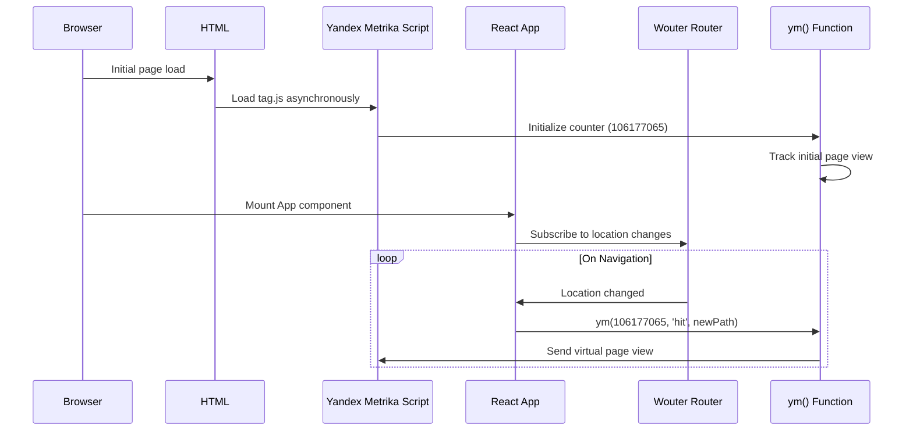

# Yandex Metrika Analytics Integration

## Objective

Integrate Yandex Metrika counter (ID: 106177065) into the Reader.market application to track page views, user navigation, and collect behavioral analytics across all pages of the Single Page Application.

## Background

The application is a React-based Single Page Application using:
- Wouter for client-side routing
- Express.js backend with SSR capability in production
- Vite for development and build tooling
- Server-side rendering requirement for the landing page

Yandex Metrika needs to be integrated with SSR support enabled, WebVisor for session replay, clickmap tracking, accurate bounce tracking, and link tracking capabilities.

## System Context

### Current Architecture
- **Frontend**: React SPA with Wouter-based routing, multiple pages including landing, library, reader, profiles, messaging, and admin sections
- **Backend**: Express.js server handling API routes and serving static assets in production
- **Entry Points**: 
  - HTML template at `client/index.html`
  - React root component at `client/src/App.tsx`
  - Main entry at `client/src/main.tsx`

### Routing Behavior
The application uses client-side routing via Wouter, meaning URL changes do not trigger full page reloads. Route transitions happen within the SPA, requiring explicit page view tracking when location changes.

## Requirements

### Functional Requirements

1. **Counter Initialization**
   - Load Yandex Metrika script asynchronously without blocking page render
   - Initialize counter with ID 106177065 and configuration flags: SSR support, WebVisor, clickmap, ecommerce dataLayer, accurate bounce tracking, and link tracking

2. **Page View Tracking**
   - Track initial page load as first page view
   - Track subsequent navigation within SPA as virtual page views
   - Ensure each route change triggers a hit to Yandex Metrika

3. **No-JavaScript Fallback**
   - Provide noscript image pixel for browsers without JavaScript support

4. **Environment Awareness**
   - Function correctly in both development (Vite dev server) and production (SSR with Express)

### Non-Functional Requirements

1. **Performance**
   - Script must load asynchronously to avoid blocking page render
   - Minimal impact on initial page load time

2. **Reliability**
   - Handle cases where Metrika script fails to load gracefully
   - Prevent duplicate page view tracking on route changes

3. **Maintainability**
   - Configuration should be easily updatable (counter ID, feature flags)
   - Clear separation between script loading and page view tracking logic

## Design Approach

### Integration Strategy

The integration will be split into two complementary components:

1. **Static Script Injection**: Place the base Yandex Metrika counter code in the HTML template to ensure it loads on initial page access
2. **Dynamic Page View Tracking**: Add React hook to monitor route changes and send virtual page views

### Component Overview

| Component | Location | Purpose |
|-----------|----------|---------|
| Base Counter Script | `client/index.html` | Load and initialize Yandex Metrika library with configuration |
| Route Change Tracker | `client/src/App.tsx` | Monitor route changes and trigger virtual page view hits |
| Noscript Fallback | `client/index.html` | Tracking pixel for non-JS environments |

### Integration Points

#### HTML Template Modification

The base counter script will be inserted into `client/index.html` within the `<head>` section to:
- Define the global `ym` function queue
- Load the Metrika tag script asynchronously
- Initialize the counter with required configuration parameters
- Provide noscript fallback image in `<body>`

**Configuration Parameters:**
- `ssr: true` - Indicates server-side rendering support
- `webvisor: true` - Enables session replay recordings
- `clickmap: true` - Tracks click heatmaps
- `ecommerce: "dataLayer"` - Links ecommerce events to dataLayer
- `accurateTrackBounce: true` - More accurate bounce rate calculation
- `trackLinks: true` - Automatic outbound link tracking

#### React Application Modification

Within the main App component (`client/src/App.tsx`), introduce a navigation tracking mechanism:
- Use Wouter's `useLocation` hook to observe current route
- Create a React effect that triggers on location changes
- Call Yandex Metrika hit method with updated virtual URL

**Tracking Logic:**
- On component mount: Counter already initialized via HTML script, first page view recorded automatically
- On route change: Send virtual page view hit with new path
- Gracefully handle cases where `ym` function is not available

### Data Flow

### Error Handling

The implementation should handle the following error scenarios:

| Scenario | Handling Strategy |
|----------|-------------------|
| Metrika script fails to load | Check for `window.ym` existence before calling; silently skip if unavailable |
| Multiple rapid route changes | Effect cleanup or debouncing not required; Metrika handles multiple hits naturally |
| Browser blocks third-party scripts | Graceful degradation; application continues functioning without analytics |

## Implementation Scope

### Files to Modify

1. **client/index.html**
   - Add Yandex Metrika counter script in `<head>` section
   - Add noscript fallback image in `<body>` section

2. **client/src/App.tsx**
   - Import `useLocation` from wouter (already imported)
   - Add `useEffect` hook to track route changes
   - Call `window.ym` function with hit method on location change

### Type Safety Considerations

Since `window.ym` is a third-party global function, TypeScript may not recognize it. The implementation should:
- Use type assertion or optional chaining when accessing `window.ym`
- Check for existence before invocation to avoid runtime errors

### Testing Considerations

Verification should confirm:
- Initial page load registers in Yandex Metrika dashboard
- Navigation between routes (e.g., home → book detail → reader) registers as separate page views
- No duplicate page views on same route
- Noscript pixel fires when JavaScript is disabled
- No console errors when Metrika script is blocked

## Constraints and Assumptions

### Constraints
- Must not modify any backend server files
- Must not introduce new dependencies to package.json
- Must work in both development and production environments
- Must not block or delay page rendering

### Assumptions
- The provided counter ID (106177065) is valid and active
- Yandex Metrika service is accessible from target user regions
- SSR configuration is correctly aligned with production deployment setup
- Application uses standard Wouter routing without hash-based navigation

## Future Considerations

While out of scope for this integration, future enhancements could include:
- Custom event tracking for specific user actions (book opens, chapter completions)
- User identification for authenticated sessions
- Goal tracking for conversion metrics
- Ecommerce event implementation if monetization features are added

## Security and Privacy

- Yandex Metrika script is loaded from official Yandex CDN
- No personally identifiable information is explicitly sent beyond standard browser metadata
- WebVisor session recording should comply with privacy policy disclosures
- Consider GDPR compliance if targeting EU users
