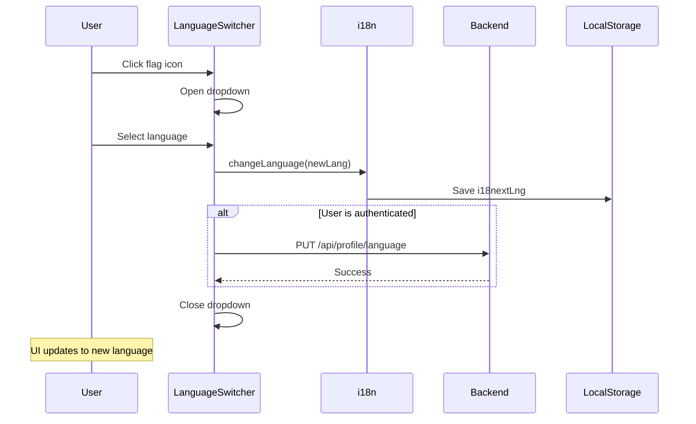

# Language Switcher in Header Menu

## Overview

Add a language switcher component to the main header navigation menu, positioned after the Profile menu item. The switcher displays as a flag icon representing the current language, and when clicked, opens a dropdown menu with available languages showing their flags and names.

## Objective

Enable users to quickly switch the interface language from the header without navigating to the profile settings page.

## Current State Analysis

| Aspect | Current Implementation |
|--------|----------------------|
| Language Selection | Available only in Profile page via radio buttons |
| Available Languages | English (en), Russian (ru) - defined in i18n.ts |
| i18n Library | i18next with react-i18next |
| Language Storage | localStorage (i18nextLng) + backend user preference |
| Navigation Components | Navbar.tsx (desktop), MobileMenu.tsx (mobile) |

## Design

### Component Location

| View | Location | Description |
|------|----------|-------------|
| Desktop | Navbar.tsx | After Profile link, rightmost position |
| Mobile | MobileMenu.tsx | After Profile item in the menu list |

### UI Structure

**Trigger Button**:
- Display: Flag icon/emoji of the currently active language
- Size: Consistent with other navigation icons (w-4 h-4 or w-5 h-5)
- Behavior: Clickable, opens dropdown on click

**Dropdown Content**:
- List of available languages
- Each item displays: Flag icon/emoji + Language name
- Visual indication of currently selected language (checkmark or highlight)
- Smooth open/close animations (consistent with existing dropdowns)

### Language Configuration

| Code | Flag | English Name | Native Name |
|------|------|--------------|-------------|
| en | Flag icon (US/UK) | English | English |
| ru | Flag icon (Russia) | Russian | Русский |

### Flag Representation Options

Option A: Emoji flags (recommended for simplicity)
- English: "🇺🇸" or "🇬🇧"
- Russian: "🇷🇺"

Option B: SVG/Image flags from a library or custom assets

### Behavioral Flow

### Integration Points

| Integration | Details |
|-------------|---------|
| i18n | Use existing i18n.changeLanguage() method |
| Auth Context | Check if user is authenticated for backend sync |
| API Endpoint | Reuse existing PUT /api/profile/language |
| UI Components | Use existing DropdownMenu from @/components/ui/dropdown-menu |

### Desktop Navigation Menu Order

1. Home
2. Search
3. Shelves
4. About Project
5. Messages
6. Profile
7. **Language Switcher** (new)

### Mobile Menu Considerations

- Add language switcher at the bottom of the menu list after Profile
- Use same flag + language name display format
- Close menu sheet after language selection

## Files to Modify

| File | Change Type | Description |
|------|-------------|-------------|
| client/src/components/Navbar.tsx | Modify | Add LanguageSwitcher after Profile link |
| client/src/components/MobileMenu.tsx | Modify | Add language switching options after Profile |
| client/src/locales/en/navigation.json | Modify | Add translation keys for language names |
| client/src/locales/ru/navigation.json | Modify | Add translation keys for language names |

## New Component (Optional)

Consider creating a reusable LanguageSwitcher component if the logic is complex, or implement inline within Navbar/MobileMenu if simpler.

## Accessibility

- Dropdown should be keyboard navigable
- Proper ARIA labels for the language switcher button
- Screen reader friendly language names

## Out of Scope

- Adding new languages beyond en/ru
- Language auto-detection based on browser settings (already implemented in i18n.ts)
- Removing the language selection from Profile page (it should remain as an alternative)
