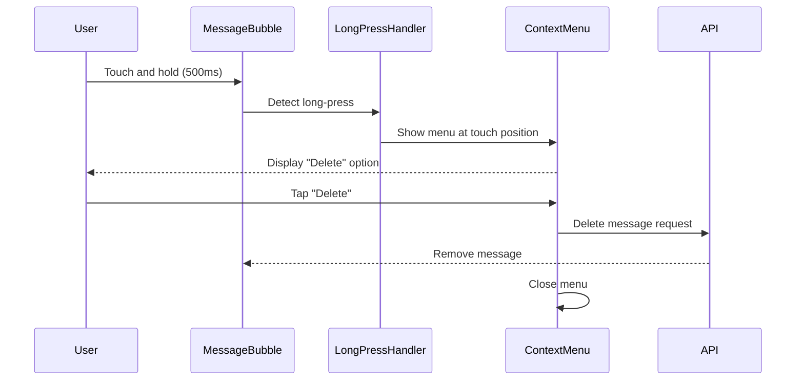
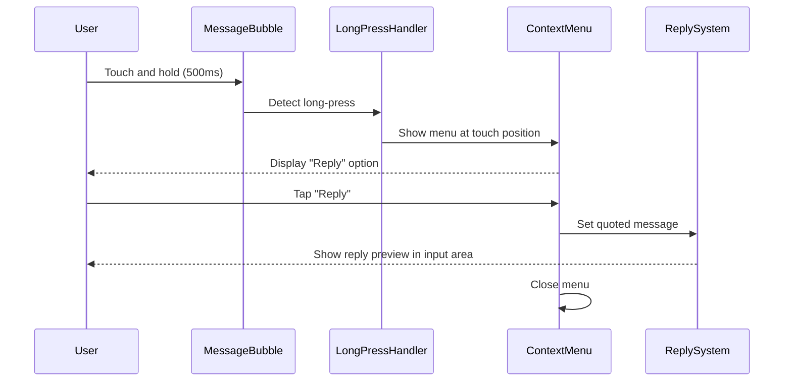
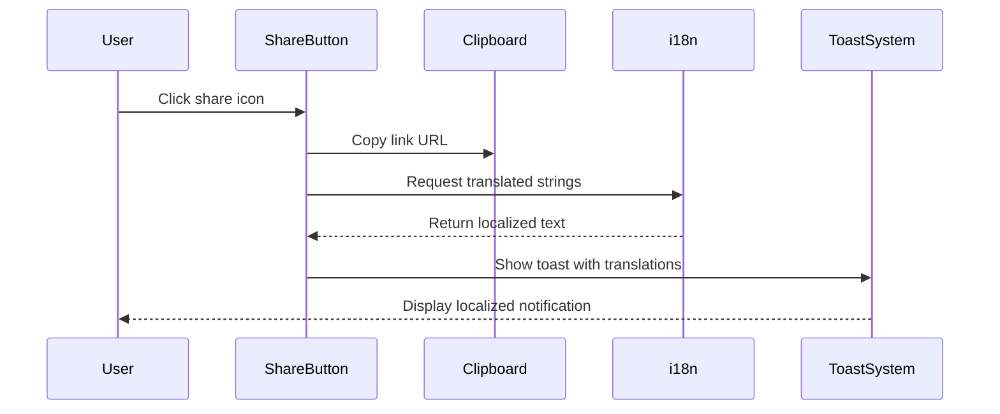
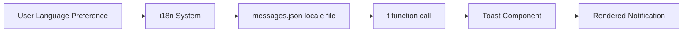
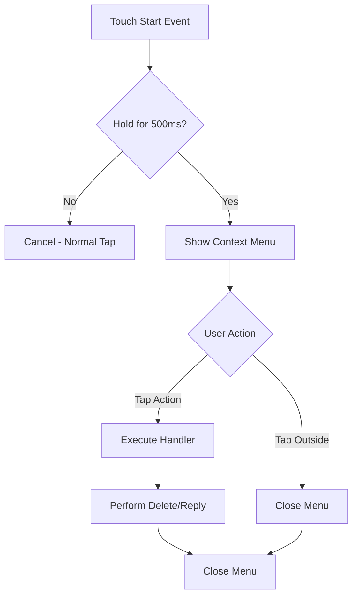

# Russian Message Translation and Mobile Message Actions

## Overview

This design addresses two localization and user experience improvements in the messaging feature:

1. **Missing Russian translations** for clipboard copy notifications when sharing conversation/group links
2. **Mobile message interaction improvements** by replacing always-visible delete buttons with a long-press context menu for both delete and reply actions

## Problem Statement

### Issue 1: Untranslated Clipboard Notifications

Currently, when users copy a conversation or group chat link to the clipboard, the toast notification appears in English regardless of the user's language preference:
- "Link copied!" (title)
- "Conversation link copied to clipboard" (description)
- "Group link copied to clipboard" (description)

These messages are hardcoded in the Messages.tsx component and bypass the i18n system, creating an inconsistent user experience for Russian-speaking users.

### Issue 2: Suboptimal Mobile Message Actions

The current implementation displays delete (X) buttons on the user's own messages and reply buttons on other users' messages with `opacity-100` on mobile devices. While this ensures visibility on touch devices without hover states, it creates visual clutter and reduces the clean aesthetic of the messaging interface.

**Current behavior:**
- Delete button (X icon) always visible on own messages
- Reply button always visible on other users' messages
- No differentiated interaction pattern for mobile vs desktop

**Desired behavior:**
- Clean message interface on mobile without persistent action buttons
- Long-press gesture on own messages reveals context menu with "Delete" option
- Long-press gesture on other users' messages reveals context menu with "Reply" option
- Maintain hover-based interaction on desktop

## Strategic Goals

1. **Complete Localization**: Ensure all user-facing text respects the user's language preference
2. **Improved Mobile UX**: Provide a cleaner, more intuitive interaction model for touch devices
3. **Consistency**: Align mobile messaging interactions with common mobile application patterns
4. **Accessibility**: Maintain clear affordances for message actions without visual clutter

## Design Solution

### Solution 1: Localize Clipboard Copy Notifications

#### Approach

Integrate the hardcoded English toast messages into the existing i18n translation system by:
1. Adding translation keys to both English and Russian message locale files
2. Replacing hardcoded strings with i18n function calls using the translation keys
3. Ensuring consistent naming conventions with existing message translations

#### Translation Keys

Add the following keys to the messages locale files:

| Key | English Value | Russian Value |
|-----|--------------|---------------|
| `linkCopied` | Link copied! | Ссылка скопирована! |
| `conversationLinkCopied` | Conversation link copied to clipboard | Ссылка на диалог скопирована в буфер обмена |
| `groupLinkCopied` | Group link copied to clipboard | Ссылка на группу скопирована в буфер обмена |

#### Implementation Location

**File**: `client/src/pages/Messages.tsx`

**Affected Code Sections**:
1. Private conversation share button (lines 1535-1542)
2. Group chat share button (lines 1748-1755)

**Current Pattern**:
```
toast({
  title: "Link copied!",
  description: "Conversation link copied to clipboard"
});
```

**Target Pattern**:
```
toast({
  title: t('messages:linkCopied'),
  description: t('messages:conversationLinkCopied')
});
```

### Solution 2: Mobile Long-Press Context Menu for Message Actions

#### Interaction Design

Implement a touch-friendly context menu system that activates on long-press gestures for message bubbles:

**For Own Messages (Delete Action)**:
- User performs long-press (touch and hold ~500ms) on their own message bubble
- Context menu appears with "Delete" option
- Tapping "Delete" triggers existing message deletion logic
- Clicking outside menu dismisses it

**For Other Users' Messages (Reply Action)**:
- User performs long-press on another user's message bubble
- Context menu appears with "Reply" option
- Tapping "Reply" triggers existing reply/quote logic
- Clicking outside menu dismisses it

**Desktop Behavior Preservation**:
- Hover-based button display remains unchanged on desktop viewports (≥640px)
- Long-press functionality is mobile-only (disabled on desktop)

#### Context Menu Component Design

**Visual Specifications**:
- Small, lightweight overlay positioned near the touch point
- Single-item menu for primary action (Delete or Reply)
- Follows application's existing design system (border, shadow, background)
- Appears with subtle animation (fade-in + scale)
- Auto-dismisses on selection or outside tap

**Positioning Logic**:
- Calculate menu position relative to message bubble
- For own messages (right-aligned): position menu to the left of bubble
- For other messages (left-aligned): position menu to the right of bubble
- Adjust vertical position to avoid viewport overflow

#### Component Structure

**New Component**: `MessageContextMenu`

**Props**:
| Prop | Type | Description |
|------|------|-------------|
| `isOpen` | boolean | Controls menu visibility |
| `onClose` | function | Callback when menu closes |
| `position` | {x: number, y: number} | Pixel coordinates for menu placement |
| `actions` | Action[] | Array of menu action items |

**Action Item Interface**:
| Property | Type | Description |
|----------|------|-------------|
| `label` | string | Localized action text |
| `icon` | ReactNode | Optional icon component |
| `onClick` | function | Action handler |
| `variant` | 'default' \| 'destructive' | Visual style |

#### Long-Press Detection Logic

**Trigger Conditions**:
- Touch event initiated on message bubble
- Touch maintained for minimum duration (500ms threshold)
- Touch position remains within tolerance radius (10px)
- No scroll or drag gesture detected

**Event Flow**:
1. User touches message bubble → start timer + record position
2. Timer reaches 500ms threshold → trigger haptic feedback (if available) + show context menu
3. User lifts finger before 500ms → cancel timer, no action
4. User moves finger beyond tolerance → cancel timer (interpret as scroll)

#### Mobile Button Removal Strategy

Remove the always-visible action buttons on mobile viewports:

**Current Classes**:
```
opacity-100 sm:opacity-0 sm:group-hover:opacity-100 ... bg-background/80 sm:bg-transparent
```

**Target Classes**:
```
hidden sm:block sm:opacity-0 sm:group-hover:opacity-100 ... sm:bg-transparent
```

**Rationale**: 
- `hidden` removes buttons from mobile view entirely
- `sm:block` restores them on desktop
- Preserves existing hover behavior on desktop
- Eliminates visual clutter on mobile

#### Translation Integration

Add context menu action labels to locale files:

| Key | English Value | Russian Value |
|-----|--------------|---------------|
| `deleteMessageAction` | Delete | Удалить |
| `replyToMessage` | Reply | Ответить |

## User Flow Diagrams

### Flow 1: Long-Press to Delete Own Message (Mobile)



### Flow 2: Long-Press to Reply to Other's Message (Mobile)



### Flow 3: Share Link with Localized Notification



## Component Architecture

### Modified Components

#### Messages.tsx

**Changes Required**:
1. Import translation function for new keys
2. Replace hardcoded toast strings with i18n calls (2 locations)
3. Add long-press event handlers to message bubbles
4. Manage context menu state (open/closed, position, target message)
5. Update button visibility classes for mobile
6. Import and integrate MessageContextMenu component

**State Additions**:
| State Variable | Type | Purpose |
|----------------|------|---------|
| `contextMenuOpen` | boolean | Controls menu visibility |
| `contextMenuPosition` | {x: number, y: number} \| null | Menu coordinates |
| `contextMenuTarget` | Message \| null | Message associated with menu |
| `longPressTimer` | NodeJS.Timeout \| null | Timer for long-press detection |

### New Components

#### MessageContextMenu

**Purpose**: Render touch-activated context menu for message actions

**Responsibilities**:
- Display action items in overlay menu
- Handle positioning and viewport constraints
- Provide dismiss functionality (outside click, action selection)
- Apply appropriate styling and animations

**Rendering Logic**:
- Conditionally render based on `isOpen` prop
- Position using absolute/fixed positioning
- Include backdrop overlay for dismiss interaction
- Map action items to clickable menu entries

## Data Flow

### Translation Data Flow



### Long-Press Interaction Data Flow



## Implementation Considerations

### Viewport Detection Strategy

Use existing responsive breakpoint system (Tailwind's `sm:` prefix = 640px) to differentiate mobile and desktop experiences:
- Mobile: `< 640px` - long-press context menu enabled
- Desktop: `≥ 640px` - hover-based buttons enabled

### Performance Optimization

**Long-Press Timer Management**:
- Clear timers on unmount to prevent memory leaks
- Cancel timers on scroll events to avoid false triggers
- Debounce position calculations for performance

**Context Menu Rendering**:
- Use conditional rendering to avoid DOM overhead when closed
- Implement lightweight component with minimal re-renders
- Apply CSS transitions for smooth animations

### Accessibility Considerations

**Desktop Accessibility**:
- Maintain keyboard navigation for message actions
- Preserve focus states and ARIA attributes
- Ensure screen reader compatibility

**Mobile Accessibility**:
- Provide haptic feedback on long-press trigger (vibration API)
- Ensure context menu touch targets meet minimum size (44x44px)
- Support VoiceOver/TalkBack for menu actions

### Edge Cases

| Scenario | Handling Strategy |
|----------|-------------------|
| Long-press while scrolling | Cancel long-press timer if touch position moves beyond 10px |
| Context menu overflow viewport | Calculate alternative position (flip to opposite side) |
| Rapid successive long-presses | Close previous menu before opening new one |
| Long-press on quoted message | Target the entire message bubble, not quoted section |
| Long-press on message with attachments | Ensure touch target covers entire message area including media |
| Device doesn't support touch | Gracefully degrade to desktop hover behavior |

### Backward Compatibility

**Existing Functionality Preservation**:
- Desktop hover interactions remain unchanged
- Existing delete and reply logic unchanged (same handlers)
- No changes to message rendering or data structure
- No breaking changes to messaging API

**Graceful Degradation**:
- Browsers without touch event support fall back to desktop mode
- Long-press functionality automatically disabled on non-touch devices

## Testing Strategy

### Localization Testing

**Test Cases**:
1. Verify English toast appears for users with English language preference
2. Verify Russian toast appears for users with Russian language preference
3. Test conversation link copy notification translation
4. Test group link copy notification translation
5. Confirm translation keys exist in both locale files

### Mobile Interaction Testing

**Touch Gesture Tests**:
1. Long-press on own message displays "Delete" context menu
2. Long-press on other's message displays "Reply" context menu
3. Quick tap (< 500ms) does not trigger context menu
4. Scrolling cancels long-press timer
5. Dragging finger beyond tolerance cancels long-press

**Context Menu Behavior Tests**:
1. Tapping "Delete" removes message successfully
2. Tapping "Reply" populates quote in input area
3. Tapping outside menu closes it without action
4. Menu positions correctly for left/right aligned messages
5. Menu adjusts position when near viewport edge

**Responsive Behavior Tests**:
1. Action buttons hidden on mobile viewport (< 640px)
2. Long-press functionality works on mobile
3. Action buttons visible on hover at desktop viewport (≥ 640px)
4. Long-press disabled on desktop viewport
5. Smooth transition when resizing viewport across breakpoint

### Cross-Platform Testing

**Target Devices**:
- iOS Safari (iPhone)
- Android Chrome (Android device)
- Desktop Chrome (simulated touch device)
- Desktop Firefox (hover mode)
- Desktop Safari (hover mode)

## Success Metrics

### Functional Completeness

- [ ] All toast notifications respect user language preference
- [ ] Long-press triggers context menu on mobile devices
- [ ] Context menu actions execute correctly
- [ ] Desktop hover behavior preserved
- [ ] No visual regression in message layout

### User Experience Quality

- [ ] Context menu appears within 500ms of long-press
- [ ] Menu positioning never causes overflow or clipping
- [ ] Touch targets meet accessibility guidelines
- [ ] Smooth animations and transitions
- [ ] Consistent with mobile platform conventions

### Localization Quality

- [ ] All new text uses i18n system
- [ ] Russian translations reviewed by native speaker
- [ ] Translation keys follow existing naming convention
- [ ] No hardcoded strings remain in code

## Risk Assessment

| Risk | Impact | Likelihood | Mitigation |
|------|--------|------------|------------|
| Long-press conflicts with native browser behavior | High | Medium | Use `preventDefault()` on touch events; test across browsers |
| Context menu positioning fails on edge cases | Medium | Medium | Implement robust positioning algorithm with fallbacks |
| Users don't discover long-press feature | Medium | High | Consider brief tutorial tooltip on first message interaction |
| Performance issues with touch event handlers | Low | Low | Debounce calculations; use passive event listeners |
| Translation quality concerns | Low | Low | Native speaker review before deployment |

## Future Enhancements

### Potential Expansions

1. **Multi-Action Context Menu**: Add more options (Copy, Forward, React) to context menu for power users
2. **Customizable Long-Press Duration**: Allow users to adjust sensitivity in settings
3. **Context Menu for All Messages**: Provide consistent menu for both own and others' messages with appropriate actions
4. **Desktop Right-Click Menu**: Extend context menu functionality to desktop with right-click trigger
5. **Gesture Library Integration**: Use established gesture recognition library for more sophisticated interactions
6. **Onboarding Tutorial**: Add first-time user guidance for long-press functionality

### Compatibility Notes

This design maintains compatibility with:
- Existing message deletion permissions (own messages, moderator/admin in groups)
- Current reply/quote message system
- Attachment handling in messages
- Real-time message updates via WebSocket
- Message scrolling and pagination logic
**Current behavior:**
- Delete button (X icon) always visible on own messages
- Reply button always visible on other users' messages
- No differentiated interaction pattern for mobile vs desktop

**Desired behavior:**
- Clean message interface on mobile without persistent action buttons
- Long-press gesture on own messages reveals context menu with "Delete" option
- Long-press gesture on other users' messages reveals context menu with "Reply" option
- Maintain hover-based interaction on desktop

## Strategic Goals

1. **Complete Localization**: Ensure all user-facing text respects the user's language preference
2. **Improved Mobile UX**: Provide a cleaner, more intuitive interaction model for touch devices
3. **Consistency**: Align mobile messaging interactions with common mobile application patterns
4. **Accessibility**: Maintain clear affordances for message actions without visual clutter

## Design Solution

### Solution 1: Localize Clipboard Copy Notifications

#### Approach

Integrate the hardcoded English toast messages into the existing i18n translation system by:
1. Adding translation keys to both English and Russian message locale files
2. Replacing hardcoded strings with i18n function calls using the translation keys
3. Ensuring consistent naming conventions with existing message translations

#### Translation Keys

Add the following keys to the messages locale files:

| Key | English Value | Russian Value |
|-----|--------------|---------------|
| `linkCopied` | Link copied! | Ссылка скопирована! |
| `conversationLinkCopied` | Conversation link copied to clipboard | Ссылка на диалог скопирована в буфер обмена |
| `groupLinkCopied` | Group link copied to clipboard | Ссылка на группу скопирована в буфер обмена |

#### Implementation Location

**File**: `client/src/pages/Messages.tsx`

**Affected Code Sections**:
1. Private conversation share button (lines 1535-1542)
2. Group chat share button (lines 1748-1755)

**Current Pattern**:
```
toast({
  title: "Link copied!",
  description: "Conversation link copied to clipboard"
});
```

**Target Pattern**:
```
toast({
  title: t('messages:linkCopied'),
  description: t('messages:conversationLinkCopied')
});
```

### Solution 2: Mobile Long-Press Context Menu for Message Actions

#### Interaction Design

Implement a touch-friendly context menu system that activates on long-press gestures for message bubbles:

**For Own Messages (Delete Action)**:
- User performs long-press (touch and hold ~500ms) on their own message bubble
- Context menu appears with "Delete" option
- Tapping "Delete" triggers existing message deletion logic
- Clicking outside menu dismisses it

**For Other Users' Messages (Reply Action)**:
- User performs long-press on another user's message bubble
- Context menu appears with "Reply" option
- Tapping "Reply" triggers existing reply/quote logic
- Clicking outside menu dismisses it

**Desktop Behavior Preservation**:
- Hover-based button display remains unchanged on desktop viewports (≥640px)
- Long-press functionality is mobile-only (disabled on desktop)

#### Context Menu Component Design

**Visual Specifications**:
- Small, lightweight overlay positioned near the touch point
- Single-item menu for primary action (Delete or Reply)
- Follows application's existing design system (border, shadow, background)
- Appears with subtle animation (fade-in + scale)
- Auto-dismisses on selection or outside tap

**Positioning Logic**:
- Calculate menu position relative to message bubble
- For own messages (right-aligned): position menu to the left of bubble
- For other messages (left-aligned): position menu to the right of bubble
- Adjust vertical position to avoid viewport overflow

#### Component Structure

**New Component**: `MessageContextMenu`

**Props**:
| Prop | Type | Description |
|------|------|-------------|
| `isOpen` | boolean | Controls menu visibility |
| `onClose` | function | Callback when menu closes |
| `position` | {x: number, y: number} | Pixel coordinates for menu placement |
| `actions` | Action[] | Array of menu action items |

**Action Item Interface**:
| Property | Type | Description |
|----------|------|-------------|
| `label` | string | Localized action text |
| `icon` | ReactNode | Optional icon component |
| `onClick` | function | Action handler |
| `variant` | 'default' \| 'destructive' | Visual style |

#### Long-Press Detection Logic

**Trigger Conditions**:
- Touch event initiated on message bubble
- Touch maintained for minimum duration (500ms threshold)
- Touch position remains within tolerance radius (10px)
- No scroll or drag gesture detected

**Event Flow**:
1. User touches message bubble → start timer + record position
2. Timer reaches 500ms threshold → trigger haptic feedback (if available) + show context menu
3. User lifts finger before 500ms → cancel timer, no action
4. User moves finger beyond tolerance → cancel timer (interpret as scroll)

#### Mobile Button Removal Strategy

Remove the always-visible action buttons on mobile viewports:

**Current Classes**:
```
opacity-100 sm:opacity-0 sm:group-hover:opacity-100 ... bg-background/80 sm:bg-transparent
```

**Target Classes**:
```
hidden sm:block sm:opacity-0 sm:group-hover:opacity-100 ... sm:bg-transparent
```

**Rationale**: 
- `hidden` removes buttons from mobile view entirely
- `sm:block` restores them on desktop
- Preserves existing hover behavior on desktop
- Eliminates visual clutter on mobile

#### Translation Integration

Add context menu action labels to locale files:

| Key | English Value | Russian Value |
|-----|--------------|---------------|
| `deleteMessageAction` | Delete | Удалить |
| `replyToMessage` | Reply | Ответить |

## User Flow Diagrams

### Flow 1: Long-Press to Delete Own Message (Mobile)


### Flow 2: Long-Press to Reply to Other's Message (Mobile)


### Flow 3: Share Link with Localized Notification


## Component Architecture

### Modified Components

#### Messages.tsx

**Changes Required**:
1. Import translation function for new keys
2. Replace hardcoded toast strings with i18n calls (2 locations)
3. Add long-press event handlers to message bubbles
4. Manage context menu state (open/closed, position, target message)
5. Update button visibility classes for mobile
6. Import and integrate MessageContextMenu component

**State Additions**:
| State Variable | Type | Purpose |
|----------------|------|---------|
| `contextMenuOpen` | boolean | Controls menu visibility |
| `contextMenuPosition` | {x: number, y: number} \| null | Menu coordinates |
| `contextMenuTarget` | Message \| null | Message associated with menu |
| `longPressTimer` | NodeJS.Timeout \| null | Timer for long-press detection |

### New Components

#### MessageContextMenu

**Purpose**: Render touch-activated context menu for message actions

**Responsibilities**:
- Display action items in overlay menu
- Handle positioning and viewport constraints
- Provide dismiss functionality (outside click, action selection)
- Apply appropriate styling and animations

**Rendering Logic**:
- Conditionally render based on `isOpen` prop
- Position using absolute/fixed positioning
- Include backdrop overlay for dismiss interaction
- Map action items to clickable menu entries

## Data Flow

### Translation Data Flow


### Long-Press Interaction Data Flow


## Implementation Considerations

### Viewport Detection Strategy

Use existing responsive breakpoint system (Tailwind's `sm:` prefix = 640px) to differentiate mobile and desktop experiences:
- Mobile: `< 640px` - long-press context menu enabled
- Desktop: `≥ 640px` - hover-based buttons enabled

### Performance Optimization

**Long-Press Timer Management**:
- Clear timers on unmount to prevent memory leaks
- Cancel timers on scroll events to avoid false triggers
- Debounce position calculations for performance

**Context Menu Rendering**:
- Use conditional rendering to avoid DOM overhead when closed
- Implement lightweight component with minimal re-renders
- Apply CSS transitions for smooth animations

### Accessibility Considerations

**Desktop Accessibility**:
- Maintain keyboard navigation for message actions
- Preserve focus states and ARIA attributes
- Ensure screen reader compatibility

**Mobile Accessibility**:
- Provide haptic feedback on long-press trigger (vibration API)
- Ensure context menu touch targets meet minimum size (44x44px)
- Support VoiceOver/TalkBack for menu actions

### Edge Cases

| Scenario | Handling Strategy |
|----------|-------------------|
| Long-press while scrolling | Cancel long-press timer if touch position moves beyond 10px |
| Context menu overflow viewport | Calculate alternative position (flip to opposite side) |
| Rapid successive long-presses | Close previous menu before opening new one |
| Long-press on quoted message | Target the entire message bubble, not quoted section |
| Long-press on message with attachments | Ensure touch target covers entire message area including media |
| Device doesn't support touch | Gracefully degrade to desktop hover behavior |

### Backward Compatibility

**Existing Functionality Preservation**:
- Desktop hover interactions remain unchanged
- Existing delete and reply logic unchanged (same handlers)
- No changes to message rendering or data structure
- No breaking changes to messaging API

**Graceful Degradation**:
- Browsers without touch event support fall back to desktop mode
- Long-press functionality automatically disabled on non-touch devices

## Testing Strategy

### Localization Testing

**Test Cases**:
1. Verify English toast appears for users with English language preference
2. Verify Russian toast appears for users with Russian language preference
3. Test conversation link copy notification translation
4. Test group link copy notification translation
5. Confirm translation keys exist in both locale files

### Mobile Interaction Testing

**Touch Gesture Tests**:
1. Long-press on own message displays "Delete" context menu
2. Long-press on other's message displays "Reply" context menu
3. Quick tap (< 500ms) does not trigger context menu
4. Scrolling cancels long-press timer
5. Dragging finger beyond tolerance cancels long-press

**Context Menu Behavior Tests**:
1. Tapping "Delete" removes message successfully
2. Tapping "Reply" populates quote in input area
3. Tapping outside menu closes it without action
4. Menu positions correctly for left/right aligned messages
5. Menu adjusts position when near viewport edge

**Responsive Behavior Tests**:
1. Action buttons hidden on mobile viewport (< 640px)
2. Long-press functionality works on mobile
3. Action buttons visible on hover at desktop viewport (≥ 640px)
4. Long-press disabled on desktop viewport
5. Smooth transition when resizing viewport across breakpoint

### Cross-Platform Testing

**Target Devices**:
- iOS Safari (iPhone)
- Android Chrome (Android device)
- Desktop Chrome (simulated touch device)
- Desktop Firefox (hover mode)
- Desktop Safari (hover mode)

## Success Metrics

### Functional Completeness

- [ ] All toast notifications respect user language preference
- [ ] Long-press triggers context menu on mobile devices
- [ ] Context menu actions execute correctly
- [ ] Desktop hover behavior preserved
- [ ] No visual regression in message layout

### User Experience Quality

- [ ] Context menu appears within 500ms of long-press
- [ ] Menu positioning never causes overflow or clipping
- [ ] Touch targets meet accessibility guidelines
- [ ] Smooth animations and transitions
- [ ] Consistent with mobile platform conventions

### Localization Quality

- [ ] All new text uses i18n system
- [ ] Russian translations reviewed by native speaker
- [ ] Translation keys follow existing naming convention
- [ ] No hardcoded strings remain in code

## Risk Assessment

| Risk | Impact | Likelihood | Mitigation |
|------|--------|------------|------------|
| Long-press conflicts with native browser behavior | High | Medium | Use `preventDefault()` on touch events; test across browsers |
| Context menu positioning fails on edge cases | Medium | Medium | Implement robust positioning algorithm with fallbacks |
| Users don't discover long-press feature | Medium | High | Consider brief tutorial tooltip on first message interaction |
| Performance issues with touch event handlers | Low | Low | Debounce calculations; use passive event listeners |
| Translation quality concerns | Low | Low | Native speaker review before deployment |

## Future Enhancements

### Potential Expansions

1. **Multi-Action Context Menu**: Add more options (Copy, Forward, React) to context menu for power users
2. **Customizable Long-Press Duration**: Allow users to adjust sensitivity in settings
3. **Context Menu for All Messages**: Provide consistent menu for both own and others' messages with appropriate actions
4. **Desktop Right-Click Menu**: Extend context menu functionality to desktop with right-click trigger
5. **Gesture Library Integration**: Use established gesture recognition library for more sophisticated interactions
6. **Onboarding Tutorial**: Add first-time user guidance for long-press functionality

### Compatibility Notes

This design maintains compatibility with:
- Existing message deletion permissions (own messages, moderator/admin in groups)
- Current reply/quote message system
- Attachment handling in messages
- Real-time message updates via WebSocket
- Message scrolling and pagination logic

**Current behavior:**
- Delete button (X icon) always visible on own messages
- Reply button always visible on other users' messages
- No differentiated interaction pattern for mobile vs desktop

**Desired behavior:**
- Clean message interface on mobile without persistent action buttons
- Long-press gesture on own messages reveals context menu with "Delete" option
- Long-press gesture on other users' messages reveals context menu with "Reply" option
- Maintain hover-based interaction on desktop

## Strategic Goals

1. **Complete Localization**: Ensure all user-facing text respects the user's language preference
2. **Improved Mobile UX**: Provide a cleaner, more intuitive interaction model for touch devices
3. **Consistency**: Align mobile messaging interactions with common mobile application patterns
4. **Accessibility**: Maintain clear affordances for message actions without visual clutter

## Design Solution

### Solution 1: Localize Clipboard Copy Notifications

#### Approach

Integrate the hardcoded English toast messages into the existing i18n translation system by:
1. Adding translation keys to both English and Russian message locale files
2. Replacing hardcoded strings with i18n function calls using the translation keys
3. Ensuring consistent naming conventions with existing message translations

#### Translation Keys

Add the following keys to the messages locale files:

| Key | English Value | Russian Value |
|-----|--------------|---------------|
| `linkCopied` | Link copied! | Ссылка скопирована! |
| `conversationLinkCopied` | Conversation link copied to clipboard | Ссылка на диалог скопирована в буфер обмена |
| `groupLinkCopied` | Group link copied to clipboard | Ссылка на группу скопирована в буфер обмена |

#### Implementation Location

**File**: `client/src/pages/Messages.tsx`

**Affected Code Sections**:
1. Private conversation share button (lines 1535-1542)
2. Group chat share button (lines 1748-1755)

**Current Pattern**:
```
toast({
  title: "Link copied!",
  description: "Conversation link copied to clipboard"
});
```

**Target Pattern**:
```
toast({
  title: t('messages:linkCopied'),
  description: t('messages:conversationLinkCopied')
});
```

### Solution 2: Mobile Long-Press Context Menu for Message Actions

#### Interaction Design

Implement a touch-friendly context menu system that activates on long-press gestures for message bubbles:

**For Own Messages (Delete Action)**:
- User performs long-press (touch and hold ~500ms) on their own message bubble
- Context menu appears with "Delete" option
- Tapping "Delete" triggers existing message deletion logic
- Clicking outside menu dismisses it

**For Other Users' Messages (Reply Action)**:
- User performs long-press on another user's message bubble
- Context menu appears with "Reply" option
- Tapping "Reply" triggers existing reply/quote logic
- Clicking outside menu dismisses it

**Desktop Behavior Preservation**:
- Hover-based button display remains unchanged on desktop viewports (≥640px)
- Long-press functionality is mobile-only (disabled on desktop)

#### Context Menu Component Design

**Visual Specifications**:
- Small, lightweight overlay positioned near the touch point
- Single-item menu for primary action (Delete or Reply)
- Follows application's existing design system (border, shadow, background)
- Appears with subtle animation (fade-in + scale)
- Auto-dismisses on selection or outside tap

**Positioning Logic**:
- Calculate menu position relative to message bubble
- For own messages (right-aligned): position menu to the left of bubble
- For other messages (left-aligned): position menu to the right of bubble
- Adjust vertical position to avoid viewport overflow

#### Component Structure

**New Component**: `MessageContextMenu`

**Props**:
| Prop | Type | Description |
|------|------|-------------|
| `isOpen` | boolean | Controls menu visibility |
| `onClose` | function | Callback when menu closes |
| `position` | {x: number, y: number} | Pixel coordinates for menu placement |
| `actions` | Action[] | Array of menu action items |

**Action Item Interface**:
| Property | Type | Description |
|----------|------|-------------|
| `label` | string | Localized action text |
| `icon` | ReactNode | Optional icon component |
| `onClick` | function | Action handler |
| `variant` | 'default' \| 'destructive' | Visual style |

#### Long-Press Detection Logic

**Trigger Conditions**:
- Touch event initiated on message bubble
- Touch maintained for minimum duration (500ms threshold)
- Touch position remains within tolerance radius (10px)
- No scroll or drag gesture detected

**Event Flow**:
1. User touches message bubble → start timer + record position
2. Timer reaches 500ms threshold → trigger haptic feedback (if available) + show context menu
3. User lifts finger before 500ms → cancel timer, no action
4. User moves finger beyond tolerance → cancel timer (interpret as scroll)

#### Mobile Button Removal Strategy

Remove the always-visible action buttons on mobile viewports:

**Current Classes**:
```
opacity-100 sm:opacity-0 sm:group-hover:opacity-100 ... bg-background/80 sm:bg-transparent
```

**Target Classes**:
```
hidden sm:block sm:opacity-0 sm:group-hover:opacity-100 ... sm:bg-transparent
```

**Rationale**: 
- `hidden` removes buttons from mobile view entirely
- `sm:block` restores them on desktop
- Preserves existing hover behavior on desktop
- Eliminates visual clutter on mobile

#### Translation Integration

Add context menu action labels to locale files:

| Key | English Value | Russian Value |
|-----|--------------|---------------|
| `deleteMessageAction` | Delete | Удалить |
| `replyToMessage` | Reply | Ответить |

## User Flow Diagrams

### Flow 1: Long-Press to Delete Own Message (Mobile)


### Flow 2: Long-Press to Reply to Other's Message (Mobile)


### Flow 3: Share Link with Localized Notification


## Component Architecture

### Modified Components

#### Messages.tsx

**Changes Required**:
1. Import translation function for new keys
2. Replace hardcoded toast strings with i18n calls (2 locations)
3. Add long-press event handlers to message bubbles
4. Manage context menu state (open/closed, position, target message)
5. Update button visibility classes for mobile
6. Import and integrate MessageContextMenu component

**State Additions**:
| State Variable | Type | Purpose |
|----------------|------|---------|
| `contextMenuOpen` | boolean | Controls menu visibility |
| `contextMenuPosition` | {x: number, y: number} \| null | Menu coordinates |
| `contextMenuTarget` | Message \| null | Message associated with menu |
| `longPressTimer` | NodeJS.Timeout \| null | Timer for long-press detection |

### New Components

#### MessageContextMenu

**Purpose**: Render touch-activated context menu for message actions

**Responsibilities**:
- Display action items in overlay menu
- Handle positioning and viewport constraints
- Provide dismiss functionality (outside click, action selection)
- Apply appropriate styling and animations

**Rendering Logic**:
- Conditionally render based on `isOpen` prop
- Position using absolute/fixed positioning
- Include backdrop overlay for dismiss interaction
- Map action items to clickable menu entries

## Data Flow

### Translation Data Flow


### Long-Press Interaction Data Flow


## Implementation Considerations

### Viewport Detection Strategy

Use existing responsive breakpoint system (Tailwind's `sm:` prefix = 640px) to differentiate mobile and desktop experiences:
- Mobile: `< 640px` - long-press context menu enabled
- Desktop: `≥ 640px` - hover-based buttons enabled

### Performance Optimization

**Long-Press Timer Management**:
- Clear timers on unmount to prevent memory leaks
- Cancel timers on scroll events to avoid false triggers
- Debounce position calculations for performance

**Context Menu Rendering**:
- Use conditional rendering to avoid DOM overhead when closed
- Implement lightweight component with minimal re-renders
- Apply CSS transitions for smooth animations

### Accessibility Considerations

**Desktop Accessibility**:
- Maintain keyboard navigation for message actions
- Preserve focus states and ARIA attributes
- Ensure screen reader compatibility

**Mobile Accessibility**:
- Provide haptic feedback on long-press trigger (vibration API)
- Ensure context menu touch targets meet minimum size (44x44px)
- Support VoiceOver/TalkBack for menu actions

### Edge Cases

| Scenario | Handling Strategy |
|----------|-------------------|
| Long-press while scrolling | Cancel long-press timer if touch position moves beyond 10px |
| Context menu overflow viewport | Calculate alternative position (flip to opposite side) |
| Rapid successive long-presses | Close previous menu before opening new one |
| Long-press on quoted message | Target the entire message bubble, not quoted section |
| Long-press on message with attachments | Ensure touch target covers entire message area including media |
| Device doesn't support touch | Gracefully degrade to desktop hover behavior |

### Backward Compatibility

**Existing Functionality Preservation**:
- Desktop hover interactions remain unchanged
- Existing delete and reply logic unchanged (same handlers)
- No changes to message rendering or data structure
- No breaking changes to messaging API

**Graceful Degradation**:
- Browsers without touch event support fall back to desktop mode
- Long-press functionality automatically disabled on non-touch devices

## Testing Strategy

### Localization Testing

**Test Cases**:
1. Verify English toast appears for users with English language preference
2. Verify Russian toast appears for users with Russian language preference
3. Test conversation link copy notification translation
4. Test group link copy notification translation
5. Confirm translation keys exist in both locale files

### Mobile Interaction Testing

**Touch Gesture Tests**:
1. Long-press on own message displays "Delete" context menu
2. Long-press on other's message displays "Reply" context menu
3. Quick tap (< 500ms) does not trigger context menu
4. Scrolling cancels long-press timer
5. Dragging finger beyond tolerance cancels long-press

**Context Menu Behavior Tests**:
1. Tapping "Delete" removes message successfully
2. Tapping "Reply" populates quote in input area
3. Tapping outside menu closes it without action
4. Menu positions correctly for left/right aligned messages
5. Menu adjusts position when near viewport edge

**Responsive Behavior Tests**:
1. Action buttons hidden on mobile viewport (< 640px)
2. Long-press functionality works on mobile
3. Action buttons visible on hover at desktop viewport (≥ 640px)
4. Long-press disabled on desktop viewport
5. Smooth transition when resizing viewport across breakpoint

### Cross-Platform Testing

**Target Devices**:
- iOS Safari (iPhone)
- Android Chrome (Android device)
- Desktop Chrome (simulated touch device)
- Desktop Firefox (hover mode)
- Desktop Safari (hover mode)

## Success Metrics

### Functional Completeness

- [ ] All toast notifications respect user language preference
- [ ] Long-press triggers context menu on mobile devices
- [ ] Context menu actions execute correctly
- [ ] Desktop hover behavior preserved
- [ ] No visual regression in message layout

### User Experience Quality

- [ ] Context menu appears within 500ms of long-press
- [ ] Menu positioning never causes overflow or clipping
- [ ] Touch targets meet accessibility guidelines
- [ ] Smooth animations and transitions
- [ ] Consistent with mobile platform conventions

### Localization Quality

- [ ] All new text uses i18n system
- [ ] Russian translations reviewed by native speaker
- [ ] Translation keys follow existing naming convention
- [ ] No hardcoded strings remain in code

## Risk Assessment

| Risk | Impact | Likelihood | Mitigation |
|------|--------|------------|------------|
| Long-press conflicts with native browser behavior | High | Medium | Use `preventDefault()` on touch events; test across browsers |
| Context menu positioning fails on edge cases | Medium | Medium | Implement robust positioning algorithm with fallbacks |
| Users don't discover long-press feature | Medium | High | Consider brief tutorial tooltip on first message interaction |
| Performance issues with touch event handlers | Low | Low | Debounce calculations; use passive event listeners |
| Translation quality concerns | Low | Low | Native speaker review before deployment |

## Future Enhancements

### Potential Expansions

1. **Multi-Action Context Menu**: Add more options (Copy, Forward, React) to context menu for power users
2. **Customizable Long-Press Duration**: Allow users to adjust sensitivity in settings
3. **Context Menu for All Messages**: Provide consistent menu for both own and others' messages with appropriate actions
4. **Desktop Right-Click Menu**: Extend context menu functionality to desktop with right-click trigger
5. **Gesture Library Integration**: Use established gesture recognition library for more sophisticated interactions
6. **Onboarding Tutorial**: Add first-time user guidance for long-press functionality

### Compatibility Notes

This design maintains compatibility with:
- Existing message deletion permissions (own messages, moderator/admin in groups)
- Current reply/quote message system
- Attachment handling in messages
- Real-time message updates via WebSocket
- Message scrolling and pagination logic
