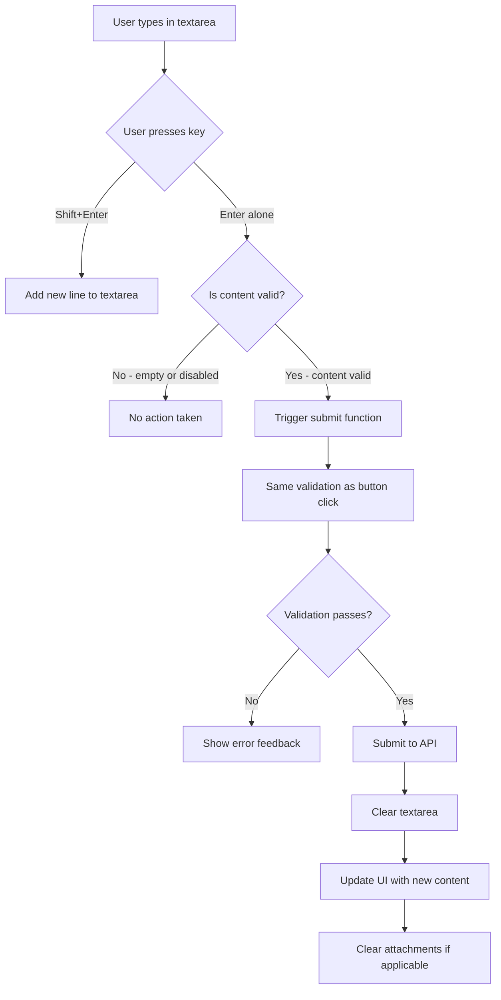

# Feature Design: Unified Keyboard Shortcuts for Text Input Submission

## Overview

Implement a unified keyboard shortcut pattern across all text input fields in the application:

- **Enter**: Submit content (send message, post comment, publish review)
- **Shift+Enter**: Create a new line (multi-line composition)

This standardized interaction pattern will be applied to:
- Book comments
- Book reviews
- News comments
- Private messages
- Group channel messages

All single-line input fields will be converted to multi-line textarea components to support better content composition.

## Affected Components

All components will use the same interaction pattern (Enter to submit, Shift+Enter for new line):

1. **Book Comments** - CommentsSection component (`client/src/components/CommentsSection.tsx`, line ~276-281)
2. **Book Reviews** - ReviewsSection component (`client/src/components/ReviewsSection.tsx`, line ~548-553)
3. **News Comments** - NewsDetailPage component (`client/src/pages/NewsDetailPage.tsx`, line ~453-458)
4. **Private Messages** - Messages page component (`client/src/pages/Messages.tsx`, line ~1628)
5. **Group Channel Messages** - Messages page component (`client/src/pages/Messages.tsx`, line ~1867)

## Functional Requirements

### Unified Keyboard Shortcut Behavior

All text input fields should implement the same keyboard interaction pattern:

- **Enter alone**: Submit content (same as clicking the submit/send button)
- **Shift+Enter**: Create a new line within the textarea
- Only function when the textarea is focused
- Respect the same disabled states as their respective submit buttons:
  - Empty content (after trimming whitespace)
  - User not authenticated (where applicable)
  - Pending file uploads (where applicable)
  - Already submitting/sending
- Prevent default form submission behavior on Enter
- Support multi-line content composition with Shift+Enter

### User Interaction Flow



## Technical Approach

### Unified Event Handler Implementation

All textarea components should implement a consistent `keydown` event handler that:

1. Detects Enter key press
2. Checks if Shift modifier is pressed:
   - **If Shift is pressed**: Allow default behavior (create new line)
   - **If Shift is NOT pressed**: Prevent default behavior and invoke submit function
3. Only triggers when the textarea is focused
4. Respects validation states before submission

### Validation Consistency

The keyboard shortcut must honor the same validation rules as their respective submit buttons:

- **Book Comments**: 
  - Content must not be empty (after trimming whitespace)
  - User must be authenticated
  - If attachments are present, all files must be uploaded before submission

- **Book Reviews**:
  - Content must not be empty (after trimming whitespace)
  - User must be authenticated
  - Rating must be valid (1-10)
  - If attachments are present, all files must be uploaded before submission

- **News Comments**:
  - Content must not be empty (after trimming whitespace)
  - User must be authenticated

- **Messages (Private and Group Channels)**:
  - Content must not be empty (after trimming whitespace)
  - Not currently in sending state
  - Recipient or channel must be selected

### Cross-Platform Compatibility

The Enter/Shift+Enter behavior is consistent across all platforms (Windows, Linux, macOS):
- **Enter**: Submit content
- **Shift+Enter**: Create new line

This is the standard pattern used in modern messaging and communication applications.

## Input Components to Modify

All components require the same modification pattern: add unified Enter/Shift+Enter keyboard handler.

### 1. CommentsSection (Book Comments)

**Location**: `client/src/components/CommentsSection.tsx`

**Current Implementation**:
- Component: `<Textarea>` (already multi-line)
- Location: Line ~276-281
- Submit function: `handlePostComment`
- Button disabled when: `!newComment.trim() || !user || (attachmentFiles.length > 0 && uploadedFiles.length !== attachmentFiles.length)`

**Changes Required**:
1. Add `onKeyDown` event handler
2. Detect Enter without Shift to submit
3. Allow Shift+Enter for new lines

### 2. ReviewsSection (Book Reviews)

**Location**: `client/src/components/ReviewsSection.tsx`

**Current Implementation**:
- Component: `<Textarea>` (already multi-line)
- Location: Line ~548-553
- Submit function: `handlePostReview`
- Button disabled when: `!newReviewContent.trim() || !user`

**Changes Required**:
1. Add `onKeyDown` event handler
2. Detect Enter without Shift to submit
3. Allow Shift+Enter for new lines

### 3. NewsDetailPage (News Comments)

**Location**: `client/src/pages/NewsDetailPage.tsx`

**Current Implementation**:
- Component: `<Textarea>` (already multi-line)
- Location: Line ~453-458
- Submit function: `handlePostComment`
- Button disabled when: `!newComment.trim()`

**Changes Required**:
1. Add `onKeyDown` event handler
2. Detect Enter without Shift to submit
3. Allow Shift+Enter for new lines

### 4. Messages Page (Private Messages)

**Location**: `client/src/pages/Messages.tsx`

**Current Implementation**:
- Component: `<Input>` (single-line)
- Location: Line ~1628
- Current handler: `handleKeyPress` (line 1166) - already implements Enter without Shift
- Submit function: `sendMessage`
- Button disabled when: `sending || !newMessage.trim()`

**Changes Required**:
1. Replace `<Input>` with `<Textarea>` component
2. Update event handler from `onKeyPress` to `onKeyDown` for consistency
3. Keep existing logic: Enter submits, Shift+Enter creates new line
4. Update styling to accommodate multi-line input

### 5. Messages Page (Group Channel Messages)

**Location**: `client/src/pages/Messages.tsx`

**Current Implementation**:
- Component: `<Input>` (single-line)
- Location: Line ~1867
- Current handler: `handleKeyPress` (shared with private messages)
- Submit function: `sendMessage`
- Button disabled when: `sending || !newMessage.trim()`

**Changes Required**:
1. Replace `<Input>` with `<Textarea>` component
2. Update event handler from `onKeyPress` to `onKeyDown` for consistency
3. Keep existing logic: Enter submits, Shift+Enter creates new line
4. Update styling to accommodate multi-line input

## User Experience Considerations

### Visual Feedback

No additional visual indicators are required. The existing button states and loading indicators provide sufficient feedback across all components.

### Textarea Appearance

All textarea components should:
- Support vertical expansion to accommodate multiple lines
- Have appropriate minimum height for comfortable typing
- Maintain responsive layout on mobile devices
- Implement maximum height with scrolling if needed
- Use `resize-none` to prevent manual resizing (for consistency)

### Accessibility

The unified keyboard pattern enhances accessibility by:
- Providing keyboard-only users with consistent, fast submission methods across the entire application
- Reducing the need for mouse/trackpad interaction
- Following the universal UX standard:
  - **Enter**: Submit (used in Slack, Discord, Telegram, WhatsApp, Facebook Messenger)
  - **Shift+Enter**: New line (universal standard across all communication platforms)

### Error Handling

When validation fails (across all components):
- No action occurs (silent failure)
- Existing error handling mechanisms (toast notifications, form validation) remain unchanged
- Users can still click the submit button to see why submission is blocked
- The disabled state prevents duplicate submissions during active sending/posting

## Testing Scenarios

The unified keyboard pattern should be tested consistently across all components:

### Core Functionality (All Components)

1. **Valid submission**: Textarea contains content, Enter key triggers submission
2. **Empty content**: Textarea is empty or whitespace-only, Enter does nothing
3. **Multi-line content**: Shift+Enter creates new lines without submitting
4. **During submission**: While submitting/sending, Enter does nothing (respects disabled state)
5. **Focus state**: Enter only submits when textarea has focus

### Component-Specific Tests

#### Book Comments
6. **Authenticated submission**: User is logged in, Enter submits comment
7. **Unauthenticated**: User not logged in, Enter does nothing
8. **Pending uploads**: Attachments selected but not uploaded, Enter does nothing
9. **With attachments**: Enter posts comment with uploaded attachments

#### Book Reviews
10. **Authenticated submission**: User is logged in, Enter submits review
11. **With rating**: Enter posts review with selected rating (1-10)
12. **Pending uploads**: Attachments selected but not uploaded, Enter does nothing

#### News Comments
13. **Authenticated submission**: User is logged in, Enter submits comment
14. **Unauthenticated**: User not logged in, Enter does nothing

#### Private Messages
15. **Valid send**: Enter sends message in private conversation
16. **With attachments**: Enter sends message with uploaded attachments
17. **With quoted message**: Enter sends message with quote reference
18. **Typing indicator**: Typing indicator works correctly with textarea

#### Group Channel Messages
19. **Valid send**: Enter sends message in group channel
20. **Channel selected**: Enter only works when channel is selected
21. **With attachments**: Enter sends message with uploaded attachments

### UI and Responsiveness
22. **Textarea expansion**: Multi-line content displays correctly across all components
23. **Mobile responsiveness**: Keyboard behavior and textarea work correctly on mobile devices
24. **Cross-platform**: Behavior is consistent on Windows, Linux, macOS
25. **Layout integrity**: Multi-line textareas don't break page layouts

## Implementation Notes

### Unified Key Detection Logic

All components should implement the same `onKeyDown` event handler:

```
const handleKeyDown = (e: React.KeyboardEvent<HTMLTextAreaElement>) => {
  if (e.key === 'Enter' && !e.shiftKey) {
    e.preventDefault();
    handleSubmit(); // Call the appropriate submit function
  }
  // Shift+Enter will use default behavior (create new line)
};
```

Where:
- `event.key === 'Enter'` detects the Enter key
- `!event.shiftKey` ensures Shift is NOT pressed
- `preventDefault()` prevents the default new line on Enter alone
- `handleSubmit()` is the existing submit function for each component

### Component-Specific Implementation Examples

#### Comments and Reviews (Already using Textarea)

Add the handler to existing Textarea components:

```
<Textarea
  placeholder={t('placeholder')}
  value={content}
  onChange={(e) => setContent(e.target.value)}
  onKeyDown={handleKeyDown}
  className="min-h-[100px]"
/>
```

#### Messaging (Convert Input to Textarea)

**Current Implementation**:
```
<Input
  placeholder={t('messages:typeMessage')}
  value={newMessage}
  onChange={handleInputChange}
  onKeyPress={handleKeyPress}
  disabled={sending}
  className="flex-1 min-w-0"
/>
```

**New Implementation**:
```
<Textarea
  placeholder={t('messages:typeMessage')}
  value={newMessage}
  onChange={handleInputChange}
  onKeyDown={handleKeyPress}  // Update to onKeyDown
  disabled={sending}
  className="flex-1 min-w-0 min-h-[40px] max-h-[120px] resize-none overflow-y-auto"
  rows={1}
/>
```

Update the existing `handleKeyPress` function to use `onKeyDown`:
```
const handleKeyPress = (e: React.KeyboardEvent<HTMLTextAreaElement>) => {
  if (e.key === 'Enter' && !e.shiftKey) {
    e.preventDefault();
    sendMessage();
  }
};
```

### Textarea Styling Considerations

- **Minimum height**: Match the original input height (~40px)
- **Maximum height**: Implement scrolling for long content (~120px)
- **Resize control**: Use `resize-none` to disable manual resizing
- **Overflow**: Use `overflow-y-auto` for vertical scrolling when needed
- **Rows**: Start with `rows={1}` for compact appearance

### Submit Button State Reuse

The keyboard shortcuts should respect the exact same disabled conditions as their respective submit buttons. This ensures consistent behavior and reduces code duplication.

### Typing Indicator Compatibility (Messaging)

The existing typing indicator logic in `handleInputChange` (line 1214-1231) will continue to work with the Textarea component, as it uses the same `onChange` event.

## Localization

No changes to translation files are required, as this is a keyboard interaction feature without visible text labels.

## Success Criteria

The feature is successful when:
- Users can submit comments, reviews, and news comments using Ctrl+Enter
- The shortcut behaves identically to clicking the submit button
- All validation rules are enforced
- The feature works across Windows, Linux, and macOS platforms
- No regressions occur in existing submit button functionality
