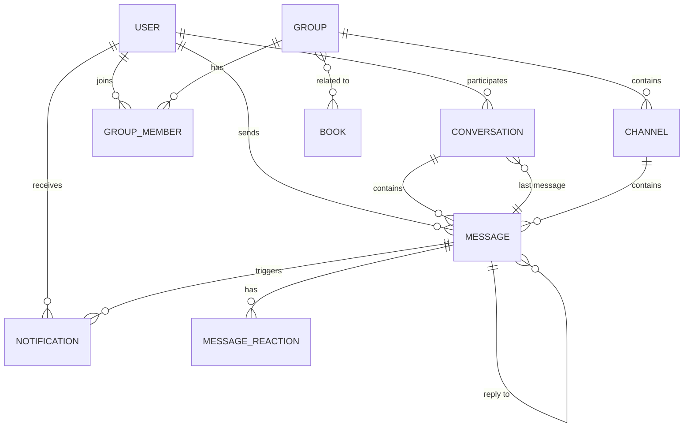

# Social Messaging System Design

## Overview

This document defines the design for a comprehensive social messaging system that enables users to communicate through private conversations and group chats within the Reader.Market platform. The system supports real-time message delivery, reactions, user search, group management with multiple channels, and notification mechanisms.

## Strategic Goals

- Enable users to communicate privately and in groups about books and reading experiences
- Create a social layer that enhances user engagement and community building
- Provide real-time communication capabilities with instant notifications
- Support structured group discussions with multiple channels for organized conversations
- Allow users to discover and connect with other readers through search functionality

## System Architecture

### Component Structure

The messaging system consists of the following major components:

#### Frontend Components

**Messages Page Component**
- Primary interface for viewing conversations and messages
- Split-panel layout: conversation list on the left, active chat on the right
- Accessible via main navigation menu before the Profile menu item
- Displays unread message counts in navigation badge

**Conversation List Panel**
- Shows all active conversations (private and group)
- Search functionality to find users and groups
- Create new conversation action button
- Visual indicators for unread messages and group types
- Sorted by most recent activity

**Chat Display Panel**
- Message thread for selected conversation
- Message composition area with text input
- Real-time message updates
- Message reactions and reply functionality
- Sender information with clickable profile links
- Timestamp display for each message

**User Search Dialog**
- Search users by name or username
- Display search results with user avatars and basic info
- Action to initiate new private conversation

**Group Management Interface**
- Group creation dialog with name, description, and privacy settings
- Member management for administrators and moderators
- Channel creation and management within groups
- Group settings editor for administrators
- Book association selector to link groups with specific books

**Message Composer**
- Text input area for composing messages
- Support for formatted text and links in group descriptions
- Send action with real-time delivery

#### Backend Services

**Message Service**
- Handle message creation, retrieval, and updates
- Manage read status tracking
- Support message reactions
- Process message replies and threading

**Conversation Service**
- Manage private conversation lifecycles
- Track conversation metadata and last message
- Handle conversation participant relationships

**Group Service**
- Create and manage group entities
- Handle group membership operations
- Manage group privacy settings and visibility
- Support group-to-book associations
- Maintain group administrators and moderators

**Channel Service**
- Create and manage channels within groups
- Support multiple discussion threads per group
- Handle channel-specific permissions

**User Search Service**
- Provide user lookup by name or username
- Return relevant user information for messaging

**Real-Time Communication Service**
- WebSocket connection management
- Broadcast messages to connected clients
- Deliver notifications for new messages and events
- Maintain presence information

**Notification Service**
- Generate notifications for new messages
- Badge count updates for unread messages
- Deliver notifications to users across devices

## Data Model

### Core Entities

#### Message Entity
- Unique identifier
- Sender reference to user
- Recipient reference (user for private, null for groups)
- Conversation or channel reference
- Message content (text)
- Created timestamp
- Updated timestamp
- Read status flag
- Parent message reference (for replies)
- Deleted flag for moderation

#### Conversation Entity
- Unique identifier
- Participant references (user1, user2)
- Last message reference
- Created timestamp
- Updated timestamp
- Archived status per participant

#### Group Entity
- Unique identifier
- Name
- Description (supports formatted text)
- Creator reference to user
- Privacy setting (public/private)
- Created timestamp
- Updated timestamp
- Associated book references (optional)
- Deleted flag

#### Group Member Entity
- Unique identifier
- Group reference
- User reference
- Role (administrator/moderator/member)
- Joined timestamp
- Invited by reference to user

#### Channel Entity
- Unique identifier
- Group reference
- Name
- Description
- Creator reference to user
- Created timestamp
- Order index for display
- Archived status

#### Message Reaction Entity
- Unique identifier
- Message reference
- User reference
- Emoji or reaction type
- Created timestamp

#### Notification Entity
- Unique identifier
- User reference (recipient)
- Type (new_message, group_invite, mention, etc.)
- Related entity reference (message, group, etc.)
- Read status flag
- Created timestamp

### Data Relationships

## Functional Requirements

### Private Messaging

**Conversation Initiation**
- Users can start a new conversation from the Messages page by searching for another user
- Users can initiate a conversation from another user's profile via the envelope icon button
- System creates a conversation entity linking the two participants
- First message establishes the conversation thread

**Message Sending**
- Users compose messages in the chat interface
- Messages are delivered in real-time to the recipient
- System updates conversation's last message reference
- Recipient receives notification if not actively viewing the conversation

**Message Display**
- Messages appear in chronological order
- Each message shows sender name (as profile link), content, and timestamp
- Visual distinction between sent and received messages
- Read status indicators for sent messages

**Message Reading**
- When recipient views conversation, unread messages are marked as read
- Read status updates propagate to sender's interface
- Unread count decrements in navigation badge

### Group Messaging

**Group Creation**
- Users can create a new group from the Messages page
- Creator specifies group name and description
- Creator selects privacy setting (public/private)
- Creator can associate group with specific books
- System creates default "General" channel automatically
- Creator becomes the initial administrator

**Group Discovery**
- Public groups are discoverable through search
- Private groups are accessible only by invitation
- Search results show group name, description, and member count
- Users can request to join public groups or be invited to private groups

**Group Membership**
- Administrators can invite users to join the group
- Administrators and moderators can remove members
- Users can leave groups voluntarily
- Member list displays all participants with their roles

**Group Administration**
- Administrators can edit group name and description
- Administrators can change group privacy settings
- Administrators can associate or disassociate books with the group
- Administrators can promote members to moderators
- Only the creator can transfer administrator rights or delete the group

**Channel Management**
- Administrators and moderators can create new channels within a group
- Channels have names and optional descriptions
- Channels serve as separate discussion threads within the group
- Common channel examples: General Discussion, Book Questions, Sequel Speculation
- Users navigate between channels to view different conversation threads

**Group Messaging**
- Users send messages to a specific channel within a group
- Messages display sender name (as clickable profile link) and timestamp
- All group members can view messages in all channels
- Messages appear in real-time for all active participants

**Moderation**
- Administrators and moderators can delete inappropriate messages
- Administrators and moderators can edit messages to remove violations
- System maintains audit log of moderation actions
- Deleted messages show as removed with timestamp

### Message Interaction

**Reactions**
- Users can add emoji reactions to any message
- Multiple users can react with the same emoji
- Reaction count displays alongside the message
- Users can remove their own reactions
- Reaction mechanism mirrors the existing comments/reviews system

**Replies**
- Users can reply directly to a specific message
- Reply creates a thread relationship to the original message
- Replied-to message shows context in the thread
- Visual indication of reply relationships

### Real-Time Communication

**WebSocket Connection**
- System establishes WebSocket connection when user accesses Messages page
- Connection maintains bidirectional communication for instant updates
- Automatic reconnection on connection loss

**Message Broadcasting**
- New messages broadcast to all conversation/channel participants
- Updates appear instantly without page refresh
- Typing indicators show when other users are composing

**Presence Management**
- System tracks which users are currently online
- Online status indicators appear in conversation and member lists

### Notifications

**Message Notifications**
- Users receive notifications for new private messages
- Users receive notifications for new messages in groups they belong to
- Notification includes sender name and message preview
- Unread message count appears in navigation badge

**Group Notifications**
- Users receive notifications for group invitations
- Users receive notifications when mentioned in group messages
- Administrators receive notifications for join requests in public groups

**Notification Display**
- Badge in main navigation shows total unread message count
- Envelope icon highlights when new messages arrive
- Browser notifications for desktop alerts
- Notification list accessible from Messages page

### User Search

**Search Functionality**
- Users search by entering full name or username
- Search returns matching users with avatars and basic profile info
- Search results are clickable to initiate conversations
- Recent conversation partners suggested for quick access

### Profile Integration

**Message Button in Profile**
- Envelope icon button appears below user's name in profile view
- Button visible when viewing other users' profiles (not own profile)
- Clicking button opens messaging interface
- If conversation exists, opens that conversation; otherwise creates new one

**Navigation Menu Integration**
- "Messages" menu item added to main navigation bar
- Positioned before "Profile" menu item in the header
- Badge displays unread message count when greater than zero
- Direct access to Messages page with conversation list

## User Interface Design

### Messages Page Layout

The Messages page uses a two-panel layout:

**Left Panel - Conversation List**
- Width: 30-40% of viewport
- Contains search bar at top
- "New Conversation" action button
- Scrollable list of conversations
- Each conversation shows:
  - Avatar of other participant or group icon
  - Name of participant or group
  - Last message preview
  - Timestamp of last activity
  - Unread indicator badge
  - Group type indicator (private/public)

**Right Panel - Active Chat**
- Width: 60-70% of viewport
- Header shows:
  - Participant name or group name (clickable to profile/group info)
  - Group member count and settings icon (for groups)
  - Channel selector dropdown (for groups)
- Message thread area (scrollable):
  - Messages in chronological order
  - Sender avatar and name
  - Message content
  - Timestamp
  - Reactions below message
  - Reply indicator for threaded messages
- Message composer at bottom:
  - Text input area
  - Send button
  - Formatting options (for groups)

### Group Information Panel

Accessible via settings icon in group chat header:

- Group name and description
- Associated books list with links
- Member list with avatars and roles
- Channel list with creation option (for admins/mods)
- Leave group action
- Administrative actions (for admins):
  - Edit group settings
  - Manage members
  - Create/edit channels
  - Delete group

### Navigation Badge

The Messages menu item displays a badge when unread messages exist:

- Badge position: top-right of menu item
- Badge style: small circle with number
- Color: highlighted accent color
- Updates in real-time as messages are read/received

## Technical Specifications

### Real-Time Communication Protocol

**WebSocket Implementation**
- Use Socket.io or native WebSocket for bidirectional communication
- Establish connection on Messages page mount
- Authenticate connection using existing session token
- Implement automatic reconnection with exponential backoff

**Message Events**
- `message:new` - New message created
- `message:read` - Message marked as read
- `message:reaction` - Reaction added or removed
- `typing:start` - User starts typing
- `typing:stop` - User stops typing
- `presence:online` - User comes online
- `presence:offline` - User goes offline

**Room Management**
- Each conversation has a unique room identifier
- Users join rooms for their active conversations
- Messages broadcast only to users in the same room
- Efficient room cleanup when users disconnect

### API Endpoints

**Private Messages**
- `POST /api/messages` - Send a new private message
- `GET /api/messages/conversation/:conversationId` - Retrieve messages in a conversation
- `GET /api/messages/unread-count` - Get total unread message count
- `PUT /api/messages/:messageId/read` - Mark message as read
- `POST /api/messages/:messageId/reactions` - Add reaction to message
- `DELETE /api/messages/:messageId/reactions/:reactionId` - Remove reaction

**Conversations**
- `GET /api/conversations` - List all user's conversations
- `GET /api/conversations/:conversationId` - Get conversation details
- `POST /api/conversations` - Create new conversation with a user
- `PUT /api/conversations/:conversationId/archive` - Archive conversation

**Groups**
- `POST /api/groups` - Create a new group
- `GET /api/groups` - List user's groups
- `GET /api/groups/search` - Search public groups
- `GET /api/groups/:groupId` - Get group details
- `PUT /api/groups/:groupId` - Update group settings
- `DELETE /api/groups/:groupId` - Delete group (admin only)

**Group Membership**
- `POST /api/groups/:groupId/members` - Add member to group
- `DELETE /api/groups/:groupId/members/:userId` - Remove member from group
- `PUT /api/groups/:groupId/members/:userId/role` - Update member role
- `GET /api/groups/:groupId/members` - List group members

**Channels**
- `POST /api/groups/:groupId/channels` - Create channel in group
- `GET /api/groups/:groupId/channels` - List group channels
- `PUT /api/groups/:groupId/channels/:channelId` - Update channel settings
- `DELETE /api/groups/:groupId/channels/:channelId` - Delete channel
- `GET /api/groups/:groupId/channels/:channelId/messages` - Get channel messages

**User Search**
- `GET /api/users/search?q=query` - Search users by name or username

**Notifications**
- `GET /api/notifications` - Get user's notifications
- `PUT /api/notifications/:notificationId/read` - Mark notification as read
- `PUT /api/notifications/read-all` - Mark all notifications as read

### Database Schema Extensions

New tables required beyond the existing messages and conversations tables:

**groups table**
- id (primary key, UUID)
- name (text, required)
- description (text)
- creator_id (foreign key to users)
- privacy (enum: public/private)
- created_at (timestamp)
- updated_at (timestamp)
- deleted_at (timestamp, nullable)

**group_members table**
- id (primary key, UUID)
- group_id (foreign key to groups)
- user_id (foreign key to users)
- role (enum: administrator/moderator/member)
- invited_by (foreign key to users)
- joined_at (timestamp)

**group_books table** (association)
- id (primary key, UUID)
- group_id (foreign key to groups)
- book_id (foreign key to books)
- added_at (timestamp)

**channels table**
- id (primary key, UUID)
- group_id (foreign key to groups)
- name (text, required)
- description (text)
- creator_id (foreign key to users)
- display_order (integer)
- created_at (timestamp)
- archived_at (timestamp, nullable)

**message_reactions table**
- id (primary key, UUID)
- message_id (foreign key to messages)
- user_id (foreign key to users)
- emoji (text, required)
- created_at (timestamp)

**notifications table**
- id (primary key, UUID)
- user_id (foreign key to users)
- type (text, required)
- related_entity_id (UUID, nullable)
- related_entity_type (text, nullable)
- content (JSONB, stores notification details)
- read_status (boolean, default false)
- created_at (timestamp)

**Messages table modifications**
- Add conversation_id (foreign key to conversations, nullable)
- Add channel_id (foreign key to channels, nullable)
- Add parent_message_id (foreign key to messages, nullable for replies)
- Add deleted_at (timestamp, nullable for moderation)
- Add deleted_by (foreign key to users, nullable)

Constraint: Either conversation_id or channel_id must be set, but not both.

### Permission Model

**Private Conversations**
- Users can only send messages in conversations they are participants in
- Users can only read messages in their own conversations
- Users cannot delete others' messages in private conversations

**Groups**
- Members can send messages to any channel in groups they belong to
- Members can read all messages in their groups
- Members can react to any message in their groups
- Members can reply to any message in their groups

**Group Administrators**
- All member permissions
- Can edit group name and description
- Can change group privacy settings
- Can manage book associations
- Can create and manage channels
- Can promote/demote moderators
- Can remove any member except creator
- Can delete any message in the group
- Can edit any message in the group

**Group Moderators**
- All member permissions
- Can create and manage channels
- Can remove members (excluding admins)
- Can delete messages in the group
- Can edit messages in the group

**Group Creator**
- All administrator permissions
- Cannot be removed from the group
- Can delete the entire group
- Can transfer creator status to another administrator

### Performance Considerations

**Message Loading**
- Implement pagination for message history
- Load most recent messages first
- Lazy load older messages on scroll
- Cache recent messages in client state

**Conversation List**
- Load initial set of conversations on page mount
- Implement infinite scroll for additional conversations
- Update list in real-time as new messages arrive
- Optimize queries with proper database indexing

**Real-Time Scalability**
- Use efficient WebSocket room management
- Limit broadcast scope to relevant participants
- Implement message queuing for offline users
- Consider Redis for WebSocket session storage in production

**Search Optimization**
- Index user names and usernames for fast lookup
- Implement debouncing on search input
- Limit search results to reasonable number
- Cache frequently accessed user profiles

## Behavior Specifications

### Message Delivery Flow

When a user sends a message:

1. Client validates message content is not empty
2. Client sends message via WebSocket or HTTP POST
3. Server authenticates request and validates permissions
4. Server creates message record in database
5. Server updates conversation or channel last message reference
6. Server broadcasts message to all participants via WebSocket
7. Server creates notifications for recipients not currently viewing
8. Server returns success confirmation to sender
9. Client updates UI optimistically, confirming on server response

### Unread Count Management

System maintains unread message counts through the following logic:

- When message is created, increment unread count for all recipients except sender
- When user opens a conversation/channel, mark all messages as read
- When message is marked as read, decrement unread count for that user
- Navigation badge displays total unread count across all conversations and groups
- Conversation list items show per-conversation unread indicators

### Group Invitation Flow

When administrator invites a user to a group:

1. Administrator searches for user by name or username
2. Administrator selects user and confirms invitation
3. System creates group member record with pending status
4. System sends notification to invited user
5. Invited user receives notification with group information
6. User can accept or decline invitation
7. On acceptance, system updates member status to active
8. User gains access to group channels and messages

### Channel Creation Flow

When administrator or moderator creates a channel:

1. User clicks "Create Channel" in group settings
2. System presents dialog for channel name and description
3. User confirms channel creation
4. System creates channel record with next display order
5. System makes channel available to all group members
6. System broadcasts channel creation event to active members
7. Channel appears in channel selector for all group members

### Message Reaction Flow

When user adds a reaction to a message:

1. User clicks reaction icon below message
2. System presents emoji picker
3. User selects emoji
4. Client sends reaction request to server
5. Server validates user has access to message
6. Server creates or updates reaction record
7. Server broadcasts reaction update to all participants
8. All participants see updated reaction count in real-time

### Search and Connect Flow

When user searches for someone to message:

1. User clicks "New Conversation" button
2. System presents search dialog
3. User enters name or username
4. Client sends search query with debouncing
5. Server queries user database for matches
6. Server returns list of matching users
7. Client displays results with avatars and names
8. User clicks on desired person
9. System checks if conversation already exists
10. If exists, opens existing conversation
11. If not, creates new conversation and opens it

## Edge Cases and Error Handling

**WebSocket Connection Loss**
- Client detects disconnection and displays warning
- Client attempts automatic reconnection with exponential backoff
- Messages sent during disconnection are queued locally
- Once reconnected, client sends queued messages
- Client requests message history to fill any gaps

**Simultaneous Message Sending**
- Multiple users may send messages at the same time
- Server timestamps each message on receipt
- Messages appear in chronological order based on server timestamp
- Optimistic UI updates may show messages out of order temporarily
- Final order determined by server timestamps

**Deleted User Accounts**
- Messages from deleted users remain visible with "Deleted User" placeholder
- Conversations with deleted users remain accessible
- Groups retain deleted users' messages for context
- Cannot initiate new conversations with deleted users

**Group Deletion**
- When group is deleted, all members lose access immediately
- Group data is soft-deleted, not permanently removed
- Messages and channels remain in database for audit purposes
- Users receive notification that group was deleted
- Deleted group no longer appears in search or user's group list

**Message Editing by Moderators**
- Edited messages display "Edited by [Moderator]" indicator
- System stores edit history for audit trail
- Original message content preserved in database
- Users can see that message was modified by moderation

**Channel Archival**
- Archived channels no longer appear in active channel list
- Messages in archived channels remain accessible in read-only mode
- Administrators can unarchive channels to restore full functionality
- Users cannot send messages to archived channels

**Notification Delivery Failures**
- System retries notification delivery on transient failures
- Failed notifications logged for investigation
- User can manually refresh notification list
- Critical notifications (e.g., group invite) persist until acknowledged

**Invalid Message Content**
- Empty messages rejected before sending
- Excessively long messages truncated with warning
- Malicious content (e.g., scripts) sanitized before storage
- Invalid characters removed or escaped

**Permission Changes**
- When user is removed from group, lose access immediately
- Active WebSocket connection terminates for removed user
- User interface updates to reflect removal
- User receives notification of removal

**Concurrent Group Updates**
- Multiple administrators may edit group settings simultaneously
- Last write wins for conflicting changes
- System logs all changes with timestamps and user references
- Consider optimistic locking for critical updates

## Success Metrics

**User Engagement**
- Number of active conversations per user
- Message send rate per day
- User retention rate after joining groups
- Average response time in conversations

**Feature Adoption**
- Percentage of users who send at least one message
- Number of groups created
- Average group size
- Channel usage rate within groups

**System Performance**
- Message delivery latency (target: under 500ms)
- WebSocket connection stability (target: 99.9% uptime)
- Search response time (target: under 300ms)
- Unread count update latency (target: under 100ms)

**Community Health**
- Number of moderation actions per group
- User-reported spam or abuse rate
- Group activity over time
- User satisfaction with messaging features

## Future Enhancements

Potential features for future iterations:

- Rich media support in messages (images, file attachments)
- Voice and video calling capabilities
- Message pinning in groups and channels
- Thread branching for complex discussions
- Advanced search within message history
- Message translation for international users
- Integration with reading progress to share quotes
- Bot support for automated notifications and reminders
- Message scheduling for delayed sending
- Enhanced notification preferences and filtering
- Mobile push notifications
- Desktop application with native notifications
- Encryption for private messages
- Message archival and export functionality
- Analytics dashboard for group administrators
