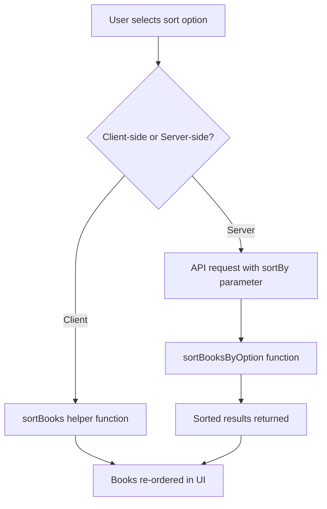
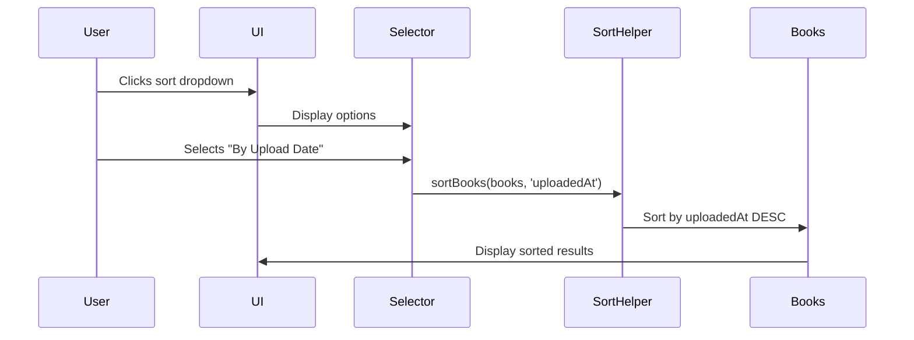
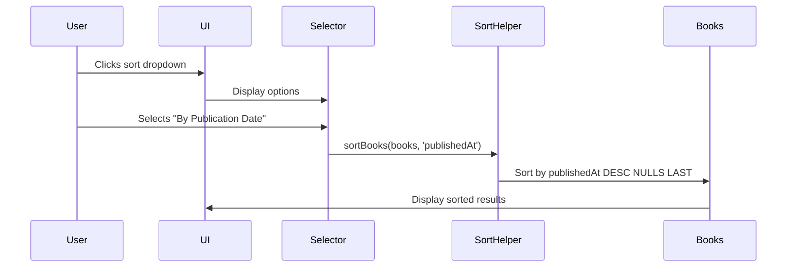

# Add Book Sorting by Upload and Publication Dates

## Overview

Extend the existing book sorting functionality by adding two new sorting options:
- **By Upload Date** (uploadedAt): Sort books by when they were added to the platform
- **By Publication Date** (publishedAt): Sort books by their original publication date

These options will be available consistently across all book listing views (Library, Search, Shelves) alongside the existing sorting criteria (rating, views, reader opens, comments, reviews, shelf count).

## Business Context

Users need the ability to discover books based on temporal criteria:
- **Upload Date Sorting**: Helps users find recently added content to the platform
- **Publication Date Sorting**: Allows users to explore books chronologically by their original publication timeline

## Strategic Design

### Data Model

The database schema already supports these fields in the books table:
- `uploadedAt` (timestamp): Automatically set when book is created, represents when book was uploaded to the system
- `publishedAt` (timestamp): Nullable field, represents the original publication date of the book

### Sorting Behavior

| Sort Option | Field Used | Sort Order | Null Handling |
|------------|------------|------------|---------------|
| By Upload Date | uploadedAt | Descending (newest first) | Not applicable (always has value) |
| By Publication Date | publishedAt | Descending (newest first) | Nulls last |

### Component Architecture

The sorting system follows a consistent pattern across frontend and backend:

#### Frontend Layer
- **BookListSortSelector Component**: Dropdown UI for selecting sort options
- **SortOption Type**: TypeScript enum defining available sorting criteria
- **sortBooks Helper**: Client-side sorting utility for immediate UI updates

#### Backend Layer
- **sortBooksByOption Function**: Server-side sorting logic applied to database query results
- **API Endpoints**: Accept sortBy query parameter to control result ordering

### User Interface Integration

The sort selector appears in the following locations:
- Library page (multiple sections: Popular Books, Recently Reviewed, New Releases, My Books)
- Search page (global search results)
- Shelves page (both global search and individual shelf views)

### Sorting Logic Flow

### Translation Structure

Sort option labels are managed through i18n system:
- Translation key pattern: `common:sort.by[OptionName]`
- Supported languages: English (en), Russian (ru)
- New keys required:
  - `common:sort.byUploadDate`
  - `common:sort.byPublicationDate`

## Technical Changes Required

### Frontend Modifications

#### Type Definition Update
Extend the SortOption type to include the new sorting criteria:
- Add 'uploadedAt' option
- Add 'publishedAt' option

#### BookListSortSelector Component
Add two new entries to the sortOptions array with proper translation keys.

#### Client-Side Sorting Function
Extend the switch statement in sortBooks function to handle:
- 'uploadedAt': Sort by uploadedAt timestamp descending
- 'publishedAt': Sort by publishedAt timestamp descending, with null values last

#### Book Data Propagation
Ensure book objects passed to sorting utilities include:
- uploadedAt field
- publishedAt field

These fields are already present in the database schema and API responses.

### Backend Modifications

#### Server-Side Sorting Function
Extend sortBooksByOption function in storage.ts:
- Add case for 'uploadedAt': Compare timestamps in descending order
- Add case for 'publishedAt': Compare timestamps in descending order, treating null as minimum value

#### Database Query Consideration
No changes required to database queries as:
- uploadedAt is already fetched in all book queries
- publishedAt is already included in book selection

### Translation Files

Add new translation entries to locale files:

**English (en/common.json)**:
| Key | Value |
|-----|-------|
| common:sort.byUploadDate | By Upload Date |
| common:sort.byPublicationDate | By Publication Date |

**Russian (ru/common.json)**:
| Key | Value |
|-----|-------|
| common:sort.byUploadDate | По дате добавления |
| common:sort.byPublicationDate | По дате публикации |

## Data Flow

### Sort by Upload Date Flow

### Sort by Publication Date Flow

## Edge Cases and Considerations

### Publication Date Handling
- **Missing Publication Dates**: Books without publishedAt values should appear at the end when sorting by publication date
- **Future Dates**: Books with future publication dates should appear first (descending order)
- **Very Old Dates**: Historical books should sort correctly regardless of how old they are

### Upload Date Handling
- **Recent Uploads**: All books have uploadedAt values (required field with default)
- **Consistency**: Upload date sorting should be identical to the existing "New Releases" section behavior

### Performance Considerations
- Client-side sorting handles arrays already in memory (no additional data fetching)
- Server-side sorting may be implemented in future iterations for large datasets
- Current implementation maintains consistency with existing sort options

### UI Behavior
- Default sort option remains 'rating' (no change to current behavior)
- Sort selection persists within page session
- Each book section maintains independent sort state

## Success Criteria

The implementation is successful when:
1. Two new sort options appear in all sort dropdowns across the application
2. Selecting "By Upload Date" reorders books from newest to oldest upload
3. Selecting "By Publication Date" reorders books from newest to oldest publication, with unpublished dates last
4. Translation labels display correctly in both English and Russian
5. Sorting behavior is consistent across Library, Search, and Shelves pages
6. No regression in existing sort functionality
7. Performance remains comparable to existing sort options

## Non-Functional Requirements

### Consistency
- Sorting behavior must be identical across all pages
- Date formatting should follow existing patterns
- UI component styling should match current design system

### Maintainability
- Follow existing code patterns for sort implementation
- Use type-safe TypeScript enums for new sort options
- Maintain separation between client and server sorting logic

### User Experience
- Sort selection should provide immediate visual feedback
- No loading states required (client-side sorting)
- Dropdown should remain accessible and keyboard-navigable
- Dropdown should remain accessible and keyboard-navigable
