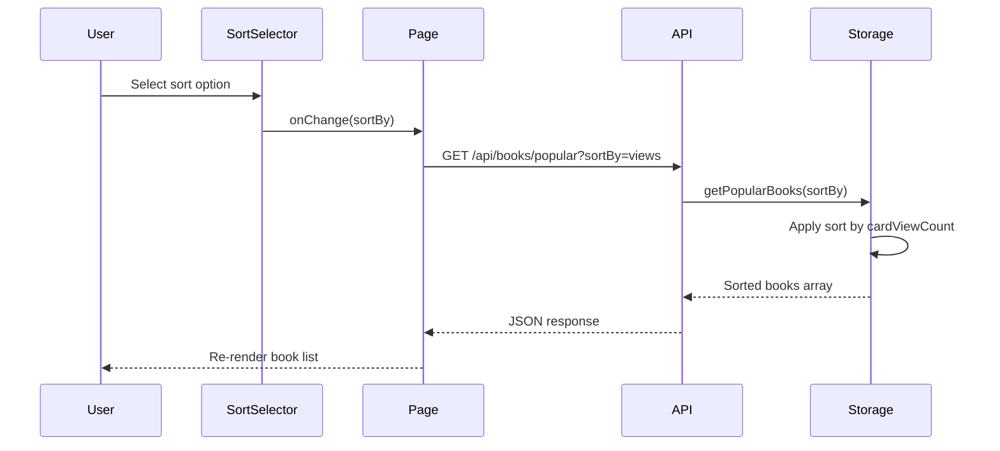

# Sorting Options for Book Lists

## Overview

Add user-selectable sorting options for all book list views across the application, allowing users to sort books by various metrics including views, reader opens, rating, comments, and reviews.

## Scope

### Affected Pages
| Page | Component | Book Lists |
|------|-----------|------------|
| Home (Library) | `Library.tsx` | Popular Books, Books by Genre, Recently Reviewed, New Releases, My Books |
| Search | `Search.tsx` | Search Results |
| Shelves | `Shelves.tsx` | Books per shelf, Global search results |

### Sort Options
| Sort Option | Field | Description |
|-------------|-------|-------------|
| By Views | `cardViewCount` | Number of times book card was viewed |
| By Reader Opens | `readerOpenCount` | Number of times book was opened in reader |
| By Rating | `rating` | Average user rating (descending) |
| By Comments | `commentCount` | Number of comments |
| By Reviews | `reviewCount` | Number of reviews |

## Design

### UI Component: Sort Selector

A reusable dropdown component placed near each book list section header.

**Location**: Next to section titles (e.g., "Popular Books", "Search Results", shelf names)

**Behavior**:
- Default sort: Rating (current behavior)
- Sort direction: Descending for all metrics (highest first)
- Selection persists during session
- Each section can have independent sort selection

### Frontend Changes

#### 1. New Reusable Component: `BookListSortSelector`

**Props**:
| Prop | Type | Description |
|------|------|-------------|
| `value` | `SortOption` | Current selected sort option |
| `onChange` | `(value: SortOption) => void` | Callback when sort changes |

**SortOption enum values**: `views`, `readerOpens`, `rating`, `comments`, `reviews`

#### 2. Page Updates

Each page will:
1. Add local state for sort option per book list section
2. Pass sort option to API calls
3. Display `BookListSortSelector` in section headers

### Backend Changes

#### 1. API Parameter Extension

All book list endpoints will accept optional `sortBy` query parameter:

| Endpoint | Current | Updated |
|----------|---------|---------|
| `GET /api/books/popular` | No params | `?sortBy=views\|readerOpens\|rating\|comments\|reviews` |
| `GET /api/books/search` | `?query=...` | Add `&sortBy=...` |
| `GET /api/books/genre/:genre` | No params | `?sortBy=...` |
| `GET /api/books/recently-reviewed` | No params | `?sortBy=...` |
| `GET /api/books/new-releases` | No params | `?sortBy=...` |

#### 2. Storage Layer Updates

Modify sort logic in `storage.ts` functions:
- `getBooks()` / `searchBooks()`
- `getPopularBooks()`
- `getBooksByGenre()`
- `getRecentlyReviewedBooks()`
- `getNewReleases()`
- `getCurrentUserBooks()`
- `getBooksByIds()`

**Sort Field Mapping**:
| sortBy Value | Sort Field |
|--------------|------------|
| `views` | `cardViewCount DESC` |
| `readerOpens` | `readerOpenCount DESC` |
| `rating` | `rating DESC NULLS LAST` |
| `comments` | `commentCount DESC` |
| `reviews` | `reviewCount DESC` |

### Data Flow

### Localization

Add translation keys for sort options:

| Key | EN | RU |
|-----|----|----|
| `sort.byViews` | By Views | По просмотрам |
| `sort.byReaderOpens` | By Reader Opens | По открытиям |
| `sort.byRating` | By Rating | По рейтингу |
| `sort.byComments` | By Comments | По комментариям |
| `sort.byReviews` | By Reviews | По рецензиям |
| `sort.label` | Sort by | Сортировка |

## Implementation Notes

- All required data fields (`cardViewCount`, `readerOpenCount`, `rating`, `commentCount`, `reviewCount`) are already available in API responses
- Current backend sorting logic in `storage.ts` can be refactored to accept sortBy parameter
- Client-side sorting is an alternative for small datasets, but server-side sorting is preferred for consistency
