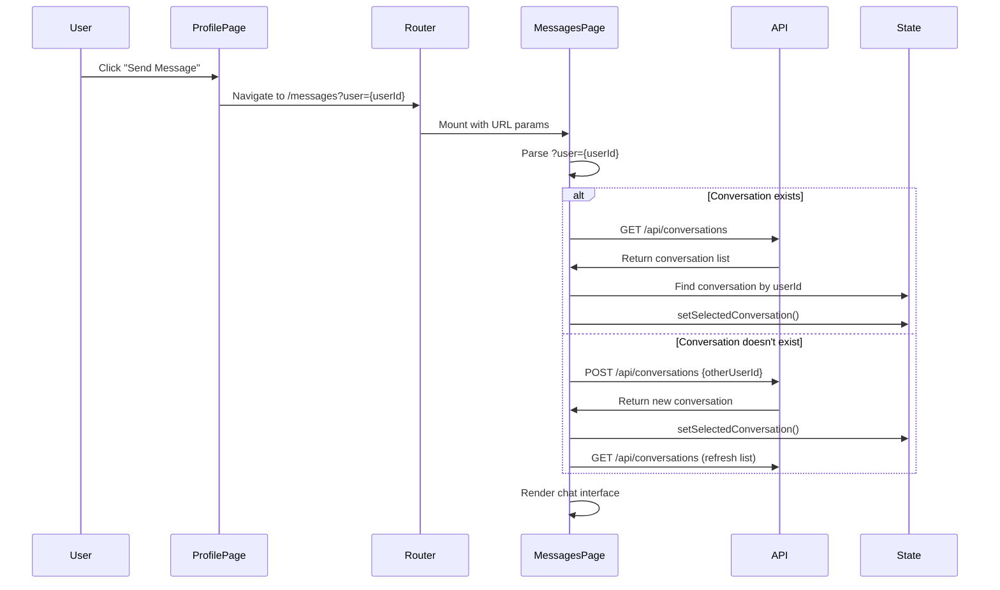
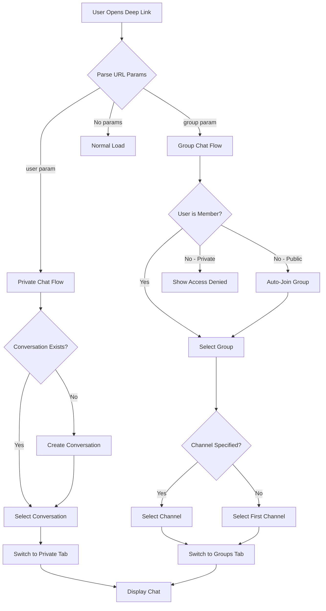
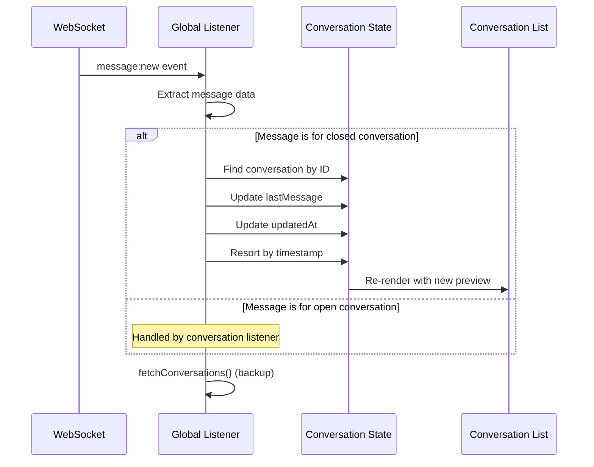
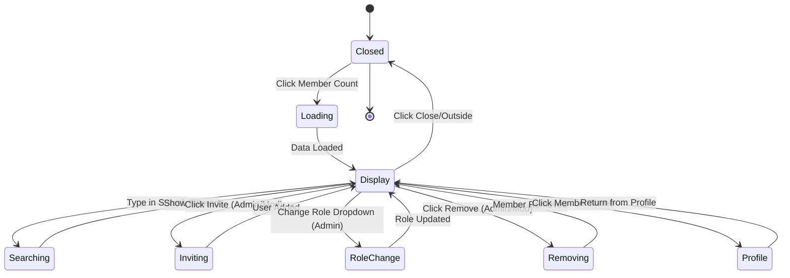

# User Message Dialog & Deep Linking Design

## Overview

This design addresses several enhancements to the messaging system and group management interface:

1. Direct messaging from user profiles with automatic navigation to Messages page
2. Shareable deep links for opening specific conversations or group chats
3. Real-time conversation list updates when receiving new messages
4. Group member role update functionality fix
5. Opening group books in new tabs
6. Clickable member count with member management modal
7. User profile links throughout messaging interface

## Feature Requirements

### 1. Profile Message Button with Navigation

**Current State**: Profile page has a message button that currently just navigates to /messages without opening a specific conversation.

**Target Behavior**: 
- When clicking "Send Message" button in user profile, automatically navigate to /messages page
- Open the conversation with that specific user immediately
- If conversation doesn't exist yet, create it automatically
- Select the conversation in the left panel and display the chat interface

### 2. Deep Linking for Conversations and Groups

**Purpose**: Allow users to share links that directly open specific conversations or group chats.

**URL Patterns**:

| Link Type | URL Format | Description |
|-----------|-----------|-------------|
| Private Conversation | `/messages?user={userId}` | Opens conversation with specific user |
| Group Channel | `/messages?group={groupId}` | Opens specific group chat |
| Group Channel | `/messages?group={groupId}&channel={channelId}` | Opens specific channel in group |

**Behavior**:
- Parse URL parameters on Messages page mount
- Validate user/group access permissions
- Auto-create conversation if it doesn't exist (for private chats)
- Auto-join public groups if user isn't a member
- Display error message for inaccessible private groups
- Switch to appropriate tab (private/groups)
- Select and open the target conversation/group

**Link Generation**:
- Add "Share Link" button in conversation header
- Copy shareable URL to clipboard
- Format: `{origin}/messages?user={userId}` or `{origin}/messages?group={groupId}`

### 3. Real-Time Conversation List Updates

**Current Issue**: When receiving a new message, the last message preview in the conversation list only updates after opening that conversation.

**Root Cause**: Global WebSocket listener at line 104-114 calls `fetchConversations()`, but the API response may not reflect the latest message immediately due to timing or caching.

**Solution Strategy**:
- Enhance WebSocket event handler to update conversation list optimistically
- Update local state immediately when receiving `message:new` event
- Move the newest conversation to the top of the list
- Update last message preview without requiring full API refetch
- Maintain API refetch as backup for data consistency

**State Management**:
- When `message:new` event arrives, check if it belongs to an existing conversation
- Update that conversation's `lastMessage` and `updatedAt` fields in local state
- Re-sort conversations by `updatedAt` to move updated conversation to top
- If conversation doesn't exist in list, add it

### 4. Group Member Role Update Fix

**Current Issue**: PUT request to `/api/groups/{groupId}/members/{memberId}/role` returns `{success: true}` but role doesn't change in UI.

**Investigation Areas**:

| Component | Check Points |
|-----------|-------------|
| Backend API | Verify database update occurs correctly |
| Backend Response | Ensure updated member data is returned |
| Frontend Handler | Confirm state update after successful response |
| UI Rendering | Validate Select component reflects new value |

**Expected Flow**:
1. User selects new role from dropdown
2. PUT request sent to backend
3. Backend updates database and returns updated member object
4. Frontend updates local member list state
5. UI reflects new role immediately

**Debugging Strategy**:
- Add logging to backend role update endpoint
- Verify SQL UPDATE query execution
- Confirm transaction commit
- Log response payload
- Check frontend state update logic

### 5. Group Books Opening in New Tab

**Current State**: Group books displayed in group header as badges.

**Required Change**: Make book badges clickable links that open book detail page in new window/tab.

**Implementation**:
- Books already render as Link components with `target="_blank"` at lines 1077-1086
- Verify link navigation works correctly
- Ensure `rel="noopener noreferrer"` for security

### 6. Member Count Modal with Management

**Purpose**: Transform static member count display into interactive element for viewing and managing group members.

**Trigger**: Clicking on member count text in group header (line 1072).

**Modal Content**:

| Feature | Access Level | Description |
|---------|-------------|-------------|
| Member List | All | Paginated list of all group members |
| Search | All | Filter members by name/username |
| View Profile | All | Click member to open profile in new tab |
| Invite Users | Admin/Moderator | Search and add new members |
| Remove Member | Admin/Moderator | Exclude members from group |
| Change Role | Admin | Modify member permissions |

**Modal Structure**:

```
┌─────────────────────────────────────┐
│  Group Members (142)            [X] │
├─────────────────────────────────────┤
│  [Search members...]   [Invite]    │
├─────────────────────────────────────┤
│  ┌────────────────────────────────┐│
│  │ 👤 John Doe (@johndoe)    Admin││
│  │ 👤 Jane Smith (@jane)   Mod  [↓]│
│  │ 👤 Bob Wilson (@bob)    Member  │
│  │ ...                             ││
│  └────────────────────────────────┘│
├─────────────────────────────────────┤
│         [<]  Page 1 of 8   [>]     │
└─────────────────────────────────────┘
```

**Pagination**:
- Display 20 members per page
- Server-side pagination via API parameters: `?page=1&limit=20`
- Show page controls only when total members > limit

**Search**:
- Client-side filtering for loaded members
- Server-side search for larger groups (optional optimization)

**Permissions Matrix**:

| Action | Member | Moderator | Administrator |
|--------|--------|-----------|---------------|
| View List | ✓ | ✓ | ✓ |
| View Profiles | ✓ | ✓ | ✓ |
| Search | ✓ | ✓ | ✓ |
| Invite | ✗ | ✓ | ✓ |
| Remove | ✗ | ✓ (not admins) | ✓ (not admins) |
| Change Role | ✗ | ✗ | ✓ |

### 7. Profile Links in Messages

**Current State**: Usernames appear in messages but some aren't clickable.

**Required Changes**: Ensure all username references in messaging interface open user profile in new tab.

**Locations to Update**:
- Private chat header: Already implemented (lines 964-970)
- Private message sender names: Already implemented (lines 994-1001)
- Group channel message sender names: Already implemented (lines 1141-1148)
- Conversation list: Add clickable username
- Group member mentions in chat (if applicable)

**Link Pattern**:
- Format: `/profile/{userId}`
- Target: `_blank`
- Rel: `noopener noreferrer`
- Style: Hover underline, cursor pointer

## Data Flow Diagrams

### Profile to Messages Navigation Flow



### Deep Link Processing Flow



### Real-Time Message Update Flow



### Member Count Modal Interaction



## API Requirements

### New Endpoint: Member List with Pagination

**Endpoint**: `GET /api/groups/{groupId}/members`

**Query Parameters**:

| Parameter | Type | Required | Default | Description |
|-----------|------|----------|---------|-------------|
| page | number | No | 1 | Page number (1-indexed) |
| limit | number | No | 20 | Members per page |
| search | string | No | - | Filter by name/username |

**Response**:
```
{
  members: Member[],
  pagination: {
    total: number,
    page: number,
    limit: number,
    totalPages: number
  }
}
```

### Enhanced Endpoint: Create Conversation with Auto-Open

**Endpoint**: `POST /api/conversations`

**Request Body**:
```
{
  otherUserId: string
}
```

**Response**:
```
{
  id: string,
  user1Id: string,
  user2Id: string,
  otherUser: {
    id: string,
    username: string,
    fullName: string | null,
    avatarUrl: string | null
  },
  lastMessage: Message | null,
  createdAt: string,
  updatedAt: string
}
```

**Behavior**: Returns existing conversation if already exists, creates new one otherwise.

### Fix Endpoint: Update Member Role

**Endpoint**: `PUT /api/groups/{groupId}/members/{memberId}/role`

**Request Body**:
```
{
  role: 'member' | 'moderator' | 'administrator'
}
```

**Current Response**:
```
{
  success: true
}
```

**Required Response**:
```
{
  success: true,
  member: {
    id: string,
    userId: string,
    role: string,
    username: string,
    fullName: string | null,
    avatarUrl: string | null,
    joinedAt: string
  }
}
```

**Backend Changes Required**: Return complete updated member object after role update.

## Component Updates

### Messages Page Enhancements

**New State Variables**:
```
- deepLinkProcessed: boolean (prevent re-processing URL params)
- memberModalOpen: boolean
- memberModalGroupId: string | null
```

**New useEffect Hook: Deep Link Handler**

**Trigger**: On component mount and when URL search params change

**Logic**:
1. Extract URL parameters (user, group, channel)
2. Validate parameters
3. If `user` param exists:
   - Switch to private tab
   - Find or create conversation with user
   - Select conversation
4. If `group` param exists:
   - Switch to groups tab
   - Check membership, join if needed
   - Select group
   - If `channel` param exists, select that channel
5. Set `deepLinkProcessed` flag

**Conversation List Update Enhancement**

**Modify Global WebSocket Listener** (lines 104-114):
- On `message:new` event, update conversation in local state
- Find conversation by `conversationId`
- Update `lastMessage` and `updatedAt`
- Re-sort conversations array
- Update state to trigger re-render
- Keep `fetchConversations()` call as backup

### Profile Page Button Enhancement

**Modify Message Button** (lines 575-580):

**Current**: Simple Link to /messages

**New Behavior**:
- Link to `/messages?user={profile.id}`
- Opens Messages page with conversation auto-selected

### Group Settings Panel Fix

**Update `updateMemberRole` Function** (lines 295-332):

**Changes**:
1. Parse response JSON
2. Update member in local `members` state with returned data
3. Only call `fetchMembers()` if response doesn't include member data

**Verify Backend**: Ensure backend returns updated member object.

### New Component: Group Members Modal

**Location**: New file `GroupMembersModal.tsx`

**Props**:
```
{
  groupId: string,
  isOpen: boolean,
  onClose: () => void,
  userRole: 'administrator' | 'moderator' | 'member',
  onMemberUpdate?: () => void
}
```

**Features**:
- Dialog/Modal wrapper
- Search input (client-side filtering)
- Paginated member list
- Member cards with avatar, name, role badge
- Admin/Moderator controls (invite, remove, role change)
- Clickable member names to open profile

**State Management**:
```
- members: Member[]
- loading: boolean
- searchQuery: string
- currentPage: number
- totalPages: number
- inviteDialogOpen: boolean
```

**Integration**: Import and use in Messages page, triggered by clicking member count in group header.

## UI/UX Specifications

### Member Count Button Styling

**Location**: Group header member count display

**Visual Changes**:
- Add hover effect (underline, color change)
- Show cursor: pointer
- Add subtle icon (e.g., chevron or users icon)
- Tooltip: "View all members"

**Responsive**: Works on mobile with touch events

### Share Link Button

**Location**: 
- Private chat header (next to user info)
- Group chat header (next to settings)

**Icon**: Share or Link icon

**Behavior**:
- Click to copy link to clipboard
- Show toast notification: "Link copied!"
- Generate appropriate URL with user/group parameters

**Permissions**: Available to all members

### Deep Link Error Handling

**Scenarios**:

| Error | Message | Action |
|-------|---------|--------|
| User not found | "User not found or unavailable" | Stay on empty Messages page |
| Private group access denied | "You don't have access to this group" | Show groups list |
| Group not found | "Group not found" | Show groups list |
| Invalid parameters | "Invalid link" | Show normal Messages page |

**Display**: Toast notification with error message

## Testing Scenarios

### Deep Link Testing

| Test Case | URL | Expected Result |
|-----------|-----|----------------|
| Valid user link | `/messages?user={validUserId}` | Open conversation with user |
| New conversation | `/messages?user={userId}` (no existing chat) | Create and open conversation |
| Invalid user | `/messages?user=invalid-id` | Show error, load normal page |
| Valid group | `/messages?group={groupId}` | Switch to groups tab, open group |
| Private group (member) | `/messages?group={privateGroupId}` | Open group chat |
| Private group (non-member) | `/messages?group={privateGroupId}` | Show access denied error |
| Group with channel | `/messages?group={groupId}&channel={channelId}` | Open specific channel |
| Multiple params | `/messages?user={userId}&group={groupId}` | Prioritize user param |

### Role Update Testing

| Test Case | Expected Backend Behavior | Expected Frontend Behavior |
|-----------|--------------------------|---------------------------|
| Admin changes member to moderator | Update DB, return member object | Update local state, show new role |
| Admin changes moderator to member | Update DB, return member object | Update local state, show new role |
| Moderator tries to change admin | Return 403 error | Show error toast |
| Invalid role value | Return 400 error | Show error toast |
| Non-existent member | Return 404 error | Show error toast |

### Member Modal Testing

| Test Case | Expected Result |
|-----------|----------------|
| Open modal as member | See list, no management controls |
| Open modal as moderator | See list, invite and remove buttons |
| Open modal as admin | See list, all controls including role change |
| Search members | Filter list by name/username |
| Click member name | Open profile in new tab |
| Navigate pages | Load next/previous page of members |
| Invite user | Add user, refresh list, show at top |
| Remove member | Remove from list, update count |
| Change role | Update role badge immediately |

### Real-Time Update Testing

| Test Case | Expected Behavior |
|-----------|------------------|
| Receive message in closed conversation | Conversation moves to top, preview updates |
| Receive message in open conversation | Handled by conversation listener |
| Multiple messages in quick succession | All updates reflected correctly |
| Message from new conversation | New conversation added to list |

## Security Considerations

**URL Parameter Validation**:
- Validate UUIDs format before API calls
- Check user permissions before opening private groups
- Sanitize search queries in member modal

**Profile Links**:
- Use `rel="noopener noreferrer"` for all external profile links
- Validate user IDs before rendering links

**Member Management**:
- Backend must enforce role-based permissions
- Frontend controls are UI convenience only
- All management actions require authentication

**Deep Links**:
- Don't expose sensitive information in URLs
- Log suspicious access attempts
- Rate limit conversation creation

## Performance Considerations

**Member Modal Pagination**:
- Load only 20 members at a time
- Cache loaded pages for quick navigation
- Implement virtual scrolling for very large groups (>1000 members)

**Real-Time Updates**:
- Debounce rapid conversation updates
- Limit re-sorts to prevent UI jank
- Use React.memo for conversation list items

**Deep Link Processing**:
- Process URL params only once on mount
- Use URL param change detection, not full re-mount
- Cache created conversations to prevent duplicates

## Migration & Rollout

**Phase 1: Backend Fixes**
1. Fix member role update endpoint to return member object
2. Add pagination support to members endpoint
3. Test all endpoints thoroughly

**Phase 2: Frontend Core Features**
1. Implement deep link parsing and navigation
2. Add URL parameter handling to Messages page
3. Update Profile page message button
4. Test basic navigation flows

**Phase 3: UI Enhancements**
1. Build Group Members Modal component
2. Add member count clickable behavior
3. Implement pagination and search
4. Add share link buttons

**Phase 4: Real-Time Improvements**
1. Enhance WebSocket listener for conversation updates
2. Implement optimistic UI updates
3. Test message preview updates

**Phase 5: Polish & Testing**
1. Add all profile links throughout messaging
2. Verify book links open in new tabs
3. Comprehensive testing of all scenarios
4. Error handling and edge cases

## Open Questions

1. Should deep links auto-join public groups, or just show group info with "Join" button?
2. Maximum member count for client-side search before requiring server-side filtering?
3. Should conversation creation from profile page show a confirmation or happen silently?
4. Cache strategy for member list pagination?
5. Should we show typing indicators in conversation list previews?

## Success Metrics

- Message button click-through from profile to Messages page
- Deep link usage and conversion rates
- Member modal engagement (opens, invites, searches)
- Time to open specific conversation (improved with deep links)
- Reduction in user complaints about role update bugs
- Real-time message preview update latency

## Future Enhancements

- Share conversation history links with message highlights
- Group invitation links with one-time tokens
- Member role change notifications
- Bulk member management actions
- Export member list functionality
- Member activity statistics in modal
- Advanced search filters (role, join date, activity)
